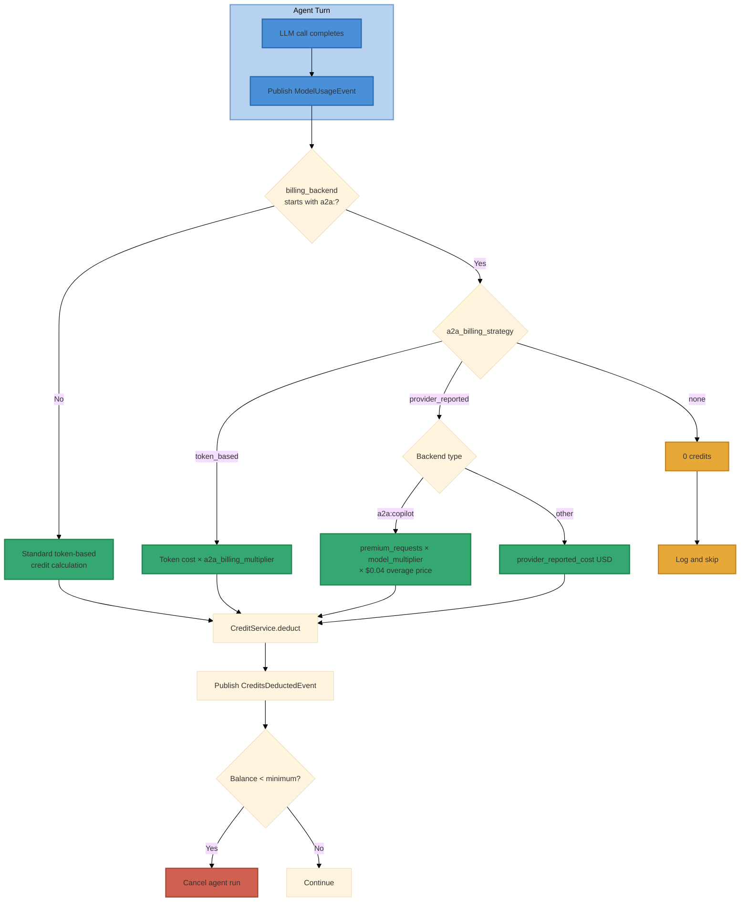

# A2A Billing Model

**Status:** Implemented (April 2026)
**Owner:** credits domain
**Source of truth:** `credits/usage/handler.py`, `core/config/agent.py`

## Problem

When the inner-loop execution path uses an A2A backend (Copilot CLI, Claude Code, Codex) instead of direct API calls, the actual cost of inference differs from ii-agent's standard per-token pricing. Copilot Business offers unlimited subsidised inference; Copilot Pro+ uses a premium-request quota model priced at $0.04/request with per-model multipliers. Billing users at raw API token rates would overcharge (or undercharge) relative to real cost.

## Decision

`CreditUsageHandler` inspects `ModelUsageEvent.billing_backend` and routes to one of three configurable billing strategies controlled by `AGENT_A2A_BILLING_STRATEGY`.

## Credit Conversion Baseline

```
100 II-Agent credits == $1.50 USD
1 USD ≈ 66.67 credits
```

Defined in `billing/utils.py` as `USD_TO_CREDITS_MULTIPLIER`.

## Billing Strategies

### Strategy 1: `token_based` (default)

Same token × PricingInfo calculation as native execution, then scaled by `AGENT_A2A_BILLING_MULTIPLIER` (default 1.0).

```
credits = standard_token_cost(input, output, cache, reasoning) × multiplier
```

| Multiplier | Effect |
|---|---|
| `1.0` | Identical to native — safe default, may overcharge on subsidised backends |
| `0.5` | Half price — reflects partial subsidy |
| `0.0` | Free — equivalent to `none` strategy but still logs the event |

**When to use:** Raw API key usage, BYOK Anthropic through Copilot (no subsidy applies), or when you want a simple discount without modelling premium requests.

### Strategy 2: `provider_reported`

Uses the backend's own cost model rather than token counts.

#### Copilot (`billing_backend = "a2a:copilot"`)

Each user prompt = 1 premium request × model multiplier. Tool calls within agentic features do **not** count as premium requests.

```
effective_requests = max(premium_requests, 1) × model_multiplier
cost_usd = effective_requests × $0.04
credits = cost_usd × 66.67
```

**Copilot premium-request multipliers** (April 2026, source: GitHub docs):

| Model prefix | Multiplier | Effective cost/prompt | Credits/prompt |
|---|---|---|---|
| `gpt-5-mini` | 0.0 | $0.00 | 0 |
| `gpt-4.1` | 0.0 | $0.00 | 0 |
| `gpt-4o` | 0.0 | $0.00 | 0 |
| `claude-3-5-haiku` | 0.33 | $0.013 | ~0.9 |
| `grok-code-fast` | 0.33 | $0.013 | ~0.9 |
| `claude-sonnet` | 1.0 | $0.04 | ~2.7 |
| `gemini-3-pro` | 1.0 | $0.04 | ~2.7 |
| `gpt-5.1` | 1.0 | $0.04 | ~2.7 |
| `claude-opus` | 3.0 | $0.12 | ~8.0 |

Multipliers are resolved by longest model-id prefix match from `AGENT_A2A_COPILOT_MULTIPLIERS`. Unknown models default to 1.0 with a warning log.

#### Other backends (`a2a:claude-code`, `a2a:codex`)

Uses `ModelUsageEvent.provider_reported_cost` (USD) directly. Falls back to token-based if the adapter reports zero cost.

**When to use:** Copilot Pro+ or Business subscriptions where the real cost is the premium-request overage, not per-token API pricing.

### Strategy 3: `none`

Zero credits charged for A2A-served LLM turns. Tool costs (image generation, etc.) still apply normally.

**When to use:** Copilot Business (unlimited), enterprise flat-rate agreements, or development/testing.

## Billing Flow



## ModelUsageEvent Fields

| Field | Type | Purpose |
|---|---|---|
| `billing_backend` | `str` | `"native"`, `"a2a:copilot"`, `"a2a:claude-code"`, `"a2a:codex"` |
| `provider_reported_cost` | `float` | USD cost reported by the A2A adapter (non-Copilot backends) |
| `premium_requests` | `int` | Premium request count consumed by this turn (Copilot only) |
| `is_user_key` | `bool` | When `True`, LLM billing is skipped entirely (user pays their own API bill) |

Source: `realtime/events/app_events.py::ModelUsageEvent`

## Configuration Reference

All settings use the `AGENT_` env prefix.

| Env Variable | Default | Description |
|---|---|---|
| `AGENT_A2A_BILLING_STRATEGY` | `token_based` | `token_based` / `provider_reported` / `none` |
| `AGENT_A2A_BILLING_MULTIPLIER` | `1.0` | Scaling factor for `token_based` strategy (0.0–∞) |
| `AGENT_A2A_COPILOT_PREMIUM_REQUEST_COST` | `0.04` | USD per premium request for `provider_reported` Copilot billing |
| `AGENT_A2A_COPILOT_MULTIPLIERS` | (see table above) | JSON object: model-prefix → multiplier mapping |

Source: `core/config/agent.py::AgentSettings`

## Deployment Decision Tree

| Scenario | Strategy | Multiplier | Notes |
|---|---|---|---|
| Direct API keys (no A2A) | n/a | n/a | `billing_backend="native"`, standard token billing applies |
| BYOK Anthropic through Copilot | `token_based` | `1.0` | No subsidy — caller pays full API rates |
| Copilot Business (unlimited) | `none` | — | Subscription fully covers inference |
| Copilot Pro+ (within quota) | `none` | — | Monthly allowance covers it |
| Copilot Pro+ (overage) | `provider_reported` | — | Charges based on $0.04 × multiplier per prompt |
| Copilot Pro+ (mixed) | `provider_reported` | — | Conservative: always charge; credits offset by lower per-request cost vs token pricing |
| Claude Code subscription | `none` or `token_based` @ `0.0` | `0.0` | Flat-rate subscription covers inference |
| Development / testing | `none` | — | No billing during development |

### Example .env Configurations

**Copilot Business (free inference):**
```bash
AGENT_A2A_BILLING_STRATEGY=none
```

**Copilot Pro+ (charge per premium request):**
```bash
AGENT_A2A_BILLING_STRATEGY=provider_reported
AGENT_A2A_COPILOT_PREMIUM_REQUEST_COST=0.04
```

**Copilot with 50% discount:**
```bash
AGENT_A2A_BILLING_STRATEGY=token_based
AGENT_A2A_BILLING_MULTIPLIER=0.5
```

## Cost Comparison: Native vs A2A Copilot

Empirical finding (April 2026): a Claude Opus 4.6 agentic task costing ~$40 via direct Anthropic API for 20 minutes capped at ~$2.40 of overage charges via Copilot's native Opus serving at 3× premium-request multiplier — approximately **16× cost reduction**.

| Path | Claude Opus 4.6 (20 min session) | Claude Sonnet 4.5 (10 min session) |
|---|---|---|
| Native (Anthropic API) | ~$40 → ~2,667 credits | ~$5 → ~333 credits |
| Copilot `provider_reported` | ~$2.40 → ~160 credits | ~$0.40 → ~27 credits |
| Copilot `none` (within quota) | $0 → 0 credits | $0 → 0 credits |

## Key Invariants

1. **Tool billing is always native.** Only LLM inference costs are affected by the A2A billing strategy. Tool costs (image generation, web search, etc.) are always deducted at their standard rates.
2. **`is_user_key` takes priority.** If the user provides their own API key, no LLM billing occurs regardless of strategy.
3. **Balance exhaustion still cancels runs.** Even under `provider_reported` or `none`, the balance check runs after every deduction. Under `none`, no deduction means no cancellation — the run continues until the turn limit or explicit cancellation.
4. **Multiplier table is hot-configurable.** `AGENT_A2A_COPILOT_MULTIPLIERS` accepts a JSON object and can be updated without code changes or restarts (on next `AgentSettings` instantiation).
5. **A2A is the cheap path; native is the failure-mode fallback.** When `AGENT_CHAT_INNER_LOOP_MODE=a2a` is configured, every chat turn that silently falls back to the native LLM costs ~10×+ the Copilot subscription rate (see Cost Comparison above). Misconfiguration that causes silent fallback is therefore a financial-impact bug, not a UX bug. Production deployments **must** keep `AGENT_A2A_CHAT_STRICT=true` (default) so a missing `AGENT_A2A_AGENT_URL` crashes the backend at startup instead of silently routing every request to expensive native APIs. See [`chat-a2a-adapter-sidecar.md`](chat-a2a-adapter-sidecar.md) for the deployment contract.

## Related Documents

- [`chat-a2a-adapter-sidecar.md`](chat-a2a-adapter-sidecar.md) — Chat A2A deployment contract; defines how operators configure the adapter URL and the strict-mode crash semantics that prevent silent native-LLM billing
- [`inner-loop-competitor-analysis.md`](inner-loop-competitor-analysis.md) — Cost model comparison across Copilot, Claude Code, and Codex
- [`a2a-inner-loop-parity-assessment.md`](a2a-inner-loop-parity-assessment.md) — Billing attribution verification status
