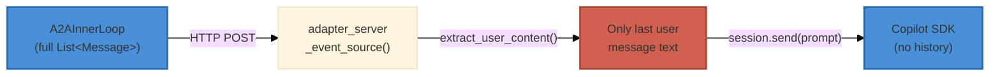

# A2A Conversation History Parity with Native Inner Loop

> **Date**: 2026-04-11
> **Status**: Implemented
> **Branch**: `rebase/local-docker-sandbox`
> **Related**: [a2a-inner-loop-parity-assessment.md](a2a-inner-loop-parity-assessment.md)

---

## Problem Statement

The A2A inner loop lost conversation context between turns. When a user sent a
follow-up message (e.g. "done, proceed"), the Copilot SDK agent had no knowledge
of prior turns and responded with "I don't have context on what to proceed with."

## Root Cause

The message flow from ii-agent to the Copilot SDK passed through three stages:



`extract_user_content()` grabbed only the **last user message**, discarding all
prior user/assistant/tool messages. The Copilot SDK creates fresh sessions per
run (by design), so the prompt was the only source of context, and it contained
zero history.

## How the Native Inner Loop Works

The native path maintains full fidelity:

1. `_aget_run_messages()` loads **all prior runs** from the database
2. Each `Message` preserves: `role`, `content`, `reasoning_content`,
   `tool_calls`, `tool_call_id`, `tool_name`, `tool_args`, images, files
3. The complete `List[Message]` is passed to `model.aresponse_stream()` —
   the LLM API receives structured alternating user/assistant/tool messages
4. Tool call/result pairs maintain their `tool_call_id` linkage
5. Thinking/reasoning blocks are preserved in `reasoning_content`

## Solution: Structured `build_conversation_context()`

Since the Copilot SDK accepts a single prompt string (not structured messages),
we reconstruct conversation history as structured text that preserves:

| Data Type | Native Format | A2A Text Reconstruction |
|-----------|---------------|------------------------|
| User messages | `Message(role="user")` | `[User]: text` + media references |
| Assistant text | `Message(role="assistant")` | `[Assistant]: text` |
| Thinking blocks | `Message.reasoning_content` | `[Assistant Thinking]:\n<thinking>...</thinking>` |
| Encrypted thinking | `Message.redacted_reasoning_content` | `[Assistant had encrypted reasoning (redacted)]` |
| Tool calls | `Message.tool_calls` list | `[Assistant Tool Call]: name(args)` |
| Tool results | `Message(role="tool")` | `[Tool Result (name)]: output` |
| Tool errors | `Message(tool_call_error=True)` | `[Tool Error (name)]: output` |
| Session summaries | `Message(is_summary=True)` | `[Session Summary]: text` |
| Image attachments | `Message.images` | `[Attached image: alt — url]` |
| File attachments | `Message.files` | `[Attached file: name — url]` |
| Audio attachments | `Message.audio` | `[Attached audio: id — transcript: text]` |
| Video attachments | `Message.videos` | `[Attached video: id — url]` |
| Image output | `Message.image_output` | `[Generated image: alt — url]` |
| File output | `Message.file_output` | `[Generated file: name — url]` |
| Audio output | `Message.audio_output` | `[Generated audio: id — transcript: text]` |
| Video output | `Message.video_output` | `[Generated video: id — url]` |
| Citations | `Message.citations` | `[Citation: title — url]` |

### Prompt Structure Sent to SDK

```
<conversation_history>
[Session Summary]: User asked to build a web app. Assistant set up the project.

[User]: Here's my voice note about the design.
  [Attached audio: voice_1 — transcript: I want a blue theme]

[Assistant Thinking]:
<thinking>
I need to use the browser_navigate tool.
</thinking>
[Assistant had encrypted reasoning (redacted)]
[Assistant Tool Call]: browser_navigate({"url": "https://example.com"})

[Tool Result (browser_navigate)]: Page loaded: Example Domain

[Tool Error (ReadFile)]: Error: file not found

[Assistant]: I've navigated to example.com. It shows the Example Domain page.
  [Generated image: preview — https://example.com/preview.png]
  [Citation: CSS Guide — https://example.com/css]
</conversation_history>

Now take a screenshot.
```

### Safety: Truncation

- Tool arguments > 2000 chars are truncated with `... (truncated)`
- Tool results > 3000 chars are truncated with `... (truncated)`
- This prevents context window exhaustion from large tool outputs

## Files Changed

| File | Change |
|------|--------|
| `src/ii_agent/integrations/a2a/multimodal.py` | Rewrote `build_conversation_context()` with structured formatting; added `_format_history_message()`, `_append_media_references()`, `_append_output_references()`, `_append_citations()` helpers |
| `src/ii_agent/integrations/a2a/adapter_server.py` | Unchanged — already calls `build_conversation_context()` and prepends to prompt |
| `src/tests/unit/integrations/test_a2a_multimodal.py` | Added `TestBuildConversationContext` class with 38 test cases covering all gap closures |

## Remaining Gaps vs Native (Not Addressed)

These are known differences that remain between native and A2A paths:

1. **SDK context window management** — Native uses `SessionSummaryManager` for
   compaction; the text-based history grows linearly. The SDK's
   `infinite_sessions` config handles this within the Copilot CLI.
2. **Multimodal history (binary content)** — Historical image/file bytes are
   not forwarded; only URL references are noted as text placeholders.
3. **Message ID linkage** — Tool call IDs are not preserved in the text
   representation; the SDK cannot correlate specific calls to results.

## Verification

```bash
# Unit tests
uv run pytest src/tests/unit/integrations/test_a2a_multimodal.py -v

# All A2A tests
uv run pytest src/tests/unit/integrations/test_a2a_*.py src/tests/unit/engine/test_v1_tools_a2a*.py -v
```
