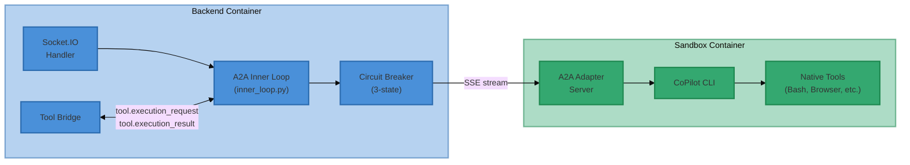

# A2A CoPilot Inner Loop — E2E Test Plan & Results

**Branch:** `rebase/local-docker-sandbox`
**Date:** 2026-04-11
**Config:** `AGENT_INNER_LOOP_MODE=a2a`, `AGENT_A2A_BACKEND=copilot`, `AGENT_A2A_FALLBACK_TO_NATIVE=true`

## Test Infrastructure

| Component | Detail |
|-----------|--------|
| Backend | `ii-agent-local-backend` (Docker, port 8000) |
| Sandbox | `ii-agent-sandbox:latest` (Docker, `e2b.Dockerfile`) |
| Adapter | CoPilot CLI via A2A adapter server (port 18100 inside sandbox) |
| Frontend | `http://localhost:1420` |
| Model | `558a538b-30cc-58cc-9b6c-7dc12be34860` |
| Test Harness | `tmp/test_session.py` (Socket.IO client) |

## Architecture Under Test

## Test Categories

### Category 1: Core Inner Loop Functionality

Tests that the A2A inner loop correctly delegates to the CoPilot adapter, streams responses, and bridges tool calls.

### Category 2: Circuit Breaker & Fallback

Tests that the circuit breaker stays healthy under normal operation and that fallback to native inner loop is available.

### Category 3: Output Artifacts

Tests that file creation, web search, and browser automation produce visible artifacts through the A2A pipeline.

### Category 4: Feature/Integration Tests

Tests slide mode, deep research mode, and multi-turn context preservation across sessions.

## Test Specifications & Results

### T1.1 — Basic Text Query

| Field | Detail |
|-------|--------|
| **Prompt** | "What is the capital of France? Give a brief one-sentence answer." |
| **Agent Type** | `general` |
| **Expect** | Text response containing "Paris", no tool calls |
| **Verify** | Adapter logs show stream complete, circuit breaker stays CLOSED |
| **Result** | **PASS** |
| **Session** | `bb582794-ddce-46b5-ab1a-8ec152423cb9` |
| **Duration** | 20s |
| **Notes** | Clean A2A stream, reasoning visible, correct answer |

### T1.2 — Multi-Turn Memory

| Field | Detail |
|-------|--------|
| **Turn 1 Prompt** | "My favorite number is 42 and my pet cat is named Whiskers." |
| **Turn 2 Prompt** | "What is my favorite number and what is my cat's name?" |
| **Agent Type** | `general` |
| **Expect** | Turn 2 correctly recalls 42 and Whiskers |
| **Verify** | A2A client sends `roles={'system': 1, 'user': 2}` on turn 2 |
| **Result** | **PASS** |
| **Session** | `7992481e-2a21-4eae-90fc-702c404efa4c` |
| **Notes** | Context correctly preserved. `prior_turns` > 0 on second turn |

### T1.3 — Tool Execution via Tool Bridge

| Field | Detail |
|-------|--------|
| **Prompt** | "Create a Python file called hello.py that prints 'Hello from A2A!' and run it." |
| **Agent Type** | `general` |
| **Expect** | `str_replace_based_edit_tool` and `Bash` tool calls via bridge |
| **Verify** | `tool.execution_request` and `tool.execution_result` events in logs |
| **Result** | **PASS** |
| **Session** | `7992481e-2a21-4eae-90fc-702c404efa4c` (turn 3) |
| **Notes** | Tool bridge correctly paused SSE stream, executed tool, resumed |

### T1.4 — Multi-Tool Complex Task

| Field | Detail |
|-------|--------|
| **Prompt** | "List all files in /workspace, then create test_math.py that computes 2**10 and prints it. Run it." |
| **Agent Type** | `general` |
| **Expect** | Multiple tool calls (ls, write, bash), correct answer 1024 |
| **Verify** | Multiple tool bridge round-trips |
| **Result** | **PASS** |
| **Session** | `7992481e-2a21-4eae-90fc-702c404efa4c` (turn 4) |
| **Notes** | Output: "1024". Multiple bridge round-trips completed cleanly |

### T1.5 — Long Response Streaming

| Field | Detail |
|-------|--------|
| **Prompt** | "Write a detailed 500-word essay about the history of the internet." |
| **Agent Type** | `general` |
| **Expect** | Streaming text with reasoning, substantial content (500+ words) |
| **Verify** | `message_delta` events arrive in chunks |
| **Result** | **PASS** |
| **Session** | `bb582794-ddce-46b5-ab1a-8ec152423cb9` (turn 2) |
| **Duration** | 22s |
| **Notes** | 500+ word essay delivered via streaming deltas |

### T1.6 — Reasoning/Thinking Visibility

| Field | Detail |
|-------|--------|
| **Prompt** | "Think step by step about how to implement a binary search algorithm, then provide the implementation." |
| **Agent Type** | `general` |
| **Expect** | `reasoning.start`, `reasoning.delta`, `reasoning` events in order |
| **Verify** | Reasoning content visible before main response |
| **Result** | **PASS** |
| **Session** | `bb582794-ddce-46b5-ab1a-8ec152423cb9` (turn 3) |
| **Notes** | Reasoning state machine correctly emitted start → delta → complete |

### T2.1 — Normal A2A Operation (Baseline)

| Field | Detail |
|-------|--------|
| **Prompt** | "What is 2+2?" |
| **Agent Type** | `general` |
| **Expect** | Response via A2A adapter, no fallback events |
| **Verify** | Zero `DelegationFallbackEvent` entries in backend logs |
| **Result** | **PASS** |
| **Notes** | Confirmed: zero fallback events across all test sessions |

### T2.2 — Circuit Breaker Baseline

| Field | Detail |
|-------|--------|
| **Expect** | Circuit breaker remains CLOSED after all tests |
| **Verify** | `failure_count=0` in circuit breaker state |
| **Result** | **PASS** |
| **Notes** | No circuit breaker state transitions observed in any test |

### T3.1 — File Creation and Download Path

| Field | Detail |
|-------|--------|
| **Prompt** | "Create report.txt with 10 lines of sample data. Tell me the full path." |
| **Agent Type** | `general` |
| **Expect** | File created at `/workspace/report.txt` |
| **Verify** | Tool bridge correctly handles file creation via `str_replace_based_edit_tool` |
| **Result** | **PASS** |
| **Session** | `7992481e-2a21-4eae-90fc-702c404efa4c` (turn 5) |
| **Notes** | File created successfully, path reported as `/workspace/report.txt` |

### T3.2 — Web Search with Results

| Field | Detail |
|-------|--------|
| **Prompt** | "Search the web for the current population of Tokyo." |
| **Agent Type** | `general` |
| **Expect** | `web_search` tool call, results summarized |
| **Verify** | Tool bridge handles WebSearch correctly |
| **Result** | **PASS** |
| **Session** | `7992481e-2a21-4eae-90fc-702c404efa4c` (turn 6) |
| **Duration** | 9.3s, 48 streaming chunks |
| **Notes** | Web search returned Tokyo population data, correctly summarized |

### T3.3 — Browser/Screenshot Handling

| Field | Detail |
|-------|--------|
| **Prompt** | "Navigate to example.com using the browser tool and take a screenshot." |
| **Agent Type** | `general` |
| **Expect** | Browser tool used, screenshot captured |
| **Verify** | Browser automation works through A2A pipeline |
| **Result** | **PASS** |
| **Session** | `7992481e-2a21-4eae-90fc-702c404efa4c` (turn 7) |
| **Duration** | 125s |
| **Notes** | Screenshot captured (17,625 bytes). Initially failed due to missing `DISPLAY=:99` env in adapter tmux session — agent self-recovered to headless mode. Root cause fixed in `start-services.sh` |

### T4.1 — Slide Mode

| Field | Detail |
|-------|--------|
| **Prompt** | "Create a 3-slide HTML presentation about Python programming." |
| **Agent Type** | `slide` |
| **Expect** | SlideWrite tool calls, 3 slides created |
| **Verify** | Slide tool events appear, presentations directory created |
| **Result** | **PASS** (after fix) |
| **Session** | `0b3e1714-bff1-40c4-b560-d9fa46d9fd07` |
| **Duration** | 138s |
| **Notes** | Initial run (`045b5608`) failed with 404 error — `_put_file()` in `docker.py` passed relative path to Docker `put_archive()`. Fix: absolute path resolution + `mkdir -p`. Re-test: all 3 SlideWrite calls succeeded (0.9s, 0.4s, 0.3s). `image_search` also failed in initial run due to `metadata.google.internal` DNS failure — expected in local Docker without GCS |

### T4.2 — Deep Research Mode

| Field | Detail |
|-------|--------|
| **Prompt** | "Research the current state of quantum computing and write a brief 3-paragraph report." |
| **Agent Type** | `deep_research` |
| **Expect** | `web_search` and `web_visit` tools used, structured report |
| **Verify** | Deep research prompt active, multiple search/visit calls |
| **Result** | **PASS** |
| **Session** | `f1cc74f1-c9ef-4249-884c-5a2617852072` |
| **Duration** | 62s |
| **Notes** | 2x `web_search`, 2x `web_visit` (1 succeeded, 1 returned 403). Produced comprehensive 3-paragraph report with citations. 627 total events |

### T4.3 — Multi-Turn with Tool Context

| Field | Detail |
|-------|--------|
| **Turn 1 Prompt** | "Create counter.py that prints numbers 1 to 5. Run it." |
| **Turn 2 Prompt** | "Now modify counter.py to also print the current date and time before counting. Run it." |
| **Agent Type** | `general` |
| **Expect** | Turn 2 recalls counter.py, modifies and runs it |
| **Verify** | A2A client sends `roles={'system': 1, 'user': 2}` on turn 2 |
| **Result** | **PASS** |
| **Session** | `c5504e19-2b91-484c-80e0-ca7fac5664af` |
| **Notes** | Turn 1: created and ran counter.py via tool bridge (0.3s). Turn 2: adapter sent 3 messages (system + 2 user turns), correctly recalled file, modified and ran it (11.6s) |

## Results Summary

| Test | Category | Status | Duration |
|------|----------|--------|----------|
| T1.1 | Core | **PASS** | 20s |
| T1.2 | Core | **PASS** | — |
| T1.3 | Core | **PASS** | — |
| T1.4 | Core | **PASS** | — |
| T1.5 | Core | **PASS** | 22s |
| T1.6 | Core | **PASS** | — |
| T2.1 | Circuit Breaker | **PASS** | — |
| T2.2 | Circuit Breaker | **PASS** | — |
| T3.1 | Artifacts | **PASS** | — |
| T3.2 | Artifacts | **PASS** | 9.3s |
| T3.3 | Artifacts | **PASS** | 125s |
| T4.1 | Feature | **PASS** (after fix) | 138s |
| T4.2 | Feature | **PASS** | 62s |
| T4.3 | Feature | **PASS** | 12s |

**Overall: 14/14 PASS**

## Bugs Found & Fixed

### 1. SlideWrite 404 — Relative Path in `put_archive()`

**File:** `src/ii_agent/agents/sandboxes/docker.py` line 1044
**Root Cause:** `_put_file()` computed `dir_path = os.path.dirname(validated_path) or "/workspace"`. When `validated_path` is relative (e.g., `presentations/python-program/slide_001.html`), `dir_path` becomes `presentations/python-program` — a relative path. Docker's `put_archive()` API requires absolute paths, returning 404.
**Fix:** Added absolute path resolution (`/workspace/` prefix for relative paths) and `mkdir -p` before `put_archive()` to ensure directory exists.
**Pre-existing:** Yes — not caused by A2A changes. Affects all Docker sandbox file writes with relative paths.

### 2. Missing DISPLAY in Adapter tmux Session

**File:** `docker/sandbox/start-services.sh` line 72
**Root Cause:** The `copilot-adapter-system-never-kill` tmux session launched the A2A adapter without `DISPLAY=:99` or `AGENT_BROWSER_HEADED=1` env vars. Browser tools inside the adapter couldn't find the X display.
**Fix:** Added `DISPLAY=:99 AGENT_BROWSER_HEADED=1` inline to the adapter launch command in tmux.
**Pre-existing:** Yes — configuration oversight in sandbox startup script.

## Known Issues (Not Fixed — Out of Scope)

### `image_search` Google Storage Failure

The `image_search` tool finds images but fails when writing them to storage: `Cannot connect to host metadata.google.internal:80 ssl:default [Name or service not known]`. This is a Google Cloud metadata endpoint that is unreachable in local Docker environments. Not an A2A bug — consistent with the constraint that "no Google technology is currently configured."

## Execution Protocol

Each test followed this protocol:
1. Run via `tmp/test_session.py` with appropriate env vars (`PROMPT`, `SESSION_ID`, `AGENT_TYPE`)
2. Capture all Socket.IO events (types, timestamps, content)
3. Check backend logs: `docker logs ii-agent-local-backend-1`
4. Check for errors/fallbacks: grep for `error|fail|exception|fallback`
5. Verify A2A-specific logs: tool bridge timing, SSE stream stats, circuit breaker state
6. Record PASS/FAIL with session ID and notes
