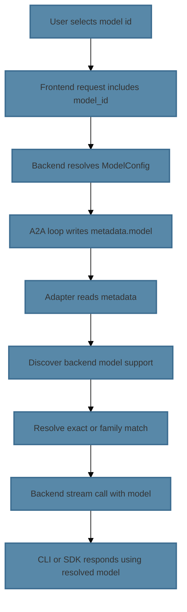

# A2A Copilot Model Steering Design

**Status**: Design Document (New)  
**Author**: AI Research Team  
**Date**: 2026-04-15  
**Area**: Agent Execution, A2A Backend Integration  

---

## Problem Statement

Currently, when a user selects a model (e.g., "OpenAI GPT-4o") and the A2A Copilot backend is active, the model selection is **ignored**. The `metadata["model"]` field is populated by both agent and chat A2A loops, but never read by the adapter server. Copilot uses whatever model is configured at adapter startup (`CopilotConfig.model`), typically empty, allowing Copilot's SDK to choose.

This breaks user expectations:
- User selects "gpt-4o" → Copilot silently uses a different model (Claude, default policy, etc.)
- Model preference in agent settings has no effect when A2A is enabled
- User cannot control which backend model processes their requests (within Copilot SDK's supported set)

It also applies to chat A2A mode, where there is no inline model picker and no chat-side compatibility warning before backend invocation.

---

## Goals

1. **Respect User Model Selection**: Pass the user-selected model to Copilot backend within A2A inner loop (agent and chat).
2. **Graceful Degradation**: If user's selected model isn't available in Copilot SDK, find the closest match or use a sensible default.
3. **Transparent to User**: Model resolution should be automatic—user sets preference, system picks the best available match.
4. **Support Multi-Provider Models**: Handle OpenAI (GPT-4o, GPT-4-turbo), Anthropic (Claude 3.5, etc.), Google (Gemini), and future Copilot-supported models.
5. **Observability**: Log model selection, resolution, and any fallbacks for debugging.

---

## Design Overview

### Current State Caveats (Verified)

1. There is no best-match resolver implemented today for any A2A backend.
2. Agent mode has warning-only compatibility checks; chat mode has no equivalent pre-check.
3. Adapter/backend model steering must be implemented at a shared boundary so both agent and chat benefit.

### Architecture Flow



### Key Changes

| Component | Change |
|-----------|--------|
| `A2AInnerLoop` | Already puts `model.id` in metadata for agent ✓ |
| `A2AChatTurnLoop` | Already puts `model_config.model_id` in metadata for chat ✓ |
| `AdapterServer` | **NEW**: Read and forward `metadata['model']` to backend |
| `CopilotBackend` | **NEW**: Accept `model` parameter in `stream()` + `astream()` |
| `CopilotBackend.___init__` | **NEW**: Model discovery + caching at startup |
| `ModelResolver` | **NEW**: Match user model to Copilot-supported models |
| Logging | **ENHANCED**: Track model selection and resolution |

---

## Detailed Design

### 1. Model Discovery & Caching

**When**: Adapter server startup (async initialization)  
**Where**: `src/ii_agent/integrations/a2a/copilot_backend.py`

```python
class CopilotBackend:
    def __init__(self, cli_path: str, ...):
        self._cli_path = cli_path
        self._model_cache: dict[str, bool] | None = None  # {model_name: is_available}
        self._last_discovery_time: float | None = None
        self._discovery_ttl_secs = 3600  # Refresh every hour
    
    async def _discover_models(self) -> dict[str, bool]:
        """Query Copilot SDK/CLI for available models. Cache for TTL."""
        if self._model_cache and time.time() - self._last_discovery_time < self._discovery_ttl_secs:
            return self._model_cache
        
        try:
            # Via CLI: `copilot models list` or similar
            # Via SDK: github.copilot.models or equivalent
            # Returns {model_name: True} for supported models
            discovered = await self._query_copilot_models()
            self._model_cache = discovered
            self._last_discovery_time = time.time()
            logger.info("Copilot models discovered: %d", len(discovered))
            return discovered
        except Exception as e:
            logger.error("Model discovery failed, using fallback list: %s", e)
            return self._fallback_models()
    
    def _fallback_models(self) -> dict[str, bool]:
        """Hardcoded list of commonly available Copilot models."""
        return {
            "gpt-4o": True,
            "gpt-4o-mini": True,
            "gpt-4": True,
            "gpt-4-turbo": True,
            "claude-3-5-sonnet": True,
            "claude-3-opus": True,
            "gemini-2-flash": True,
        }
```

### 2. Model Resolution Strategy

**Purpose**: Map user-selected model to Copilot-supported model.

```python
class ModelResolver:
    """Resolve user-selected model to best Copilot match."""
    
    ALIAS_MAP: dict[str, set[str]] = {
        "gpt-4o": {"gpt-4o", "gpt-4o-mini"},
        "gpt-4": {"gpt-4", "gpt-4-turbo"},
        "claude-3-5-sonnet": {"claude-3-5-sonnet", "claude-3-opus"},
        "gemini-2-flash": {"gemini-2-flash"},
    }
    
    def resolve(
        self,
        user_model: str,
        copilot_models: dict[str, bool],
    ) -> tuple[str, str]:
        """
        Resolve user model to Copilot match.
        
        Returns: (resolved_model, reason)
          - reason: 'exact' | 'family' | 'fallback'
        """
        # 1. Exact match
        if user_model in copilot_models:
            return user_model, "exact"
        
        # 2. Family match (e.g., gpt-4o → gpt-4o-mini if gpt-4o unavailable)
        for family, aliases in self.ALIAS_MAP.items():
            if user_model in aliases:
                # Find any alias in copilot_models
                for alias in aliases:
                    if alias in copilot_models:
                        return alias, "family"
        
        # 3. Fallback to Copilot's default
        logger.warning("No match for %s in Copilot models, using Copilot default", user_model)
        return "", "fallback"  # Empty string → Copilot chooses

resolver = ModelResolver()
resolved_model, reason = resolver.resolve("gpt-4o", copilot_models)
logger.info("Model resolution: %s → %s (reason: %s)", "gpt-4o", resolved_model, reason)
```

### 3. Adapter Server Changes

**File**: `src/ii_agent/integrations/a2a/adapter_server.py`

```python
@app.post("/api/stream")
async def stream_endpoint(req: StreamRequest) -> AsyncGenerator[...]:
    """Handle streaming requests from backend."""
    
    # Read user-selected model from metadata
    user_model = (req.metadata or {}).get("model", "")
    
    # Discover Copilot models (cached)
    copilot_models = await backend.discover_models()
    
    # Resolve to best Copilot match
    resolved_model, resolution_reason = resolver.resolve(
        user_model or "default",
        copilot_models,
    )
    
    logger.info(
        "Stream request: user_model=%s, resolved_model=%s (reason=%s)",
        user_model,
        resolved_model,
        resolution_reason,
    )
    
    # Forward resolved model to backend.stream()
    async for event in backend.stream(
        prompt=req.prompt,
        context_id=context_id,
        task_id=task_id,
        parts=parts,
        tool_schemas=tool_schemas,
        system_message=system_message,
        model=resolved_model,  # <-- NEW
    ):
        yield event
```

### 4. CopilotBackend.stream() Signature

**File**: `src/ii_agent/integrations/a2a/copilot_backend.py`

```python
class CopilotBackend:
    async def stream(
        self,
        prompt: str,
        context_id: str,
        task_id: str,
        *,
        parts: list[...] | None = None,
        tool_schemas: dict | None = None,
        system_message: str | None = None,
        model: str = "",  # <-- NEW: user-specified or resolved model
    ) -> AsyncGenerator[...]:
        """Stream response from Copilot backend."""
        
        session_kwargs = {}
        if model:
            session_kwargs["model"] = model
            logger.debug("Copilot: using model=%s", model)
        
        # Rest of implementation...
        async with self._session_manager.get_session(**session_kwargs) as session:
            async for event in session.stream(...):
                yield event
```

### 5. Data Flow Through Inner Loop

**File**: `src/ii_agent/agents/inner_loop.py`

Current (already correct):
```python
async def aresponse_stream(
    self,
    messages: list[...],
    model: Model,  # User's selected model
    ...
):
    metadata = {
        "model": model.id,  # <-- Already putting it here ✓
        ...
    }
    async for event in self.client.astream(
        messages=messages,
        context_id=context_id,
        metadata=metadata,  # <-- Metadata includes model
    ):
        yield event
```

**No change needed** — metadata["model"] is already populated correctly.

---

## Model Matching Heuristics

### Exact Match (Priority 1)
```
User selects: "gpt-4o"
Copilot supports: ["gpt-4o", "gpt-4", "claude-3-opus"]
Result: "gpt-4o" ✓
```

### Family Match (Priority 2)
```
User selects: "gpt-4o"
Copilot supports: ["gpt-4o-mini", "gpt-4", "claude-3-opus"]
Result: "gpt-4o-mini" (same family, closest available)
```

### Fallback (Priority 3)
```
User selects: "unknown-model-xyz"
Copilot supports: ["gpt-4o", "claude-3-opus"]
Result: "" (empty → Copilot decides, logged as warning)
```

### Provider-Level Fallback
```
User selects: "gpt-4-turbo" (older, no longer in Copilot)
Copilot supports: ["gpt-4o", "gpt-4o-mini"]
Resolution: "gpt-4o" (same provider/family, best available)
```

---

## Configuration & Environment

### New Config Options

**File**: `src/ii_agent/core/config/agent.py`

```python
class AgentSettings(BaseSettings):
    # ... existing fields ...
    
    a2a_model_discovery_ttl_secs: int = Field(
        default=3600,
        description="Cache TTL for Copilot model discovery.",
    )
    
    a2a_model_resolution_strategy: Literal["strict", "lenient", "fallback"] = Field(
        default="lenient",
        description="""
        Model resolution strategy:
        - strict: Only exact matches, error if not found
        - lenient: Exact/family match, fallback to Copilot default
        - fallback: Always succeed, use user model or Copilot default
        """,
    )
```

### Environment Variables

```bash
# Optional: Control model discovery refresh
AGENT_A2A_MODEL_DISCOVERY_TTL_SECS=3600

# Optional: Set resolution strategy
AGENT_A2A_MODEL_RESOLUTION_STRATEGY=lenient
```

---

## Implementation Plan

### Phase 1: Core Model Resolution (Week 1)
- [ ] Implement `ModelResolver` class with alias map
- [ ] Add model discovery stub to `CopilotBackend`
- [ ] Update `CopilotBackend.stream()` signature to accept `model` parameter
- [ ] Unit tests for model resolution logic

### Phase 2: Adapter Integration (Week 2)
- [ ] Update `AdapterServer` to read `metadata["model"]`
- [ ] Wire model resolution into request path
- [ ] Add logging/observability
- [ ] E2E tests: select model → verify it's used

### Phase 3: Model Discovery (Week 3)
- [ ] Implement actual Copilot model discovery (via CLI or SDK)
- [ ] Add caching with TTL
- [ ] Handle discovery failures gracefully
- [ ] Populate fallback list from real Copilot data

### Phase 4: Observability & Polish (Week 4)
- [ ] Metrics: model resolution outcomes (exact/family/fallback)
- [ ] Health endpoint reports available models
- [ ] Frontend: Show available models vs. user selection
- [ ] Docs: Update A2A inner loop guide

---

## Testing Strategy

### Unit Tests

**`tests/unit/integrations/test_a2a_model_resolver.py`**
```python
def test_model_resolver_exact_match():
    resolver = ModelResolver()
    resolved, reason = resolver.resolve("gpt-4o", {"gpt-4o": True})
    assert resolved == "gpt-4o"
    assert reason == "exact"

def test_model_resolver_family_match():
    resolver = ModelResolver()
    resolved, reason = resolver.resolve("gpt-4o", {"gpt-4o-mini": True})
    assert resolved == "gpt-4o-mini"
    assert reason == "family"

def test_model_resolver_fallback():
    resolver = ModelResolver()
    resolved, reason = resolver.resolve("unknown", {"gpt-4o": True})
    assert resolved == ""
    assert reason == "fallback"
```

### Integration Tests

**`tests/integrations/test_a2a_model_steering.py`**
```python
@pytest.mark.asyncio
async def test_copilot_backend_accepts_model_param():
    """Verify CopilotBackend.stream() accepts and uses model param."""
    backend = CopilotBackend(cli_path=...)
    
    # This should not error and should log the model
    async for event in backend.stream(
        prompt="test",
        context_id="ctx",
        task_id="task",
        model="gpt-4o",
    ):
        assert event is not None

@pytest.mark.asyncio
async def test_adapter_server_forwards_model():
    """Verify AdapterServer reads and forwards metadata['model']."""
    # Mock Copilot backend
    # Send request with metadata={'model': 'gpt-4o'}
    # Verify backend.stream() was called with model='gpt-4o'
    ...
```

### E2E Tests

**`scripts/local/test_e2e.py` - add test case**
```python
async def test_a2a_copilot_model_steering():
    """End-to-end: select model in settings → verify A2A uses it."""
    # 1. Create session
    # 2. Set agent model to "gpt-4o"
    # 3. Send query via socket
    # 4. Verify backend logs show model="gpt-4o" was used
    # 5. Verify response quality aligns with gpt-4o expectations
    ...
```

---

## Fallback & Error Handling

### Scenario: Model Discovery Fails

```python
try:
    copilot_models = await backend.discover_models()
except DiscoveryError as e:
    logger.error("Model discovery failed: %s, using fallback", e)
    copilot_models = backend._fallback_models()
    # Proceed with resolution against fallback list
```

### Scenario: Copilot Rejects Model at Runtime

```python
try:
    async for event in backend.stream(..., model="gpt-4o"):
        yield event
except ModelNotSupportedError:
    # Copilot SDK rejected the model
    logger.warning("Model %s not supported, retrying with fallback", proposed_model)
    async for event in backend.stream(..., model=""):
        yield event
```

---

## Observability & Metrics

### Logging

```python
logger.info(
    "Model steering: user_model=%s → resolved_model=%s (reason=%s)",
    user_selected_model,
    resolved_model,
    resolution_reason,
)
```

### Metrics (Prometheus-like)

```
copilot_model_resolution{outcome="exact"} = N
copilot_model_resolution{outcome="family"} = M
copilot_model_resolution{outcome="fallback"} = K
```

### Health Endpoint

```json
{
  "status": "ok",
  "a2a_mode": "copilot",
  "copilot_models_available": 8,
  "last_model_discovery": "2026-04-15T10:30:00Z",
  "model_discovery_ttl_remaining_secs": 1800
}
```

---

## Migration & Rollout

### Backward Compatibility
- If `model` param is not provided to `CopilotBackend.stream()`, behavior unchanged (empty string → Copilot chooses).
- Existing code without model steering continues to work.

### Rollout Steps
1. Deploy `ModelResolver` + updated signatures (non-breaking)
2. Deploy adapter server changes (reads metadata, forwards model)
3. Monitor resolution outcomes in logs
4. Enable in test deployments first
5. Gradual rollout to production with feature flag if needed

### Rollback
- If `CopilotBackend.stream(model=...)` fails, fall back to `model=""` (empty) automatically.
- No data migration required.

---

## Limitations & Future Work

### Known Limitations
1. **Model discovery is async**: First request may trigger discovery—consider pre-warming in adapter startup.
2. **Alias map is static**: New Copilot models require code update. Consider dynamic config override via env JSON.
3. **No model version pinning**: We match families, not exact versions. Future: support model versioning.

### Future Enhancements
1. **Dynamic alias configuration** via `AGENT_A2A_MODEL_ALIASES=/path/to/aliases.json`
2. **Per-domain model policies**: Different domains prefer different models
3. **Cost-aware resolution**: Route to cheaper model if quality similar
4. **User model preferences history**: Track which models user prefers

---

## References

- **A2A Billing Model**: [a2a-billing-model.md](a2a-billing-model.md)
- **A2A Inner Loop Assessment**: [a2a-inner-loop-parity-assessment.md](a2a-inner-loop-parity-assessment.md)
- **Copilot SDK Integration**: [copilot-sdk-integration-assessment.md](copilot-sdk-integration-assessment.md)
- **Related Code**:
  - [src/ii_agent/integrations/a2a/copilot_backend.py](../../src/ii_agent/integrations/a2a/copilot_backend.py)
  - [src/ii_agent/integrations/a2a/adapter_server.py](../../src/ii_agent/integrations/a2a/adapter_server.py)
  - [src/ii_agent/agents/inner_loop.py](../../src/ii_agent/agents/inner_loop.py)
