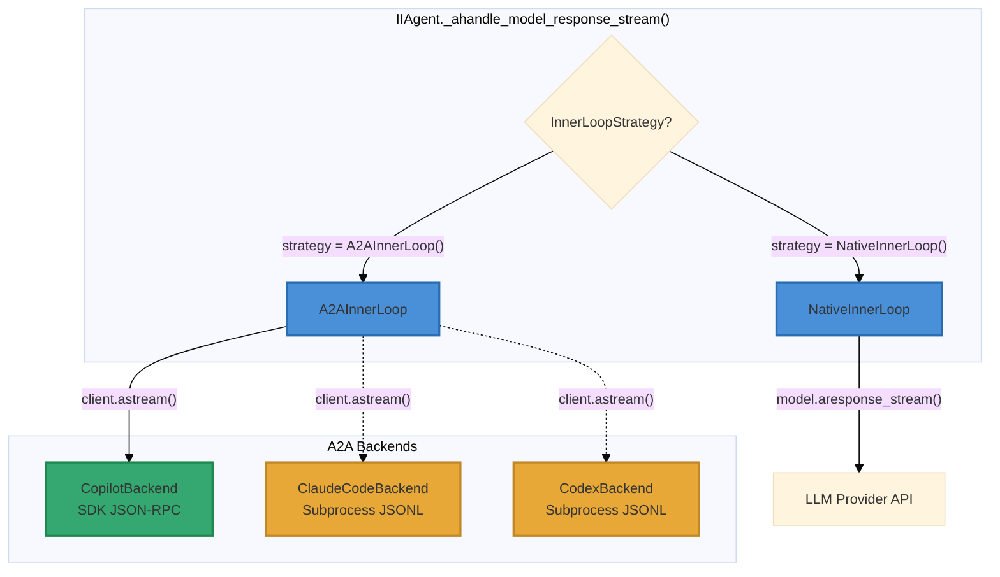

# A2A Inner Loop Backend Parity Assessment

> **Date**: 2026-04-09  
> **Status**: As-built assessment against codebase at `rebase/local-docker-sandbox` HEAD  
> **Scope**: Feature-by-feature comparison of NativeInnerLoop vs three A2A backends  
> **Related**: [a2a-copilot-cli-inner-loop-strategy.md](a2a-copilot-cli-inner-loop-strategy.md), [a2a-tools-parity-audit.md](a2a-tools-parity-audit.md)

---

## Architecture Overview



---

## 1. Complete Native Inner Loop Feature Inventory

Every feature of the native inner loop is cataloged below. The native path is
`NativeInnerLoop.aresponse_stream()` → `Model.aresponse_stream()`, plus the
agent-level orchestration in `IIAgent._ahandle_model_response_stream()` and
`_arun_stream()`.

### 1.1 LLM Turn Execution

| # | Feature | Location | Description |
|---|---------|----------|-------------|
| F01 | **Streaming text deltas** | `models/base.py` `_ainvoke_stream_with_retry()` | Token-by-token content streaming via SSE |
| F02 | **Reasoning / extended thinking** | `models/base.py` + provider impls | Streaming reasoning chunks with `delta_status` lifecycle |
| F03 | **Tool call generation** | `models/base.py` `aresponse_stream()` | LLM generates tool_calls; agent executes them |
| F04 | **Tool call loop** | `models/base.py` loop in `aresponse()` | Automatic re-invocation after tool results until model stops |
| F05 | **Structured output** | `response_format` parameter | JSON schema / Pydantic model validation on output |
| F06 | **Retry with backoff** | `_ainvoke_with_retry()` | Exponential backoff on transient LLM API errors |
| F07 | **Multiple LLM providers** | `models/anthropic/`, `models/openai/`, `models/google/` | Claude, GPT, Gemini, Cerebras, VertexAI |
| F08 | **Model-specific parameters** | `_set_reasoning_request_param()` etc. | o-series reasoning budget, provider-specific tuning |
| F09 | **Response caching** | Provider-level prompt caching | Anthropic cache_read/write, OpenAI cached tokens |

### 1.2 Tool Execution

| # | Feature | Location | Description |
|---|---------|----------|-------------|
| F10 | **Full tool inventory** | `agents/tools/` (100+ tools) | Shell, file, browser, media, dev, MCP, connectors |
| F11 | **Tool hooks (pre/post)** | `BaseAgentTool.on_tool_start/end()` | Sandbox init, MCP connect, agent ref injection |
| F12 | **Parameter injection** | `FunctionCall._build_entrypoint_args()` | `agent`, `run_context`, `session_state`, `fc`, `dependencies` |
| F13 | **HITL — confirmation** | `ToolExecution.requires_confirmation` | Pause for user approval before executing dangerous tools |
| F14 | **HITL — user input** | `ToolExecution.requires_user_input` | Prompt user for structured input mid-execution |
| F15 | **HITL — external execution** | `ToolExecution.external_execution_required` | Mark tool for client-side execution |
| F16 | **Tool call pause/resume** | `ToolCallPausedEvent` → user confirms → resume | Full HITL lifecycle with event emission |
| F17 | **Session state mutation** | `session_state` dict passed by reference | Tools can write state visible to subsequent tools |
| F18 | **Artifact collection** | `images`, `videos`, `audios`, `files` on response | Tools return media artifacts to agent |
| F19 | **Skills framework** | `agents/skills/` | User-defined custom tools via skill registry |
| F20 | **Connector tools** | `agents/connector.py` | GitHub, Google Drive via Composio MCP |

### 1.3 Sandbox Lifecycle

| # | Feature | Location | Description |
|---|---------|----------|-------------|
| F21 | **Lazy sandbox init** | `BaseSandboxTool._ensure_sandbox()` | Double-checked locking; init on first sandbox tool use |
| F22 | **Eager sandbox init (A2A)** | `IIAgent._ensure_sandbox_for_inner_loop()` | Pre-LLM-turn init with adapter health check |
| F23 | **Sandbox info on FunctionCall** | `fc.sandbox = await sandbox.get_info()` | Every tool call receives sandbox metadata |
| F24 | **MCP server lifecycle** | `MCPTool.on_tool_start()` | Expose port + connect MCP client on tool start |

### 1.4 Event System

| # | Feature | Location | Description |
|---|---------|----------|-------------|
| F25 | **RunStartedEvent** | `_arun_stream()` | Emitted before first LLM call |
| F26 | **ReasoningStarted/Delta/Completed** | `_handle_model_response_chunk()` | Full reasoning lifecycle events |
| F27 | **RunContentDeltaEvent** | `_handle_model_response_chunk()` | Streaming content to client |
| F28 | **ToolCallStarted/Completed** | `_handle_model_response_chunk()` | Per-tool execution events |
| F29 | **ToolCallPausedEvent** | `_handle_model_response_chunk()` | HITL pause notification |
| F30 | **SandboxInitializedEvent** | `_ahandle_model_response_stream()` | Post-sandbox-creation notification |
| F31 | **ModelTurnMetricsEvent** | `_handle_model_response_chunk()` | Per-turn billing metrics |
| F32 | **RunCompleted/Cancelled/Error** | `_arun_stream()` exception handling | Terminal run state events |
| F33 | **SessionSummaryStarted/Completed** | `_arun_stream()` | Context summarization events |
| F34 | **Pre/PostHookStarted/Completed** | `_arun_stream()` | Agent hook lifecycle events |

### 1.5 Billing & Metrics

| # | Feature | Location | Description |
|---|---------|----------|-------------|
| F35 | **Token counting** | `Metrics` dataclass | input, output, total, cache_read, cache_write, reasoning |
| F36 | **Cost tracking** | `Metrics.cost` | Dollar cost per turn |
| F37 | **billing_backend attribution** | `Metrics.billing_backend` | Identifies which backend served the turn |
| F38 | **premium_requests tracking** | `Metrics.premium_requests` | Copilot-model premium request count |
| F39 | **TTFT / duration** | `Metrics.time_to_first_token`, `duration` | Latency metrics |
| F40 | **Metrics aggregation** | `Metrics.__add__()` | Sum across turns; `billing_backend` uses latest |

### 1.6 Session & Context Management

| # | Feature | Location | Description |
|---|---------|----------|-------------|
| F41 | **Message history** | `RunMessages` assembly in `_arun_stream()` | System + history + user input + context |
| F42 | **Session summarization** | `SessionSummaryManager.acreate_session_summary()` | Compress history when token threshold exceeded |
| F43 | **Compaction authority** | `CompactionAuthorityEvent` + lock | A2A claims summarization control |
| F44 | **Context reuse across backends** | `A2AInnerLoop.context_reuse` | Continue A2A session after native fallback |

### 1.7 Error Handling & Resilience

| # | Feature | Location | Description |
|---|---------|----------|-------------|
| F45 | **Cancellation** | `raise_if_cancelled()` checks in `_arun_stream()` | Redis-backed cancel token; checked pre/post model call |
| F46 | **Circuit breaker** | `A2AInnerLoop.circuit_breaker` | Automatic A2A→native fallback on repeated failures |
| F47 | **Graceful fallback** | `A2AInnerLoop.fallback_to_native` | Falls back to NativeInnerLoop on A2A failure |
| F48 | **Non-retriable error detection** | `_map_event()` for `session.error` | Bad prompts / malformed JSON raise immediately |

### 1.8 Multimodal

| # | Feature | Location | Description |
|---|---------|----------|-------------|
| F49 | **Image input** | `multimodal.py` `extract_user_content()` | Images in user messages via A2A Parts |
| F50 | **Video/audio input** | `models/base.py` media handling | Provider-dependent; native supports via model API |
| F51 | **File attachments** | `multimodal.py` `FilePart` extraction | Documents / code files as context |
| F52 | **Generated media output** | `ModelResponse.images/videos/audios/files` | Tools return created media to client |

---

## 2. Per-Backend Feature Parity Matrix

Legend: **Y** = full parity, **P** = partial, **N** = not supported, **—** = not applicable

| # | Feature | Native | Copilot | Claude Code | Codex | Notes |
|---|---------|--------|---------|-------------|-------|-------|
| | **LLM Turn Execution** | | | | | |
| F01 | Streaming text deltas | **Y** | **Y** | **Y** | **Y** | All emit `assistant.message_delta` |
| F02 | Reasoning / thinking | **Y** | **Y** | **Y** | **Y** | All emit `assistant.reasoning_delta` |
| F03 | Tool call generation | **Y** | **Y** | **Y** | **Y** | CLI backends generate tool calls internally |
| F04 | Tool call loop | **Y** | **Y** | **Y** | **Y** | CLI backends loop internally |
| F05 | Structured output | **Y** | **N** | **N** | **N** | `response_format` discarded in A2A path (line 126) |
| F06 | Retry with backoff | **Y** | **P** | **N** | **N** | Copilot has circuit breaker; CLI backends are one-shot |
| F07 | Multiple LLM providers | **Y** | **P** | **N** | **N** | Copilot uses GH models; others fixed to their provider |
| F08 | Model-specific params | **Y** | **N** | **N** | **N** | CLI backends use their own model configs |
| F09 | Response caching | **Y** | **P** | **Y** | **N** | Claude Code has prompt caching; Copilot via GH API |
| | **Tool Execution** | | | | | |
| F10 | Full tool inventory | **Y** | **Y** | **N** | **N** | Copilot bridges via `tool_schemas`; others use CLI-native only |
| F11 | Tool hooks (pre/post) | **Y** | **Y** | **N** | **N** | Copilot bridge runs `FunctionCall.aexecute()` with hooks |
| F12 | Parameter injection | **Y** | **Y** | **N** | **N** | Copilot bridge injects `agent`, `run_context`, etc. |
| F13 | HITL — confirmation | **Y** | **N** | **N** | **N** | **Bypassed in tool bridge — safety gap** |
| F14 | HITL — user input | **Y** | **N** | **N** | **N** | Not implemented in any A2A backend |
| F15 | HITL — external exec | **Y** | **N** | **N** | **N** | Not implemented in any A2A backend |
| F16 | Tool pause/resume | **Y** | **N** | **N** | **N** | No `ToolCallPausedEvent` in A2A path |
| F17 | Session state mutation | **Y** | **Y** | **N** | **N** | Copilot bridge tools mutate `session_state` |
| F18 | Artifact collection | **Y** | **P** | **N** | **N** | Copilot bridge collects results; no media extraction |
| F19 | Skills framework | **Y** | **Y** | **N** | **N** | Skills are regular tools; bridge can execute them |
| F20 | Connector tools | **Y** | **Y** | **N** | **N** | Connectors are regular tools; bridge can execute them |
| | **Sandbox Lifecycle** | | | | | |
| F21 | Lazy sandbox init | **Y** | **—** | **—** | **—** | A2A uses eager init instead |
| F22 | Eager sandbox init | **—** | **Y** | **—** | **—** | Only Copilot needs sandbox (adapter runs inside) |
| F23 | Sandbox info on FC | **Y** | **Y** | **N** | **N** | Copilot bridge populates `fc.sandbox` via hooks |
| F24 | MCP server lifecycle | **Y** | **Y** | **N** | **N** | MCPTool hooks fire in bridge path |
| | **Event System** | | | | | |
| F25 | RunStartedEvent | **Y** | **Y** | **Y** | **Y** | Emitted at agent level, above inner loop |
| F26 | Reasoning lifecycle | **Y** | **Y** | **Y** | **Y** | All backends emit reasoning events via `_map_event()` |
| F27 | Content deltas | **Y** | **Y** | **Y** | **Y** | All backends emit content deltas |
| F28 | ToolCall Started/Done | **Y** | **Y** | **P** | **P** | Copilot: via bridge events; CC/Codex: `tool_call` SSE only |
| F29 | ToolCallPausedEvent | **Y** | **N** | **N** | **N** | No HITL in A2A path |
| F30 | SandboxInitialized | **Y** | **Y** | **N** | **N** | Only Copilot does eager sandbox init |
| F31 | ModelTurnMetrics | **Y** | **Y** | **P** | **P** | CC/Codex missing `billing_backend` in usage |
| F32 | Run terminal events | **Y** | **Y** | **Y** | **Y** | Agent-level; above inner loop |
| F33 | Summary events | **Y** | **Y** | **Y** | **Y** | Compaction lock guards native summarization |
| F34 | Hook events | **Y** | **Y** | **Y** | **Y** | Agent-level; above inner loop |
| | **Billing & Metrics** | | | | | |
| F35 | Token counting | **Y** | **Y** | **Y** | **Y** | All emit `assistant.usage` with token counts |
| F36 | Cost tracking | **Y** | **Y** | **N** | **N** | CC/Codex don't report cost in usage |
| F37 | billing_backend | **Y** | **Y** | **N** | **N** | **Bug**: CC/Codex → `"a2a:unknown"` — missing `"backend"` key |
| F38 | premium_requests | **Y** | **Y** | **—** | **—** | Only meaningful for Copilot |
| F39 | TTFT / duration | **Y** | **Y** | **N** | **N** | CC/Codex don't report timing |
| F40 | Metrics aggregation | **Y** | **Y** | **Y** | **Y** | `__add__` works regardless of source |
| | **Session & Context** | | | | | |
| F41 | Message history | **Y** | **Y** | **Y** | **Y** | All backends get assembled message history; Copilot converts to structured text with tool calls, reasoning, and media references via `build_conversation_context()` |
| F42 | Session summarization | **Y** | **Y** | **Y** | **Y** | Compaction lock prevents conflicts |
| F43 | Compaction authority | **—** | **Y** | **Y** | **Y** | All A2A backends acquire compaction lock |
| F44 | Context reuse | **—** | **Y** | **Y** | **P** | Codex conversation persistence is in-memory only |
| | **Error Handling** | | | | | |
| F45 | Cancellation | **Y** | **N** | **N** | **N** | **No `raise_if_cancelled` in A2A stream loop** |
| F46 | Circuit breaker | **—** | **Y** | **Y** | **Y** | Same breaker for all A2A backends |
| F47 | Graceful fallback | **—** | **Y** | **Y** | **Y** | Falls back to NativeInnerLoop |
| F48 | Non-retriable errors | **Y** | **Y** | **Y** | **Y** | `session.error` → `ModelProviderError` |
| | **Multimodal** | | | | | |
| F49 | Image input | **Y** | **Y** | **Y** | **N** | Codex is text-only |
| F50 | Video/audio input | **Y** | **N** | **N** | **N** | No A2A backend supports video/audio input |
| F51 | File attachments | **Y** | **Y** | **P** | **N** | CC: `--image` only; Codex: none |
| F52 | Generated media output | **Y** | **P** | **N** | **N** | Copilot bridge returns tool results but no media extraction |

---

## 3. Parity Scores

| Backend | Full Parity | Partial | Not Supported | Parity Rate |
|---------|------------|---------|---------------|-------------|
| **Copilot** | 35 | 7 | 10 | **67%** |
| **Claude Code** | 19 | 4 | 29 | **37%** |
| **Codex** | 17 | 3 | 32 | **32%** |

---

## 4. Features That Cannot Be Implemented Per Backend

### 4.1 CopilotBackend — Structurally Impossible

| Feature | Why |
|---------|-----|
| F05 Structured output | Copilot SDK has no `response_format` parameter; CLI controls output format |
| F07 Multiple LLM providers | Copilot CLI uses GitHub-hosted models only; no arbitrary provider |
| F08 Model-specific params | Copilot SDK abstracts model config; no reasoning budget knobs |
| F50 Video/audio input | Copilot SDK `Part` types support text and file only |

### 4.2 ClaudeCodeBackend — Structurally Impossible

| Feature | Why |
|---------|-----|
| F05 Structured output | CLI subprocess has no `response_format` flag |
| F07 Multiple LLM providers | Hardcoded to Anthropic Claude |
| F10-F12 Custom tool bridging | No `tool_schemas` parameter; CLI uses its own builtin tools exclusively |
| F13-F16 HITL | No SDK bridge for confirmation/input pause; CLI auto-executes |
| F17 Session state mutation | No bidirectional communication; subprocess is fire-and-forget |
| F19-F20 Skills/connectors | Cannot register custom tools at runtime |
| F50 Video/audio input | CLI `--image` flag only |

### 4.3 CodexBackend — Structurally Impossible

| Feature | Why |
|---------|-----|
| F05 Structured output | CLI subprocess has no `response_format` flag |
| F07 Multiple LLM providers | Hardcoded to OpenAI models |
| F10-F12 Custom tool bridging | No `tool_schemas` parameter |
| F13-F16 HITL | No SDK bridge; `--full-auto` mode auto-executes everything |
| F17 Session state mutation | No bidirectional communication |
| F19-F20 Skills/connectors | Cannot register custom tools at runtime |
| F49 Image input | Text-only; non-text parts logged and skipped |
| F50-F51 Video/audio/file input | Text-only backend |

---

## 5. Bugs and Issues Found

### 5.1 Critical

| ID | Issue | Location | Impact |
|----|-------|----------|--------|
| B01 | **HITL bypassed in tool bridge** | `inner_loop.py:375` | Safety-critical tools (e.g., file delete, deployment) execute without user approval when invoked via Copilot bridge |
| B02 | **No cancellation during A2A stream** | `inner_loop.py:219-237` | Long-running A2A turns cannot be cancelled mid-stream; user must wait for timeout or turn completion |

### 5.2 High

| ID | Issue | Location | Impact |
|----|-------|----------|--------|
| B03 | **billing_backend = "a2a:unknown" for CC/Codex** | `inner_loop.py:653` | Claude Code and Codex usage events lack `"backend"` key → billing attribution fails |
| B04 | **No cost tracking for CC/Codex** | `claude_code_backend.py:225`, `codex_backend.py:576` | Usage events omit `cost` field → zero cost reported |

### 5.3 Medium

| ID | Issue | Location | Impact |
|----|-------|----------|--------|
| B05 | **Codex session persistence in-memory only** | `codex_backend.py` `_conversations` dict | Backend restart loses all conversation state |
| B06 | **No TTFT/duration for CC/Codex** | Missing in usage events | Latency metrics unavailable for these backends |
| B07 | **Tool call events inconsistent** | CC/Codex emit `assistant.tool_call`; `_map_event()` doesn't handle it | Tool execution visibility is backend-dependent |

### 5.4 Fixed

| ID | Issue | Location | Fix |
|----|-------|----------|-----|
| B08 | **Text duplication in A2A streaming** | `inner_loop.py:_map_event()` | `assistant.message`/`content_done` was mapped with `is_delta=True`, causing the full content to be appended on top of accumulated deltas. Fixed by setting `is_delta=False` to match native Anthropic `ContentBlockStopEvent` behavior. |

---

## 6. Copilot Backend Live Testing Go/No-Go

### 6.1 Go Criteria Assessment

| Criterion | Status | Evidence |
|-----------|--------|----------|
| **Core LLM streaming** | **GO** | Text deltas, reasoning, final messages all flow correctly |
| **Tool bridging** | **GO** | `_execute_bridged_tool()` uses `FunctionCall.aexecute()` with full hook chain |
| **Sandbox lifecycle** | **GO** | Eager init with health check; URL factory resolves adapter port |
| **Billing attribution** | **GO** | `billing_backend="a2a:copilot"`, `premium_requests` tracked |
| **Circuit breaker / fallback** | **GO** | Automatic fallback to native on failure; compaction lock works |
| **Session management** | **GO** | Multi-turn context via Copilot SDK sessions; idle reaper active |
| **Event system** | **GO** | All critical events (content, reasoning, metrics, sandbox) emitted |
| **Compaction authority** | **GO** | Lock prevents native summarization during A2A turn |
| **HITL on bridged tools** | **GO** | `_execute_bridged_tool` checks `requires_confirmation`/`requires_user_input`/`external_execution` and emits `ToolCallPaused`; agent.py handles pause/resume |
| **Mid-stream cancellation** | **GO** | `raise_if_cancelled()` in stream loop; `RunCancelledException` propagates (not caught by fallback handler); adapter `cancel_task()` called to unblock waiting tool bridge |
| **Unit tests** | **GO** | 72+ A2A/Copilot tests passing; 5377 total tests pass |

### 6.2 No-Go Blockers

| Blocker | Severity | Status | Notes |
|---------|----------|--------|-------|
| ~~B01: HITL bypassed~~ | ~~Critical~~ | **FIXED** | `_execute_bridged_tool` now checks HITL flags and emits `ToolCallPaused` events; agent.py handles pause/resume natively |
| ~~B02: No mid-stream cancel~~ | ~~High~~ | **FIXED** | `raise_if_cancelled()` in stream loop; `RunCancelledException` propagates correctly (explicit re-raise before generic handler); adapter `cancel_task()` called |
| ~~B03: billing_backend unknown~~ | ~~Medium~~ | **FIXED** | Claude Code emits `"backend": "claude-code"`, Codex emits `"backend": "codex"` |

### 6.3 Recommendation

```
┌─────────────────────────────────────────────────────────┐
│                                                         │
│   COPILOT BACKEND: GO FOR LIVE TESTING                  │
│                                                         │
│   All critical blockers resolved:                       │
│   ✓ B01: HITL pause on bridged tools implemented        │
│   ✓ B02: Mid-stream cancellation with adapter cancel    │
│   ✓ B03: Billing attribution fixed for all backends     │
│                                                         │
│   Remaining conditions:                                 │
│   1. Monitor circuit breaker fallback rate               │
│   2. Set max turn timeout to 180s (not 300s)            │
│   3. Test with non-destructive workloads first          │
│                                                         │
│   CLAUDE CODE / CODEX: NO-GO                            │
│   Missing: tool bridging, HITL, session state,          │
│   cost tracking                                         │
│                                                         │
└─────────────────────────────────────────────────────────┘
```

### 6.4 Pre-Live Checklist

- [x] Fix B01: HITL pause on bridged tools (`_execute_bridged_tool` checks HITL flags, emits `ToolCallPaused`)
- [x] Fix B02: Mid-stream cancellation (`raise_if_cancelled()` in stream loop, adapter `cancel_task()`)
- [x] Fix B03: Add `"backend": "claude-code"` and `"backend": "codex"` to usage events
- [ ] Verify Copilot CLI binary is bundled in sandbox image (`e2b.Dockerfile`)
- [ ] Verify `GITHUB_TOKEN` is available in sandbox environment
- [ ] Test circuit breaker fallback with simulated adapter failure
- [ ] Test compaction lock release on stream exception
- [ ] Confirm `ToolCallStarted`/`ToolCallCompleted`/`ToolCallPaused` events reach frontend for bridged tools
- [ ] Run at least one multi-turn session with tool use (web_search + file write)
- [ ] Verify billing ledger records `a2a:copilot` transactions correctly

### 6.5 Post-Live Monitoring

| Metric | Threshold | Action |
|--------|-----------|--------|
| Circuit breaker fallback rate | > 10% of turns | Investigate adapter stability |
| Average turn latency | > 2x native | Profile SDK overhead |
| Tool bridge success rate | < 95% | Check hook chain + sandbox access |
| Billing attribution accuracy | Any `a2a:unknown` | Fix backend identifier emission |
| Cancel responsiveness | > 30s after cancel | Prioritize B02 fix |

---

## 7. Remediation Roadmap

### Phase 1 — Pre-Live (Required)

| Item | Effort | Impact |
|------|--------|--------|
| Exclude HITL-flagged tools from `serialize_tool_schemas()` | Small | Prevents B01 safety gap |
| Add `"backend"` key to CC/Codex usage events (B03) | Small | Fixes billing attribution |

### Phase 2 — Post-Live (High Priority)

| Item | Effort | Impact |
|------|--------|--------|
| Add `raise_if_cancelled()` inside A2A stream loop (B02) | Medium | Enables mid-stream cancellation |
| Add `cost` to CC/Codex usage events (B04) | Small | Enables cost tracking |
| Add HITL support in tool bridge for Copilot (B01) | Large | Enables confirmation for bridged tools |

### Phase 3 — Future

| Item | Effort | Impact |
|------|--------|--------|
| Add `tool_schemas` support to Claude Code backend | Large | Enables custom tool bridging |
| Add `tool_schemas` support to Codex backend | Large | Enables custom tool bridging |
| Add video/audio multimodal support | Medium | Requires SDK/CLI updates |
| Persistent Codex sessions (B05) | Medium | Improves context reuse reliability |
