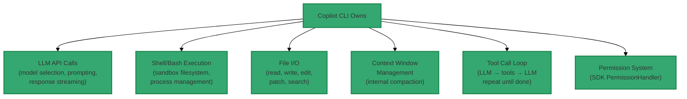
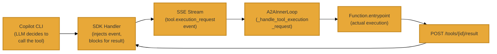
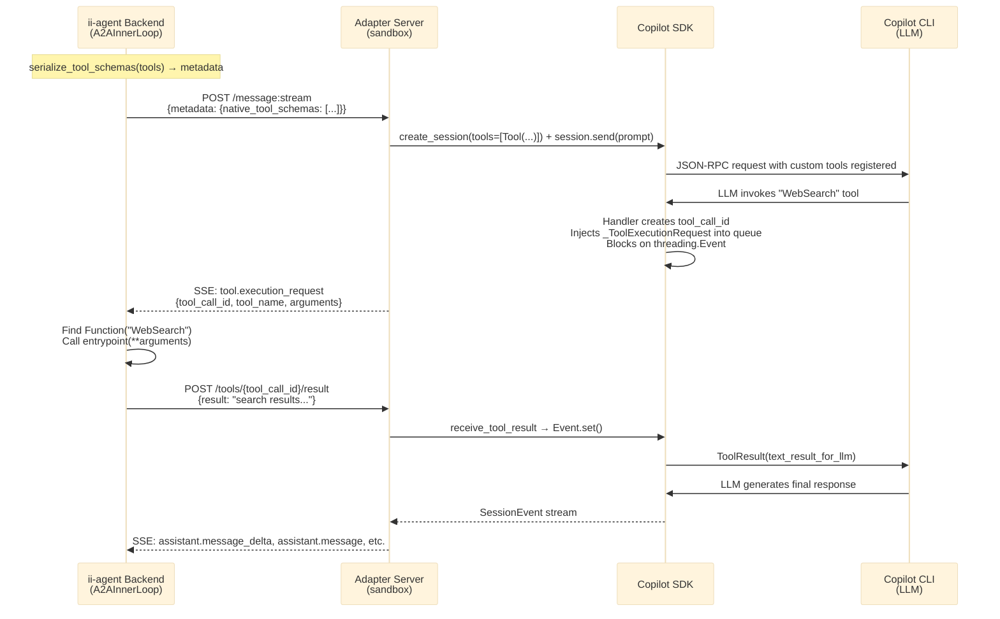

# A2A Tool Bridge — Gap Analysis & Responsibility Matrix

> **Status**: Implemented — Tests Passing (55 tests)  
> **Date**: 2026-04-09  
> **Scope**: Analysis of what was missing from the original A2A inner loop design, which native inner loop responsibilities the A2A path can take over, and which must remain native-only  
> **Depends on**: [a2a-copilot-cli-inner-loop-strategy.md](a2a-copilot-cli-inner-loop-strategy.md), [a2a-copilot-cli-inner-loop-impl.md](../impl-docs/a2a-copilot-cli-inner-loop-impl.md)

---

## Executive Summary

The original A2A inner loop design delegated the **entire LLM + tool execution loop** to the Copilot CLI.  This created a critical gap: the CLI only has built-in bash and file tools, so all ii-agent platform features (browser, media, slides, web search, connectors, deployments, etc.) were silently unavailable during A2A-delegated turns.

The **tool bridge** closes this gap by registering ii-agent's native tools as Copilot SDK custom tools.  When the CLI's LLM invokes a bridged tool, the execution request is forwarded back to the ii-agent backend (which has full infrastructure access), executed locally, and the result is delivered back to the CLI session.

---

## 1. What Was Missing From the Original Design

### 1.1 The Core Gap: Tool Availability

The original `A2AInnerLoop.aresponse_stream()` accepted a `tools` parameter but **completely ignored it**.  The implementation sent only the user's text message to the A2A adapter — the tool definitions were never transmitted.  The Copilot CLI only has:

- **Bash/shell** tools (built-in)
- **File read/write/edit** tools (built-in)

ii-agent provides **19+ additional tools** in the GENERAL agent alone:

| Tool Category | Tools | Status Before Bridge |
|---|---|---|
| Shell / Filesystem | Bash, Read, Write, Edit, ApplyPatch, StrReplaceEditor | CLI-native (worked) |
| Browser / Web | WebSearch, VisitWeb, BrowserAction | **Missing** — CLI refused browser tasks |
| Media | ImageGeneration, VideoGeneration | **Missing** — not possible in CLI |
| Slides | SlideGeneration, SlideEdit | **Missing** |
| Connectors | GitHubConnector, GoogleDriveConnector | **Missing** |
| Project | DeployProject, ManageDatabase | **Missing** |
| Planning | CreatePlan, UpdatePlan | **Missing** |
| Content | StoryGenerator | **Missing** |

**Observed failure**: Test session `b303bdc8` showed the Copilot CLI responding "I don't have internet access via the bash tool" when asked to browse a website — because it genuinely didn't have a browser tool.

### 1.2 Missing: Tool Result Event Loop

In the native inner loop, the model's `aresponse_stream()` runs a **while loop**: LLM call → tool calls → execute tools → feed results back → LLM call → repeat.  This loop is managed entirely by the `Model.aresponse_stream()` method (base.py L553-691).

When the A2A path delegates to the Copilot CLI, this same loop runs **inside the CLI process** via the Copilot SDK.  But tool execution happened inside the CLI's sandbox — there was no mechanism to execute a tool on the backend side and return the result.

### 1.3 Missing: Cross-Boundary Tool Execution Protocol

No protocol existed for:

1. The CLI to signal "I need tool X executed with arguments Y"
2. The backend to receive that signal, execute the tool, and return the result
3. Keeping the HTTP SSE stream alive during potentially long tool executions

### 1.4 Missing: Tool Schema Transport

The A2A metadata dict had no field for carrying tool definitions from the backend to the adapter.  The `_event_source()` function in `adapter_server.py` didn't extract or forward tool information to the backend's `stream()` method.

---

## 2. Responsibility Matrix: What A2A Can vs Must-Not Handle

### 2.1 Responsibilities Fully Delegated to A2A CLI

These are handled entirely by the Copilot CLI and **should NOT** be duplicated on the backend:

| Responsibility | Why CLI Handles It | Backend Role |
|---|---|---|
| **LLM API calls** | CLI has its own model + auth | None — CLI chooses model |
| **Shell execution** | Must run in sandbox for isolation | None |
| **File I/O** | Must access sandbox filesystem | None |
| **Tool call while-loop** | SDK manages internally (base.py L663-765 equivalent) | None |
| **Context window** | CLI compacts its own working context | Backend holds canonical DB history |
| **Permission approval** | SDK `PermissionHandler` callback | Auto-approve via `on_permission_request` |
| **Streaming events** | SDK fires `SessionEvent` callbacks | Backend maps to `ModelResponse` |

### 2.2 Responsibilities Bridged (CLI Invokes, Backend Executes)

These tools are **registered in the CLI as custom tools** via the SDK, but **executed on the backend** where infrastructure is available:

| Tool | Base Class | Why Bridged | Bridge Status Today |
|---|---|---|---|
| **WebSearch** | `BaseAgentTool` | Pure API call via `tool_client` — needs API keys in backend env | **Works** — no sandbox/agent injection needed |
| **VisitWeb** | `BaseAgentTool` | Pure API call via `tool_client.web_visit()` | **Works** — no sandbox/agent injection needed |
| **WebBatchSearch** | `BaseAgentTool` | Pure API call via `tool_client` | **Works** |
| **ImageSearch** | `BaseAgentTool` | Pure API call via `tool_client.image_search()` | **Works** |
| **ReadRemoteImage** | `BaseAgentTool` | Plain `httpx` HTTP call | **Works** |
| **BrowserAction** | `MCPTool` → `BaseSandboxTool` | Browser runs in sandbox; tool orchestrates via MCP client | **Broken** — `_execute_bridged_tool` is `@staticmethod`, no `on_tool_start()` → `self.sandbox` is `None` |
| **ImageGeneration** | `BaseSandboxTool` | Needs media API keys + writes output to sandbox filesystem | **Broken** — `self.sandbox` is `None` without `on_tool_start()` |
| **VideoGeneration** | `BaseSandboxTool` | Backend media pipeline + sandbox filesystem | **Broken** — same reason |
| **SlideGeneration** | `MCPTool` → `BaseSandboxTool` | Backend slide service + MCP client to sandbox | **Broken** — `self.mcp_client` is `None` |
| **GitHubConnector** | service-based | Composio OAuth tokens on backend | Needs `agent.session_id` injection |
| **GoogleDriveConnector** | service-based | Composio OAuth tokens on backend | Needs `agent.session_id` injection |
| **DeployProject** | service-based | Cloud Run / GCS access on backend | Needs `agent`/`run_context` injection |
| **ManageDatabase** | service-based | Database provisioning service on backend | Needs `agent`/`run_context` injection |
| **CreatePlan / UpdatePlan** | service-based | Backend planning service | Needs `agent`/`run_context` injection |
| **StoryGenerator** | service-based | Backend storybook service | Needs `agent`/`run_context` injection |

> **Important architectural note**: In ii-agent's native inner loop, ALL tool entrypoints
> run on the **backend** process — not inside the sandbox.  Tools that need the sandbox
> access it remotely via `agent.sandbox` (injected by `FunctionCall.aexecute()` →
> `_build_entrypoint_args()`).  `BaseSandboxTool.on_tool_start()` lazily creates the
> sandbox and stores the reference in `self.sandbox`.  The current bridge's
> `_execute_bridged_tool()` is a `@staticmethod` that calls `tool.entrypoint(**arguments)`
> directly — skipping all injection and lifecycle hooks.  Only pure-API tools (6 tools
> using `tool_client`) work today; sandbox-dependent tools crash with `None` references.

### 2.3 Responsibilities That MUST Remain Native (Never Delegated)

These are executed **only** by the ii-agent backend, never by the CLI or any external process:

```mermaid
%%{init: {'theme':'base', 'themeVariables': {'fontFamily': 'Arial, sans-serif', 'fontSize': '13px', 'fontWeight': 'normal'}}}%%
flowchart TD
    NATIVE["Backend-Only<br/>(Never Delegated)"]
    NATIVE --> SEC["Security-Sensitive Tools<br/>(get_secret, set_secret,<br/>rotate_api_key, etc.)"]
    NATIVE --> AUTH["Authentication &<br/>Authorization<br/>(JWT, OAuth, API keys)"]
    NATIVE --> BILL["Billing & Credits<br/>(reserve → settle → release)"]
    NATIVE --> DB["Database Persistence<br/>(canonical message history,<br/>session state, run tasks)"]
    NATIVE --> EVENTS["Event Bus<br/>(Socket.IO broadcast,<br/>application_events table)"]
    NATIVE --> CANCEL["Cancellation<br/>(Redis cancel tokens,<br/>run lifecycle)"]
    NATIVE --> METRICS["Metrics & Telemetry<br/>(ModelTurnMetricsEvent,<br/>ToolExecution tracking)"]
    NATIVE --> HOOKS["Pre/Post Hooks<br/>(agent lifecycle callbacks)"]
    NATIVE --> HITL["HITL Pausing<br/>(requires_confirmation,<br/>requires_user_input)"]
    NATIVE --> MEDIA_AGG["Media Aggregation<br/>(images, videos, audio<br/>from tool results)"]

    classDef critical fill:#d94a4a,stroke:#b03030,stroke-width:2px
    class NATIVE,SEC,AUTH,BILL,DB,EVENTS,CANCEL,METRICS,HOOKS,HITL,MEDIA_AGG critical
```

| Responsibility | Why Backend-Only | Risk If Delegated |
|---|---|---|
| **Security-sensitive tools** | Secret values must never leave server | Credential exposure |
| **Authentication** | JWT/OIDC verification, user identity | Auth bypass |
| **Billing reservations** | Credit reserve → settle → release lifecycle | Revenue leakage |
| **DB persistence** | Canonical message history, session state | Data loss / split-brain |
| **Event bus** | Socket.IO real-time events to frontend | UI out of sync |
| **Cancellation** | Redis token checks at multiple checkpoints | Uncancellable runs |
| **Metrics/telemetry** | Per-turn token counts, tool execution timing | Billing inaccuracy |
| **Pre/post hooks** | Session memory, skill injection, custom logic | Missing functionality |
| **HITL pausing** | `requires_confirmation`, `requires_user_input` | Safety bypass |
| **Media aggregation** | Collect images/videos/audio from tools | Missing media in UI |

---

## 3. Current Gaps in the Tool Bridge Implementation

### 3.1 Partially Addressed

| Gap | Status | What's Done | What's Missing |
|---|---|---|---|
| **Tool schema transport** | Done | `serialize_tool_schemas()` → metadata → adapter extraction | — |
| **SDK tool registration** | Done | `_create_sdk_tools()` creates SDK `Tool` objects | — |
| **Bidirectional result delivery** | Done | SDK handler → event queue → SSE → backend → POST | — |
| **Heartbeat keep-alive** | Done | 15s heartbeat events during tool execution | — |
| **CLI-native tool exclusion** | Done | `_CLI_NATIVE_TOOL_NAMES` frozenset excludes 9 tools | — |
| **Cross-thread safety** | Done | `threading.Event` + `call_soon_threadsafe` | — |

### 3.2 Not Yet Addressed (Known Limitations)

| Gap | Impact | Planned Direction |
|---|---|---|
| **No `ToolCallStartedEvent` / `ToolCallCompletedEvent` for bridged tools** | Frontend won't show tool execution progress during A2A turns | Emit synthetic events from `_handle_tool_execution_request` |
| **No `ModelTurnMetricsEvent` from A2A turns** | Billing telemetry via `assistant.usage` SSE only | Map usage SSE to `Metrics` in `_map_event()` (already partially done) |
| **No media artifact extraction from bridged tool results** | Images/videos from bridged tools not surfaced to UI | Parse tool results for media references |
| **No `requires_confirmation` / HITL for bridged tools** | Safety-critical tools could execute without user approval | Check `Function.requires_confirmation` before executing |
| **No tool hooks** (`pre_hook`, `post_hook`, `tool_hooks`) for bridged tools | Custom middleware around tool execution skipped | Wire hooks in `_execute_bridged_tool` |
| **`_execute_bridged_tool` doesn't inject `agent`/`run_context`/`session_state`** | Sandbox-dependent tools (`BaseSandboxTool`, `MCPTool`) crash — `self.sandbox` is `None`; service tools fail without context | Promote from `@staticmethod` to instance method; pass `agent`/`run_context`; call `on_tool_start()` for sandbox tools |
| **No `stop_after_tool_call` support** | Tools that should end the turn won't | Check flag after bridged tool execution |
| **Only 6 of ~19 bridged tools actually work** | Pure-API tools (`tool_client`-based) work; `BaseSandboxTool`/`MCPTool` subclasses crash | Must solve agent injection first — this is the critical next step |

### 3.3 Architectural Invariants

These will **never** be bridged (by design):

1. **Billing** — A2A turns consume CLI credits, not ii-agent credits (billing bypass via `CREDITS_BILLING_ENABLED`)
2. **Cancellation** — The A2A stream can be abandoned, but there's no way to cancel a specific tool call inside the CLI once the SDK handler is blocking
3. **Tool call limits** — Enforced inside the CLI's model loop, not by ii-agent

---

## 4. Implementation Summary

### 4.1 New Module: `tool_bridge.py`

| Export | Purpose |
|---|---|
| `_CLI_NATIVE_TOOL_NAMES` | frozenset of 9 tool names with CLI-native equivalents |
| `serialize_tool_schemas(tools, exclude_cli_native)` | Convert `Function`/dict tools to JSON schemas for transport |

### 4.2 Modified: `copilot_backend.py`

| Addition | Purpose |
|---|---|
| `_ToolExecutionRequest` dataclass | Sentinel for SDK handler → event queue injection |
| `_HEARTBEAT_INTERVAL = 15.0` | Keep HTTP streams alive during tool execution |
| `_tool_stream_queue`, `_tool_stream_loop` | Per-turn references for SDK handler thread safety |
| `_tool_result_slots` | `dict[tool_call_id → (Event, [result])]` for cross-thread delivery |
| `_session_tool_count` | Track tool set changes to trigger session re-creation |
| `_create_sdk_tools(schemas)` | Create SDK `Tool` objects with blocking handlers |
| `receive_tool_result(tool_call_id, result)` | Unblock SDK handler with execution result |

### 4.3 Modified: `adapter_server.py`

| Addition | Purpose |
|---|---|
| `_ToolResultBody` Pydantic model | Request body for tool result endpoint |
| `POST /tools/{tool_call_id}/result` | HTTP endpoint for backend → adapter result delivery |
| `_event_source` extracts `native_tool_schemas` | Forward tool schemas from metadata to backend |

### 4.4 Modified: `inner_loop.py`

| Addition | Purpose |
|---|---|
| `serialize_tool_schemas` call in metadata | Transport tool schemas via A2A request |
| `heartbeat` event handling | Skip heartbeat SSE events |
| `tool.execution_request` event handling | Execute bridged tools locally |
| `_handle_tool_execution_request(data, tools, context_id)` | Dispatch tool execution and POST result |
| `_execute_bridged_tool(tool_name, arguments, tools)` | Find matching Function, call entrypoint |

### 4.5 Modified: `as_client.py`

| Addition | Purpose |
|---|---|
| `post_tool_result(tool_call_id, result)` | POST to adapter's tool result endpoint |

---

## 5. Data Flow

