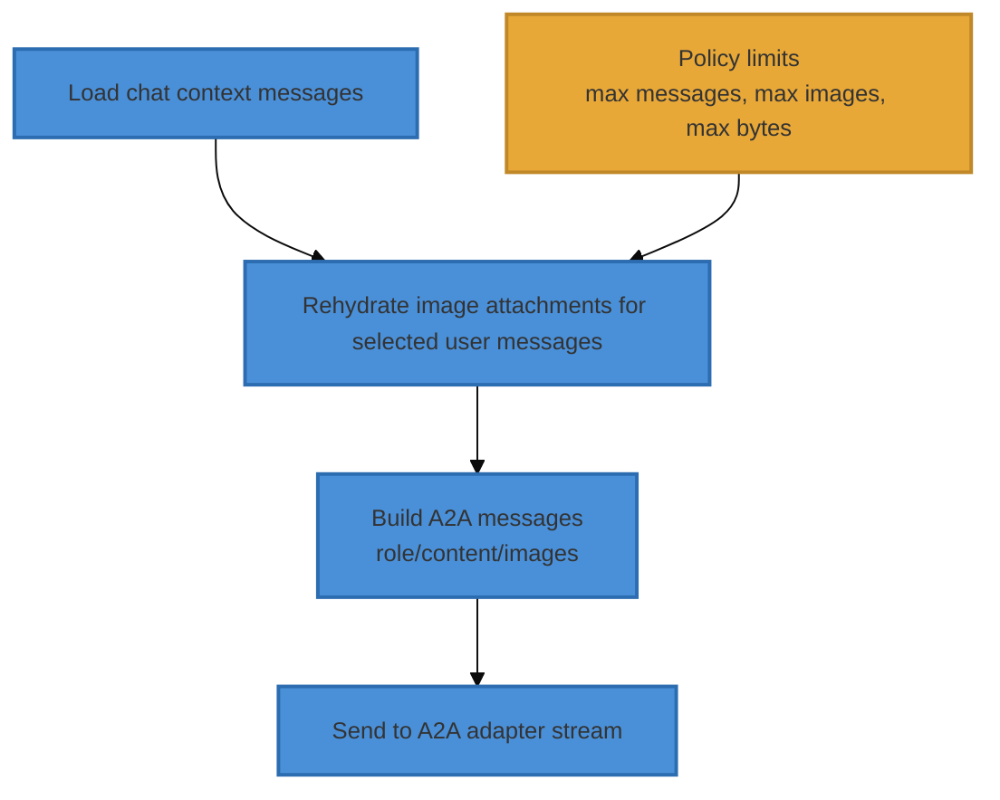

# Chat A2A Image Rehydration Design

> **Date**: 2026-04-14
> **Status**: Superseded — see As-Built Addendum below
> **Scope**: Chat mode (`/v1/chat/conversations`) when `AGENT_CHAT_INNER_LOOP_MODE=a2a`
> **Related**:
> - [chat-a2a-inner-loop-integration-assessment.md](chat-a2a-inner-loop-integration-assessment.md)
> - [a2a-conversation-history-parity.md](a2a-conversation-history-parity.md)

---

## Executive Summary

In Chat A2A mode, follow-up turns can lose access to images uploaded in earlier turns.
The root cause is representation mismatch:

- persisted chat history stores attachment IDs (`file_ids`), not image bytes
- A2A payload conversion forwards only inline image parts (`BinaryContent` / `ImageURLContent`)

This design adds a **rehydration step** in the Chat A2A loop that converts historical
`file_ids` back into inline image content for selected user messages before building
A2A payload messages.

Result: multi-turn image continuity in A2A chat, without requiring users to manually
reattach images every turn.

### Scope Boundary (Critical)

This design applies only to the Chat A2A turn loop used by
`/v1/chat/conversations` when `AGENT_CHAT_INNER_LOOP_MODE=a2a`.

It does not apply to agentic/runtime A2A execution paths (agent runs, tool-runtime
inner loops, or agent-mode orchestration). Those paths must remain behaviorally
unchanged by this work.

---

## Problem Statement

### User-visible symptom

A user can upload an image, ask a question, get a correct answer, then ask a follow-up
in the same session and receive: "I don't see any image file..."

### Technical root cause

1. New upload turn:
   - `ChatFileProcessor.process_uploads()` adds `BinaryContent` to the in-memory user message.
2. Message persistence:
   - message stores `parts` + `file_ids` metadata in DB.
3. Later turn context load:
   - history is reconstructed as normal message parts plus `file_ids` metadata.
4. A2A conversion:
   - `_build_a2a_messages()` includes images only from `BinaryContent`/`ImageURLContent`.
   - historical `file_ids` are ignored.

So prior images are known as metadata but not sent to the A2A backend as actual image inputs.

---

## Goals

1. Preserve prior-turn image visibility in Chat A2A mode.
2. Keep user UX parity with direct provider behavior for common follow-up questions.
3. Bound token/payload growth with explicit limits.
4. Avoid schema migrations.
5. Keep changes isolated to chat A2A path.

## Non-Goals

1. Rehydrating arbitrary non-image files for A2A backends.
2. Changing direct-provider chat behavior.
3. Replacing existing context compression/summarization strategy.
4. Reworking agent-mode A2A multimodal flow.

---

## Current vs Proposed Behavior

| Scenario | Current | Proposed |
|---|---|---|
| Turn N: user uploads image | Works (inline `BinaryContent`) | Works (unchanged) |
| Turn N+1 follow-up in same session (no reattach) | Fails in A2A path if image not inline in reconstructed history | Works: image is rehydrated from `file_ids` and included in A2A payload |
| Very large image history | Implicit failure/omission | Deterministic truncation by policy (latest-first, byte caps, count caps) |

---

## High-Level Design



---

## Detailed Design

### 1. New preprocessing step in Chat A2A turn loop

Before `_build_a2a_messages(chat_messages)`, run:

- `rehydrate_a2a_images(chat_messages, session_id, db_session, storage)`

Integration point in current runtime flow (must be explicit):

1. `ContextWindowManager.compress_context_if_needed(...)`
2. `rehydrate_a2a_images(...)`  **(new step)**
3. `_build_a2a_messages(...)`
4. `self._client.astream(...)`

Implementation note:

- Rehydration must use the same pre-stream DB session scope already used in
   `A2AChatTurnLoop._a2a_turn_loop` before adapter streaming begins.
- Rehydration must happen only on the A2A chat path; direct loop behavior is unchanged.
- Rehydration must not be invoked from agentic A2A/runtime paths.
- Rehydration must be backend-capability aware:
   - enabled for `copilot` and `claude-code`
   - skipped for `codex` (text-only backend) to avoid unnecessary payload bloat.

Implementation alignment with existing code:

- `A2AChatTurnLoop` currently has `_resolve_file_ids_to_binary(messages)`.
- This proposal supersedes that helper with policy-governed rehydration.
- Existing behavior that blindly injects all file types should be replaced by:
   - image-only rehydration
   - cap-aware reads
   - ownership/session checks
   - structured skip reasons.

Behavior:

1. Iterate user messages in reverse chronological order (latest first).
2. For each message, inspect `file_ids`.
3. Resolve IDs via `FileRepository.get_by_ids(...)`.
4. Keep image MIME types only (`image/*`).
5. For each selected image:
   - read bytes from storage
   - create `BinaryContent(path=..., mime_type=..., data=...)`
   - append to that message's `parts` if not already represented
6. Stop when policy limits are reached.
7. Check cancellation between messages and between storage reads.

Ownership/session enforcement (required):

- While resolving file rows, enforce that each asset belongs to the current user/session
   context before bytes are read.
- Any mismatch must be logged as skipped and never included in payload.

Required lookup strategy:

- Resolve eligible files through a session-scoped join/filter (session asset linkage)
   rather than trust-by-id lookup alone.

### 2. Policy controls (required)

Add A2A chat-safe limits (configurable):

- `CHAT_A2A_REHYDRATE_ENABLED` (default `true`)
- `CHAT_A2A_REHYDRATE_MAX_MESSAGES` (default `6`)
- `CHAT_A2A_REHYDRATE_MAX_IMAGES` (default `8`)
- `CHAT_A2A_REHYDRATE_MAX_TOTAL_BYTES` (default `16 MiB`)
- `CHAT_A2A_REHYDRATE_MAX_IMAGE_BYTES` (default `10 MiB`)
- `CHAT_A2A_REHYDRATE_MAX_SERIALIZED_PAYLOAD_BYTES` (default `24 MiB`)
- `CHAT_A2A_REHYDRATE_INCLUDE_GENERATED` (default `true`)

Configuration mapping (implementation contract):

- Add fields to `AgentSettings` (`src/ii_agent/core/config/agent.py`) and load from env.
- Expose typed access through existing settings plumbing used by chat A2A loop.
- Defaults by environment:
   - current implementation: enabled by default in all environments unless explicitly overridden.

Recommended defaults (approved baseline):

- `CHAT_A2A_REHYDRATE_ENABLED=true`
- `CHAT_A2A_REHYDRATE_MAX_MESSAGES=6`
- `CHAT_A2A_REHYDRATE_MAX_IMAGES=8`
- `CHAT_A2A_REHYDRATE_MAX_IMAGE_BYTES=10 MiB`
- `CHAT_A2A_REHYDRATE_MAX_TOTAL_BYTES=16 MiB`
- `CHAT_A2A_REHYDRATE_MAX_SERIALIZED_PAYLOAD_BYTES=24 MiB`
- `CHAT_A2A_REHYDRATE_INCLUDE_GENERATED=true`

Feature exposure policy:

- Do not expose this behavior as a user-facing API or UI toggle in phase 1.
- Keep control config-only (server-side env/settings) to avoid cross-mode UX confusion.

### 2a. Harmonized image selection algorithm (required)

The selector must combine latest-first recency with source priority:

1. Build a latest-first candidate window of user messages, capped by
   `CHAT_A2A_REHYDRATE_MAX_MESSAGES`.
2. Classify eligible image candidates into two tiers using asset origin metadata:
   - Tier 1 (higher priority): uploaded/attached images.
   - Tier 2 (lower priority): generated images from the same session.
3. Traverse Tier 1 latest-first and attach while all policy caps allow.
4. Enter Tier 2 only after all Tier 1 candidates in scope are exhausted.
5. In Tier 2, continue latest-first and attach only while policy caps allow.
6. Apply dedupe by canonical `file_id` across both tiers.
7. Stop immediately when any hard cap is reached (image count, raw bytes,
   serialized payload bytes).

Rationale:

- Generated images are included for continuity, but lower priority because they can
   usually be regenerated.

Example walkthrough (3-turn session):

- Policy:
   - `CHAT_A2A_REHYDRATE_MAX_MESSAGES=6`
   - `CHAT_A2A_REHYDRATE_MAX_IMAGES=8`
   - `CHAT_A2A_REHYDRATE_MAX_TOTAL_BYTES=16 MiB`
   - `CHAT_A2A_REHYDRATE_MAX_SERIALIZED_PAYLOAD_BYTES=24 MiB`
- History window (latest first):
   - Turn 3 user message: no upload, references prior context
   - Turn 2 user message: one generated image `g1` (2 MiB)
   - Turn 1 user message: two uploaded images `u1` (3 MiB), `u2` (4 MiB)
- Tiering result:
   - Tier 1 uploaded candidates (latest-first by containing message): `u1`, `u2`
   - Tier 2 generated candidates (latest-first by containing message): `g1`
- Selection:
   1. Attach `u1` (Tier 1) -> counts: images=1, bytes=3 MiB
   2. Attach `u2` (Tier 1) -> counts: images=2, bytes=7 MiB
   3. Tier 1 exhausted, policy still allows more -> evaluate Tier 2
   4. Attach `g1` (Tier 2) -> counts: images=3, bytes=9 MiB
   5. Final payload order remains consistent with per-message attachment order
       while honoring uploaded-first priority.

Cap-constrained variant:

- If `CHAT_A2A_REHYDRATE_MAX_TOTAL_BYTES=8 MiB` for the same history, selector
   stops after `u1` + `u2` (7 MiB) and skips `g1` because adding it would breach
   total byte cap.

Selection strategy:

- latest user messages first
- uploaded images first, generated images second
- generated images are considered only after uploaded candidates are exhausted
- within a message, preserve attachment order
- skip oversized image individually
- hard-stop on total byte cap
- hard-stop on serialized payload cap (estimated before send)

Serialized size policy:

- Enforce both raw-byte and serialized-payload caps.
- The serialized cap is authoritative for adapter safety.

### 3. Deduplication rules

Prevent duplicate images in payload:

1. Build a `seen_file_ids` set during rehydration (latest-first traversal).
2. If a `file_id` is already seen, skip older occurrences.
3. If a message already has a rehydrated part tagged with the same `file_id` in
   `provider_options`, skip re-append.

Implementation note:

- Do not rely on path signature for dedupe correctness; `file_id` is the canonical key.

### 4. Failure behavior (non-fatal)

Rehydration is best-effort:

- Missing DB asset row: warn + skip
- Storage read failure: warn + skip
- Invalid MIME/type mismatch: warn + skip
- Cap reached: info + stop
- Backend does not support image input: info + skip rehydrate stage

Never fail the turn solely due to rehydration misses.

Cancellation behavior:

- If cancellation is raised during rehydration, abort before opening A2A stream.
- This preserves current user-visible cancellation latency expectations.

### 5. Observability

Add structured logs/counters per turn:

- `chat.a2a.rehydrate.start`
- `chat.a2a.rehydrate.image_added`
- `chat.a2a.rehydrate.image_skipped` (reason: `missing`, `read_error`, `oversize`, `cap_reached`, `not_image`)
- `chat.a2a.rehydrate.complete` with totals

---

## Data/State Implications

No DB migration required.

Uses existing:

- `chat_messages.file_ids`
- `file assets` metadata
- storage paths for byte retrieval

No new persisted fields are required for phase 1.

---

## Security and Privacy Considerations

1. Rehydration only for current session messages.
2. Existing auth checks for session ownership already gate chat access.
3. No cross-session file lookup.
4. Logs must not include raw bytes or sensitive file content.

---

## Performance Considerations

Potential costs:

- additional DB read for file metadata
- additional storage reads for image bytes
- larger A2A request payloads

Mitigations:

- strict caps (messages/images/bytes)
- latest-first selection
- optional in-memory short-lived cache for repeated files within one request

Additional safeguard:

- Emit a single summary log line with selected/skipped totals per turn to avoid
   high-volume per-file logs on long histories.

---

## Rollout Plan

Scope guardrail for rollout:

- Enablement and telemetry for this feature are limited to Chat A2A traffic only.
- Agentic A2A/runtime traffic is out of scope and must not receive this behavior.

1. Implemented with config-driven controls.
2. Current default is enabled; operators can tune or disable via env-backed settings.
3. Keep telemetry and limits in place to monitor payload growth and regressions.

---

## Test Plan

### Unit tests

Add tests around A2A chat loop preprocessing:

1. Rehydrates image from prior user message `file_ids`.
2. Does not rehydrate non-image files.
3. Respects max-images and total-byte caps.
4. Deduplicates repeated file IDs.
5. Handles missing file metadata gracefully.
6. Handles storage read failure gracefully.
7. Respects serialized payload cap.
8. Honors cancellation during rehydration (no stream opened).
9. Enforces session/ownership checks (mismatch skipped).
10. Prioritizes uploaded images over generated images under tight caps.
11. Includes generated images only after uploaded candidates are exhausted.

### Integration tests

1. Chat A2A session:
   - turn 1: upload image + ask
   - turn 2: ask follow-up without reattach
   - assert model still describes same image
2. Regression: existing IMG-02 behavior remains green.
3. Regression: non-image A2A chat behavior unchanged.
4. Regression: direct chat path unchanged when A2A disabled.
5. Regression: council mode path unchanged (no rehydrate invocation).

---

## Alternatives Considered

### A) User reattach every turn

Pros: no backend changes.
Cons: poor UX, frequent user error, inconsistent with direct-provider behavior.

### B) Persist image bytes inside message payload

Pros: no storage fetch on replay.
Cons: larger DB rows, migration complexity, long-term storage bloat.

### C) Rehydrate only the latest user message with `file_ids`

Pros: cheapest.
Cons: misses common follow-up patterns when image was uploaded earlier than latest turn.

---

## Open Questions (For Approval)

No blocking open questions for phase 1.

Resolved by this revision:

- Include both uploaded and generated images in phase 1, with generated images as
   lower-priority candidates.
- Keep feature controls config-only (no user-facing toggle for now).
- Runtime call-site ordering is now explicit.
- Config ownership moved to `AgentSettings` contract.
- Serialized payload safety is now first-class.
- Existing helper replacement path is explicit.
- Default values and rollout posture are explicit.

---

## Approval Checklist

- [x] Scope limited to Chat A2A path
- [x] No schema migration required
- [x] Clear cap policy approved
- [x] Logging fields approved
- [x] Unit + integration test coverage approved
- [x] Rollout strategy approved
- [x] Config-only control approved (no user-facing toggle)

---

## As-Built Addendum (2026-04-17)

> The original design proposed a `rehydrate_a2a_images()` function with config-driven
> cap policies, serialized payload safety checks, and a phased rollout. **That design
> was never implemented.** The root cause and fix turned out to be simpler.

### Root Cause

`extract_user_content()` in `multimodal.py` only extracts images from the **last**
user message (`break` on first user hit when iterating in reverse). Meanwhile,
`build_conversation_context()` converts all prior messages to text-only, replacing
image references with `[Attached image: <alt>]` placeholders. On turn 2+, the LLM
never received the actual prior image bytes.

### Actual Implementation

**New function: `extract_historical_image_parts()`** in
`src/ii_agent/integrations/a2a/multimodal.py`

- Iterates all user messages **except the last** (which is handled by
  `extract_user_content()`).
- Collects image dicts via `_image_dict_to_part()`.
- Deduplicates by image `id` using a `seen_ids` set.
- Returns `list[Part]`.

**Integration point:** `adapter_server.py` `_event_source()`

After calling `extract_user_content()` and before `build_conversation_context()`:

```python
historical_images = extract_historical_image_parts(req.messages)
if historical_images:
    parts.extend(historical_images)
```

### Test Coverage

- 9 unit tests in `TestExtractHistoricalImageParts` (`test_a2a_multimodal.py`)
- E2E coverage via `IMG-02` (chat mode) and `IMG-03` (agent mode) multi-turn image retention tests

### Key Differences from Original Design

| Aspect | Original Design | As-Built |
|--------|----------------|----------|
| Function | `rehydrate_a2a_images()` | `extract_historical_image_parts()` |
| Location | Service layer (turn loop) | Adapter layer (`multimodal.py`) |
| Cap policy | Config-driven `max_images`, `max_payload_bytes` | No cap (all prior images included) |
| Config | `AgentSettings.image_rehydration` | No config needed |
| Complexity | High (phased rollout, feature flags) | Low (simple extraction + dedup) |
