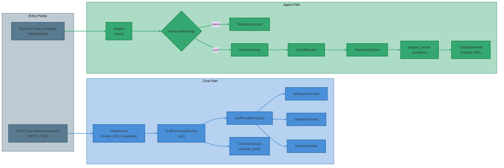
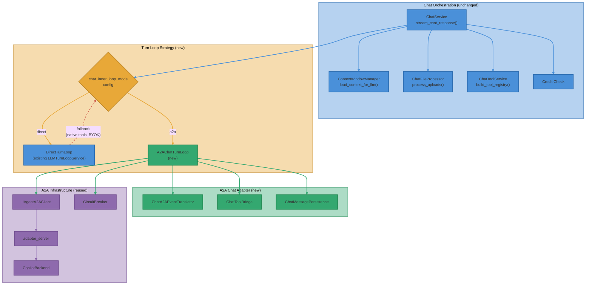
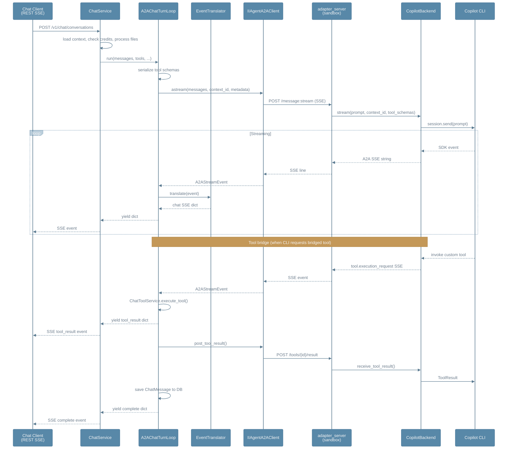
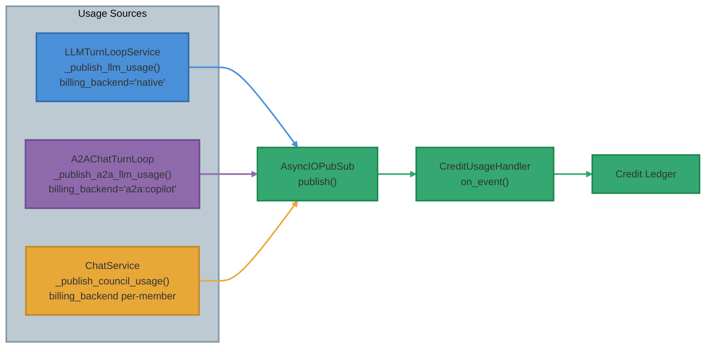
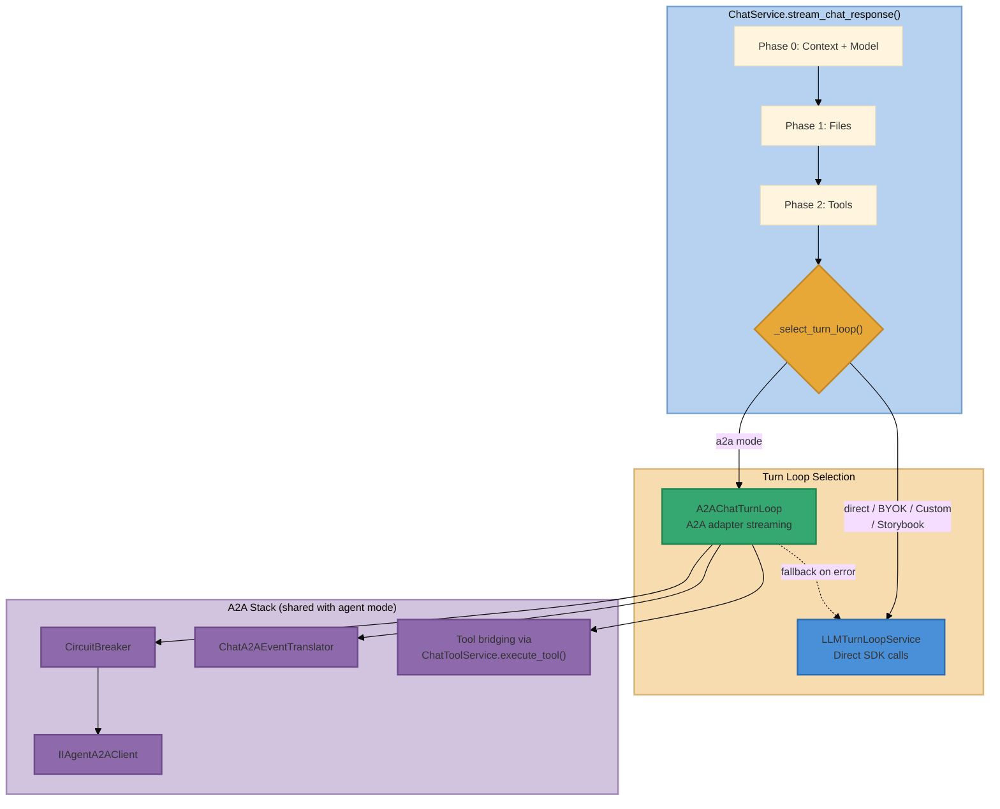
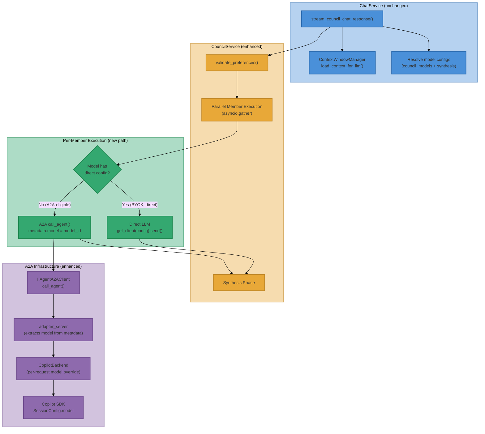
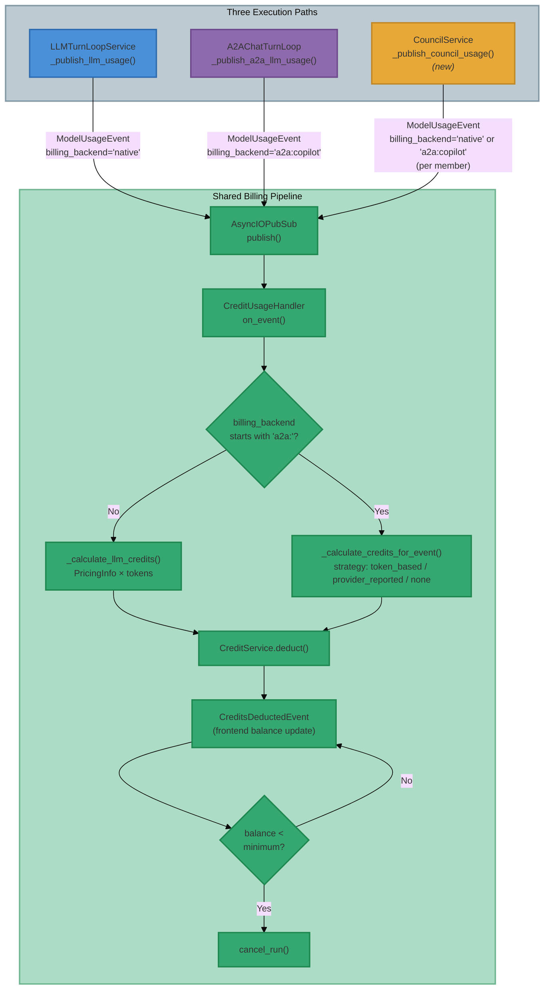
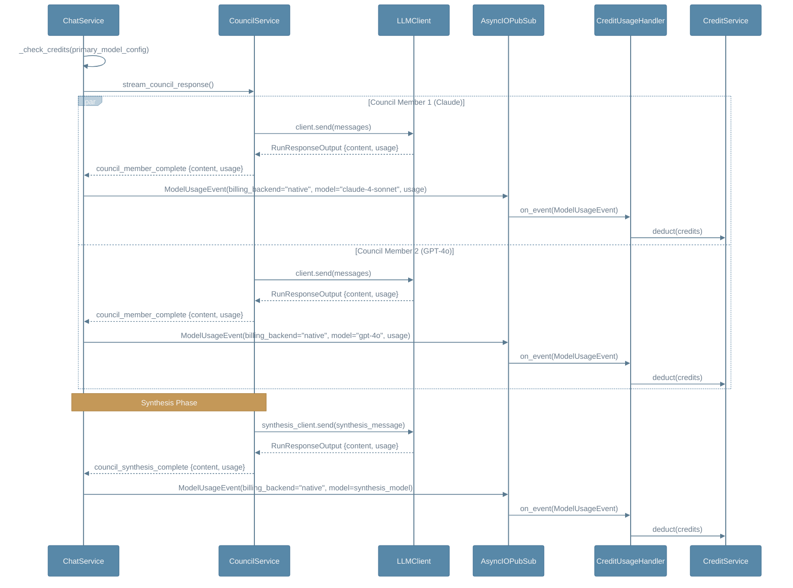
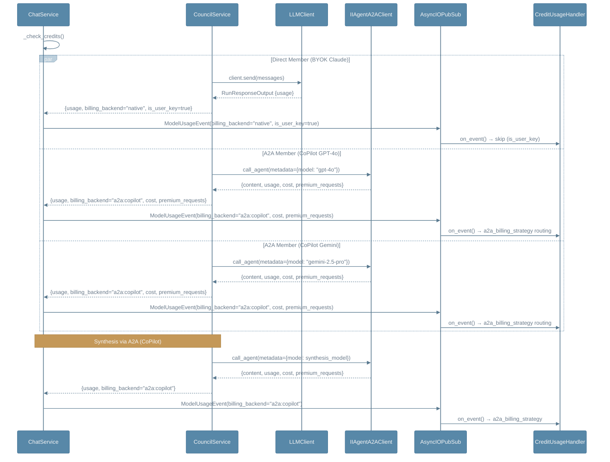

# Chat Mode → A2A Inner Loop Integration Assessment

**Date**: 2026-04-12
**Status**: Implementation Complete
**Scope**: Replacing the chat turn loop with A2A backends (Copilot, Claude Code, Codex)

---

## Executive Summary

The chat API (`/v1/chat/conversations`) and the agent API (Socket.IO) use **completely separate
inner loops** that share no execution infrastructure. The chat path uses
`LLMTurnLoopService` → direct LLM provider SDK calls, while the agent path uses
`InnerLoopStrategy` (native or A2A). The A2A CoPilot backend — already proven in agent mode
with 67% feature parity, tool bridging, and circuit-breaker fallback — is a viable replacement
for the chat turn loop, with medium engineering effort.

**Verdict**: **GO for implementation** — the A2A CoPilot backend can serve chat mode with an
adapter layer that translates between chat SSE events and A2A SSE events, preserving the chat
orchestration phases and message persistence model. The primary risk is provider-native tool
handling (OpenAI code interpreter / file search), which requires a fallback path.

---

## Current Architecture: Two Separate Inner Loops



### Chat Inner Loop: `LLMTurnLoopService`

The chat turn loop in
[turn_loop_service.py](src/ii_agent/chat/application/turn_loop_service.py)
is a synchronous `while True` loop that:

1. Checks cancellation via `raise_if_cancelled()`
2. Optionally compresses context at 90% window usage
3. Calls `provider.stream(messages, tools)` — direct SDK call to Anthropic/OpenAI/Google
4. Yields SSE events to the REST client during streaming
5. Publishes `ModelUsageEvent` for billing
6. Saves assistant message to `chat_messages` table
7. If `finish_reason == TOOL_USE`: executes tools via `ChatToolService.execute_tool()`,
   saves tool results, appends to messages, loops back
8. Otherwise: runs post-response summarization, yields `complete`, breaks

**Key properties**:
- Direct LLM SDK coupling (Anthropic, OpenAI, Google, LiteLLM)
- Provider-native tool support (OpenAI code interpreter, file search)
- Per-message DB persistence in `chat_messages` (JSONB `ContentPart` list)
- Context window management via `ContextWindowManager`
- SSE streaming to REST client (not Socket.IO)
- Council mode for multi-model synthesis

### Agent Inner Loop: `A2AInnerLoop`

The A2A inner loop in [inner_loop.py](src/ii_agent/agents/inner_loop.py) delegates to the
CoPilot CLI running inside a sandbox:

1. Serializes tool schemas via `tool_bridge.serialize_tool_schemas()`
2. Checks circuit breaker — falls back to `NativeInnerLoop` if open
3. Acquires compaction lock (prevents native summarization)
4. Streams SSE from `IIAgentA2AClient.astream()` → adapter → CoPilot SDK → CLI
5. Maps A2A events to `ModelResponse` via `_map_event()`
6. On `tool.execution_request`: pauses SSE, executes bridged tool natively, POSTs result back
7. On completion: records circuit breaker success, releases compaction lock

**Key properties**:
- LLM calls delegated to CoPilot CLI (model-agnostic from ii-agent's perspective)
- Tool bridge for ii-agent platform tools (web search, browser, media, connectors)
- Circuit breaker with automatic native fallback
- Context managed by CLI's own compaction (not `ContextWindowManager`)
- Deferred sandbox binding for lazy startup

---

## Chat Inner Loop: Complete Feature Inventory & Backend Parity

This section catalogs every feature of the chat inner loop (`LLMTurnLoopService.run()`) and
provides a per-backend parity assessment for all three A2A backends.

### Chat Turn Loop Feature Inventory

| # | Feature | Location | Description |
|---|---------|----------|-------------|
| | **LLM Streaming** | | |
| C01 | **Text content streaming** | `turn_loop_service.py:90-98` | Token-by-token `content_delta` SSE events via `provider.stream()` |
| C02 | **Reasoning / extended thinking** | `turn_loop_service.py` + provider impls | `thinking_delta` / `thinking_start` / `thinking_stop` SSE events |
| C03 | **Signature streaming** | Provider impls | Claude model signature deltas (`signature_delta` event type) |
| C04 | **Multi-provider support** | `LLMProviderFactory` | Anthropic, OpenAI, Google Gemini, Cerebras, Custom/LiteLLM |
| C05 | **Per-provider options** | `provider.stream(provider_options=...)` | Provider-specific parameters (temperature, reasoning budget, etc.) |
| C06 | **Response caching** | Provider-level | Anthropic cache_read/write tokens; OpenAI cached tokens |
| | **Tool Execution** | | |
| C07 | **Chat tool registry** | `ChatToolService.build_tool_registry()` | Dynamic tool registration: web_search, image_search, web_visit, file_search, GitHub, media |
| C08 | **Tool execution loop** | `turn_loop_service.py:136-200` | On `TOOL_USE`: execute tools → save results → continue LLM loop |
| C09 | **Tool result SSE events** | `turn_loop_service.py:175-180` | `tool_result` dict with `tool_call_id`, `name`, `output` |
| C10 | **Provider-native tools** | OpenAI `code_interpreter`, `file_search` | LLM-side execution; results in `run_response.files` |
| C11 | **Storybook celery tools** | `turn_loop_service.py:157-168` | Special-case streaming for `generate_storybook` tool |
| C12 | **Media generation tools** | `MediaOrchestrator` → tool registry | Image/video generation via tool bridge or provider |
| C13 | **GitHub connector tool** | `ChatToolService._load_connector_tools()` | Dynamic GitHub tool loading from user's connected accounts |
| | **Message Persistence** | | |
| C14 | **Assistant message save** | `turn_loop_service.py:113-127` | Save to `chat_messages` with `ContentPart` JSONB, usage, file_ids |
| C15 | **Tool results save** | `turn_loop_service.py:200-210` | Save `TOOL` role message with `ToolResult` parts |
| C16 | **Finish reason tracking** | `RunResponseOutput.finish_reason` | `end_turn`, `tool_use`, `max_tokens`, `canceled`, etc. |
| C17 | **Provider metadata** | `run_response.provider_metadata` | Provider-specific metadata persisted on assistant message |
| | **Context Management** | | |
| C18 | **Context compression** | `ContextWindowManager.compress_context_if_needed()` | Compress at 90% window usage before each LLM call |
| C19 | **Post-response summarization** | `ContextWindowManager.check_and_summarize_after_response()` | Summarize after assistant response for long conversations |
| C20 | **Context loading** | `ContextWindowManager.load_context_for_llm()` | Load full conversation history from `chat_messages` |
| | **Billing** | | |
| C21 | **LLM usage billing** | `_publish_llm_usage()` | Publish `ModelUsageEvent` via pubsub → `CreditUsageHandler` |
| C22 | **Tool usage billing** | `_publish_tool_usage()` | Publish `ToolUsageEvent` for tools with `cost_usd > 0` |
| C23 | **Token usage SSE** | `turn_loop_service.py:100-108` | `usage` SSE event with `input_tokens`, `output_tokens`, cache tokens |
| | **Session & Lifecycle** | | |
| C24 | **Cancellation** | `cancel.raise_if_cancelled(run_id)` | Checked before LLM call, after streaming, after tool execution |
| C25 | **Run completion** | `turn_loop_service.py:222-232` | `complete` SSE event with `message_id`, `finish_reason`, `files` |
| C26 | **File parts collection** | `run_response.files` | Accumulate file outputs (code interpreter outputs, etc.) |
| | **Orchestration (ChatService level)** | | |
| C27 | **Credit pre-check** | `ChatService._check_credits()` | Pre-run credit gate before turn loop starts |
| C28 | **File upload processing** | `ChatFileProcessor.process_uploads()` | Vector store creation for file search |
| C29 | **Media context** | `MediaOrchestrator.prepare_media_context()` | Media hints, tool preparation, context clearing |
| C30 | **Council mode** | `ChatService.stream_council_chat_response()` | Parallel multi-model execution + synthesis |
| C31 | **Session title generation** | `SessionTitleService` | Async title generation after first user message |
| C32 | **Error handling** | `ChatService.stream_chat_response()` exception block | Mark messages incomplete, cleanup run, yield error/cancel events |
| C33 | **Model config resolution** | `ChatService.get_model_config()` | Resolve model by setting_id or model_id lookup |
| | **Multimodal** | | |
| C34 | **Image uploads** | `BinaryContent` in user message parts | Images passed to LLM via provider-specific formatting |
| C35 | **File attachments** | Via `ChatFileProcessor` + vector store | Documents indexed for file_search tool |

### Per-Backend Parity Matrix for Chat Mode

Legend: **Y** = full parity, **P** = partial, **N** = not supported, **D** = direct-path only (force fallback), **—** = not applicable (handled at orchestration level, outside turn loop)

| # | Feature | Direct | Copilot | Claude Code | Codex | Notes |
|---|---------|--------|---------|-------------|-------|-------|
| | **LLM Streaming** | | | | | |
| C01 | Text content streaming | **Y** | **Y** | **Y** | **Y** | All backends emit `assistant.message_delta` → mapped to `content_delta` |
| C02 | Reasoning / thinking | **Y** | **Y** | **Y** | **Y** | All backends emit `assistant.reasoning_delta` → mapped to `thinking_delta` |
| C03 | Signature streaming | **Y** | **N** | **N** | **N** | Claude-specific; no A2A backend emits signature deltas |
| C04 | Multi-provider support | **Y** | **P** | **N** | **N** | Copilot: GitHub-hosted models only; CC: Anthropic only; Codex: OpenAI only |
| C05 | Per-provider options | **Y** | **N** | **N** | **N** | A2A backends use their own model configs |
| C06 | Response caching | **Y** | **P** | **Y** | **N** | CC has prompt caching; Copilot via GH API; Codex: none |
| | **Tool Execution** | | | | | |
| C07 | Chat tool registry | **Y** | **Y** | **N** | **N** | Copilot: tools serialized via `serialize_tool_schemas()` and bridged; CC/Codex: no `tool_schemas` parameter |
| C08 | Tool execution loop | **Y** | **Y** | **P** | **P** | Copilot: bridged via `tool.execution_request` + `post_tool_result`; CC/Codex: CLI-internal tools only |
| C09 | Tool result SSE events | **Y** | **Y** | **N** | **N** | Copilot: tool results yielded during bridge execution; CC/Codex: no tool bridge |
| C10 | Provider-native tools | **Y** | **D** | **D** | **D** | OpenAI code_interpreter/file_search require direct mode; force fallback |
| C11 | Storybook celery tools | **Y** | **D** | **D** | **D** | Requires provider-specific streaming; force fallback |
| C12 | Media generation tools | **Y** | **Y** | **N** | **N** | Copilot: bridged (NATIVE routing); CC/Codex: no tool bridge |
| C13 | GitHub connector tool | **Y** | **Y** | **N** | **N** | Copilot: bridged; CC/Codex: no connector tool access |
| | **Message Persistence** | | | | | |
| C14 | Assistant message save | **Y** | **Y** | **Y** | **Y** | A2AChatTurnLoop saves accumulated content to `chat_messages` |
| C15 | Tool results save | **Y** | **P** | **N** | **N** | Copilot: tool_result SSE events emitted but not persisted as TOOL-role chat_messages; CC/Codex: no tool bridge |
| C16 | Finish reason tracking | **Y** | **P** | **P** | **P** | Extracted from backend `finish_reason`/`stop_reason` when reported; defaults to `"end_turn"` |
| C17 | Provider metadata | **Y** | **N** | **N** | **N** | A2A backends don't expose provider-specific metadata |
| | **Context Management** | | | | | |
| C18 | Context compression | **Y** | **Y** | **Y** | **Y** | Pre-turn compression still runs (compaction lock prevents conflicts) |
| C19 | Post-response summarization | **Y** | **Y** | **Y** | **Y** | Post-turn summarization still runs |
| C20 | Context loading | **Y** | **Y** | **Y** | **Y** | Full history passed in A2A `messages`; context_reuse for subsequent turns |
| | **Billing** | | | | | |
| C21 | LLM usage billing | **Y** | **Y** | **P** | **P** | All: `ModelUsageEvent` published; CC/Codex missing `cost` and timing fields |
| C22 | Tool usage billing | **Y** | **Y** | **N** | **N** | Copilot: bridged tools publish `ToolUsageEvent`; CC/Codex: no tool bridge |
| C23 | Token usage SSE | **Y** | **Y** | **Y** | **Y** | All backends emit `assistant.usage` → mapped to `usage` SSE event |
| | **Session & Lifecycle** | | | | | |
| C24 | Cancellation | **Y** | **Y** | **Y** | **Y** | `raise_if_cancelled()` checked per-event; `cancel_task()` propagated to adapter |
| C25 | Run completion | **Y** | **Y** | **Y** | **Y** | `complete` SSE event emitted from accumulated state |
| C26 | File parts collection | **Y** | **N** | **N** | **N** | A2A backends don't emit file generation events; `file_parts` list never populated |
| | **Orchestration (unchanged — always at ChatService level)** | | | | | |
| C27 | Credit pre-check | **—** | **—** | **—** | **—** | Handled by `ChatService` before turn loop |
| C28 | File upload processing | **—** | **—** | **—** | **—** | Handled by `ChatService` before turn loop |
| C29 | Media context | **—** | **—** | **—** | **—** | Handled by `ChatService` before turn loop |
| C30 | Council mode | **Y** | **P** | **N** | **N** | CoPilot: hybrid direct+A2A per member (Appendix D); CC/Codex: no multi-model support |
| C31 | Session title generation | **—** | **—** | **—** | **—** | Handled by `ChatService` outside turn loop |
| C32 | Error handling | **—** | **—** | **—** | **—** | Handled by `ChatService` around turn loop |
| C33 | Model config resolution | **—** | **—** | **—** | **—** | Handled by `ChatService` before turn loop |
| | **Multimodal** | | | | | |
| C34 | Image uploads | **Y** | **Y** | **Y** | **N** | Codex is text-only; CC supports `--image` flag |
| C35 | File attachments | **Y** | **P** | **N** | **N** | Copilot: text content passed; no vector store integration |

### Parity Scores (Chat Mode Features Only)

Counting only features within the turn loop (C01–C26, C34–C35 = 28 features; excluding orchestration-level C27–C33):

| Backend | Full (Y) | Partial (P) | Not Supported (N) | Direct-Only (D) | Feature Parity |
|---------|----------|-------------|-------------------|-----------------|----------------|
| **Direct** | 28 | 0 | 0 | 0 | **100%** |
| **Copilot** | 17 | 5 | 3 | 3 | **70%** (17Y + 5×0.5P = 19.5/28 effective) |
| **Claude Code** | 10 | 4 | 11 | 3 | **43%** (10Y + 4×0.5P = 12/28 effective) |
| **Codex** | 9 | 3 | 13 | 3 | **38%** (9Y + 3×0.5P = 10.5/28 effective) |

### Features That Force Fallback to Direct Path

These features are detected by `_select_turn_loop()` and force the turn loop back to
`LLMTurnLoopService` regardless of `chat_inner_loop_mode`:

| Feature | Detection | Implemented |
|---------|-----------|-------------|
| No A2A loop configured | `self._a2a_loop is None` | **Yes** |
| Council mode | `chat_request.council_preferences.enabled` | **Yes** |
| User BYOK models | `model_config.is_user_model()` | **Yes** |
| Custom/LiteLLM provider | `model_config.provider == Provider.CUSTOM` | **Yes** |
| Storybook media type | `chat_request.media_preferences.type == "storybook"` | **Yes** |

**Not yet implemented** (design aspirations — these route through A2A today but may
produce degraded results if triggered):

| Feature | Detection | Reason |
|---------|-----------|--------|
| OpenAI code interpreter | `provider == OPENAI` AND `code_interpreter in tools` | Provider-native execution |
| OpenAI file search | `provider == OPENAI` AND `file_search in tools` | Provider-native vector store |
| Google Gemini provider | `provider == GOOGLE` | No A2A backend equivalent |
| Cerebras provider | `provider == CEREBRAS` | No A2A backend equivalent |
| Anthropic container tools | Model supports `container_capabilities` | Provider-native generation |

### Structurally Impossible Features Per Backend

**All A2A Backends (shared architectural limitations)**:
- C05 (Per-provider options): Adapter does not forward model config; backends use static initialization
- C17 (Provider metadata): A2A protocol has no metadata passthrough mechanism
- C26 (File parts): A2A protocol has no file generation event type

**Copilot**:
- C03 (Signature streaming): Copilot SDK doesn't expose Claude signature tokens
- C05 (Per-provider options): Copilot SDK abstracts model configuration
- C10 (Provider-native tools): Copilot doesn't proxy to OpenAI Responses API
- C17 (Provider metadata): No provider-specific metadata passthrough

**Claude Code**:
- C03 (Signature streaming): CLI subprocess doesn't emit signature events
- C04 (Multi-provider): Hardcoded to Anthropic Claude models
- C07–C09, C12–C13 (Chat tool bridging): No `tool_schemas` parameter; CLI uses built-in tools only
- C17 (Provider metadata): Subprocess output has no metadata passthrough
- C35 (File attachments): `--image` flag only; no document/code file support

**Codex**:
- C03 (Signature streaming): CLI subprocess doesn't emit signature events
- C04 (Multi-provider): Hardcoded to OpenAI models (o4-mini, o3)
- C06 (Response caching): Codex CLI doesn't report cache tokens
- C07–C09, C12–C13 (Chat tool bridging): No `tool_schemas` parameter
- C17 (Provider metadata): Subprocess output has no metadata passthrough
- C34 (Image uploads): Codex is text-only; non-text parts skipped (BinaryContent/ImageURLContent now converted to A2A Image objects for backends that support images)
- C35 (File attachments): Text-only backend

---

## Gap Analysis: A2A CoPilot Backend for Chat Mode

### Feature Mapping

| Chat Feature | A2A Support | Gap | Severity |
|---|---|---|---|
| **Text streaming** | `assistant.message_delta` → `content_delta` | Format translation only | None |
| **Reasoning/thinking** | `assistant.reasoning_delta` → `thinking_delta` | Format translation only | None |
| **Tool execution** | `tool.execution_request` bridge | Chat tools need schema conversion | Low |
| **Tool results** | `POST /tools/{id}/result` | Chat `ToolResponse` → string serialization | Low |
| **Usage/billing** | `assistant.usage` → `ModelUsageEvent` | Same pubsub pipeline | None |
| **Message persistence** | Not handled by A2A | Must save to `chat_messages` (not `agent_run_messages`) | Medium |
| **Context loading** | CLI manages own context | Must bootstrap CLI with chat history | Medium |
| **Context summarization** | CLI compaction vs `ContextWindowManager` | Compaction authority handoff needed | Medium |
| **Provider-native tools** | Not supported | OpenAI code interpreter/file search have no A2A equivalent | **High** |
| **Council mode** | Partially supported (CoPilot) | Hybrid direct+A2A execution per member; see Appendix D | **Medium** |
| **File uploads** | A2A supports image parts | Binary/vector store uploads need pre-processing | Medium |
| **Media tools** | NATIVE routing (already bridged) | Same as agent path | None |
| **Cancel** | `client.cancel_task()` | Wire `cancel.register_run()` to A2A cancel | Low |
| **Model selection** | Passed in A2A metadata | Must forward `model_config` to adapter | Low |
| **Credit check** | Pre-turn-loop | Stays in `ChatService` orchestration | None |
| **SSE format** | A2A SSE → Chat SSE dict | New translation layer | Medium |

### Severity Breakdown

**High (2 gaps)**:
- **Provider-native tools**: OpenAI's code interpreter and file search are provider-executed —
  the LLM runs them internally. The A2A CoPilot backend cannot replicate this because CoPilot
  CLI does not proxy to OpenAI's Responses API. **Mitigation**: disable provider-native tools
  when A2A is active; offer equivalent functionality through CLI-native code execution (sandbox
  shell) and ii-agent's own file search tool.
- **Council mode**: Multi-model parallel execution with synthesis was originally considered
  architecturally incompatible with A2A delegation. However, CoPilot's multi-vendor model
  catalog enables a hybrid approach: council members can be individually routed through A2A
  with per-request model selection via metadata. **See Appendix D** for the full design.
  Claude Code and Codex remain incompatible (single-vendor, no per-request model override).

**Medium (4 gaps)**:
- **Message persistence format**: A2A events must be saved as `chat_messages` with `ContentPart`
  JSONB, not `agent_run_messages` blobs.
- **Context loading**: Chat history lives in `chat_messages` table. The adapter must receive
  conversation history and bootstrap the CLI session with it.
- **Context summarization authority**: Must replicate the agent path's `CompactionAuthorityEvent`
  pattern — lock native `ContextWindowManager` during A2A streaming.
- **SSE event translation**: Need a bidirectional mapping layer between A2A SSE types and chat
  SSE dict types.

---

## Proposed Architecture



### Design Principles

1. **Preserve the chat orchestration layer** — `ChatService.stream_chat_response()` handles
   credit checks, file uploads, context loading, tool registry, and message creation. These
   phases are unchanged.

2. **Replace only the turn loop** — the swap point is `LLMTurnLoopService.run()`. A new
   `A2AChatTurnLoop` implements the same `AsyncIterator[Dict]` interface, yielding identical
   SSE dict events.

3. **Reuse the A2A transport stack** — `IIAgentA2AClient`, `adapter_server.py`, and
   `CopilotBackend` are shared with agent mode. No duplication.

4. **Automatic fallback** — circuit breaker failure or unsupported features (provider-native
   tools, BYOK) fall back to `DirectTurnLoop` (existing `LLMTurnLoopService`). Council mode
   uses its own hybrid orchestration (see Appendix D).

5. **Config-driven opt-in** — new setting `chat_inner_loop_mode: "direct" | "a2a"` defaults
   to `"direct"`. No behavioral change without explicit opt-in.

---

## Component Design

### 1. `A2AChatTurnLoop` (new service)

**Location**: `src/ii_agent/chat/application/a2a_turn_loop_service.py`

**Interface**: Same as `LLMTurnLoopService.run()` — `async def run(...) -> AsyncIterator[Dict]`

**Turn loop logic**:

```
1. Convert chat tool_registry → JSON schemas via serialize_tool_schemas()
2. Convert chat messages → A2A message format (text + image parts)
3. Extract system message from model config / system prompt
4. Check circuit breaker
5. Acquire compaction lock
6. Stream from IIAgentA2AClient.astream():
   a. Map A2A events → chat SSE dicts via ChatA2AEventTranslator
   b. On tool.execution_request:
      - Execute via ChatToolService.execute_tool()
      - Yield tool_result SSE event
      - POST result to adapter
   c. Accumulate content for message persistence
7. Save assistant message to chat_messages (ChatMessage format)
8. Publish ModelUsageEvent for billing
9. Release compaction lock
10. On error: record circuit breaker failure, fall back to DirectTurnLoop
```

### 2. `ChatA2AEventTranslator` (new utility)

**Location**: `src/ii_agent/chat/application/a2a_event_translator.py`

Bidirectional mappings:

| A2A SSE Event | Chat SSE Dict |
|---|---|
| `assistant.message_delta` `{"delta": str}` | `{"type": "content_delta", "content": str}` |
| `assistant.reasoning_delta` `{"delta": str}` | `{"type": "thinking_delta", "thinking": str}` |
| `assistant.reasoning` `{"content": str}` | (synthetic thinking stop — no direct equivalent) |
| `assistant.message` `{"content": str}` | `{"type": "content_stop"}` |
| `assistant.usage` `{tokens...}` | `{"type": "usage", "usage": {mapped TokenUsage fields}}` |
| `tool.execution_request` `{tool_call_id, name, arguments}` | `{"type": "tool_use_start", "tool_call": ToolCall(...)}` |
| `session.error` `{"message": str}` | `{"type": "error", "message": str}` |
| `[DONE]` | `{"type": "complete", "message_id": UUID, ...}` |

### 3. `ChatToolBridge` (new utility)

**Location**: `src/ii_agent/chat/application/a2a_tool_bridge.py`

Converts between chat tool formats and A2A tool schemas:

- **Chat → A2A**: `ToolInfo` (from `BaseTool.info()`) → JSON schema dict for
  `native_tool_schemas` metadata. Near-identical structure — both use
  `{"name", "description", "parameters"}`.
- **A2A → Chat tool execution**: `tool.execution_request` →
  `ChatToolService.execute_tool(tool_call_id, tool_name, tool_input, tool_registry)` →
  serialize `ToolResponse` → `client.post_tool_result(tool_call_id, result_str)`.

### 4. Sandbox Lifecycle for Chat

Chat mode currently has no sandbox. For A2A integration, the sandbox is needed to host the
adapter and CoPilot CLI.

**Options**:

| Option | Pros | Cons |
|---|---|---|
| **A. Shared sandbox per session** | Reuse agent sandbox infrastructure; file state persists | Chat sessions don't expect sandbox overhead; cold start latency |
| **B. Shared sandbox pool** | Amortize startup; fast warm sandbox assignment | Pool management complexity; resource limits |
| **C. External adapter (no sandbox)** | No sandbox needed; sidecar deployment | Loses file state locality; network hop; deployment complexity |

**Recommendation**: **Option A** — use the existing `SandboxService` with deferred binding
(same pattern as agent mode). The sandbox is initialized on first A2A turn and reused for
subsequent turns in the same session. Cold start (~5-10s) is acceptable for the first turn
since users already experience initial response latency.

### 5. Configuration

New settings in `core/config/chat.py` or extend existing `AgentSettings`:

```python
class ChatSettings(BaseSettings):
    chat_inner_loop_mode: Literal["direct", "a2a"] = "direct"
    # Reuse existing agent A2A settings:
    # a2a_agent_url, a2a_timeout_seconds, a2a_fallback_to_native,
    # a2a_backend, a2a_billing_strategy, etc.
```

---

## SSE Event Flow Comparison



---

## Feature Exclusions (Stay on Direct Path)

These features are incompatible with A2A turn-loop delegation and must force fallback to the
direct turn loop, or use their own orchestration path:

| Feature | Reason | Detection Point | Implemented |
|---|---|---|---|
| **Council mode** | Uses own hybrid orchestration (direct + A2A per member); see Appendix D | `chat_request.council_preferences.enabled` | **Yes** |
| **Custom/BYOK providers** | A2A backend is CoPilot-specific | `model_config.provider == CUSTOM` OR `is_user_model()` | **Yes** |
| **Storybook media** | Requires Celery streaming path; A2A tool bridge can't invoke `start_celery_generation()` | `chat_request.media_preferences.type == "storybook"` | **Yes** |
| **OpenAI code interpreter** | Provider-native execution inside OpenAI | `model_config.provider == OPENAI` AND `code_interpreter in tools` | No (future) |
| **OpenAI file search** | Provider-native vector store | `model_config.provider == OPENAI` AND `file_search in tools` | No (future) |
| **Anthropic container tools** | Provider-native pptx/xlsx/pdf/docx generation | Model supports `container_capabilities` | No (future) |
| **Google Gemini / Cerebras** | No A2A backend equivalent | `model_config.provider in (GOOGLE, CEREBRAS)` | No (future) |

**Fallback logic** in `ChatService._select_turn_loop()`:

```python
loop = self._select_turn_loop(model_config=model_config, chat_request=chat_request)
```

---

## Context History Bootstrap

The CoPilot CLI needs conversation history context. Two approaches were considered:

### Option A: Full History in A2A Message — IMPLEMENTED

`A2AChatTurnLoop._build_a2a_messages()` converts **all** chat messages every turn and passes
them to `IIAgentA2AClient.astream()`. The adapter's `build_conversation_context()` serializes
prior turns into a `<conversation_history>` text block prepended to the current prompt.

This means every A2A request carries the full conversation — simple, always-correct context,
at the cost of larger payloads for long conversations.

**Key code path**: `_build_a2a_messages(messages)` → `astream(messages=...)` →
adapter `build_conversation_context(req.messages)` → history prefix + current prompt.

### Option B: CLI-Side Context Reuse — NOT IMPLEMENTED (Chat Path)

The original design proposed a Hybrid approach: Option A for the first turn, then on
subsequent turns rely on CLI's own session state (`context_reuse=True`) and send only
the new user message.

This was **not implemented in the chat A2A turn loop**. The `context_reuse` setting exists
but only controls context_id stability (`chat-{session_id}` vs `chat-{session_id}-{uuid}`),
not message passing. The reconciliation logic (`_effective_context_id`, `_last_owner`,
`.reconcile.<uuid>` suffix) exists only in the **agent-mode inner loop**
(`agents/inner_loop.py`), not in the chat path.

| Feature | Chat A2A Turn Loop | Agent Inner Loop |
|---------|-------------------|-----------------|
| Full history every turn | Yes (Option A) | Yes |
| `context_reuse` | context_id stability only | context_id + reconciliation |
| `_last_owner` tracking | Not implemented | Implemented |
| `_effective_context_id` | Not implemented | Implemented |
| First vs subsequent differentiation | None | Via `_last_owner` |

**Future optimisation**: If long-conversation payloads become a performance concern, the
Hybrid approach could be implemented by porting the agent inner loop's `_last_owner` /
reconciliation pattern to `A2AChatTurnLoop`. This is not urgent — current payload sizes
are manageable.

---

## Billing Integration

All three chat execution paths — direct turn loop, A2A turn loop, and council — converge
on the same `CreditUsageHandler` via `ModelUsageEvent` published to `AsyncIOPubSub`.



Each path publishes `ModelUsageEvent` with the appropriate `billing_backend`:

| Path | `billing_backend` | Billing Strategy |
|------|-------------------|------------------|
| **Direct turn loop** | `"native"` | `_calculate_llm_credits()` — PricingInfo × tokens |
| **A2A turn loop** | `"a2a:{backend}"` | `_calculate_credits_for_event()` — strategy-routed |
| **Council (direct member)** | `"native"` | Same as direct turn loop |
| **Council (A2A member)** | `"a2a:{backend}"` | Same as A2A turn loop |
| **Council (BYOK member)** | `"native"` + `is_user_key=True` | Handler skips deduction |

The `CreditUsageHandler` routes based on `billing_backend.startswith("a2a:")`:
- **Native**: standard PricingInfo × token-count calculation
- **A2A**: configurable strategy (`token_based` / `provider_reported` / `none`)

Council billing publishes **N+1 events** per invocation (N members + 1 synthesis). Each event
carries per-model `setting_id`, `model_id`, `provider`, `pricing`, and token counts — enabling
per-model cost attribution in the credit ledger.

**Council billing design details**: See [Appendix D § Council Billing Design](#council-billing-design)
for the full implementation plan, sequence diagrams, phased rollout, and edge case handling.

---

## Implementation Plan

### Phase 1: Core Infrastructure (Estimated: 3 files, ~500 LOC)

| Task | File | Description |
|---|---|---|
| 1.1 | `chat/application/a2a_turn_loop_service.py` | `A2AChatTurnLoop` implementing the turn loop with A2A streaming, tool bridge, and message persistence |
| 1.2 | `chat/application/a2a_event_translator.py` | `ChatA2AEventTranslator` — A2A SSE ↔ chat SSE dict translation |
| 1.3 | `chat/application/a2a_tool_bridge.py` | `ChatToolBridge` — chat tool schema ↔ A2A tool schema conversion |

### Phase 2: Wiring (Estimated: 4 file edits)

| Task | File | Description |
|---|---|---|
| 2.1 | `chat/application/chat_service.py` | Add `_should_use_a2a()` routing logic; inject `A2AChatTurnLoop` |
| 2.2 | `core/config/chat.py` or `core/config/agent.py` | Add `chat_inner_loop_mode` setting |
| 2.3 | `core/container.py` | Wire `A2AChatTurnLoop` into `ApplicationContainer` |
| 2.4 | `chat/dependencies.py` | Expose dependencies for sandbox service in chat context |

### Phase 3: Sandbox Lifecycle for Chat

| Task | File | Description |
|---|---|---|
| 3.1 | `chat/application/a2a_turn_loop_service.py` | Deferred sandbox binding (lazy init on first A2A turn) |
| 3.2 | `agents/sandboxes/` | Ensure `SandboxService` works for chat sessions (`app_kind="chat"`) |

### Phase 4: Testing

| Task | Description |
|---|---|
| 4.1 | Unit tests for `ChatA2AEventTranslator` — verify all event mappings |
| 4.2 | Unit tests for `ChatToolBridge` — schema conversion round-trip |
| 4.3 | Integration test: A2A chat turn with tool execution (mock adapter) |
| 4.4 | Integration test: circuit breaker fallback to direct turn loop |
| 4.5 | E2E test: full chat session via A2A with `test_session.py` |

---

## Risk Assessment

| Risk | Likelihood | Impact | Mitigation |
|---|---|---|---|
| Sandbox cold start adds latency to first chat turn | High | Medium | Pre-warm sandbox pool; lazy init only on first A2A turn; accept 5-10s first-turn latency |
| Provider-native tools silently degrade | Medium | High | Explicit fallback detection in `_should_use_a2a()`; never route provider-native tool sessions to A2A |
| Context divergence after direct↔A2A switches | Medium | Medium | Reconciliation suffix pattern (already proven in agent mode) |
| CoPilot CLI model mismatch with user's selected model | Low | High | Pass `model` in A2A metadata; verify adapter forwards to CLI correctly |
| Chat message format incompatibility with A2A events | Low | Medium | `ChatA2AEventTranslator` handles all format conversion; extensive unit tests |
| Billing double-count or miss | Low | Medium | Same pubsub pipeline; A2A billing strategy config; billing backend tag `"a2a:copilot"` |

---

## Success Criteria

1. A chat session with `chat_inner_loop_mode=a2a` produces identical user-visible behavior
   to `direct` mode for text-only conversations
2. Chat tool execution (web search, image search, web visit, image generation) works through
   the A2A tool bridge
3. Circuit breaker automatically falls back to direct mode on A2A failure
4. Council mode uses hybrid execution (direct for BYOK, A2A for CoPilot-hosted models); provider-native tools route to direct mode
5. Billing is accurate — token counts match between A2A and direct modes for the same prompts
6. Context persists correctly across multi-turn chat conversations
7. No regression in existing chat or agent functionality

---

## Appendix A: Event Format Cross-Reference

| Chat SSE Type | Chat Dict Key | A2A SSE Event | A2A Data Field | Notes |
|---|---|---|---|---|
| `content_delta` | `content: str` | `assistant.message_delta` | `delta: str` | Direct mapping |
| `content_start` | (no data) | (synthetic on first delta) | — | Emit before first delta |
| `content_stop` | (no data) | `assistant.message` / `content_done` | `content: str` | Emit on content completion |
| `thinking_delta` | `thinking: str` | `assistant.reasoning_delta` | `delta: str` | Direct mapping |
| `tool_use_start` | `tool_call: ToolCall` | `tool.execution_request` | `tool_name, arguments` | Construct `ToolCall` from A2A fields |
| `tool_use_stop` | `tool_call: ToolCall` | (synthetic after result POST) | — | Emit after `post_tool_result()` |
| `tool_result` | `tool_call_id, name, output` | (derived from local execution) | — | Same as direct — local execution |
| `usage` | `usage: {tokens...}` | `assistant.usage` | `{input_tokens, output_tokens, ...}` | Field-level rename |
| `complete` | `message_id, finish_reason` | `[DONE]` | — | Construct from accumulated state |
| `error` | `message: str` | `session.error` | `message: str` | Direct mapping |

## Appendix B: Incompatible Feature Decision Matrix

| Feature | Direct Mode | A2A Mode | Decision |
|---|---|---|---|
| Anthropic Claude | Yes | Yes (via CoPilot) | A2A eligible |
| OpenAI GPT | Yes | Maybe (if CoPilot supports) | Verify; fallback if not |
| Google Gemini | Yes | No | Direct only |
| Custom/LiteLLM | Yes | No | Direct only |
| Council mode | Yes | Partial (CoPilot) | Hybrid: direct + A2A per member (Appendix D) |
| Code interpreter (OpenAI) | Yes | No (sandbox shell alternative) | Direct for OpenAI; A2A uses sandbox |
| File search (OpenAI) | Yes | No (chat file search alternative) | Direct for OpenAI vectors |
| Extended thinking | Yes | Yes (reasoning_delta) | A2A eligible |
| Image uploads | Yes | Yes (image parts) | A2A eligible |
| Web search | Yes (tool) | Yes (bridged tool) | A2A eligible |
| Image generation | Yes (tool) | Yes (NATIVE routing) | A2A eligible |
| Storybook generation | Yes (tool) | No (Celery streaming) | Direct only — `_select_turn_loop()` forces fallback |
| GitHub connector | Yes (tool) | Yes (bridged tool) | A2A eligible |

---

## Appendix C: As-Built Implementation Notes

### Files Created

| File | Purpose | Lines |
|---|---|---|
| `src/ii_agent/chat/application/a2a_event_translator.py` | `ChatA2AEventTranslator` — stateful translator from A2A SSE events to chat SSE dicts; tracks `finish_reason` | ~125 |
| `src/ii_agent/chat/application/a2a_turn_loop_service.py` | `A2AChatTurnLoop` — A2A-backed replacement for `LLMTurnLoopService` with context compression, thinking_tokens forwarding, image support | ~480 |
| `src/tests/unit/chat/test_chat_a2a_turn_loop.py` | 51 unit tests covering translator, turn loop, routing, message conversion, context ID, metadata, finish_reason, storybook guard, image support, shared resources | ~830 |

### Files Modified

| File | Change |
|---|---|
| `src/ii_agent/core/config/agent.py` | Added `chat_inner_loop_mode: Literal["direct", "a2a"]` field to `AgentSettings` |
| `src/ii_agent/chat/application/chat_service.py` | Added `a2a_loop` parameter to constructor; added `_select_turn_loop()` routing method; Phase 3 uses selected loop |
| `src/ii_agent/chat/api/dependencies.py` | Shared singleton A2A client + circuit breaker via `_get_shared_a2a_resources()`; `_build_a2a_chat_loop()` factory; updated `get_chat_service()` to wire A2A loop |

### Configuration

Enable via environment variable:

```bash
AGENT_CHAT_INNER_LOOP_MODE=a2a   # Route chat through A2A adapter
AGENT_A2A_AGENT_URL=http://...   # Required: adapter URL
AGENT_A2A_BACKEND=copilot        # Backend: copilot | claude-code | codex
AGENT_A2A_FALLBACK_TO_NATIVE=true # Fallback to direct LLM on failure
```

All A2A settings (`a2a_backend`, `a2a_timeout_seconds`, `a2a_fallback_to_native`, `a2a_context_reuse`, billing settings) are shared between agent mode and chat mode.

### Routing Logic (`_select_turn_loop`)

The chat service automatically falls back to the direct `LLMTurnLoopService` when:

1. **No A2A loop configured** — `chat_inner_loop_mode` is `"direct"` or URL not set
2. **Council mode** — orchestrated separately by `stream_council_chat_response()` with hybrid direct+A2A member execution (see Appendix D)
3. **BYOK (user keys)** — user pays their own API bill, no A2A billing needed
4. **Custom/LiteLLM provider** — no A2A adapter mapping exists
5. **Storybook media type** — requires Celery streaming path (`start_celery_generation()`) which A2A tool bridge cannot invoke

### Architecture



### Test Coverage

| Test Category | Count | Coverage |
|---|---|---|
| `ChatA2AEventTranslator` | 18 | All event types, finalize, accumulation, alternate names |
| `ChatA2AEventTranslator` finish_reason | 4 | Extracted from message, stop_reason, default None, error |
| `A2AChatTurnLoop` streaming | 4 | Basic content, tool bridging, billing backend |
| Circuit breaker fallback | 3 | CB open, stream error, no-fallback raises |
| `_select_turn_loop` routing | 7 | No A2A, A2A configured, council, BYOK, Custom provider, storybook media, image media (non-storybook) |
| Message conversion | 7 | Text extraction, tool role skip, system prompt, BinaryContent→Image, ImageURLContent→Image, text-only no images |
| Tool serialization | 2 | OpenAI-compat and flat format |
| Context ID | 2 | Reuse stable, no-reuse unique |
| Shared A2A resources | 2 | Singleton CB + client reuse, direct-mode returns None |
| Metadata construction | 2 | `native_tool_schemas` key, `thinking_tokens` forwarding |
| **Total** | **51** | |

### What's NOT Implemented (by design)

- **Provider-native tool execution** (OpenAI code interpreter, file search): Falls back to direct loop
- **Multi-turn tool loops in A2A**: The A2A adapter handles its own tool loop; chat only bridges explicitly requested tools
- **Context reconciliation after fallback**: Unlike agent mode, chat does not suffix context_id after fallback (simpler model — each A2A chat turn is independent)
- **Storybook Celery streaming**: Falls back to direct loop (storybook tool uses `start_celery_generation` which requires direct LLM provider)

### Post-Implementation Audit Findings & Fixes

A comprehensive audit of the as-built implementation against the native `LLMTurnLoopService` and
the A2A transport layer revealed several critical gaps. All fixable issues were resolved:

#### Critical Bug: Metadata Key Mismatch (FIXED)

The A2A chat turn loop sent tool schemas as `metadata["tool_schemas"]`, but `adapter_server.py`
line 523 reads `metadata["native_tool_schemas"]` (matching the agent inner-loop convention).
**All chat tools were silently dropped.** Fixed by changing the metadata key to `native_tool_schemas`.

#### Critical Gap: Context Compression Missing (FIXED)

The native turn loop calls `ContextWindowManager.compress_context_if_needed()` before each LLM
turn and `ContextWindowManager.check_and_summarize_after_response()` after each response. The A2A
path had neither call, meaning long conversations would silently exceed the context window. Fixed
by adding both calls at the same lifecycle points as the native loop.

#### Moderate Gap: Finish Reason Hardcoded (FIXED)

The finish reason was always hardcoded to `"end_turn"` regardless of actual completion state.
`ChatA2AEventTranslator` now extracts `finish_reason` or `stop_reason` from backend completion
events and sets `"error"` on error events. Falls back to `"end_turn"` when not reported.

#### Moderate Gap: Extended Thinking Config Not Forwarded (FIXED)

`ModelConfig.thinking_tokens` was ignored in the A2A metadata. Now forwarded as
`metadata["thinking_tokens"]` when value is `isinstance(int)` and `>= 1024`. Note: no A2A backend
currently acts on this field — it's forward-compatible for when backends add support.

#### Critical Bug: Circuit Breaker Per-Request (FIXED)

`_build_a2a_chat_loop()` in `dependencies.py` created a fresh `CircuitBreaker` instance per HTTP
request via FastAPI dependency injection. This meant failures never accumulated across requests —
the breaker could never open. Fixed by extracting `_get_shared_a2a_resources()` that lazily creates
module-level singleton `IIAgentA2AClient` and `CircuitBreaker` instances, reused across all requests.

#### Moderate Bug: BinaryContent Images Silently Dropped (FIXED)

`_build_a2a_messages()` only handled `TextContent` parts — `BinaryContent` (user-uploaded images)
and `ImageURLContent` were silently ignored, losing all image data before A2A transport. Fixed by
converting `BinaryContent` to `Image(content=part.data, mime_type=part.mime_type)` and
`ImageURLContent` to `Image(url=part.url)`, passed via the `Message.images` field which the A2A
transport layer serializes as base64 in `to_dict()`.

#### Known Architectural Limitations (NOT fixable in chat A2A code)

| Limitation | Explanation |
|---|---|
| **Model selection is static** | `adapter_server.py` does NOT forward `metadata["model"]` to backends; all three backends use static `self.config.model` set at initialization. Per-request model override requires adapter+backend changes (see Appendix D council design for the fix path). |
| **Provider metadata not saved** | A2A backends don't expose provider-specific metadata (Anthropic container context, etc.). `provider_metadata=None` is passed to message save. |
| **File parts never collected** | `file_parts: list = []` is declared but never populated — A2A backends don't emit file generation events. |
| **Tool results not saved as TOOL-role messages** | Bridged tool results yield `tool_result` SSE events for the client but are not persisted as separate TOOL-role `chat_messages` in the DB. |
| **Storybook Celery streaming** | No async progress events through the A2A path; storybook sessions fall back to direct loop. |

---

## Appendix D: Council Mode over A2A — Feasibility & Design

### Problem Statement

Council mode (C30) is currently rated **D** (Direct-only) in the parity matrix and is
documented as "architecturally incompatible with A2A." This blanket exclusion is overly
broad. A2A backends like CoPilot provide access to **multiple models across multiple
vendors** (Anthropic Claude, OpenAI GPT, Google Gemini, etc.) through a single
infrastructure endpoint. Council mode's core requirement — parallel multi-model execution
followed by synthesis — can be partially satisfied by making parallel A2A requests with
per-request model selection.

### Current Limitations (Why Council Was Excluded)

The original incompatibility assessment identified three barriers:

| Barrier | Description | Severity |
|---------|-------------|----------|
| **B1: Single-model config** | `CopilotConfig.model` is a static startup-time value; all sessions use the same model | High — blocks per-member model selection |
| **B2: No model passthrough** | `adapter_server._event_source()` ignores the `"model"` key in request metadata | High — even if the client sends a model, it's dropped |
| **B3: Single-stream assumption** | Council needs N parallel responses + 1 synthesis; A2A was designed for single-stream turns | Medium — architectural, but solvable |

### Why These Barriers Are Surmountable

**B1 is a 2-line fix.** `CopilotBackend._get_or_create_session()` already conditionally
sets `session_kwargs["model"]` from config. A per-request model override parameter
(forwarded from metadata) can take precedence over the static config value.

**B2 is a 1-line fix.** The adapter already extracts `native_tool_schemas` and
`system_message` from metadata. Extracting `"model"` and forwarding it to
`backend.stream()` is the same pattern.

**B3 is already solved.** The `IIAgentA2AClient` is stateless per-request. Each `astream()`
or `call_agent()` call creates its own HTTP stream with its own `context_id`. The
`CopilotBackend` creates a fresh session per turn, keyed by `context_id`. Parallel calls
with distinct `context_id` values are fully independent — no shared mutable state blocks
concurrent execution (the `_client_lock` serializes only `CopilotClient` initialization,
not subsequent session/turn operations).

### Proposed Design: Council-over-A2A



### Architecture: Hybrid Council Execution

The key insight is that council members don't all need to use the same execution path.
`CouncilService.stream_council_response()` currently calls `get_client(config).send()` for
every member — a direct LLM SDK call. The enhancement adds a **per-member routing decision**:

```
For each council member model_id:
  1. If model has a direct ModelConfig with API key → use get_client(config).send() (existing path)
  2. If model is A2A-eligible (CoPilot-hosted) → use client.call_agent() with model in metadata
  3. If model has no config at all → skip with council_member_error event
```

This hybrid approach means:
- Users with their own API keys (BYOK) continue using direct calls — no change
- Users relying on the platform's A2A backend can select CoPilot-hosted models for council
- Mixed councils (some direct, some A2A) work naturally
- The synthesis model can also use either path

### Required Code Changes

#### Layer 1: Adapter — Forward Model from Metadata (1 file, ~3 lines)

**File**: `src/ii_agent/integrations/a2a/adapter_server.py`

In `_event_source()`, extract the model from metadata and pass to `backend.stream()`:

```python
# Current (lines 523-526):
tool_schemas = (req.metadata or {}).get("native_tool_schemas") or None
system_message = (req.metadata or {}).get("system_message") or None

# Enhanced:
tool_schemas = (req.metadata or {}).get("native_tool_schemas") or None
system_message = (req.metadata or {}).get("system_message") or None
model_override = (req.metadata or {}).get("model") or None
```

Then pass `model_override=model_override` to **both** `backend.stream()` call sites in
`_event_source()` (lines 530-538 for multimodal, lines 540-546 for non-multimodal). Note:
this extraction applies to all A2A requests, not just council. Non-council requests
currently never set `metadata["model"]`, so there is no behavioral change for existing
flows.

**Pre-existing adapter issue:** `_event_source()` already passes `tool_schemas` and
`system_message` kwargs to `backend.stream()` unconditionally, but `ClaudeCodeBackend`
and `CodexBackend` don't accept these kwargs (no `**kwargs` in their signature). This is a
latent bug that would crash for non-CoPilot backends if they ever received metadata with
these keys. Adding `model_override` has the same characteristic. Since each adapter process
runs a single backend type, the recommended fix is to pass CoPilot-specific kwargs only
when `isinstance(backend, CopilotBackend)`, resolving both the pre-existing bug and the
new `model_override` kwarg in one change.

#### Layer 2: CoPilot Backend — Accept Model Override (1 file, ~10 lines)

**File**: `src/ii_agent/integrations/a2a/copilot_backend.py`

Note: there is no shared base class — each backend (`CopilotBackend`, `ClaudeCodeBackend`,
`CodexBackend`) is independent. Only `CopilotBackend` needs `model_override` since it's the
only backend with multi-vendor model access. Claude Code and Codex have model-prefix
restrictions and no per-request model selection.

Add `model_override: str | None = None` to `stream()`, `_run_turn()`, and
`_get_or_create_session()`. In `_get_or_create_session()`:

```python
# Current (line 709):
if self.config.model:
    session_kwargs["model"] = self.config.model

# Enhanced:
effective_model = model_override or self.config.model
if effective_model:
    session_kwargs["model"] = effective_model
```

#### Layer 3: Council Service — A2A-Aware Member Execution (1 file, ~40 lines)

**File**: `src/ii_agent/chat/application/council_service.py`

Add an optional `a2a_client: IIAgentA2AClient | None` parameter to
`stream_council_response()`. The nested `run_single_model()` signature changes from
`(model_id: str, config: ModelConfig)` to `(model_id: str, config: ModelConfig | None)` to
accept A2A-only models that have no direct config. When present, the function checks whether
the model config indicates a direct-callable provider or should be routed through A2A:

```python
async def run_single_model(model_id: str, config: ModelConfig | None) -> None:
    if config and config.api_key:
        # Direct path (existing) — user has API key or platform has direct config
        client = get_client(config)
        content = await client.send(messages=messages)
    elif a2a_client:
        # A2A path (new) — delegate to CoPilot backend with model selection
        result = await a2a_client.call_agent(
            messages=a2a_messages,
            context_id=f"council-{run_id}-{model_id}",
            metadata={"model": model_id, "source": "council"},
        )
        content = result["content"] if result["success"] else raise ...
    else:
        raise ValueError(f"No execution path for model {model_id}")
```

Each parallel council member gets a unique `context_id` (`council-{run_id}-{model_id}`)
ensuring fully independent CoPilot sessions with independent model selection.

#### Layer 4: Chat Service — Relax Council Routing (1 file, ~10 lines)

**File**: `src/ii_agent/chat/application/chat_service.py`

The council guard in `_select_turn_loop()` (lines 103-105) **remains unchanged**.
Council mode never invokes `_select_turn_loop()` — it goes through
`stream_council_chat_response()` → `CouncilService.stream_council_response()` directly.
The guard is defence-in-depth and costs nothing to keep.

The only change in this file is injecting the A2A client into the council call:

```python
# In stream_council_chat_response():
a2a_client = self._a2a_loop._client if self._a2a_loop else None
# Pass to CouncilService.stream_council_response(a2a_client=a2a_client, ...)
```

### Model Compatibility & Routing Rules

Not all models available through CoPilot are suitable for council. The routing decision
per council member follows this precedence:

| Condition | Execution Path | Rationale |
|-----------|---------------|-----------|
| Model has `api_key` in ModelConfig (BYOK) | Direct `get_client().send()` | User pays own API bill; A2A would double-bill |
| Model provider is `CUSTOM` or `CEREBRAS` | Direct `get_client().send()` | No A2A equivalent |
| Model is CoPilot-compatible (per `backend_compat.py`) | A2A `call_agent()` | CoPilot accepts any model prefix |
| Model is Claude-only AND backend is `claude-code` | A2A (if Claude Code backend configured) | Claude Code only supports `claude-*` |
| Model has no config AND no A2A client | Skip with error event | Graceful degradation |

Since `backend_compat.py` shows CoPilot has **no model-prefix restriction** (empty tuple),
any model ID can be requested — the CoPilot SDK's own model routing will handle availability.

### Council Billing Design

> **Implementation Status:** Phase 1 (Native Council Billing) is **implemented and tested**.
> See [Phase 1 As-Built Notes](#phase-1-as-built-notes) at the end of this section for
> deviations from the design and test coverage details. Phase 2 (A2A Council Billing) remains
> unimplemented — it extends Phase 1 and requires A2A client integration.

#### Problem Statement

**Council mode is currently completely unbilled.** Every council invocation (N member models
+ 1 synthesis model) consumes LLM API tokens at zero credit cost to the user. The full
billing pipeline is bypassed across four dimensions:

| Gap | Evidence | Comparison to Normal Chat |
|-----|----------|--------------------------|
| **No credit pre-check** | `stream_council_chat_response()` never calls `_check_credits()` | `stream_chat_response()` calls it at line 385 |
| **Token usage discarded** | `_extract_text(response.content)` drops `RunResponseOutput.usage` | `LLMTurnLoopService` reads `run_response.usage` at line 100 |
| **No `ModelUsageEvent`** | Neither `CouncilService` nor `stream_council_chat_response()` publish usage events | `LLMTurnLoopService._publish_llm_usage()` publishes per-turn at line 116 |
| **No pubsub access** | `ChatService.__init__` receives no `pubsub` parameter | `LLMTurnLoopService.__init__` and `A2AChatTurnLoop.__init__` both receive `pubsub` |

This billing gap must be fixed as a prerequisite to A2A council support, because A2A billing
depends on the same `ModelUsageEvent` → `CreditUsageHandler` pipeline that council currently bypasses.

#### Design Principle: Event-Driven Billing Harmony

The council billing design follows the **same event-driven pattern** used by both existing
turn loops. All three paths converge on the same `CreditUsageHandler`:



The critical design choice: **council members set `billing_backend` per member based on
their execution path** — direct members use `"native"`, A2A members use `"a2a:{backend}"`.
This means the `CreditUsageHandler` routing logic works unchanged — no billing infrastructure
changes required.

#### Phase 1: Native Council Billing (prerequisite, independent of A2A)

Phase 1 fixes the billing gap for the existing direct-only council path. Three changes are
required across two files.

##### Change 1: Pubsub Injection into ChatService

**File**: `src/ii_agent/chat/application/chat_service.py` (~5 lines)
**File**: `src/ii_agent/chat/api/dependencies.py` (~1 line)

`ChatService` currently does not receive `pubsub`. The turn loops receive it directly from
`get_chat_service()`, bypassing `ChatService`. For council billing, `ChatService` needs
pubsub to publish `ModelUsageEvent` events from the council orchestration path.

```python
# chat_service.py — add pubsub parameter
class ChatService:
    def __init__(
        self,
        *,
        # ... existing params ...
        a2a_loop: A2AChatTurnLoop | None = None,
        pubsub: AsyncIOPubSub | None = None,    # NEW
    ) -> None:
        # ... existing assignments ...
        self._pubsub = pubsub                    # NEW

# dependencies.py — pass pubsub through
    return ChatService(
        # ... existing params ...
        a2a_loop=a2a_loop,
        pubsub=pubsub,                           # NEW
    )
```

This follows the same pattern used by both `LLMTurnLoopService` and `A2AChatTurnLoop` (both
receive `pubsub` as a constructor parameter from `get_chat_service()`).

##### Change 2: Capture Usage from CouncilService Events

**File**: `src/ii_agent/chat/application/council_service.py` (~15 lines)

`_extract_text()` currently discards `RunResponseOutput.usage`. The fix returns both text
and usage from each member call, surfacing it through the event stream:

```python
# council_service.py — return usage alongside content

async def run_single_model(model_id: str, config: ModelConfig) -> None:
    # ...
    response = await client.send(messages=messages)
    content = _extract_text(response.content)
    member_outputs[model_id] = content

    await queue.put({
        "type": "council_member_complete",
        "model_id": model_id,
        "model_name": display_name,
        "content": content,
        "usage": response.usage,           # NEW — TokenUsage object
    })

# Same for synthesis:
synthesis_response = await synthesis_client.send(messages=[synthesis_message])
synthesis_content = _extract_text(synthesis_response.content)

yield {
    "type": "council_synthesis_complete",
    "model_id": synthesis_model_id,
    "content": synthesis_content,
    "usage": synthesis_response.usage,     # NEW — TokenUsage object
}
```

The `council_member_complete` and `council_synthesis_complete` events already flow through
`stream_council_chat_response()` in `chat_service.py`, which currently yields them to the
frontend. The new `usage` field is consumed by the orchestrator (Change 3) and NOT forwarded
to the frontend — it is billing-internal data.

##### Change 3: Publish ModelUsageEvent per Council Member

**File**: `src/ii_agent/chat/application/chat_service.py` (~50 lines)

Add a `_publish_council_usage()` helper method and credit pre-check to the council path.
This method mirrors `LLMTurnLoopService._publish_llm_usage()` exactly, using the same
`ModelUsageEvent` schema and pubsub publish pattern:

```python
# chat_service.py

async def _publish_council_usage(
    self,
    *,
    usage: TokenUsage,
    session_id: uuid.UUID,
    user_id: uuid.UUID,
    run_id: uuid.UUID,
    model_config: ModelConfig,
    billing_backend: str = "native",
    provider_reported_cost: float = 0.0,
    premium_requests: int = 0,
) -> None:
    """Publish ModelUsageEvent for a single council member or synthesis call.

    Follows the same pattern as LLMTurnLoopService._publish_llm_usage()
    and A2AChatTurnLoop._publish_a2a_llm_usage().
    """
    if not self._pubsub:
        return
    if not usage:
        return

    try:
        await self._pubsub.publish(
            ModelUsageEvent(
                session_id=session_id,
                user_id=user_id,
                run_id=run_id,
                setting_id=model_config.id,
                model_id=model_config.model_id,
                provider=model_config.provider,
                pricing=model_config.pricing,
                input_tokens=usage.input_tokens,
                output_tokens=usage.output_tokens,
                cache_read_tokens=usage.cache_read_tokens,
                cache_write_tokens=usage.cache_write_tokens,
                reasoning_tokens=usage.reasoning_tokens,
                is_user_key=model_config.is_user_model(),
                billing_backend=billing_backend,
                provider_reported_cost=provider_reported_cost,
                premium_requests=premium_requests,
            )
        )
    except Exception:
        logger.exception(
            "Failed to publish council usage event (session=%s, model=%s)",
            session_id,
            model_config.model_id,
        )
```

In `stream_council_chat_response()`, add the credit pre-check and per-member billing:

```python
async def stream_council_chat_response(self, *, chat_request, user_id):
    # ... existing prep block ...

    async with get_db_session_local() as db:
        # ... existing model config resolution ...

        # NEW: Credit pre-check (use primary model config)
        primary_config = model_configs.get(chat_request.model_id)
        if primary_config:
            await self._check_credits(db, user_id=user_id, model_config=primary_config)

    run_id = str(user_message.id)
    run_uuid = uuid.UUID(run_id) if isinstance(run_id, str) else run_id
    # ... existing run registration ...

    async for event in CouncilService.stream_council_response(...):
        event_type = event.get("type")

        # NEW: Publish billing for each completed member
        if event_type == "council_member_complete":
            member_usage = event.get("usage")
            member_model_id = event.get("model_id")
            member_config = model_configs.get(member_model_id)
            if member_usage and member_config:
                await self._publish_council_usage(
                    usage=member_usage,
                    session_id=session_id,
                    user_id=user_id,
                    run_id=run_uuid,
                    model_config=member_config,
                )
            # Yield event to frontend WITHOUT usage field
            yield {k: v for k, v in event.items() if k != "usage"}
            continue

        # NEW: Publish billing for synthesis
        if event_type == "council_synthesis_complete":
            synth_usage = event.get("usage")
            synth_config = model_configs.get(event.get("model_id"))
            if synth_usage and synth_config:
                await self._publish_council_usage(
                    usage=synth_usage,
                    session_id=session_id,
                    user_id=user_id,
                    run_id=run_uuid,
                    model_config=synth_config,
                )
            yield {k: v for k, v in event.items() if k != "usage"}
            continue

        # ... rest of event handling unchanged ...
```

##### Phase 1 Billing Flow (Direct Council Members)



##### Phase 1 Summary

| Change | File | Lines | Description |
|--------|------|-------|-------------|
| Pubsub injection | `chat_service.py`, `dependencies.py` | ~6 | Add `pubsub` param to `ChatService.__init__` |
| Usage capture | `council_service.py` | ~6 | Add `usage: response.usage` to member/synthesis event dicts |
| Credit pre-check | `chat_service.py` | ~3 | Call `_check_credits()` in council prep block |
| Usage publisher | `chat_service.py` | ~30 | `_publish_council_usage()` method (mirrors turn loop pattern) |
| Per-event billing | `chat_service.py` | ~20 | Publish `ModelUsageEvent` for each member/synthesis event |
| **Total** | **3 files** | **~65** | |

##### Phase 1 As-Built Notes

**Status:** Implemented and unit-tested.

**Files changed:**

| File | Change | Notes |
|------|--------|-------|
| `src/ii_agent/chat/application/council_service.py` | Usage propagation | `council_member_complete` events include `usage` and `model_config`; `council_synthesis_complete` includes same. Error events unchanged (no usage). |
| `src/ii_agent/chat/application/chat_service.py` | Pubsub injection + billing method + credit pre-check + per-event billing | `_publish_council_usage()` method added (~30 lines). Credit pre-check uses `synthesis_config` (not primary model config) since synthesis is the guaranteed model. Per-event billing reads `usage` and `model_config` keys from events. |
| `src/ii_agent/chat/api/dependencies.py` | Pubsub passthrough | Added `pubsub=pubsub` to `ChatService()` constructor. |

**Deviations from design:**

1. **`model_config` in events:** The design specified only `usage` in events, with the orchestrator looking up `model_config` via `model_configs.get(model_id)`. The implementation passes `model_config` directly in the event dict alongside `usage`, avoiding a second lookup and ensuring the config is always the exact one used for the call.
2. **Credit pre-check target:** Design used `primary_config = model_configs.get(chat_request.model_id)`. Implementation uses `synthesis_config` since it is always resolved and represents the council's primary execution cost.
3. **Event stripping:** The design showed `{k: v for k, v in event.items() if k != "usage"}` to strip billing data before yielding to frontend. The implementation strips both `usage` and `model_config` keys.

**Test coverage:** 11 unit tests in `src/tests/unit/chat/test_council_billing.py`:

| Test Class | Tests | What's Covered |
|------------|-------|----------------|
| `TestCouncilServiceUsagePropagation` | 2 | Member complete events include usage+config; error events do not |
| `TestPublishCouncilUsage` | 5 | Correct `ModelUsageEvent` published; BYOK `is_user_key` flag; None pubsub no-op; None usage no-op; exception swallowed |
| `TestCouncilChatResponseBilling` | 4 | Credit pre-check runs; per-member billing events published; no billing without pubsub; no billing for events without usage |

#### Phase 2: A2A Council Billing (extends Phase 1)

Phase 2 extends council billing to support hybrid execution — some members via direct LLM
calls (billing_backend=`"native"`), others via A2A
(billing_backend=`"a2a:{backend}"`). This builds directly on Phase 1's
`_publish_council_usage()` method by parameterizing the `billing_backend` field.

##### A2A Member Billing Flow

When a council member is executed via A2A, the billing path differs from direct:

| Step | Direct Member | A2A Member |
|------|--------------|------------|
| LLM call | `get_client(config).send()` | `a2a_client.call_agent()` |
| Usage source | `RunResponseOutput.usage` | `assistant.usage` SSE event |
| `billing_backend` | `"native"` | `"a2a:copilot"` |
| Pricing source | `model_config.pricing` | `CreditUsageHandler` routing |
| Billing strategy | `_calculate_llm_credits()` | `_calculate_credits_for_event()` → strategy |

The key change in Phase 2 is that `run_single_model()` returns usage from either execution
path, and the orchestrator passes the correct `billing_backend` to `_publish_council_usage()`.

##### Enhanced Council Service (Phase 2)

```python
# council_service.py — Phase 2 changes to run_single_model()

async def run_single_model(model_id: str, config: ModelConfig | None) -> None:
    # ...
    if config and config.api_key:
        # Direct path — existing billing_backend="native"
        client = get_client(config)
        response = await client.send(messages=messages)
        content = _extract_text(response.content)
        member_outputs[model_id] = content

        await queue.put({
            "type": "council_member_complete",
            "model_id": model_id,
            "model_name": display_name,
            "content": content,
            "usage": response.usage,               # TokenUsage
            "billing_backend": "native",            # NEW
        })

    elif a2a_client:
        # A2A path — billing_backend="a2a:{backend}"
        result = await a2a_client.call_agent(
            messages=a2a_messages,
            context_id=f"council-{run_id}-{model_id}",
            metadata={"model": model_id, "source": "council"},
        )
        content = result["content"]
        member_outputs[model_id] = content

        # Extract usage from A2A response (same fields as assistant.usage SSE)
        a2a_usage = result.get("usage", {})
        usage = TokenUsage(
            input_tokens=a2a_usage.get("input_tokens", 0),
            output_tokens=a2a_usage.get("output_tokens", 0),
            cache_read_tokens=a2a_usage.get("cache_read_tokens", 0),
            cache_write_tokens=a2a_usage.get("cache_write_tokens", 0),
            reasoning_tokens=a2a_usage.get("reasoning_tokens", 0),
        )

        await queue.put({
            "type": "council_member_complete",
            "model_id": model_id,
            "model_name": display_name,
            "content": content,
            "usage": usage,                         # TokenUsage
            "billing_backend": f"a2a:{backend}",    # NEW (e.g. "a2a:copilot")
            "provider_reported_cost": float(a2a_usage.get("cost", 0.0)),
            "premium_requests": int(a2a_usage.get("premium_requests", 0)),
        })
```

##### Enhanced ChatService Orchestrator (Phase 2)

The `_publish_council_usage()` method from Phase 1 already accepts `billing_backend`,
`provider_reported_cost`, and `premium_requests` parameters. The orchestrator simply reads
them from the event dict:

```python
# chat_service.py — Phase 2 change to council_member_complete handler

if event_type == "council_member_complete":
    member_usage = event.get("usage")
    member_model_id = event.get("model_id")
    member_config = model_configs.get(member_model_id)
    if member_usage and member_config:
        await self._publish_council_usage(
            usage=member_usage,
            session_id=session_id,
            user_id=user_id,
            run_id=run_uuid,
            model_config=member_config,
            billing_backend=event.get("billing_backend", "native"),
            provider_reported_cost=event.get("provider_reported_cost", 0.0),
            premium_requests=event.get("premium_requests", 0),
        )
    yield {k: v for k, v in event.items()
           if k not in ("usage", "billing_backend", "provider_reported_cost", "premium_requests")}
    continue
```

This means `CreditUsageHandler` receives `ModelUsageEvent` with `billing_backend="a2a:copilot"`
for A2A members, which triggers the existing A2A billing strategy routing in
`_calculate_credits_for_event()`. No changes to the billing handler are required.

##### A2A Billing Strategy Matrix (Council)

The `a2a_billing_strategy` setting (from `AgentSettings`) applies identically to council
members as it does to normal A2A chat turns:

| Strategy | Direct Member | A2A Member (CoPilot) | Synthesis |
|----------|--------------|---------------------|-----------|
| `token_based` | PricingInfo × tokens | PricingInfo × tokens × `a2a_billing_multiplier` | Same as member's path |
| `provider_reported` | PricingInfo × tokens | `premium_requests × multiplier × $0.04` | Same as member's path |
| `none` | PricingInfo × tokens | Zero LLM charge | Same as member's path |

Note that direct members always use native `_calculate_llm_credits()` regardless of the
A2A billing strategy — the strategy routing in `CreditUsageHandler._calculate_credits_for_event()`
is conditioned on `billing_backend.startswith("a2a:")`.

##### BYOK Billing Exemption

When `model_config.is_user_model()` returns `True`, the `ModelUsageEvent` is published with
`is_user_key=True`. `CreditUsageHandler._handle_llm_usage()` checks this flag at the top and
returns early — no credits are deducted. This works identically for council members as it does
for normal chat turns. Mixed councils (some BYOK, some platform) bill only the platform members.

##### Phase 2 Billing Flow (Hybrid Council Members)



##### Phase 2 Summary

| Change | File | Lines | Description |
|--------|------|-------|-------------|
| A2A routing in `run_single_model` | `council_service.py` | ~25 | A2A path with `call_agent()`, usage extraction, billing_backend tag |
| Event fields passthrough | `chat_service.py` | ~5 | Read `billing_backend`, `provider_reported_cost`, `premium_requests` from events |
| **Total (delta from Phase 1)** | **2 files** | **~30** | |

##### Phase 2 As-Built Notes

**Status:** Implemented and unit-tested.

**Files changed:**

| File | Change | Notes |
|------|--------|-------|
| `src/ii_agent/chat/application/council_service.py` | A2A routing + `_call_via_a2a()` helper | Added `a2a_client`/`a2a_backend` params to `stream_council_response()`. New `_call_via_a2a()` module-level function uses `astream()` (not `call_agent()`) to collect content + usage. `run_single_model()` routes BYOK → direct, system + A2A → A2A path. All member/synthesis events include `billing_backend`. A2A events also include `provider_reported_cost` and `premium_requests`. |
| `src/ii_agent/chat/application/chat_service.py` | `_publish_council_usage()` A2A params + event passthrough + A2A wiring | Added `billing_backend`, `provider_reported_cost`, `premium_requests` params to `_publish_council_usage()`, passed through to `ModelUsageEvent`. Event loop reads billing fields from events, passes to publisher, and strips them (along with `usage`/`model_config`) before yielding to frontend. Extracts A2A client/backend from `self._a2a_loop` private attrs for council routing. |

**Deviations from design:**

1. **`astream()` instead of `call_agent()`:** The design used `a2a_client.call_agent()` which is a convenience wrapper that discards usage data. The implementation uses `astream()` directly via a new `_call_via_a2a()` helper that collects both content and usage events. This is necessary to extract `provider_reported_cost` and `premium_requests` from `assistant.usage` events.
2. **Billing field stripping:** The design showed stripping only `usage`, `billing_backend`, `provider_reported_cost`, `premium_requests`. The implementation also strips `model_config` (consistent with Phase 1's approach) using a set-based filter for all billing-internal keys.
3. **A2A client access:** The design didn't specify how the A2A client reaches `CouncilService`. The implementation extracts `_client` and `_a2a_backend` from `self._a2a_loop` (the existing `A2AChatTurnLoop` instance) via private attribute access, avoiding changes to `dependencies.py` or `A2AChatTurnLoop`'s public API.

**Test coverage:** 7 new unit tests in 3 new classes (added to existing `test_council_billing.py`):

| Test Class | Tests | What's Covered |
|------------|-------|----------------|
| `TestPublishCouncilUsageA2AParams` | 3 | A2A `billing_backend` in `ModelUsageEvent`; `provider_reported_cost`/`premium_requests` passthrough; defaults to `"native"` |
| `TestCouncilServiceA2ARouting` | 3 | A2A members emit `"a2a:copilot"` billing_backend; BYOK uses direct path even with A2A available; no A2A client → all direct with `"native"` |
| `TestCouncilChatResponseA2ABillingPassthrough` | 1 | Hybrid council (A2A + native members); billing fields published correctly per member; billing fields stripped from frontend events |

#### Billing Edge Cases

| Scenario | Behavior |
|----------|----------|
| **Zero-balance user invokes council** | `_check_credits()` raises `InsufficientCreditsError` before council execution |
| **Mid-council balance exhaustion** | `CreditUsageHandler._handle_llm_usage()` detects `remaining < MINIMUM_REQUIRED_CREDITS` and calls `cancel_run()`. Council run is cancelled via existing `raise_if_cancelled()` check in the parallel execution loop |
| **All council members fail** | No usage events published (no successful `client.send()` or `call_agent()`). Zero charges. Synthesis skipped |
| **Partial council failure** | Only successful members publish usage. Failed members produce `council_member_error` events (no usage field) |
| **BYOK model in mixed council** | `ModelUsageEvent` published with `is_user_key=True` → handler skips deduction. Platform members billed normally |
| **A2A timeout (180s)** | No `assistant.usage` SSE received → `call_agent()` returns no usage → `council_member_error` event → no charge |
| **Synthesis model unavailable** | `council_synthesis_error` event; no synthesis usage published. Member charges still apply (they already completed) |
| **billing_enabled=false** | `CreditUsageHandler.on_event()` returns early. `_check_credits()` also returns early (checks `get_settings().credits.billing_enabled`). All council calls proceed but no charges |

### Limitations & Non-Goals

| Limitation | Explanation |
|------------|-------------|
| **No tool bridging during council** | Council members produce text-only responses (no tool use). This matches the current direct-path behavior where `client.send()` is a single non-streaming call with no tool loop |
| **No streaming per member** | Council uses `call_agent()` (collect full response) not `astream()`. Individual member streaming events (`council_member_start/complete`) continue to work as today |
| **CoPilot model availability** | Not all model IDs available through direct providers may be available through CoPilot. The council should gracefully handle `council_member_error` for unavailable models |
| **Increased latency** | A2A council members have ~2-5s overhead per member (adapter → SDK → model) vs direct SDK calls. Mitigated by parallel execution — wall-clock time is max(member_latencies) not sum |
| **Claude Code / Codex backends** | These backends restrict model prefixes and don't support per-request model selection. Council-over-A2A is **CoPilot-specific** for now. Claude Code and Codex council members would need separate adapter instances or direct-path fallback |

### Updated Parity Matrix Entry

The C30 row in the main parity matrix (§ Per-Backend Parity Matrix for Chat Mode) has been
updated from `D/D/D/D` to `Y/P/N/N`. See line 232 for the canonical entry.

**CoPilot partial (P)** because: model availability depends on the CoPilot subscription and
GitHub-hosted model catalog; no tool bridging during council; increased latency vs direct.

### Model Config Resolution for A2A-Only Models

`stream_council_chat_response()` resolves `ModelConfig` for each council member via
`get_model_config()`. Models not configured as LLM settings in the system will fail
resolution and be excluded from the council. This creates a gap: models available only
through CoPilot's catalog (not directly configured) would not appear in the resolved
`model_configs` dict.

**Resolution approach:** Introduce a sentinel `ModelConfig` (e.g., `api_key=None`,
`provider=None`) for A2A-eligible models that pass `backend_compat` validation but lack a
direct config. `stream_council_chat_response()` would catch the resolution failure and,
when an A2A client is available, create a minimal config entry instead of adding to
`failed_models`. This keeps the existing fail-fast behavior for non-A2A deployments.

### Implementation Priority

This enhancement has three phases with clear dependency ordering:

**Phase 1 — Council billing fix (prerequisite, independent of A2A):**
- **3 files changed**: `council_service.py` (~6 lines), `chat_service.py` (~55 lines), `dependencies.py` (~1 line)
- Injects `pubsub` into `ChatService`; captures `TokenUsage` from council member/synthesis
  responses; adds `_check_credits()` call; adds `_publish_council_usage()` method; publishes
  `ModelUsageEvent` per member and synthesis with `billing_backend="native"`.
- **Zero billing infrastructure changes** — uses the same `ModelUsageEvent` →
  `CreditUsageHandler` pipeline that `LLMTurnLoopService` and `A2AChatTurnLoop` already use.
- Fixes the unbilled council gap as a standalone product bug.

**Phase 2 — A2A council support (depends on Phase 1):**
- **3 files changed**: `adapter_server.py` (~3 lines), `copilot_backend.py` (~10 lines),
  `council_service.py` (~40 lines)
- **1 file enhanced**: `chat_service.py` (~15 lines) for A2A client injection + config fallback
- Extends `_publish_council_usage()` invocations to pass `billing_backend="a2a:copilot"`,
  `provider_reported_cost`, and `premium_requests` for A2A members.
- `CreditUsageHandler` A2A strategy routing works unchanged — no billing handler changes.

**Phase 3 — Frontend billing visibility (optional, enhances UX):**
- **Zero backend changes** — `CreditsDeductedEvent` is already published by
  `CreditUsageHandler._deduct_and_notify()` after each member deduction.
- Frontend already receives `CreditsDeductedEvent` via Socket.IO for balance updates.
- Optional: add per-member cost breakdown to `council_result` event for richer UI display.

### Verification Plan

#### Billing Tests (Phase 1)

| Test | Description |
|------|-------------|
| Unit: credit pre-check blocks zero-balance | Verify `_check_credits()` raises `InsufficientCreditsError` when `has_sufficient_credits` returns False |
| Unit: usage not discarded | Verify `council_member_complete` events contain `usage: TokenUsage` with non-zero token counts |
| Unit: synthesis usage captured | Verify `council_synthesis_complete` events contain `usage: TokenUsage` |
| Unit: `_publish_council_usage` publishes correct event | Verify `ModelUsageEvent` published with correct `setting_id`, `model_id`, `provider`, `pricing`, token counts, `billing_backend="native"` |
| Unit: per-member billing | Mock pubsub; run 3-member council; verify exactly 4 `ModelUsageEvent` publishes (3 members + 1 synthesis) |
| Unit: failed member no charge | Verify `council_member_error` events do NOT trigger `_publish_council_usage` |
| Unit: BYOK member `is_user_key` | Verify `ModelUsageEvent` for BYOK model has `is_user_key=True` |
| Unit: usage stripped from frontend event | Verify yielded event dict does NOT contain `usage` key |
| Integration: mid-council cancellation | Publish `ModelUsageEvent` → `CreditUsageHandler` sees `remaining < MINIMUM_REQUIRED_CREDITS` → `cancel_run()` → council raises `RunCancelledException` |
| E2E: billing accuracy | Run full council; sum `credits_used` from all `CreditsDeductedEvent`s; compare to manual token × pricing calculation |

#### A2A + Billing Tests (Phase 2)

| Test | Description |
|------|-------------|
| Unit: adapter model extraction | Verify `_event_source()` extracts `model` from metadata and forwards to `backend.stream()` only for CoPilot backends |
| Unit: adapter kwargs guard | Verify `tool_schemas`, `system_message`, and `model_override` are NOT passed to Claude Code or Codex backends (fixes pre-existing latent bug) |
| Unit: CoPilot model override | Verify `_get_or_create_session()` uses `model_override` when present, falls back to config |
| Unit: council hybrid routing | Verify `run_single_model()` routes BYOK→direct, A2A-eligible→call_agent, no-path→error |
| Unit: parallel context IDs | Verify each council member gets a unique `context_id` for session isolation |
| Unit: A2A billing_backend tag | Verify A2A council members publish `ModelUsageEvent` with `billing_backend="a2a:copilot"` |
| Unit: A2A provider_reported_cost | Verify `provider_reported_cost` and `premium_requests` from A2A response flow through to `ModelUsageEvent` |
| Integration: mixed council billing | Run council with 1 BYOK (direct, `is_user_key=true`) + 2 A2A (`billing_backend="a2a:copilot"`); verify handler routes each correctly |
| Integration: 3-model council via A2A | Run council with 3 CoPilot-hosted models, verify all produce output and synthesis completes |
| E2E: A2A billing strategy | Set `a2a_billing_strategy="provider_reported"`; run A2A council; verify CoPilot premium-request billing used |
