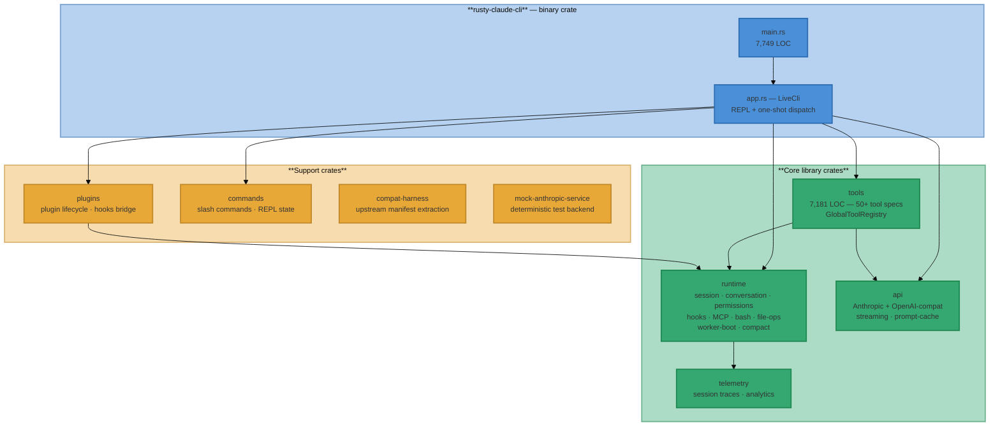
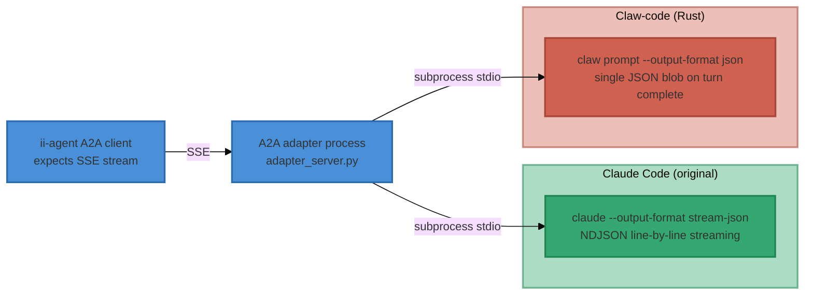
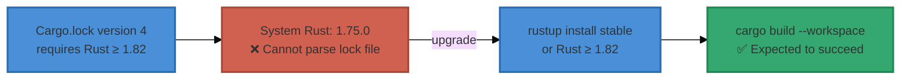
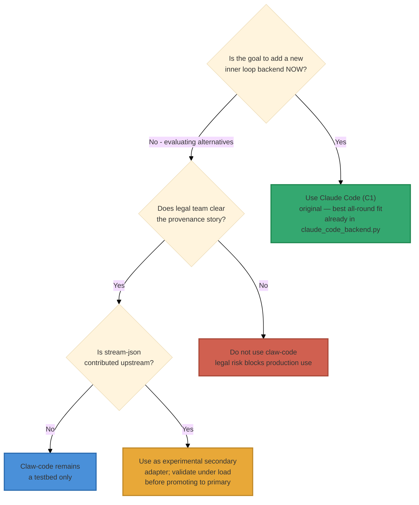

# Claw-Code Inner Loop Backend Assessment

> **Status**: Assessment — 2026-04-04  
> **Repository**: [`instructkr/claw-code`](https://github.com/instructkr/claw-code) — local mirror at `~/workspaces/git/claw-code`  
> **Parent documents**: [inner-loop-competitor-analysis.md](inner-loop-competitor-analysis.md), [a2a-copilot-cli-inner-loop-strategy.md](a2a-copilot-cli-inner-loop-strategy.md)  
> **Verdict**: **Not recommended as a primary inner loop backend.** Architecturally impressive for a 4-day autonomous build, but has a blocking integration gap (no `stream-json` output mode), material legal provenance risk, and immature test coverage relative to the original Claude Code (C1 in the prior analysis). Suitable for **experimental use only**, possibly as a secondary testbed.

---

## 1. What Is Claw-Code?

Claw-code is a rapid reimplementation of Claude Code that arose after Anthropic accidentally published the Claude Code source code. The repository itself acknowledges this directly:

> *"I originally studied the exposed codebase to understand its harness, tool wiring, and agent workflow."*

The repo evolved through three phases:

| Phase | Surface | Status |
|---|---|---|
| Original leaked snapshot | TypeScript (removed from tracking) | Not in repo |
| Python port (`src/`) | Structural scaffolding, manifest tooling | Incomplete runtime — not executable as a coding agent |
| **Rust rewrite (`rust/`)** | **9 crates, ~48,600 LOC** | **Active; the only functional implementation** |

The Rust workspace was built between 2026-03-31 and 2026-04-03 — **4 calendar days** — by autonomous agent workflows (clawhip + oh-my-codex) with 292 commits and 9 merged feature lanes. It is the implementation surface evaluated here.

---

## 2. Rust Implementation Architecture



### 2.1 Crate size summary

| Crate | LOC (Rust) | Key responsibility |
|---|---|---|
| `rusty-claude-cli` | ~7,749 (`main.rs`) + ~2,300 (other) | CLI binary: REPL, one-shot, arg parsing, render |
| `tools` | ~7,181 | Tool specs + execution dispatcher |
| `commands` | ~4,257 | Slash command state machine |
| `plugins` | ~3,361 + ~499 (hooks) | Plugin lifecycle + hook bridge |
| `runtime` | ~18,000+ | Session, conversation loop, permissions, MCP, bash, file-ops, hooks, compact, worker-boot |
| `api` | ~4,000+ | Anthropic + OpenAI-compatible provider clients |
| `telemetry` | ~526 | Session tracing, analytics events |
| `mock-anthropic-service` | ~1,123 | Deterministic mock for parity harness |
| `compat-harness` | ~small | Manifest extraction from upstream snapshot |

---

## 3. Features Implemented

### 3.1 Tool inventory (50+ tools)

The `tools` crate registers significantly more tools than the original Claude Code's built-in set. Beyond the standard coding tools, claw-code adds multi-agent orchestration tools as first-class citizens.

| Category | Tools |
|---|---|
| **File system** | `bash`, `read_file`, `write_file`, `edit_file`, `glob_search`, `grep_search` |
| **Web** | `WebFetch`, `WebSearch` |
| **Productivity** | `TodoWrite`, `Sleep`, `SendUserMessage`, `Config`, `AskUserQuestion`, `StructuredOutput` |
| **Planning** | `EnterPlanMode`, `ExitPlanMode` |
| **Code exec** | `REPL`, `PowerShell`, `NotebookEdit` |
| **Skills** | `Skill`, `ToolSearch` |
| **Sub-agents** | `Agent` |
| **Task orchestration** | `TaskCreate`, `RunTaskPacket`, `TaskGet`, `TaskList`, `TaskStop`, `TaskUpdate`, `TaskOutput` |
| **Worker lifecycle** | `WorkerCreate`, `WorkerGet`, `WorkerObserve`, `WorkerResolveTrust`, `WorkerAwaitReady`, `WorkerSendPrompt`, `WorkerRestart`, `WorkerTerminate` |
| **Team / cron** | `TeamCreate`, `TeamDelete`, `CronCreate`, `CronDelete`, `CronList` |
| **MCP** | `MCP`, `ListMcpResources`, `ReadMcpResource`, `McpAuth` |
| **LSP** | `LSP` |
| **Remote** | `RemoteTrigger` |

### 3.2 Runtime features

| Feature | Implemented | Notes |
|---|---|---|
| Anthropic API + streaming | ✅ | Full SSE streaming with retry/backoff |
| OpenAI-compat provider (xAI / OpenAI) | ✅ | `OpenAiCompatClient`; no Google/Gemini |
| Permission system (read-only / workspace-write / danger-full-access) | ✅ | `PermissionEnforcer` + `PermissionPolicy` |
| Pre/Post tool hooks | ✅ | `HookRunner` — `PreToolUse`, `PostToolUse`, `PostToolUseFailure` events |
| MCP lifecycle (stdio + hardened) | ✅ | 11-phase lifecycle state machine; tool/resource discovery |
| Session persistence (JSONL) | ✅ | Auto-rotation at 256 KB; up to 3 rotated files |
| Session resume (`--resume latest`) | ✅ | Named or latest session resumption |
| Context compaction | ✅ | `compact_session` with `CompactionConfig`; auto-compact threshold |
| Bash validation (6 submodules) | ✅ | readOnly, destructiveWarning, modeValidation, sedValidation, pathValidation, commandSemantics |
| Worker boot state machine | ✅ | `WorkerStatus`: Spawning → TrustRequired → ReadyForPrompt → Running → Finished/Failed |
| Lane event system | ✅ | Structured lifecycle events for multi-worker orchestration |
| LSP client | ✅ | `LspRegistry` for language-server integration |
| Extended thinking | ✅ (from API) | Streamed as reasoning blocks from Anthropic API |
| Prompt caching | ✅ | `PromptCache` + cache-break event tracking |
| REPL (interactive) | ✅ | `rustyline`-based with slash commands |
| One-shot / headless (`claw prompt`) | ✅ | `--output-format text` or `json` |
| JSON output format | ✅ | Single JSON blob after turn completes |
| OAuth login | ✅ | Browser flow; credential persistence |
| Git integration | ✅ | Branch freshness check; stale-branch detection |
| Cost / token tracking | ✅ | Per-turn usage; formatted USD cost display |

### 3.3 Features NOT implemented vs original Claude Code

| Feature | Status | Impact for ii-agent |
|---|---|---|
| `--output-format stream-json` (NDJSON streaming) | ❌ Missing | **Blocking** — existing ii-agent `ClaudeCodeBackend` requires this |
| Google/Gemini provider | ❌ Missing | Lower priority; no provider multiplexing beyond Anthropic+OpenAI |
| Bash validation: full 18-submodule depth | ⚠️ Partial | 6 main submodules implemented; edge cases may differ |
| Web search built-in without MCP | ✅ Added (unlike original) | Actually an improvement |
| Verified production deployments | ❌ None | Maturity risk |

---

## 4. Integration Gap Analysis vs ii-agent A2A Backend

The existing ii-agent `ClaudeCodeBackend` (`integrations/a2a/claude_code_backend.py`) expects the Claude Code subprocess to emit NDJSON streaming events via `--output-format stream-json`. Claw-code's Rust implementation supports only two output formats:

```
--output-format text   (default human-readable)
--output-format json   (single JSON object after turn completes)
```

This is the **primary blocking gap**. The following comparison maps each candidate against the ii-agent adapter contract:



**Consequence**: A claw-code backend adapter would need to either:

1. **Buffer until done** — collect all stdout until the process exits, then parse the single JSON blob and emit SSE. This works for correctness but eliminates real-time streaming entirely. The user sees nothing until the full turn completes, which can be minutes.
2. **Parse raw text output** — consume stdout in `text` mode line by line and infer event types from heuristics. This is fragile and misses structured tool-use metadata available in `json` mode.
3. **Contribute `stream-json` support to claw-code** — implement the missing output format upstream. Feasible but requires approximately 200–400 LOC of Rust work and depends on the claw-code maintainers or a fork.

Neither (1) nor (2) is suitable for production; (3) is the only viable path if this integration is desired.

### 4.1 Feature matrix delta vs original Claude Code (C1)

Using the same rating system as [inner-loop-competitor-analysis.md](inner-loop-competitor-analysis.md):

| Feature area | Claude Code (C1) | Claw-code (Rust) | Δ |
|---|---|---|---|
| Agent execution core (#1–5) | 0/5/0 | 0/5/0 | — |
| Streaming & events (#6–10) | 3/1/1 | **2/2/1** | −1 Drop-in (stream-json missing) |
| Tool system (#11–22) | 4/6/2 | **5/5/2** | +1 Drop-in (web search built-in) |
| Tool execution lifecycle (#23–28) | 2/3/1 | 2/3/1 | — |
| LLM integration (#29–34) | 2/3/1 | **2/3/1** | — (OpenAI-compat adds minor +) |
| Sandbox integration (#35–39) | 0/4/1 | 0/4/1 | — |
| Skills framework (#40–42) | 2/1/0 | 2/1/0 | — |
| Session & context (#43–46) | 2/2/0 | 2/2/0 | — |
| HITL (#47–50) | 2/2/0 | 2/2/0 | — |
| Hooks system (#51–55) | 3/1/1 | 3/1/1 | — |
| Prompts & instructions (#56–59) | 3/1/0 | 3/1/0 | — |
| Cancellation & errors (#60–63) | 1/2/1 | 1/2/1 | — |
| Billing & cost (#64–66) | 1/2/0 | 1/2/0 | — |
| Planning mode (#67–69) | 0/3/0 | 0/3/0 | — |
| MCP integration (#70–71) | 2/0/0 | 2/0/0 | — |
| Continuation & resumption (#72–73) | 2/0/0 | 2/0/0 | — |
| Output & artifacts (#74–76) | 1/2/0 | 1/2/0 | — |
| **TOTALS** | **30/38/7** | **29/38/8** | −1 Drop-in, +1 Gap |

Claw-code scores marginally **below** the original Claude Code on the feature matrix due to the missing `stream-json` mode, which downgrades streaming from Drop-in to Gap. All other categories are equivalent.

---

## 5. Build and Toolchain Status



**Current system (1.75.0) cannot build the workspace.** Cargo lock file version 4 requires Rust ≥ 1.82. A `rustup install stable` or installing the current Rust toolchain resolves this. No `rust-toolchain.toml` is provided, so any ≥ 1.82 toolchain should work after upgrading. This is not a fundamental obstacle but does mean the binary cannot be validated on the current dev host without a toolchain upgrade.

---

## 6. Test Coverage Assessment

| Test surface | Scope | Quality |
|---|---|---|
| **Mock parity harness** (`mock_parity_harness.rs`) | 10 scripted end-to-end scenarios; 19 captured `/v1/messages` requests | Good deterministic coverage of happy paths |
| **Unit tests** (runtime, api, plugins, tools) | In-module `#[test]` blocks across all crates | Moderate; conversation loop, hooks, permissions, file-ops, session all have tests |
| **CLI flags and config defaults** | Arg parsing regression suite | Good |
| **Resume slash commands** | Resume workflow coverage | Good |
| **Integration tests** (`runtime/tests/`) | Integration slice of runtime | Limited |

**Missing**: negative/adversarial testing, load testing, long-running session stability, multi-concurrent-session testing. The parity harness covers the nominal flow but does not stress edge cases the original Claude Code handles through years of production use.

---

## 7. Legal and Provenance Risk

The claw-code project arose from studying the leaked Claude Code source code. The README, PHILOSOPHY.md, and the project's own essay (`2026-03-09-is-legal-the-same-as-legitimate-ai-reimplementation...`) all acknowledge this origin:

> *"I originally studied the exposed codebase to understand its harness, tool wiring, and agent workflow. After spending more time with the legal and ethical questions I did not want the exposed snapshot itself to remain the main tracked source tree. This repository now focuses on Python porting work instead."*

The Rust rewrite is architecturally a clean-room reimplementation (different language, different crate structure, different abstractions) informed by the original architecture. Clean-room reimplementation based on publicly-disclosed architectural concepts is generally permissible — but:

1. **Reputational risk**: Depending on production infrastructure on a codebase with this origin story is a conversation-starter with enterprise customers and legal teams.
2. **Upstream instability**: Anthropic may assert claims against derivative works from the leaked source. This creates a risk of forced removal or significant redesign.
3. **Maintainer risk**: The repo is maintained by autonomous agent workflows ("lobsters/claws") rather than a stable human engineering team. Continuity is not guaranteed.

For ii-agent's production inner loop, the risk profile makes this unsuitable without independent legal review.

---

## 8. Comparison with Prior Candidates

| Dimension | Copilot CLI (C0) | Claude Code (C1) | Codex (C2) | **Claw-code (C3)** |
|---|---|---|---|---|
| Feature score | 10/55/11 | 30/38/7 | 21/43/11 | **29/38/8** |
| Streaming NDJSON | ✅ | ✅ | ✅ | ❌ |
| Native hooks | ✅ (SDK) | ✅ (settings.json) | ❌ | ✅ (settings.json compat) |
| MCP lifecycle | ✅ | ✅ | ✅ | ✅ |
| Multi-provider LLM | ✅ 4 families | ❌ Anthropic only | ❌ OpenAI only | ⚠️ Anthropic + OpenAI-compat |
| Cost per session (Sonnet 4.6 cached) | ~$0 (quota) | $0.70 | N/A | $0.70 (same API) |
| Build status | ✅ Stable | ✅ Stable | ✅ Stable | ⚠️ Requires Rust ≥ 1.82 |
| Production maturity | ✅ GitHub-scale | ✅ Anthropic-scale | ✅ OpenAI-scale | ❌ 4-day build, no production |
| Legal provenance | ✅ Clean | ✅ Clean | ✅ Clean | ⚠️ Leaked-source origin |
| Adapter complexity | High (SDK) | Medium (stdio) | Medium (stdio) | **Medium** (stdio — same as C1) |

---

## 9. Verdict and Recommendations

### 9.1 Summary

Claw-code is a technically impressive autonomous-development demonstration that produces a usable Rust CLI coding agent in 4 days. For ii-agent's inner loop backend it has **one blocking gap** and **two risk factors** that disqualify it from primary backend status:

| Issue | Severity | Mitigable? |
|---|---|---|
| Missing `stream-json` output mode | 🔴 Blocking | Yes — implement upstream or fork; ~200–400 LOC Rust |
| Legal/provenance risk from leaked-source origin | 🟡 Risk | Requires legal review; architecture is clean-room but story is public |
| 4-day autonomous build, no production validation | 🟡 Risk | Will improve over time; currently materially behind C1 maturity |
| Rust ≥ 1.82 required, not installed | 🟢 Trivial | `rustup install stable` |

### 9.2 Recommendation



**Primary backend**: Keep Claude Code (C1) as the primary inner loop backend. It is already implemented in `integrations/a2a/claude_code_backend.py`, matches the feature matrix better (stream-json native), and carries no legal risk.

**Claw-code role if pursued**: If the team wants to track claw-code as a secondary — e.g. to validate the autonomous-development ecosystem or to run side-by-side experiments — the path is:

1. Upgrade to Rust ≥ 1.82 in the sandbox container image.
2. Implement `--output-format stream-json` (NDJSON streaming) in claw-code (or contribute the PR upstream).
3. Write a `ClawCodeBackend` adapter in `integrations/a2a/` reusing the existing `ClaudeCodeBackend` event mapping (the JSONL schema is likely compatible once streaming is available).
4. Run the parity harness side-by-side with the existing `test_claude_code_backend.py` unit tests.
5. Gate behind a feature flag; do not route production traffic until stability is validated.

### 9.3 What claw-code is actually good for

Even if not suitable as an inner loop backend today, claw-code is worth watching because:

- **Multi-agent worker orchestration tools** (`WorkerCreate`, `TaskRegistry`, `TeamCreate`, `CronCreate`) are more developed here than in the original Claude Code. This is novel tooling that could inform ii-agent's own multi-agent orchestration.
- **LSP integration** is a first-class client in claw-code; the original Claude Code lacks this.
- **The autonomous-construction model** (clawhip + oh-my-codex building the repo) is a direct capability demonstration of what ii-agent is building toward — it's a useful live reference for the "inner loop in production" capability we are targeting.
- **Lane event system** (structured lifecycle events for parallel coding lanes) is an interesting prior art for ii-agent's event subscriber architecture.
