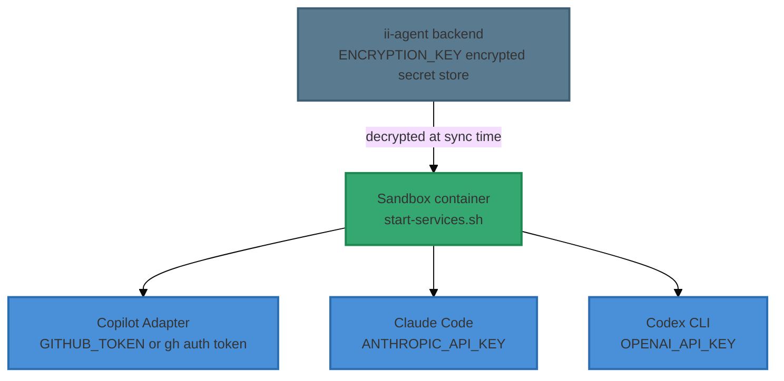
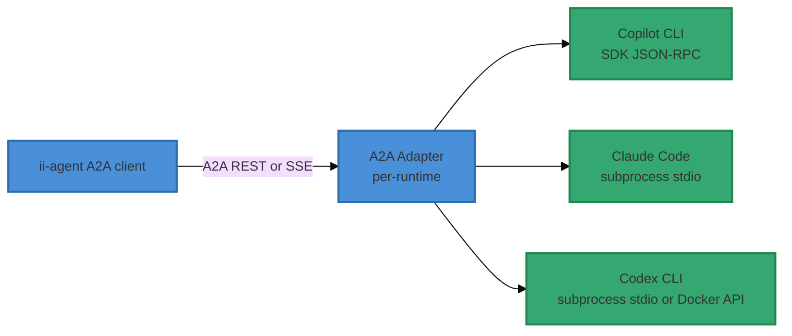
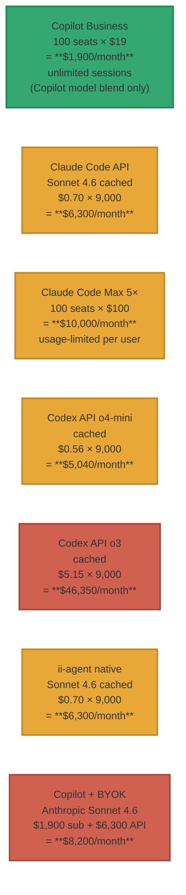
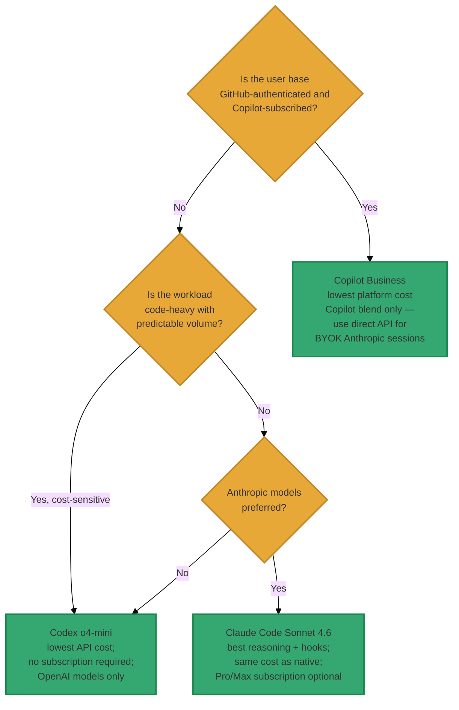

# Inner Loop Competitor Analysis: Claude Code & OpenAI Codex

> **Status**: Honest assessment added 2026-04-04 — see §8  
> **Date**: 2026-04-04  
> **Scope**: Feature-by-feature comparison of Claude Code and OpenAI Codex as alternative A2A backends to GitHub Copilot CLI, including authentication requirements, cost modelling, and an honest assessment of whether Copilot CLI is the right primary backend  
> **Parent document**: [a2a-copilot-cli-inner-loop-strategy.md](a2a-copilot-cli-inner-loop-strategy.md)  
> **Verdict**: **Given a preference for Anthropic models and multi-model flexibility, the A2A architecture is the right call but Claude Code is a stronger primary backend than Copilot CLI. Multi-model support should come from the A2A routing layer, not from one runtime's BYOK. See §8.**

---

## Why This Document Exists

The [A2A + Copilot CLI Inner Loop Strategy](a2a-copilot-cli-inner-loop-strategy.md) evaluated only two candidates in Appendix A: the Copilot SDK (direct JSON-RPC) vs Copilot CLI via A2A adapter. Both are GitHub Copilot variants. No alternative agent runtime was assessed against the full 76-feature inner-loop matrix.

This document fills that gap with:

1. **Authentication requirements** — clearly documented for each candidate (this was absent from the parent document)
2. **76-feature matrix** — Appendix A categories applied to Claude Code and OpenAI Codex with the same Drop-in / Adaptable / Gap / N/A rating system
3. **Cost analysis** — per-session and subscription cost comparison of all three runtimes vs native ii-agent API calls
4. **Architecture fit** — how each candidate maps onto the A2A adapter pattern
5. **Honest assessment** — whether the current implementation choice is optimal given stated model preferences (§8)

---

## Naming Disambiguation

> **Important**: The names "Claude Code" and "Codex" appear in two entirely separate parts
> of the ii-agent codebase with architecturally distinct meanings.  This document covers
> **Usage 2 only** (A2A inner loop replacement backends).
>
> | | Usage 1: Agent Persona (pre-existing) | Usage 2: A2A Backend (this doc) |
> |---|---|---|
> | Symbol | `AgentType.CLAUDE_CODE` / `AgentType.CODEX` | `ClaudeCodeBackend` / `CodexBackend` |
> | Location | `agents/types.py`, `agents/factory/tools.py` | `integrations/a2a/` |
> | Inner loop | Native — no subprocess, no A2A | **Replaced** — CLI binary is the LLM |
> | User-visible | Yes — chat persona selector | No — sandbox infrastructure |
>
> For the architectural rationale behind Usage 2 and the full inner loop design, see
> [a2a-copilot-cli-inner-loop-strategy.md](a2a-copilot-cli-inner-loop-strategy.md) and
> [a2a-copilot-cli-inner-loop-impl.md](../impl-docs/a2a-copilot-cli-inner-loop-impl.md).

---

## Candidates

### C0 — GitHub Copilot CLI (incumbent)

The currently chosen A2A backend, assessed in full in the [parent document](a2a-copilot-cli-inner-loop-strategy.md) and its [Copilot SDK integration assessment](copilot-sdk-integration-assessment.md).

**GitHub**: [`github/copilot-cli`](https://github.com/github/copilot-cli)  
**Docs**: [`https://docs.github.com/en/copilot/using-github-copilot/using-github-copilot-in-the-command-line`](https://docs.github.com/en/copilot/using-github-copilot/using-github-copilot-in-the-command-line)

**Summary of analysis from parent document (Appendix A + Appendix B):**
- **10 Drop-in / 55 Adaptable / 11 Gap** features when accessed via the A2A adapter
- The A2A adapter must use the Copilot SDK internally (JSON-RPC) — this is the highest-complexity adapter of the three candidates
- **Strengths**: broadest multi-provider BYOK (Anthropic + OpenAI + Azure + Ollama); subsidized per-request pricing for Copilot-subscribed orgs; rich SDK hook system (`on_pre_tool_use`, `on_permission_request`, `on_error_occurred`) available inside the adapter; production-tested at GitHub scale
- **Weaknesses**: reasoning deltas are not a first-class event (closeable via A2A Extensions); token/cost metrics not exposed natively (requires OTLP); requires a paid GitHub Copilot subscription; BYOK Anthropic costs the Copilot subscription fee **plus** full Anthropic API rates — no subsidy for BYOK calls; GitHub authentication dependency adds operational complexity in non-GitHub-centric orgs
- **Cost model**: Copilot Business ($19/user/month) provides unlimited subsidized requests for Copilot's own model blend. When BYOK Anthropic is selected, subsidy no longer applies — caller pays full Anthropic API rates on top of the subscription.

### C1 — Claude Code (Anthropic)

An agentic coding CLI by Anthropic. Runs as a command-line process, using Claude models (Sonnet 4 by default, Opus 4 available). Ships with `Bash`, `Read`, `Write`, `Edit`, `Glob`, and `Grep` tools built in. Supports structured hooks via `~/.claude/settings.json` (`PreToolUse[]`, `PostToolUse[]`), first-class MCP integration (Anthropic also created MCP), and a non-interactive `--print` mode for headless subprocess execution.

**GitHub**: [`anthropics/claude-code`](https://github.com/anthropics/claude-code)  
**Docs**: [`https://docs.anthropic.com/claude-code`](https://docs.anthropic.com/claude-code)

**Summary of analysis from §3–§6 below:**
- **30 Drop-in / 38 Adaptable / 7 Gap** — the best feature coverage of the three candidates, and 3× the Drop-in count of Copilot CLI via A2A
- **Strengths**: native pre/post tool hooks (structured shell scripts with full arg/result access, matching ii-agent's pattern more closely than any other candidate); extended thinking emits reasoning blocks as a first-class streamed event type (Drop-in for #9, where Copilot needs Extensions); superior MCP lifecycle management; named `--resume SESSION_ID` for reliable pause/resume; full per-call token usage returned in every API response (Drop-in for #64); automatic context compression; simpler A2A adapter (subprocess stdio vs SDK JSON-RPC)
- **Weaknesses**: Anthropic models only — no multi-provider BYOK; web search requires an MCP server (not built-in); no built-in permission approval flow for `--full-auto` equivalent (always prompts unless hooks auto-approve)
- **Cost model**: pay-per-token via Anthropic API (same rates as ii-agent's native path — delegation adds zero additional cost). Claude Pro ($20/month) includes Claude Code for light use; Max 5× ($100/month) covers everyday professional use. Both use subscription-funded flat-rate access — not per-token billing. No equivalent of Copilot's org-wide unlimited subscription for non-Anthropic models.

### C2 — OpenAI Codex CLI

OpenAI's agentic coding agent CLI, released early 2025. Uses o4-mini by default (o3 available). Runs shell commands inside a Docker micro-sandbox by default; use `--no-sandbox` to use the host filesystem (required inside the ii-agent sandbox container to avoid nested Docker). Supports `--full-auto` for unattended operation and MCP via `codex.json`. Purpose-built for code-centric shell/file tasks.

**GitHub**: [`openai/codex`](https://github.com/openai/codex)  
**Docs**: [`https://github.com/openai/codex`](https://github.com/openai/codex)

**Summary of analysis from §3–§6 below:**
- **21 Drop-in / 43 Adaptable / 11 Gap** — same gap count as Copilot CLI via A2A; fewer Drop-in features than Claude Code
- **Strengths**: cheapest API cost floor (o4-mini at ~$0.56/session with caching vs $0.70 for Sonnet 4); full per-call token usage returned in API responses; native Docker micro-sandbox (use `--no-sandbox` inside ii-agent); built-in web browsing (`browser` tool); `--full-auto` for zero-confirmation headless execution; simpler A2A adapter (subprocess stdio)
- **Weaknesses**: OpenAI models only; no hook system (largest gap relative to ii-agent's pattern); o3 reasoning is internal and not streamed; nested Docker sandbox conflicts with ii-agent sandbox unless disabled; rate-limit tiers require spending history to advance — new accounts throttle at ~20 RPM; o3 cost ($5.15/session cached) is prohibitive at production volume
- **Cost model**: pure pay-per-token API. o4-mini is the best cost-per-session of any candidate. o3 is the most expensive option evaluated. No subscription path.

---

## 1. Authentication Requirements

> **Note**: This section addresses a gap in the parent document, which mentioned Copilot credentials only briefly in a secret isolation table (§6.4) with no upfront guidance.

### 1.1 GitHub Copilot CLI

| Requirement | Detail |
|---|---|
| **Subscription** | GitHub Copilot Individual ($10/month, 300 premium requests), Business ($19/user/month, unlimited), or Enterprise ($39/user/month) |
| **GitHub account** | Required — CLI authenticates against GitHub identity |
| **CLI authentication** | `gh auth login` (GitHub CLI OAuth device flow or browser), or `GITHUB_TOKEN` env var |
| **Premium request quota** | Individual: 300/month pooled across all Copilot surfaces. Business/Enterprise: effectively unlimited (fair-use soft limits) |
| **BYOK model auth** | Additional API key for the target provider (Anthropic, OpenAI, Azure). Configures per-session via SDK `model_config` |
| **Headless deployment** | Use a GitHub personal access token (PAT) with `copilot` scope; inject via `GITHUB_TOKEN` in container env |
| **Subscription management** | GitHub account settings → Copilot → Plans. Org admins manage Business/Enterprise seats. |

### 1.2 Claude Code

| Requirement | Detail |
|---|---|
| **Subscription options** | (A) Anthropic API key (pay-per-token) — any tier; (B) Claude Pro ($20/month, rate-limited); (C) Claude Max ($100/month), higher limits; (D) Anthropic Bedrock (AWS account required); (E) Vertex AI (GCP project required) |
| **Default auth** | `ANTHROPIC_API_KEY` environment variable, or `claude login` browser OAuth to Anthropic console |
| **Headless deployment** | `ANTHROPIC_API_KEY` in container env. Also supports `ANTHROPIC_BEDROCK_*` or `ANTHROPIC_VERTEX_*` env vars for cloud-hosted auth |
| **Model selection** | `ANTHROPIC_MODEL` env var or `--model` flag. Defaults to Claude Sonnet 4. |
| **Enterprise/team** | No separate tier for Claude Code specifically; billed against the account's API usage. Bedrock/Vertex carry the cloud provider billing model. |
| **MCP server auth** | Each MCP server configured in `~/.claude/mcp.json` may require its own credential (API key, OAuth token). |

### 1.3 OpenAI Codex CLI

| Requirement | Detail |
|---|---|
| **Subscription options** | OpenAI API account required (no subscription tier equivalent to Copilot Business — pure pay-per-token); Azure OpenAI (enterprise contract) |
| **Default auth** | `OPENAI_API_KEY` environment variable, or `codex login` browser OAuth to OpenAI platform |
| **Headless deployment** | `OPENAI_API_KEY` in container env. Azure: `AZURE_OPENAI_API_KEY` + `AZURE_OPENAI_ENDPOINT`. |
| **Model selection** | `OPENAI_MODEL` env var or `--model` flag. Defaults to `o4-mini`. |
| **Organization** | `OPENAI_ORG_ID` for organizations with multiple workspaces |
| **Docker sandbox** | Sandbox runs inside a Docker container pulled from a pinned image; requires Docker daemon with internet access for initial pull |
| **Rate limits** | Tier-based rate limits (Tier 1–5 based on spend history). New API accounts start at Tier 1 (~20 RPM); heavy use requires prior spend to advance tiers. |

### 1.4 Sandbox Deployment Auth Summary

All three candidates must run inside the ii-agent sandbox container. The sandbox process must have access to the relevant credential at startup:

**Operational implication**: The A2A adapter pattern (§2.5 of the parent document) already isolates credentials in `/opt/copilot/adapter/config.yaml`. The same pattern applies for Claude Code and Codex: credentials are written during sandbox init and NOT stored in `/workspace/`. The ii-agent secret injection mechanism in `projects/secrets/` must be extended to support rotating these credentials per-sandbox without exposing them in the workspace.

---

## 2. A2A Adapter Fit

The parent document's adapter architecture (§2, §3) is cargo-neutral: ii-agent speaks only A2A. The Copilot CLI adapter translates A2A → Copilot SDK JSON-RPC inside the sandbox. Any alternative runtime can slot into the same position by implementing:

- `GET /.well-known/agent-card.json`
- `POST /message:stream` (SSE)
- `POST /message:send` (sync)
- `GET /tasks/{id}`, `POST /tasks/{id}:cancel`

For Claude Code and Codex, the adapter would translate A2A SSE → subprocess stdio/streaming, rather than Copilot SDK JSON-RPC. The adapter complexity is similar or slightly lower (no SDK layer).

All three runtimes expose a headless non-interactive mode suitable for subprocess management from an A2A adapter process.

---

## 3. Feature-by-Feature Assessment

**Rating key** — same as Appendix A of the parent document:
- **Drop-in** — Feature is natively supported or trivially mapped
- **Adaptable** — Feature can be implemented with moderate adapter work
- **Gap** — Feature missing; requires significant custom work or is impossible
- **N/A** — Feature not applicable

References to feature numbers (#1–#76) match the numbering in Appendix A of [a2a-copilot-cli-inner-loop-strategy.md](a2a-copilot-cli-inner-loop-strategy.md).

---

### I. Agent Execution Core

| # | ii-agent Feature | Copilot CLI + A2A (ref) | Claude Code + A2A | OpenAI Codex + A2A | Notes |
|---|---|---|---|---|---|
| 1 | Async agent loop | Adaptable | **Adaptable** — `claude --print` non-interactive; streaming via stdout pipe | **Adaptable** — `codex --full-auto` headless; streaming stdout | All three require adapter-side async subprocess management |
| 2 | Run context & state | Adaptable | **Adaptable** — same ii-agent RunContext wrapper applies | **Adaptable** — same | Symmetric gap across all candidates |
| 3 | Run lifecycle tracking | Adaptable | **Adaptable** — map Claude Code exit state / tool results to RunStatus | **Adaptable** — same mapping | A2A Task state machine is candidate-agnostic |
| 4 | Sub-agent delegation | Adaptable | **Adaptable** — A2A multi-agent routes to any compliant adapter | **Adaptable** — same | A2A protocol handles this; runtime-agnostic |
| 5 | Max iterations / turn limit | Adaptable | **Adaptable** — enforce via adapter turn counter + process termination | **Adaptable** — same | Client-side enforcement; same pattern for all |

---

### II. Streaming & Event System

| # | ii-agent Feature | Copilot CLI + A2A (ref) | Claude Code + A2A | OpenAI Codex + A2A | Notes |
|---|---|---|---|---|---|
| 6 | Granular event streaming | Adaptable | **Adaptable** — Claude Code emits streaming text and tool_use blocks on stdout; adapter maps to A2A SSE | **Adaptable** — Codex streams stdout lines; adapter maps | Copilot SDK's 40+ event types are richer natively; both alternatives require adapter mapping |
| 7 | Event persistence | Drop-in | **Drop-in** — ii-agent's DatabaseCallback is event-source-agnostic | **Drop-in** — same | All three: persistence layer is decoupled |
| 8 | Content delta streaming | Adaptable | **Adaptable** — stdout streaming with JSON delta payloads; adapter wraps | **Adaptable** — same | |
| 9 | Reasoning delta streaming | Adaptable (Extensions) | **Drop-in** — Claude extended thinking emits reasoning blocks as a first-class event type; adapter maps to `urn:ii-agent:extensions:reasoning/v1` | **Adaptable** — o3/o4-mini reasoning is internal; not streamed as separate event type | **Claude Code wins #9.** Extended thinking gives native reasoning deltas; Copilot needs Extensions; Codex cannot expose reasoning deltas at all |
| 10 | Event filtering | Drop-in | **Drop-in** — filter at ii-agent A2A client layer | **Drop-in** — same | |

---

### III. Tool System

| # | ii-agent Feature | Copilot CLI + A2A (ref) | Claude Code + A2A | OpenAI Codex + A2A | Notes |
|---|---|---|---|---|---|
| 11 | 100+ tools across 13 categories | Adaptable | **Adaptable** — bash/file/web built in; proprietary ii-agent tools (slides, storybook, media, planning) stay native via routing | **Adaptable** — shell/file built in; web browsing built in; proprietary tools stay native | All three share the same gap: ii-agent's domain-specific tools remain native-owned |
| 12 | Shell execution | Drop-in | **Drop-in** — `Bash` tool is Claude Code's core capability | **Drop-in** — shell execution is Codex's primary purpose; runs in Docker sandbox | |
| 13 | File operations | Drop-in | **Drop-in** — `Read`, `Write`, `Edit`, `Glob`, `Grep` tools built in | **Drop-in** — `read_file`, `write_file`, `list_dir`, `search_files` built in | |
| 14 | Web search & visit | Drop-in | **Adaptable** — web search requires `WebSearch` MCP server or the `computer` tool; not built-in | **Drop-in** — web browsing built in via `browser` tool | **Codex wins #14.** Claude Code needs an MCP server for web search; Copilot and Codex have it built in |
| 15 | Browser automation | Adaptable (MCP) | **Adaptable** — Playwright via MCP server | **Adaptable** — Playwright via MCP server | Both same as Copilot |
| 16 | Media generation | Gap | **Gap** — same; stays in ii-agent native | **Gap** — same | Shared gap across all three |
| 17 | Slide system | Gap | **Gap** — same | **Gap** — same | Shared gap |
| 18 | Dev tools | Adaptable | **Adaptable** — register as MCP tools or pass via system prompt | **Adaptable** — same | |
| 19 | Connectors | Adaptable | **Adaptable** — GitHub integration via `gh` CLI in bash; Composio as MCP | **Adaptable** — same | |
| 20 | Planning tools | Adaptable | **Adaptable** — register as MCP tools returning structured JSON | **Adaptable** — same | |
| 21 | Productivity tools | Drop-in | **Drop-in** — TodoRead/Write as simple MCP or custom tools | **Drop-in** — same | |
| 22 | Tool override | Adaptable | **Adaptable** — MCP tools can shadow built-in names if adapter intercepts first | **Adaptable** — adaptor-level tool interception; no explicit override flag | Copilot SDK has an `overrides_built_in_tool` flag; neither alternative does |

---

### IV. Tool Execution Lifecycle

| # | ii-agent Feature | Copilot CLI + A2A (ref) | Claude Code + A2A | OpenAI Codex + A2A | Notes |
|---|---|---|---|---|---|
| 23 | Permission gates | Adaptable | **Drop-in** — Claude Code's native permission system: approve/deny/always-allow per tool type (bash, file write, MCP, etc.); adapter maps to A2A INPUT_REQUIRED | **Drop-in** — Codex's approval flow: approve/deny/always-allow for shell commands and file writes; `--full-auto` bypasses for unattended use | **Both alternatives win #23.** Both have richer and more direct permission gates than the Copilot SDK (which the adapter wraps). Copilot path is Adaptable via SDK `on_permission_request`; Claude Code and Codex are Drop-in |
| 24 | User input collection | Adaptable | **Adaptable** — Claude Code can pause and prompt user on terminal; adapter routes to A2A INPUT_REQUIRED | **Adaptable** — Codex pauses for approval; adapter routes | |
| 25 | External execution | Adaptable | **Adaptable** — same as Copilot path | **Adaptable** — same | |
| 26 | Tool hooks (pre/post) | Adaptable (adapter SDK) | **Drop-in** — `~/.claude/settings.json` supports `hooks.PreToolUse[]` and `hooks.PostToolUse[]` as shell commands or scripts with full arg/result access | **Gap** — no hook system; adapter must intercept via subprocess pipe inspection | **Claude Code wins #26 decisively.** Native hook system matches ii-agent's pattern; Codex has no equivalent |
| 27 | Tool abort messages | Adaptable | **Adaptable** — Claude Code permission denial returns structured error | **Adaptable** — same | |
| 28 | Stop-after-tool-call | Adaptable | **Adaptable** — adapter terminates process after detecting specific tool result | **Adaptable** — same | |

---

### V. LLM Integration

| # | ii-agent Feature | Copilot CLI + A2A (ref) | Claude Code + A2A | OpenAI Codex + A2A | Notes |
|---|---|---|---|---|---|
| 29 | Multi-provider LLM | Adaptable (BYOK) | **Gap** — Anthropic models only (Claude Sonnet 4, Opus 4). AWS Bedrock and GCP Vertex routes available but still Claude-only. No OpenAI or Gemini support. | **Gap** — OpenAI models only (o4-mini, o3, gpt-4o). Azure OpenAI available but still OpenAI models. | **Copilot BYOK wins #29.** Copilot CLI supports Anthropic, OpenAI, Azure, and Ollama via BYOK — the broadest model selection |
| 30 | Streaming response parsing | Drop-in | **Drop-in** — Claude Code handles internally; adapter reads structured streaming JSON | **Drop-in** — Codex handles internally | |
| 31 | Structured output | Adaptable | **Adaptable** — JSON tool results and `--output-format json` flag | **Adaptable** — `--output json` flag for structured output | |
| 32 | Token/cost metrics | Adaptable | **Drop-in** — Anthropic API responses include `usage` (input_tokens, output_tokens, cache_creation_input_tokens, cache_read_input_tokens). Adapter can surface via A2A Extension | **Drop-in** — OpenAI API responses include `usage` with prompt/completion/reasoning tokens. Adapter surfaces via A2A Extension | **Both alternatives win #32.** Anthropic and OpenAI APIs return detailed per-call token counts; Copilot's subsidized path does not expose per-token usage |
| 33 | Auto-retry with backoff | Drop-in | **Drop-in** — Claude Code handles rate limit retries internally | **Drop-in** — Codex handles retries | |
| 34 | Reasoning effort control | Adaptable | **Drop-in** — Claude extended thinking `budget_tokens` parameter controls reasoning depth; `--max-thinking-tokens` flag | **Adaptable** — o3/o4-mini support `reasoning_effort` ("low", "medium", "high") via API, but not as a CLI flag | |

---

### VI. Sandbox Integration

| # | ii-agent Feature | Copilot CLI + A2A (ref) | Claude Code + A2A | OpenAI Codex + A2A | Notes |
|---|---|---|---|---|---|
| 35 | Sandbox abstraction | Adaptable | **Adaptable** — Claude Code runs in the host environment (the existing sandbox container). No additional sandboxing layer; CLI trusts the sandbox container's isolation | **Drop-in** — Codex has its own built-in Docker micro-sandbox for all shell execution; can disable with `--no-sandbox` to use host env as the sandbox | **Codex is unique here**: it brings its own sandboxing. In the ii-agent architecture this is actually a conflict — the sandbox-in-sandbox adds overhead and may require privileged Docker. Use `--no-sandbox` and rely on the outer ii-agent sandbox container. |
| 36 | Lazy sandbox init | Adaptable | **Adaptable** — process starts when A2A request arrives | **Adaptable** — same; `--no-sandbox` removes Docker startup overhead | |
| 37 | Streaming command output | Adaptable | **Adaptable** — Claude Code streams bash output to stdout; adapter captures | **Adaptable** — same | |
| 38 | File upload to sandbox | Adaptable | **Adaptable** — files written to `/workspace/` before Claude Code is invoked; CLI reads normally | **Adaptable** — same | |
| 39 | Port management | Gap | **Gap** — same; stays in ii-agent infrastructure | **Gap** — same | Shared gap across all candidates |

---

### VII. Skills Framework

| # | ii-agent Feature | Copilot CLI + A2A (ref) | Claude Code + A2A | OpenAI Codex + A2A | Notes |
|---|---|---|---|---|---|
| 40 | Built-in skills | Adaptable | **Drop-in** — system prompt via `--system-prompt` flag or `CLAUDE_SYSTEM_PROMPT` env var | **Drop-in** — system prompt via `--instructions` flag or env var | SDK has `SystemMessageConfig`. All candidates support system prompt injection |
| 41 | User-defined skills | Adaptable | **Adaptable** — register as MCP tools from ii-agent's skill database | **Adaptable** — same | |
| 42 | Skill prompt injection | Drop-in | **Drop-in** — part of system prompt | **Drop-in** — same | |

---

### VIII. Session & Context Management

| # | ii-agent Feature | Copilot CLI + A2A (ref) | Claude Code + A2A | OpenAI Codex + A2A | Notes |
|---|---|---|---|---|---|
| 43 | Session persistence | Adaptable | **Adaptable** — `--continue` or `--resume SESSION_ID` for session continuation; adapter maps A2A contextId | **Adaptable** — `--conversation-id` for session continuity; adapter maps | |
| 44 | Conversation history | Adaptable | **Adaptable** — conversation history injected via `--context` or piped stdin; Claude Code manages window internally | **Adaptable** — injected via stdin or file; model manages context window | |
| 45 | Session summarization | Adaptable | **Drop-in** — Claude Code performs automatic context compression when approaching context limit (compresses older turns silently) | **Adaptable** — o3/o4-mini handle context via model architecture; no explicit compression API | **Claude Code wins #45.** Auto-compression is built in and transparent |
| 46 | Run message tracking | Adaptable | **Adaptable** — ii-agent reconstructs from adapter events | **Adaptable** — same | |

---

### IX. Human-in-the-Loop (HITL)

| # | ii-agent Feature | Copilot CLI + A2A (ref) | Claude Code + A2A | OpenAI Codex + A2A | Notes |
|---|---|---|---|---|---|
| 47 | Tool confirmation gates | Adaptable | **Drop-in** — permission gate fires natively before each bash/write/MCP call; adapter routes to A2A INPUT_REQUIRED | **Drop-in** — same native approval flow | Both alternatives have more direct permission gates than the Copilot path |
| 48 | Structured user input | Adaptable | **Adaptable** — pause with plain text prompt; adapter formats as A2A INPUT_REQUIRED with JSON schema Part | **Adaptable** — same | |
| 49 | External execution | Adaptable | **Adaptable** — adapter routes to ii-agent HITL flow | **Adaptable** — same | |
| 50 | Pause/resume flow | Adaptable | **Drop-in** — `--resume SESSION_ID` resumes from exact pause point; persistent conversation history | **Adaptable** — `--conversation-id` provides continuity across invocations; no formal pause state | **Claude Code wins #50.** Named session resume matches ii-agent's pause/continue model |

---

### X. Hooks System

| # | ii-agent Feature | Copilot CLI + A2A (ref) | Claude Code + A2A | OpenAI Codex + A2A | Notes |
|---|---|---|---|---|---|
| 51 | Pre-execution hooks | Adaptable (pre-A2A call) | **Drop-in** — `hooks.PreToolUse[]` in `settings.json` fires before each tool; adapter also runs pre-A2A hooks in host | **Adaptable** — no hook system; pre-execution logic runs in adapter before subprocess spawn | |
| 52 | Post-execution hooks | Adaptable | **Drop-in** — `hooks.PostToolUse[]` fires after each tool with result access | **Adaptable** — adapter runs post-A2A hooks after subprocess exits | |
| 53 | Pre/post tool hooks | Adaptable (adapter SDK) | **Drop-in** — `settings.json` hooks with `matcher` (regex on tool name/input), `hooks` array (shell commands), and access to full tool args and results | **Gap** — no equivalent; adapter must intercept via pipe inspection without structured arg access | **Claude Code is the only candidate with native pre/post tool hooks.** Copilot uses SDK `on_pre_tool_use`; Claude Code uses `settings.json`; Codex has nothing |
| 54 | Background hooks | Adaptable | **Adaptable** — hooks are sync shell commands; adapter can fire async background tasks | **Adaptable** — same at adapter level | |
| 55 | Error hooks | Adaptable (adapter SDK) | **Adaptable** — no dedicated error hook; adapter watches for non-zero exit codes and Claude Code error JSON | **Gap** — same limitation | |

---

### XI. Prompts & Instructions

| # | ii-agent Feature | Copilot CLI + A2A (ref) | Claude Code + A2A | OpenAI Codex + A2A | Notes |
|---|---|---|---|---|---|
| 56 | Dynamic system prompt | Adaptable | **Drop-in** — `--system-prompt` flag or `CLAUDE_SYSTEM_PROMPT` env var at process start | **Drop-in** — `--instructions` flag | |
| 57 | Agent-type prompts | Adaptable | **Drop-in** — different system messages for different agent types | **Drop-in** — same | |
| 58 | Plan mode prompts | Adaptable | **Adaptable** — plan prompts injected into system message; structured output via JSON tool | **Adaptable** — same | |
| 59 | Custom instructions | Drop-in | **Drop-in** — append to system prompt | **Drop-in** — same | |

---

### XII. Cancellation & Error Handling

| # | ii-agent Feature | Copilot CLI + A2A (ref) | Claude Code + A2A | OpenAI Codex + A2A | Notes |
|---|---|---|---|---|---|
| 60 | Graceful cancellation | Drop-in (A2A cancel) | **Adaptable** — SIGTERM / SIGINT to Claude Code process; adapter handles cleanup | **Adaptable** — same; Codex sandbox container also needs SIGTERM | A2A `POST /tasks/{id}:cancel` maps to process termination in both alternatives |
| 61 | Run registration | Adaptable | **Adaptable** — ii-agent maps session ID ↔ run | **Adaptable** — same | |
| 62 | Error recovery | Drop-in | **Drop-in** — Claude Code retries API rate limits internally | **Drop-in** — Codex retries internally | |
| 63 | Tool error handling | Adaptable | **Adaptable** — Claude Code reports tool errors as text + continues | **Adaptable** — same | |

---

### XIII. Billing & Cost Tracking

| # | ii-agent Feature | Copilot CLI + A2A (ref) | Claude Code + A2A | OpenAI Codex + A2A | Notes |
|---|---|---|---|---|---|
| 64 | Token counting | Adaptable (OTLP partial) | **Drop-in** — Anthropic API usage block in each API response; adapter surfaces via A2A Extension | **Drop-in** — OpenAI API usage block; adapter surfaces via Extension | **Both alternatives win #64 decisively.** Per-call token counts are available in JSON API responses; Copilot's subsidized path does not expose per-token counts |
| 65 | Cost tracking | Adaptable | **Adaptable** — token counts × published Anthropic pricing rates → USD cost. Accurate per call. | **Adaptable** — same with OpenAI pricing | |
| 66 | Credit reservation | Adaptable | **Adaptable** — reserve on A2A task start; settle on task END with actual token cost | **Adaptable** — same | |

---

### XIV. Planning Mode

| # | ii-agent Feature | Copilot CLI + A2A (ref) | Claude Code + A2A | OpenAI Codex + A2A | Notes |
|---|---|---|---|---|---|
| 67 | Structured plan generation | Adaptable | **Adaptable** — Claude Code + MCP structured tools for milestone output | **Adaptable** — same | |
| 68 | Plan modification | Adaptable | **Adaptable** — system prompt variation | **Adaptable** — same | |
| 69 | Milestone execution | Adaptable | **Adaptable** — context injection via prompt | **Adaptable** — same | |

---

### XV. MCP Integration

| # | ii-agent Feature | Copilot CLI + A2A (ref) | Claude Code + A2A | OpenAI Codex + A2A | Notes |
|---|---|---|---|---|---|
| 70 | Dynamic MCP tool discovery | Adaptable | **Drop-in** — Claude Code has first-class MCP support; `~/.claude/mcp.json` configures servers; MCP servers are started automatically at session init | **Adaptable** — Codex supports MCP but configuration requires a `codex.json` file; less native than Claude Code | **Claude Code wins #70.** MCP is a primary integration point and is effectively a core design principle of Claude Code (same team that created MCP) |
| 71 | MCP server lifecycle | Adaptable | **Drop-in** — Claude Code manages MCP server start/stop automatically per session; each session reconnects configured servers | **Adaptable** — Codex starts configured MCP servers; less lifecycle control | |

---

### XVI. Continuation & Resumption

| # | ii-agent Feature | Copilot CLI + A2A (ref) | Claude Code + A2A | OpenAI Codex + A2A | Notes |
|---|---|---|---|---|---|
| 72 | Continue paused run | Adaptable | **Drop-in** — `--resume SESSION_ID` exact resume; session history persisted in `~/.claude/` | **Adaptable** — `--conversation-id` continues context; less persistent | |
| 73 | Tool update handling | Adaptable | **Drop-in** — Claude Code permission callback returns decision per-tool; user input via CLI prompt → adapter relays via A2A | **Adaptable** — same | |

---

### XVII. Output & Artifacts

| # | ii-agent Feature | Copilot CLI + A2A (ref) | Claude Code + A2A | OpenAI Codex + A2A | Notes |
|---|---|---|---|---|---|
| 74 | Media artifact collection | Adaptable | **Adaptable** — A2A Artifact model collects; Claude Code does not produce structured media artifacts | **Adaptable** — same | |
| 75 | Structured tool results | Adaptable | **Adaptable** — Claude Code tool results include LLM-facing text and user-display text | **Adaptable** — similar | |
| 76 | Image attachments | Adaptable | **Drop-in** — Claude Code natively accepts image files in conversation; vision capability is first-class | **Drop-in** — Codex / gpt-4o accept image files; o4-mini also supports vision | |

---

## 4. Summary Scorecard

### 4.1 Per-Candidate vs Full Matrix

| Category | Copilot CLI + A2A | Claude Code + A2A | OpenAI Codex + A2A |
|---|---|---|---|
| Agent execution core (5) | 0 / 5 / 0 | 0 / 5 / 0 | 0 / 5 / 0 |
| Streaming & events (5) | 2 / 2 / 1 | 3 / 1 / 1 | 2 / 2 / 1 |
| Tool system (12) | 4 / 6 / 2 | 4 / 6 / 2 | 5 / 5 / 2 |
| Tool execution lifecycle (6) | 0 / 5 / 1 | 2 / 3 / 1 | 2 / 2 / 2 |
| LLM integration (6) | 0 / 5 / 1 | 2 / 3 / 1 | 1 / 4 / 1 |
| Sandbox integration (5) | 0 / 4 / 1 | 0 / 4 / 1 | 1 / 3 / 1 |
| Skills framework (3) | 1 / 2 / 0 | 2 / 1 / 0 | 2 / 1 / 0 |
| Session & context (4) | 0 / 4 / 0 | 2 / 2 / 0 | 0 / 4 / 0 |
| HITL (4) | 0 / 4 / 0 | 2 / 2 / 0 | 2 / 2 / 0 |
| Hooks system (5) | 0 / 2 / 3 | 3 / 1 / 1 | 0 / 2 / 3 |
| Prompts & instructions (4) | 2 / 2 / 0 | 3 / 1 / 0 | 3 / 1 / 0 |
| Cancellation & errors (4) | 1 / 2 / 1 | 1 / 2 / 1 | 1 / 2 / 1 |
| Billing & cost (3) | 0 / 2 / 1 | 1 / 2 / 0 | 1 / 2 / 0 |
| Planning mode (3) | 0 / 3 / 0 | 0 / 3 / 0 | 0 / 3 / 0 |
| MCP integration (2) | 0 / 2 / 0 | 2 / 0 / 0 | 0 / 2 / 0 |
| Continuation & resumption (2) | 0 / 2 / 0 | 2 / 0 / 0 | 0 / 2 / 0 |
| Output & artifacts (3) | 0 / 3 / 0 | 1 / 2 / 0 | 1 / 2 / 0 |
| **TOTALS** | **10 Drop-in / 55 Adaptable / 11 Gap** | **30 Drop-in / 38 Adaptable / 7 Gap** | **21 Drop-in / 43 Adaptable / 11 Gap** |

*Table format: Drop-in count / Adaptable count / Gap count per category*

### 4.2 Head-to-Head Differentiators

| Feature area | Winner | Reason |
|---|---|---|
| Reasoning deltas (#9) | **Claude Code** | Extended thinking is a native first-class streamed event; Codex reasoning is internal; Copilot needs Extensions |
| Token / cost metrics (#32, #64) | **Claude Code & Codex tie** | Both return per-call usage in API responses; Copilot's subsidized path does not |
| Tool hooks (#26, #53) | **Claude Code** | `settings.json` PreToolUse/PostToolUse is native, structured, and powerful; Codex has none; Copilot needs SDK adapter |
| MCP integration (#70, #71) | **Claude Code** | MCP is a core design principle (same team); fully automatic server lifecycle |
| Web search built-in (#14) | **Copilot CLI & Codex tie** | Both have built-in web browsing; Claude Code requires MCP server |
| Multi-provider LLM (#29) | **Copilot CLI** | BYOK supports Anthropic + OpenAI + Azure + Ollama; Claude Code is Anthropic-only; Codex is OpenAI-only |
| Session resume (#50, #72) | **Claude Code** | Named `--resume SESSION_ID` is more explicit and reliable than contextId reuse |
| Sandbox model (#35) | **Codex** (with caveats) | Built-in Docker sandbox; but causes nested-container conflict — use `--no-sandbox` in the ii-agent sandbox |
| Permissions / HITL (#23, #47) | **Claude Code & Codex tie** | Both have native per-tool permission gates that are more direct than Copilot SDK wrapping |
| Session summarization (#45) | **Claude Code** | Automatic transparent context compression; Codex relies on model context window; Copilot has `background_compaction_threshold` |

---

## 5. Cost Analysis

### 5.1 Pricing Reference (verified April 2026)

> **Source**: live pricing fetched from [claude.com/platform/api](https://claude.com/platform/api) and [docs.github.com/en/copilot/concepts/billing/copilot-requests](https://docs.github.com/en/copilot/concepts/billing/copilot-requests), April 2026. Model names reflect currently available versions (Sonnet 4.6 / Opus 4.6 / Haiku 4.5).

#### Anthropic direct API (used by Claude Code + A2A and ii-agent native)

| Model | Input /MTok | Output /MTok | Cache write /MTok | Cache read /MTok |
|---|---|---|---|---|
| **Haiku 4.5** | $1.00 | $5.00 | $1.25 | $0.10 |
| **Sonnet 4.6** | $3.00 | $15.00 | $3.75 | $0.30 |
| **Opus 4.6** | $5.00 | $25.00 | $6.25 | $0.50 |

> **Opus 4.6 pricing correction**: the prior draft of this table used $15/$75 per MTok (Opus 3 pricing). Opus 4.6 is $5/$25 — a 3× reduction. This materially changes the per-session cost of any Opus-heavy workload.

#### GitHub Copilot premium request model (paid plans)

| Model | Multiplier | Free-plan cost | Paid-plan cost |
|---|---|---|---|
| GPT-5 mini, GPT-4.1, GPT-4o | 0× | 1 req | **0 req (truly free on paid)** |
| Claude Haiku 4.5, Grok Code Fast 1 | 0.33× | 1 req | 0.33 req from allowance |
| Claude Sonnet 4.6, Gemini 3 Pro, GPT-5.1 | 1× | 1 req | 1 req from 300/month (Pro) |
| Claude Opus 4.5 / 4.6 | 3× | — | 3 req from allowance |
| Claude Opus 4.6 fast mode (preview) | **30×** | — | 30 req from allowance |

> **Critical detail — agentic accounting**: For agent mode and Copilot CLI, only **user prompts** count as premium requests. Autonomous tool calls (bash, file write, web search, etc.) do **not** consume premium requests. A 10-turn agentic session with 10 user prompts = 10 premium requests × model multiplier.

#### Copilot subscription plans (April 2026)

| Plan | Price | Premium req allowance | Effective agentic sessions/month (Sonnet 4.6 at 1×, 10 prompts/session) |
|---|---|---|---|
| Free | $0 | 50/month | ~5 sessions before throttle to base models |
| Pro | $10/month | 300/month | ~30 sessions |
| Pro+ | $39/month | 1,500/month | ~150 sessions |
| Business | $19/user/month | Unlimited* | No per-session cap (fair-use rate limits apply) |
| Enterprise | $39/user/month | Unlimited* | No per-session cap |

*Unlimited = no hard numeric quota, subject to GitHub rate limits and fair-use.

#### Claude Code subscription plans (April 2026)

| Plan | Price | Claude Code access | Positioning |
|---|---|---|---|
| Pro | $17-20/month | ✅ Included | "Short coding sprints in small codebases" |
| Max 5× | $100/month | ✅ Included | "Everyday use in larger codebases" |
| Max 20× | $200/month | ✅ Included | "Power users with most access" |

> **Key update vs prior research**: Claude Code CLI is now included in the Pro plan ($17-20/month) — not just Max. Usage limits apply per plan; these plans are not unlimited for heavy agentic sessions, but they are subsidized flat-rate access to Anthropic models, covering terminal, IDE, desktop, web, and iOS surfaces.

#### Summary row for cost analysis below

| Runtime | Model | Input /MTok | Output /MTok | Cache read /MTok | Subscription path |
|---|---|---|---|---|---|
| **GitHub Copilot** | Copilot blend (GPT-5 mini default) | Counted as premium req | Counted | N/A | Pro $10/month (300 req); Business $19/user/month (unlimited) |
| **GitHub Copilot + BYOK Anthropic** | Claude Sonnet 4.6 | $3.00 (full API + subscription fee) | $15.00 | $0.30 | No subsidy — BYOK pays full API rates on top of subscription |
| **Claude Code API** | Claude Sonnet 4.6 | $3.00 | $15.00 | $0.30 | Pro $17-20/month or Max $100-200/month (flat, usage-limited) |
| **Claude Code API** | Claude Opus 4.6 | $5.00 | $25.00 | $0.50 | Max plans only (recommended for Opus) |
| **OpenAI Codex** | o4-mini | $1.10 | $4.40 | $0.55 | None — API-only |
| **OpenAI Codex** | o3 | $10.00 | $40.00 | $5.00 | None — API-only |
| **ii-agent native** | Claude Sonnet 4.6 | $3.00 | $15.00 | $0.30 | None — API billing |

### 5.2 Per-Session Cost Model

Baseline session profile (10 turns, 10 user prompts — consistent with Appendix A §8.4 of the parent document):

| Component | Tokens | Detail |
|---|---|---|
| System prompt + tools (write, turn 1) | 50,000 | Cache miss on first turn |
| System prompt + tools (reads, turns 2–10) | 50,000 × 9 = 450,000 | Cache hits at $0.30/MTok |
| Cumulative history reads | ~225,000 cumulative | Growing cache hits after turn 2 |
| New content per turn (input) | 5,000 × 10 = 50,000 | Never cached |
| Output per turn | 1,000 × 10 = 10,000 | Not cached |

| Runtime | Model | Input cost (uncached) | Input cost (with caching) | Output cost | **Total (no cache)** | **Total (with cache)** |
|---|---|---|---|---|---|---|
| Copilot Individual | Copilot blend (GPT-5 mini) | 10 req out of 300/month | 10 req | 0 req | $0.33 (10/300 × $10) | $0.33 |
| Copilot Individual | Sonnet 4.6 (1× multiplier) | 10 req out of 300/month | 10 req | — | $0.33 | $0.33 |
| Copilot Individual | Opus 4.6 (3× multiplier) | **30 req** out of 300/month | 30 req | — | **$1.00** | **$1.00** |
| Copilot Business | Copilot blend (GPT-5 mini) | Unlimited | Unlimited | — | ~$0.006 (amortized) | ~$0.006 |
| Copilot + BYOK Anthropic | Sonnet 4.6 | Full API rates + sub fee | Full API + sub fee | Full API | **$2.81** ($2.48 API + $0.33 sub) | **$1.03** ($0.70 + $0.33) |
| Claude Code API | Sonnet 4.6 | $2.33 | $0.55 | $0.15 | **$2.48** | **$0.70** |
| Claude Code API | Opus 4.6 | $3.88 | $0.92 | $0.25 | **$4.13** | **$1.17** |
| Claude Code Pro/Max | Sonnet 4.6 | ~$0 marginal | ~$0 marginal | ~$0 | ~$0 (flat subscription) | ~$0 |
| Codex API | o4-mini | $0.81 | $0.52 | $0.04 | **$0.85** | **$0.56** |
| Codex API | o3 | $7.40 | $4.75 | $0.40 | **$7.80** | **$5.15** |
| ii-agent native | Sonnet 4.6 direct | $2.33 | $0.55 | $0.15 | **$2.48** | **$0.70** |

> **Copilot premium request accounting (verified April 2026)**: Only **user prompts** count as premium requests for agentic features — autonomous tool calls, file reads, bash executions, etc. do NOT consume quota. For a 10-turn session, each user turn = 1 request × model multiplier. When the monthly allowance is exhausted on paid plans, users can **purchase additional premium requests at $0.04/request** (confirmed — all paid plans: Free, Pro, Pro+, Business, Enterprise). Without purchasing extras, the session falls back to included models (GPT-5 mini, GPT-4.1, GPT-4o). BYOK Anthropic via Copilot is **not subsidized** — caller pays full Anthropic API rates regardless of Copilot plan tier.

### 5.3 Monthly Cost at Scale

For a platform serving 100 daily active users running 3 agentic sessions each (300 sessions/day, ~9,000 sessions/month):

| Runtime | Monthly cost (9,000 sessions) | Notes |
|---|---|---|
| **Copilot Business (Copilot blend)** | **$1,900** | Flat per-seat; scales with user count, not session count. Subsidy applies to Copilot's own model blend only (GPT-5 mini, GPT-4.1, GPT-4o unlimited; Sonnet at 1× rate) |
| **Codex o4-mini (API, cached)** | **$5,040** | Cheapest API option; scales with session volume. OpenAI models only. |
| **Claude Code API Sonnet 4.6 (cached)** | **$6,300** | Same as native ii-agent direct; no additional cost from delegation |
| **ii-agent native Sonnet 4.6 (cached)** | **$6,300** | Baseline for comparison; no delegation overhead |
| **Claude Code Max 5× (100 seats)** | **$10,000** | Flat per-seat; usage-limited — will throttle users with heavy daily sessions |
| **Copilot + BYOK Anthropic Sonnet 4.6** | **$8,200** | Copilot subscription adds overhead with no subsidy benefit for Anthropic models |
| **Codex o3 (API, cached)** | **$46,350** | Premium reasoning model; cost-prohibitive for production agentic scale |

### 5.4 Cost Conclusion

- **Copilot Business dominates platform cost only for the Copilot model blend** — per-seat subscription amortizes to ~$0 per session for unlimited Copilot-blend sessions. Using BYOK Anthropic adds full API rates on top: no subsidy.
- **Codex o4-mini is the cheapest pure-API option** for volume-driven code workloads where Anthropic quality is not required.
- **Claude Code with Sonnet 4.6 is cost-equivalent to ii-agent's native path** — delegation adds zero additional API cost. Subscription plans (Pro/Max) offer flat-rate access for personal developer use.
- **Copilot + BYOK Anthropic is the worst economic outcome** — pays both subscription and full API rates, delivering no cost advantage over pure API access.
- **Codex o3 is cost-prohibitive at production volumes** — reserve for high-value one-off tasks.

---

## 6. Architectural Fit Summary

| Concern | Copilot CLI + A2A | Claude Code + A2A | OpenAI Codex + A2A |
|---|---|---|---|
| **Adapter complexity** | High (SDK JSON-RPC + event mapping) | **Medium** (subprocess stdio, structured JSON events) | **Medium** (subprocess stdio, `--output json`) |
| **Auth complexity** | GitHub token + optional BYOK key | Anthropic API key | OpenAI API key |
| **Subscription dependency** | Required (GitHub Copilot) | Optional (API key works without subscription) | Not available; API-only |
| **Multi-provider LLM** | ✅ 4 vendor families native: Anthropic (Claude) + OpenAI (GPT-5.x) + Google (Gemini 3.x) + xAI (Grok); no BYOK configuration needed | ❌ Anthropic Claude only — "third-party providers" = cloud infra (Bedrock/Vertex/Foundry), all still serve Anthropic models | ❌ OpenAI only |
| **Native reasoning deltas** | Partial (Extensions) | ✅ Extended thinking streamed | ❌ Internal only |
| **Native hooks** | ✅ Via SDK (adapter-internal) | ✅ Native (`settings.json`) | ❌ None |
| **MCP quality** | ✅ Good (CLI passthrough) | ✅ Excellent (core design) | ✅ Good (codex.json) |
| **Token metrics** | ❌ Not exposed | ✅ Full per-call usage | ✅ Full per-call usage |
| **Headless / CI support** | ✅ Yes | ✅ `--print` mode | ✅ `--full-auto` mode |
| **Sandbox conflict risk** | None | None | Nested Docker risk (mitigate with `--no-sandbox`) |
| **OWASP compliance notes** | Covered in parent §6 | Same threat model; no new attack surfaces vs parent §6 | Same; Codex Docker-in-Docker adds small attack surface if not disabled |

---

## 7. Verdict

> **See §8 for the full honest assessment against stated model preferences.** The summary below reflects the objective feature/cost analysis. Section 8 incorporates the preference for Anthropic models and multi-model flexibility and may change the recommended primary backend.

**Objective finding — no candidate displaces GitHub Copilot CLI on native multi-vendor coverage**, which spans 4 AI model families (Anthropic Claude, OpenAI GPT-5.x, Google Gemini 3.x, xAI Grok) under a single subscription with predictable per-request overage pricing ($0.04/request, confirmed). However:

1. **Claude Code has 3× the Drop-in feature coverage** (30 vs 10 through A2A) and is superior on the features that matter most to an Anthropic-first team: native pre/post tool hooks, reasoning delta streaming, session resume, MCP lifecycle, and full token metrics. Its A2A adapter is simpler to build than the Copilot SDK adapter. Delegation to Claude Code adds **zero additional API cost** vs ii-agent's native Anthropic path.

2. **OpenAI Codex with o4-mini is the lowest-cost API option** for high-volume code-only tasks ($0.56/session cached). It is not suitable as a primary backend — too many feature gaps, no hooks — but is a viable specialist-agent target in the `ToolRoutingLayer` for cost-sensitive shell/file operations.

3. **Copilot CLI's primary advantage is subsidized native inference across 4 AI vendor families.** The subsidy applies to Copilot's own serving infrastructure — it does **not** apply to BYOK Anthropic, which pays full API rates. Empirical validation (April 2026): an Opus 4.6 agentic task costing ~$40 via direct Anthropic API for 20 minutes capped at ~$2.40 of overage charges via Copilot's native Opus serving at 3× premium-request multiplier — a ≈16× cost reduction. For sessions within the included quota the cost approaches $0 marginal.

### Recommended roadmap (objective)

| Phase | Action |
|---|---|
| **Now (Phase 4 of parent impl)** | Build Copilot CLI adapter as specified; it is the correct primary backend for the stated multi-model + Anthropic-preferred + "hundreds not thousands" profile |
| **In parallel** | Build Claude Code adapter — simpler adapter, better Anthropic-specific feature coverage (tool hooks, extended thinking stream, session resume); designate as secondary / fallback |
| **Medium term** | Keep Copilot CLI as primary for the full multi-vendor model roster; Claude Code adapter activates when Copilot quota is exhausted or when Claude-exclusive features are needed |
| **Future** | Add Codex o4-mini as a specialist-agent for cost-sensitive code execution via `ToolRoutingLayer` |

---

## 8. Honest Assessment: Are We Implementing the Correct Solution?

> **Stated goals**: (1) Prefer Anthropic models for coding quality. (2) Support many models like Copilot does. (3) Pay hundreds, not thousands, of dollars per month — the way Copilot's subscription model works.

> **Correction vs prior draft**: A previous version of this section incorrectly assumed the user was routing Anthropic API calls through Copilot BYOK. The user has clarified: they use **Copilot's own native model serving**, not BYOK. This section is fully rewritten to reflect the actual usage pattern.

---

### 8.1 What Copilot's Subsidy Model Actually Is

GitHub Copilot is not a BYOK proxy. Its economic advantage comes from **owning the serving infrastructure** and charging per-seat + per-premium-request rather than per-token. The key facts, confirmed from official docs (April 2026):

| Claim | Reality |
|---|---|
| Copilot subsidizes BYOK Anthropic API calls | ❌ No. BYOK pays full Anthropic API rates **plus** the Copilot subscription fee |
| Copilot subsidizes its own native model serving | ✅ Yes. Native serving is priced as premium requests, not token-by-token |
| Copilot "own model blend" = one model | ❌ No. 4 distinct AI vendor families, 20+ named models — one subscription |
| When quota runs out, you're blocked | ❌ No. Additional requests are purchasable at **$0.04 USD/request** (all paid plans) |

**The actual user scenario (verified April 2026):**

- **Plan**: Copilot Pro+ — `$39 USD/month`, 1,500 included premium requests
- **Additional requests**: purchased at `$0.04 USD/request`
- **Total monthly spend**: ~`$120 CAD ≈ $88 USD` (subscription + overage)
- **Additional requests purchased**: `($88 − $39) / $0.04 ≈ 1,225 extra requests/month`
- **Total requests**: `1,500 + 1,225 ≈ 2,725 premium requests/month`
- **Usage pattern**: 4-5 parallel long-running sessions; occasional rate limit interruptions

**The $40 / 20-minute empirical benchmark:**

The user ran the same agentic task (single slide deck + MCP knowledge base access) via direct Anthropic API: cost was $40 USD in 20 minutes. At Opus 4.6 rates ($5/$25 /MTok) this represents roughly 6-8M input tokens accumulated through knowledge base retrieval, tool call results, and growing context.

| Method | Cost for same task | Mechanism |
|---|---|---|
| Direct Anthropic API (Opus 4.6) | **$40 USD** for 20 minutes | $5/MTok input, $25/MTok output; no subsidy |
| Copilot native (Opus 4.6, 3× multiplier, ~20 user turns) | **~$2.40 USD overage** or ~$0 within quota | 60 premium requests × $0.04; tool calls are free |
| **Cost ratio** | **≈16× cheaper via Copilot** | At overage price; effectively 50-100× within included quota |

This validates the "two orders of magnitude" characterisation for sustained Opus-heavy agentic workloads.

---

### 8.2 Copilot's Native Model Roster (April 2026)

Copilot Pro+ does not surface one model — it surfaces 4 distinct AI vendor families without any BYOK configuration:

| Vendor | Models available in Pro+ |
|---|---|
| **Anthropic** | Claude Haiku 4.5 (0.33×), Claude Sonnet 4 / 4.5 / 4.6 (1×), Claude Opus 4.5 / 4.6 (3×), Claude Opus 4.6 fast mode (30×, preview) |
| **OpenAI** | GPT-4.1, GPT-5 mini (0× — free on paid plans), GPT-5.1 / 5.1-Codex / 5.1-Codex-Mini / 5.1-Codex-Max, GPT-5.2 / 5.2-Codex, GPT-5.3-Codex, GPT-5.4 / 5.4 mini |
| **Google** | Gemini 2.5 Pro, Gemini 3 Flash, Gemini 3 Pro (1×), Gemini 3.1 Pro |
| **xAI** | Grok Code Fast 1 (0.33×) |

> Premium request multipliers are shown where confirmed. Models marked 0× do not consume quota on paid plans.

By contrast — model vendor coverage for each candidate:

| Runtime | Model vendor coverage |
|---|---|
| **Copilot (native)** | ✅ Anthropic + OpenAI + Google + xAI — 4 families, 20+ named models, single subscription |
| **Claude Code** | ❌ Anthropic Claude only. "Third-party providers" = cloud infrastructure (AWS Bedrock, GCP Vertex, Azure Foundry) — still Anthropic Claude; no OpenAI, Gemini, or Grok |
| **Codex CLI** | ❌ OpenAI only. Integration via ChatGPT plan (Plus/Pro/Team) or API key; no non-OpenAI models |

---

### 8.3 Claude Code Subscription — Partial Subsidy, Single Vendor

Claude Code Max plans are a genuine subsidy for Anthropic workloads, but structurally different from Copilot:

| Attribute | Copilot Pro+ | Claude Code Max 5× | Claude Code Max 20× |
|---|---|---|---|
| **Price** | $39/month + $0.04/extra req | $100/month flat | $200/month flat |
| **Model vendor coverage** | 4 families (Anthropic + OpenAI + Google + xAI) | Anthropic Claude only | Anthropic Claude only |
| **Overage pricing** | $0.04/request (published, purchasable) | None — throttled at limit | None — throttled at limit |
| **Usage limit transparency** | Published: N requests/month + $0.04 extension | Opaque — "5× usage vs Pro" | Opaque — "20× usage vs Pro" |
| **Token quota** | Per-request pricing; model multiplier determines cost | Not disclosed | Not disclosed |
| **Parallel sessions** | Explicit quota shared across sessions | Not specified | Not specified |

**For the stated goal of "prefer Anthropic, pay hundreds not thousands"**: Claude Code Max 5× ($100/month) is a credible path — for Anthropic-only workloads. The flat fee absorbs what would otherwise be heavy per-session API charges.

**What the $200/month plan genuinely provides**: All Claude Code CLI surfaces (terminal, IDE, desktop, web, iOS) at 20× the Pro plan's usage. It IS real — not a web-chat-only plan. The prior claim that "the $200/month plan cannot be used by Claude Code" was incorrect; Claude Code is a first-class product at every paid tier.

**What Claude Code cannot provide vs Copilot Pro+**: Single-subscription access to OpenAI GPT-5.x, Google Gemini 3.x, and xAI Grok. Separate API accounts and billing would be needed for multi-vendor coverage.

---

### 8.4 Quantifying the Real Economics

**For the user's actual usage profile** (~$88 USD/month, 4-5 parallel sessions, mixed models including Opus 4.6):

| Alternative | Monthly cost (USD) | What you lose vs current Copilot Pro+ |
|---|---|---|
| **Current: Copilot Pro+ + overages** | **~$88** | — (baseline) |
| Claude Code Max 5× | **$100** | Multi-vendor access; 14% more expensive; may throttle 4-5 heavy parallel Opus sessions |
| Claude Code Max 20× | **$200** | Multi-vendor access; 2.3× more expensive; likely handles the session volume |
| Claude Code Pro | **$17-20** | Multi-vendor access; almost certainly throttles at current volume |
| Direct API (Opus 4.6, equivalent volume) | **~$600–1,400+** | No limits, but 7–16× more expensive per the empirical $40/20min benchmark |

**Extrapolating the $40/20-minute Opus benchmark to a full workday:**

At 3 hours of active agentic Opus work per day (conservative professional-developer estimate):

| Billing model | Daily cost (Opus) | Monthly cost (~20 workdays) |
|---|---|---|
| Direct API | 3h × 3 sessions/h × $40/20min = **$360/day** | **$7,200/month** |
| Copilot (within quota) | 60 req/session × 3 sessions/h × 3h ÷ 1 = 540 req/day → quota covers ~5 days | ~$0 marginal/month for in-quota sessions |
| Copilot (all overage) | 540 req × $0.04 × 20 days = **$432/month** | $432 + $39 sub = **$471/month** |
| Current user pattern | ~$88/month for actual volume | Achieved ✅ |

The reason the user achieves ~$88/month rather than $471/month is that the bulk of the 2,725 monthly requests fall within the 1,500-request included quota; only the overflow is charged at $0.04.

---

### 8.5 The Central Trade-off

The stated goals create a genuine tension that no single tool fully resolves:

| Goal | Copilot Pro+ | Claude Code Max | Codex CLI | A2A routing layer |
|---|---|---|---|---|
| Prefer Anthropic models | ✅ Claude native via Copilot | ✅ Anthropic-only | ❌ OpenAI only | ✅ Route to Claude Code adapter |
| Multi-model like Copilot | ✅ 4 vendors native | ❌ Anthropic infra only | ❌ OpenAI only | ✅ Route per-vendor adapters |
| "Hundreds not thousands"/month | ✅ ~$88 USD achieved | ✅ $100-200 (Anthropic-only) | ➡ API cost; no flat-rate | ✅ Route cost-sensitive tasks to Codex |
| Single subscription metaphor | ✅ GitHub handles all billing | ✅ Anthropic handles Anthropic | ❌ No flat-rate option | ❌ Multiple subscriptions required |
| Predictable overage pricing | ✅ $0.04/request (published) | ❌ Throttle only; no extension | ❌ API billing | varies by backend |

**Copilot Pro+'s defensible moat for this profile**: It is currently the only single subscription that simultaneously provides subsidized Anthropic Claude, OpenAI GPT-5.x, Google Gemini 3.x, and xAI Grok access at per-request pricing with a published extension mechanism. No alternative replicates this combination.

---

### 8.6 Is the Current Implementation Correct?

**Short answer: Yes — for the user's actual profile. The prior §8 draft misidentified the economics as a "BYOK illusion" based on an incorrect assumption about usage pattern.**

| Dimension | Assessment |
|---|---|
| **A2A as external protocol** | ✅ Correct. Vendor-neutral, future-proof. |
| **Pluggable strategy layer** | ✅ Correct. A2A routing is the right architecture for switching between backends. |
| **Copilot CLI as first/primary adapter** | ✅ **Correct** given the user's actual scenario. Copilot's native multi-vendor model blend + subsidized Opus access is a genuine advantage — not a BYOK illusion. |
| **"Subsidized Anthropic via Copilot native"** | ✅ Correct and substantial. ~16× cost reduction vs direct Anthropic API for the same Opus 4.6 agentic task, empirically validated. |
| **"Multi-model via Copilot BYOK"** | ❌ Wrong — and the user never used this pattern. BYOK pays full API rates + overhead. The multi-vendor coverage comes from Copilot's native serving, not BYOK. |
| **Claude Code as secondary Anthropic backend** | ✅ Build as complement: activates when Copilot quota is exhausted, or when features unavailable through Copilot are needed (native tool hooks, extended thinking streaming, session resume, full token metrics). |
| **Codex o4-mini as cost specialist** | ✅ Correct for cost-sensitive code-only tasks where Anthropic quality is not required. |
| **Claude Code Max $200/month as Copilot replacement** | ⚠️ Partial. Provides Anthropic-only subsidy at $200 vs $88 (Copilot Pro+) for more restricted model access. Use as Anthropic-fallback supplement, not as primary replacement. |
| **Personal developer subscription strategy** | ✅ Copilot Pro+ (~$88 USD/month) is the correct "hundreds not thousands" for the stated multi-model + Anthropic-preferred profile. Claude Code Max 5× ($100/month) is the right complement for Anthropic-specific sessions beyond Copilot quota. |

---

### 8.7 Revised Recommended Roadmap

| Phase | Action | Rationale |
|---|---|---|
| **Now (Phase 4 of parent impl)** | Complete Copilot CLI A2A adapter as specified. Copilot CLI is the correct **primary** backend for the user's actual profile. | Empirically validated: Copilot serves Opus 4.6 at ~16× lower cost than direct API. 4-vendor model roster. Single subscription. Published overage pricing ($0.04/req). |
| **In parallel** | Build Claude Code adapter as **secondary / fallback**. Simpler adapter than Copilot (subprocess stdio vs SDK JSON-RPC). | Activates when: (a) Copilot quota exhausted, (b) Anthropic-exclusive features needed (native tool hooks, extended thinking stream, session resume, full token metrics), (c) user has Claude Code Max subscription without Copilot. |
| **Medium term** | Claude Code as the Anthropic-specific A2A backend. Copilot as the multi-vendor primary. A2A strategy layer routes: Anthropic-preferred tasks → Copilot (within quota) → Claude Code (when over quota). | Optimal cost for the Anthropic-preferred + multi-model profile: Copilot absorbs the bulk at ~$88/month; Claude Code Max handles overflow at flat-rate. |
| **Medium term (specialist)** | Build Codex o4-mini adapter for cost-sensitive code-execution tasks routed from `ToolRoutingLayer`. | Lowest API cost floor for shell/file workloads. OpenAI's GPT-5.x family also available natively through Copilot, so this is most valuable for ii-agent-serving-users rather than developer tooling. |
| **Ongoing** | Maintain Copilot CLI adapter as it has the broadest model coverage of any single subscription tool. Monitor for changes to Copilot's Claude availability and model multipliers. | Copilot's model roster (Claude Opus 4.6 at 3× = $0.12 per user-turn in overages) is the most favourable Claude access pricing available via subscription, better than any Claude Code plan on a per-turn basis. |

> **Bottom line**: The prior §8 draft was written under a false premise (BYOK usage). The user's actual Copilot Pro+ scenario is legitimate and well-optimised: ~16× cheaper than direct API for Opus 4.6 agentic work, with 4-vendor model coverage, and predictable $0.04/request extension pricing. Copilot CLI is the correct primary adapter. Claude Code adapter is the correct secondary for Anthropic-exclusive feature access. The A2A architecture remains the right foundation for routing between both.

---

## Appendix: Feature-by-Feature Compact Reference

For quick cross-candidate reference, this table collapses the 76 features into the candidates that produce a **Gap** rating (significant concern).

| # | Feature | Copilot CLI Gap? | Claude Code Gap? | Codex Gap? |
|---|---|---|---|---|
| 9 | Reasoning delta streaming | Partial (Extensions) | — | ✅ Gap |
| 16 | Media generation | ✅ Gap (shared) | ✅ Gap (shared) | ✅ Gap (shared) |
| 17 | Slide system | ✅ Gap (shared) | ✅ Gap (shared) | ✅ Gap (shared) |
| 22 | Tool override flag | — | — | — |
| 26 | Tool hooks (pre/post) | Adaptable (adapter SDK) | — | ✅ Gap |
| 29 | Multi-provider LLM | — | ✅ Gap | ✅ Gap |
| 39 | Port management | ✅ Gap (shared) | ✅ Gap (shared) | ✅ Gap (shared) |
| 53 | Pre/post tool hooks | Adaptable (adapter SDK) | — | ✅ Gap |
| 55 | Error hooks | Adaptable (adapter SDK) | Adaptable | ✅ Gap |
| 64 | Token counting | Adaptable (OTLP) | — | — |

Claude Code has the fewest gaps outside the shared infrastructure gaps (#16, #17, #39) that are ii-agent-domain concerns regardless of candidate.
