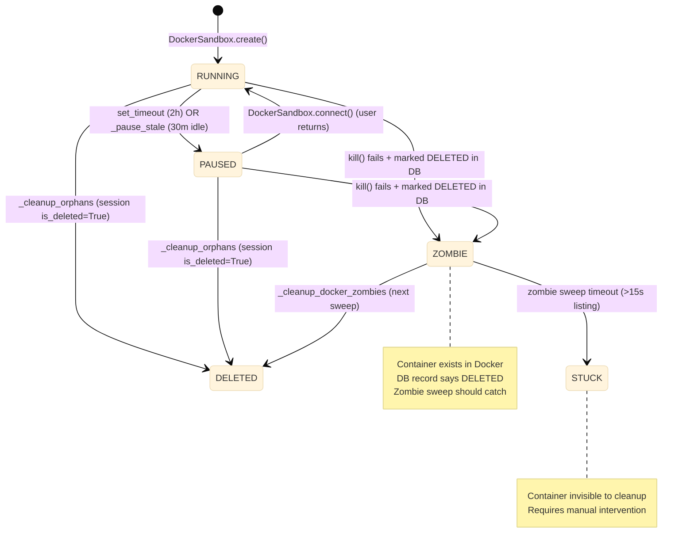
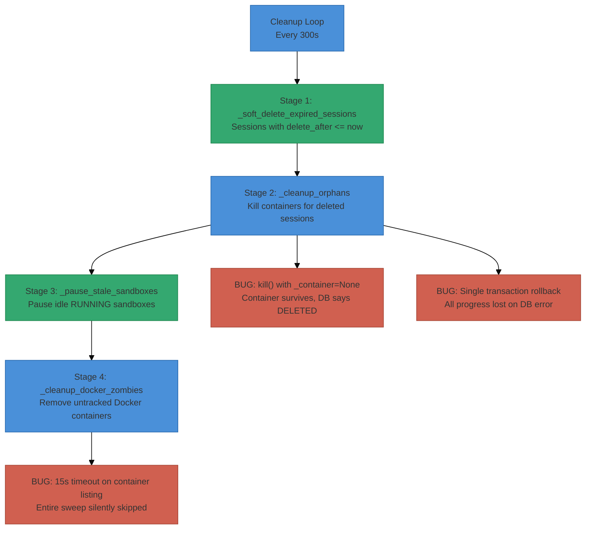

# Root Cause Analysis: Docker Sandbox Container Accumulation (253+)

**Date:** 2026-04-16
**Status:** Resolved — all P0–P2 fixes implemented (R1–R9)
**Severity:** Critical — resource exhaustion risk

> **Note:** This document describes the **pre-fix** buggy behavior discovered on
> 2026-04-16.  All findings have been addressed by the R1–R9 fixes in
> [sandbox-lifecycle-assessment.md](sandbox-lifecycle-assessment.md).  Code
> snippets and line numbers below reflect the original broken code; see the
> Evidence Index for current (post-fix) locations.

---

## Executive Summary

Investigation identified **6 root causes** and **3 contributing factors** that explain why 253+ Docker sandbox containers (97 paused) accumulated despite session deletion. The primary root cause is a **database FK discrepancy** between the ORM model and the actual migration that created `agent_sandboxes`, combined with **multiple silent failure paths** in the cleanup pipeline that allow containers to survive indefinitely.

---

## Investigation Findings

### Finding 1: No Foreign Key Constraint in Database (CRITICAL)

The ORM model declares a CASCADE FK:

```python
# src/ii_agent/agents/sandboxes/models.py L20-23
session_id: Mapped[uuid.UUID] = mapped_column(
    UUID(as_uuid=True),
    ForeignKey("sessions.id", ondelete="CASCADE"),
    index=True,
)
```

But the **actual migration** that created the table has **no FK at all**:

```python
# migrations/versions/20260330_000000_initial_schema_consolidated.py L325-327
# No FK to sessions — sandbox lifecycle managed by app; use index for lookups
sa.Column("session_id", UUID(as_uuid=True), nullable=False),
```

**Impact:** The `ondelete="CASCADE"` is a lie. If sessions were ever hard-deleted at the database level (e.g., via psql or bulk cleanup), sandbox records would be **orphaned silently** — the `agent_sandboxes` rows would remain with dangling `session_id` values pointing to non-existent sessions. The cleanup pipeline's `_cleanup_orphans()` handles this case (treats missing sessions as orphaned), but `_cleanup_docker_zombies()` relies on DB records existing to match against container IDs.

### Finding 2: `_cleanup_orphans` — Kill Failure Doesn't Prevent DELETED Status (ROOT CAUSE)

In orphan_cleanup.py (pre-fix L177–214, now refactored at L169–295 by R1+R2), when the container lookup times out, `_container` is set to `None`:

```python
try:
    docker_sandbox._container = await asyncio.wait_for(
        asyncio.to_thread(client.containers.get, sandbox.provider_sandbox_id),
        timeout=10,
    )
except (asyncio.TimeoutError, Exception):
    docker_sandbox._container = None  # Container lookup failed
```

Then `kill()` is called, but with `_container = None`, the kill() method (pre-fix L504–527, now at [L548](src/ii_agent/agents/sandboxes/docker.py#L548)) skips the actual `container.remove()`:

```python
async def kill(self) -> bool:
    try:
        if self._container:       # <-- False when _container is None!
            self._container.remove(force=True)
    finally:
        port_manager.release_ports(self.sandbox_id)  # Ports released
        _cleanup_sandbox_volume(client, self.sandbox_id)  # Volume cleaned
    return True  # Returns success despite NOT removing container
```

**Then the sandbox is unconditionally marked DELETED:**

```python
# Back in _cleanup_orphans, after the kill attempt:
sandbox.status = SandboxStatus.DELETED  # Marked deleted even though container still exists!
await db.flush()
cleaned += 1
```

**Impact:** The Docker container survives, but the DB record says DELETED. The `_cleanup_orphans` stage will **never revisit this sandbox** (it filters `status != DELETED`). The zombie sweep should catch it — but see Finding 4.

### Finding 3: Single-Transaction Cleanup Can Roll Back All Progress (ROOT CAUSE)

The entire `_cleanup_orphans()` function runs inside a **single database session**:

```python
async with get_db_session_local() as db:
    # Fetch all sandboxes (could be 100+)
    sandboxes = result.scalars().all()
    
    for sandbox in sandboxes:
        # Each kill() can take up to 30 seconds
        await asyncio.wait_for(docker_sandbox.kill(), timeout=30)
        sandbox.status = SandboxStatus.DELETED
        await db.flush()          # Flushed but NOT committed
    
    await db.commit()              # Single commit for ALL changes
```

With 253 containers at up to 30 seconds each, the DB session could be open for **2+ hours**. If the DB connection drops, times out, or the commit fails:
- **All status updates are rolled back** — sandboxes revert to their previous status
- **But Docker containers may already be killed** — creating a mismatch
- Or conversely, **Docker operations may have partially failed** — but the rollback means they'll be retried next sweep, which is fine... except the next sweep also runs in a single transaction

**Impact:** A single DB error during a large sweep can lose all progress, requiring the entire sweep to be redone.

### Finding 4: Zombie Sweep ID Matching Is Correct But Has Timeout Risks

The zombie sweep in `_cleanup_docker_zombies()` at [orphan_cleanup.py L376](src/ii_agent/agents/sandboxes/orphan_cleanup.py#L376) uses correct ID matching:
- `container_map` keys: `container.id` (full 64-char Docker SHA)
- `active_ids`: `AgentSandbox.provider_sandbox_id` (also full 64-char ID, set from `container.id` at [docker.py L362](src/ii_agent/agents/sandboxes/docker.py#L362))

**However**, the listing has a 15-second timeout:

```python
containers = await asyncio.wait_for(
    asyncio.to_thread(client.containers.list, all=True,
        filters={"label": "ii-agent.sandbox=true"}),
    timeout=15,
)
```

With 253+ containers, Docker label filtering could exceed 15 seconds, causing the **entire zombie sweep to silently skip**:

```python
except asyncio.TimeoutError:
    logger.debug("Timeout listing Docker containers for zombie sweep")
    return 0  # Silent failure — logged at DEBUG level only
```

**Impact:** If Docker is slow (high container count, disk pressure), zombie cleanup silently stops working, and the only indication is a DEBUG-level log message that likely won't appear in production logs.

### Finding 5: Cleanup Interval Is 300 Seconds (5 Minutes)

Set in [docker-compose.local.yaml L124](docker/docker-compose.local.yaml#L124):

```yaml
SANDBOX_ORPHAN_CLEANUP_INTERVAL_SECONDS: "300"
```

The loop sleeps **before** the first sweep:

```python
while True:
    await asyncio.sleep(interval)   # <-- 5 minutes before FIRST cleanup
    expired = await _soft_delete_expired_sessions()
    cleaned = await _cleanup_orphans(cfg)
    ...
```

**Impact:** After server restart, no cleanup happens for 5 minutes. During rapid E2E test execution, containers accumulate in the gap.

### Finding 6: `set_timeout` Task Is In-Memory — Lost on Server Restart (ROOT CAUSE)

In docker.py (pre-fix L494–503, now at [L509](src/ii_agent/agents/sandboxes/docker.py#L509) with persistent `timeout_at` backing):

```python
async def set_timeout(self, timeout_seconds: int) -> None:
    async def _timeout_handler():
        await asyncio.sleep(timeout_seconds)  # 7200s = 2 hours
        await self.pause()
    self._timeout_task = asyncio.create_task(_timeout_handler())
```

This asyncio task lives in the backend process memory. When the backend restarts (common during development, deploys, or crashes), **all timeout tasks are lost**. Containers that were supposed to be auto-paused after 2 hours continue running indefinitely.

The `_pause_stale_sandboxes` stage serves as a backup (pauses after 30 min idle), but it only works while the cleanup loop is running.

**Impact:** Backend restarts during active sessions create containers that may never be auto-paused if the session remains technically "active" (updated_at keeps getting refreshed).

---

## Contributing Factors

### Factor A: `_soft_delete_expired_sessions` vs Frontend Deletion

Two distinct deletion paths exist:

| Path | Mechanism | When `is_deleted` is set |
|------|-----------|--------------------------|
| Frontend DELETE | `DELETE /sessions/{id}` → `soft_delete_session()` | **Immediately** |
| Scheduled delete | `POST /sessions/{id}/schedule-delete` → `delete_after=future` | **When `delete_after` passes** (up to 24 hours later) |

The frontend `deleteSession` thunk calls `DELETE /sessions/${sessionId}` ([session.api.ts L78-84](frontend/src/state/api/session.api.ts#L78-L84)), which is the immediate path. But E2E tests that set `delete_after` 24 hours in the future create containers that **accumulate for 24 hours** before cleanup can touch them.

During those 24 hours:
- After 30 min idle → paused by `_pause_stale_sandboxes` (container still exists, status=PAUSED)
- After 24 hours → `_soft_delete_expired_sessions` sets `is_deleted=True` → next sweep cleans up

**This explains the 97 paused containers from April 16** — they are likely containers whose sessions have `delete_after` set in the future but haven't passed yet.

### Factor B: Exception Logging at Wrong Severity

Multiple silent failure paths log at `DEBUG` or `WARNING` instead of `ERROR`:

| Location | Failure | Log Level |
|----------|---------|-----------|
| `_cleanup_docker_zombies` — container list timeout | Entire zombie sweep skipped | `DEBUG` |
| `_cleanup_docker_zombies` — DB query failure | Entire zombie sweep skipped | `WARNING` |
| `_cleanup_orphans` — individual container kill | Container survives | `WARNING` |
| Main loop exception handler | Entire sweep fails | `exception` (correct) |

**Impact:** Operators cannot detect cleanup failures from standard log monitoring.

### Factor C: No Cleanup Metrics or Health Checks

There is no way to detect that cleanup is falling behind:
- No metric for "containers awaiting cleanup"
- No metric for "cleanup sweep duration"
- No health check that validates cleanup is running
- No alerting on cleanup failures

---

## Container Lifecycle Diagram



---

## Cleanup Pipeline Data Flow



---

## Quantitative Impact Assessment

| Scenario | Containers affected | Root cause |
|----------|-------------------|------------|
| Sessions with `delete_after` 24h in future | Up to 24h worth of sessions | Factor A |
| Container kill timeout (10s lookup + 30s kill) | Every failed kill | Finding 2 |
| Zombie sweep timeout (253+ containers) | ALL zombies in sweep | Finding 4 |
| Backend restart during active sessions | All running containers | Finding 6 |
| DB connection timeout during large sweep | All containers in that sweep | Finding 3 |

---

## Recommended Fixes (Priority Order)

### P0 — Fix `kill()` to handle `_container=None`

When `_container` is `None`, `kill()` should attempt removal by ID:

```python
async def kill(self) -> bool:
    client = self._get_docker_client()
    try:
        if self._container:
            self._container.remove(force=True)
        elif self.provider_sandbox_id:
            # Fallback: remove by ID when _container is None
            try:
                c = client.containers.get(self.provider_sandbox_id)
                c.remove(force=True)
            except NotFound:
                pass
    ...
```

### P0 — Commit per-sandbox in `_cleanup_orphans`

Replace single-transaction with per-item commits:

```python
for sandbox in sandboxes:
    async with get_db_session_local() as db:
        # ... kill container ...
        sandbox_record = await db.get(AgentSandbox, sandbox.id)
        sandbox_record.status = SandboxStatus.DELETED
        await db.commit()
```

### P1 — Increase zombie sweep timeout

Increase from 15s to 60s, or paginate the container listing:

```python
containers = await asyncio.wait_for(
    asyncio.to_thread(client.containers.list, all=True,
        filters={"label": "ii-agent.sandbox=true"}),
    timeout=60,  # Was 15
)
```

### P1 — Add FK constraint via migration

```python
op.create_foreign_key(
    "fk_agent_sandboxes_session_id",
    "agent_sandboxes", "sessions",
    ["session_id"], ["id"],
    ondelete="SET NULL",  # SET NULL, not CASCADE — let cleanup handle it
)
```

### P2 — Run first cleanup immediately on startup

```python
while True:
    try:
        # Run cleanup immediately, then sleep
        expired = await _soft_delete_expired_sessions()
        cleaned = await _cleanup_orphans(cfg)
        ...
    except ...:
        ...
    await asyncio.sleep(interval)  # Sleep AFTER cleanup
```

### P2 — Elevate failure log levels

Change zombie sweep timeout and DB failure logs from `DEBUG`/`WARNING` to `ERROR`.

### P3 — Add cleanup observability

Emit metrics for: sweep duration, containers cleaned per sweep, containers remaining, zombie sweep success/failure.

---

## Evidence Index

> Line numbers updated 2026-04-17 to reflect post-fix code.

| File | Current Lines | Finding | Fix |
|------|---------------|---------|-----|
| [orphan_cleanup.py](src/ii_agent/agents/sandboxes/orphan_cleanup.py#L169-L295) | 169-295 | `_cleanup_orphans` (was single-tx + unconditional DELETED) | R1+R2 |
| [orphan_cleanup.py](src/ii_agent/agents/sandboxes/orphan_cleanup.py#L376) | 376-491 | `_cleanup_docker_zombies` (was 15s timeout) | R4: 120s |
| [orphan_cleanup.py](src/ii_agent/agents/sandboxes/orphan_cleanup.py#L60) | 60-83 | `run_orphan_cleanup_loop` (was sleep-first) | R5: cleanup-first |
| [orphan_cleanup.py](src/ii_agent/agents/sandboxes/orphan_cleanup.py#L583) | 583-680 | `_kill_timed_out_sandboxes` | R6: new stage |
| [orphan_cleanup.py](src/ii_agent/agents/sandboxes/orphan_cleanup.py#L493) | 493-581 | `_cleanup_orphaned_volumes` | R9: new stage |
| [docker.py](src/ii_agent/agents/sandboxes/docker.py#L548) | 548-600 | `kill()` method | R1: conditional DELETED |
| [docker.py](src/ii_agent/agents/sandboxes/docker.py#L509) | 509-545 | `set_timeout()` — in-memory + persistent `timeout_at` | R6 |
| [docker.py](src/ii_agent/agents/sandboxes/docker.py#L290-L295) | 290-295 | Labels correctly set | — |
| [docker.py](src/ii_agent/agents/sandboxes/docker.py#L362) | 362 | `provider_sandbox_id = container.id` (full 64-char) | — |
| [models.py](src/ii_agent/agents/sandboxes/models.py#L20-L23) | 20-23 | ORM FK declaration | — |
| [migration (FK fix)](migrations/versions/20260416_000005_sandbox_timeout_and_fk.py) | — | FK constraint + `timeout_at` column | R3+R6 |
| [migration (original)](migrations/versions/20260330_000000_initial_schema_consolidated.py#L325-L327) | 325-327 | No FK in original DB | — |
| [session.api.ts](frontend/src/state/api/session.api.ts#L78-L84) | 78-84 | Frontend DELETE call |
| [service.py](src/ii_agent/sessions/service.py#L212-L237) | 212-237 | `soft_delete_session()` |
| [lifespan.py](src/ii_agent/app/lifespan.py#L191-L210) | 191-210 | Cleanup startup path |
