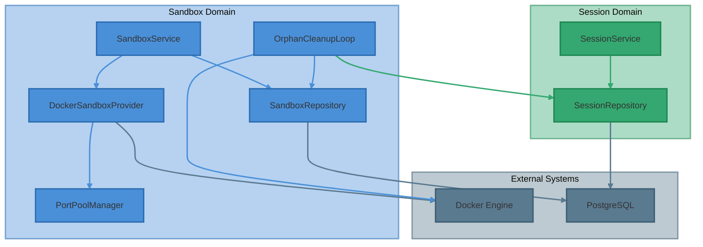
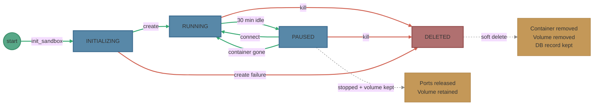
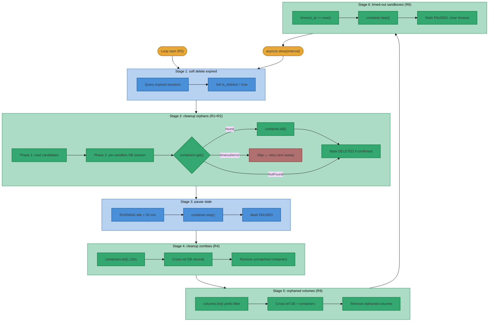
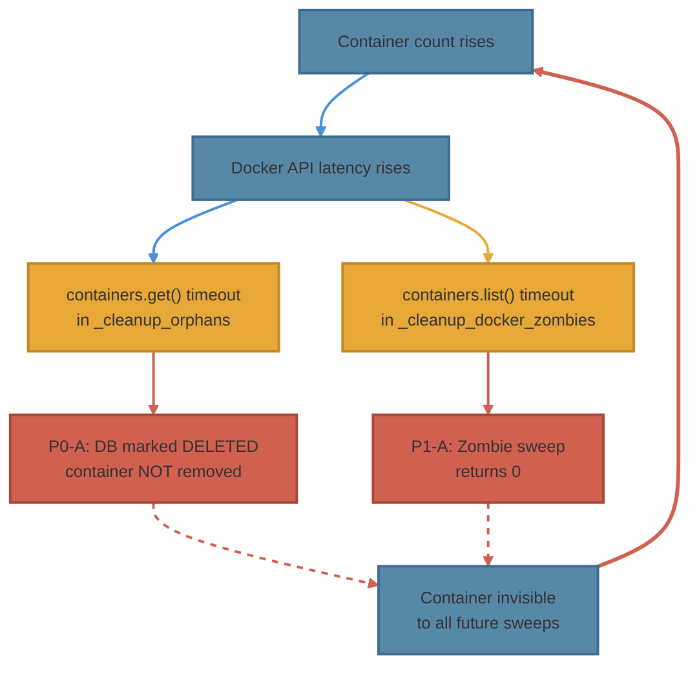

# Sandbox Lifecycle Architecture Assessment

**Date:** 2026-04-16
**Scope:** Sandbox pruning, reaping, and resource management
**Status:** Implemented — all 9 recommendations applied, 42 unit tests passing

---

## Table of Contents

1. [Executive Summary](#executive-summary)
2. [Architecture Overview](#architecture-overview)
3. [Lifecycle State Machine](#lifecycle-state-machine)
4. [Cleanup Pipeline](#cleanup-pipeline)
5. [Bug Inventory](#bug-inventory)
6. [Resource Exhaustion Analysis](#resource-exhaustion-analysis)
7. [Feedback Loop Vulnerability](#feedback-loop-vulnerability)
8. [Recommendations](#recommendations)

---

## Executive Summary

The sandbox lifecycle system has **six bugs** (2× P0, 2× P1, 2× P2) that together create a
**positive feedback loop**: as container count grows, Docker API calls slow down, causing cleanup
timeouts, which cause the cleanup loop to skip containers, which causes more accumulation.

On April 13, the system hit **256 concurrent sandbox containers** against a theoretical maximum
of **142** (port pool limited). Peak concurrent port demand was **1,792** from a **1,000-port pool**.
Peak theoretical memory reservation was **768 GB**. The Docker daemon became unresponsive under this
load.

Two distinct usage patterns interact poorly:

| Pattern | Session lifecycle | Sandbox expectation | Volume/day |
|---------|------------------|---------------------|------------|
| **E2E tests** | `delete_after = now + 24h` | Deleted with session | 100–490 sessions |
| **Human sessions** | Persist indefinitely | Persist indefinitely | 2–37 sessions |

The core invariant — **a sandbox must persist as long as its session exists** — is violated by the
P0 bug that marks sandbox DB records as `DELETED` even when the Docker container is never removed.

---

## Architecture Overview

### Resource Budget (Per Sandbox)

| Resource | Allocation | Source |
|----------|-----------|--------|
| Memory | 3 GB (`mem_limit`) | [docker.py](../../src/ii_agent/agents/sandboxes/docker.py#L330) |
| CPU | 2 cores (`nano_cpus`) | [docker.py](../../src/ii_agent/agents/sandboxes/docker.py#L331) |
| PIDs | 512 (`pids_limit`) | [docker.py](../../src/ii_agent/agents/sandboxes/docker.py#L333) |
| Shared memory | 512 MB (`shm_size`) | [docker.py](../../src/ii_agent/agents/sandboxes/docker.py#L329) |
| Ports | 7 (host-mapped) | [docker.py](../../src/ii_agent/agents/sandboxes/docker.py#L287-L288) |
| Volume | 1 named volume (`ii-sandbox-workspace-{id}`) | [docker.py](../../src/ii_agent/agents/sandboxes/docker.py#L306) |

### Hard Limits

| Resource | Pool size | Max sandboxes | Source |
|----------|-----------|---------------|--------|
| Port range | 30000–30999 (1,000 ports) | **142** | [sandbox.py](../../src/ii_agent/core/config/sandbox.py#L38-L43) |

---

## Lifecycle State Machine

### Key Transitions

| Transition | Trigger | Code path |
|-----------|---------|-----------|
| → INITIALIZING | User opens session | [service.py](../../src/ii_agent/agents/sandboxes/service.py#L66) `init_sandbox()` |
| INITIALIZING → RUNNING | Container created | [docker.py](../../src/ii_agent/agents/sandboxes/docker.py#L230) `create()` |
| RUNNING → PAUSED | 30 min idle | [orphan_cleanup.py](../../src/ii_agent/agents/sandboxes/orphan_cleanup.py#L299) `_pause_stale_sandboxes()` |
| PAUSED → RUNNING | User returns | [docker.py](../../src/ii_agent/agents/sandboxes/docker.py#L418) `connect()` |
| ANY → DELETED | Session deleted | [orphan_cleanup.py](../../src/ii_agent/agents/sandboxes/orphan_cleanup.py#L169) `_cleanup_orphans()` |
| PAUSED → new RUNNING | Container gone, user returns | [service.py](../../src/ii_agent/agents/sandboxes/service.py#L105) auto-recreation |

### In-Memory Timeout (Design Flaw — see P2-B)

`set_timeout()` creates an `asyncio.create_task()` that sleeps for `timeout_seconds` (default 2h),
then calls `kill()`. This task exists **only in the Python process memory** and is lost on any
backend restart. There is no persistent scheduler or database-backed timeout.

Source: [docker.py](../../src/ii_agent/agents/sandboxes/docker.py#L509-L545)

---

## Cleanup Pipeline

The cleanup loop runs every 60 seconds (configurable) with 6 stages executed sequentially.
R5 moved the sleep to the end of the loop body so the first sweep runs immediately on startup.

### Stage 2: The Critical Failure Path (P0-A) — FIXED (R1+R2)

The original code caught `containers.get()` timeouts, set `_container = None`, and unconditionally
marked the DB record as `DELETED`. **R1 fix:** status is now only updated to `DELETED` after
container removal is confirmed (either `kill()` succeeds or `NotFound` from `containers.get()`).
On timeout or error, the sandbox is skipped and retried next sweep. **R2 fix:** each sandbox gets
its own DB session, so a failure on one sandbox doesn't roll back others.

### Stage 4: The Safety Net (P1-A) — FIXED (R4)

Stage 4 catches Docker containers with no DB record (zombies). The `containers.list()` timeout
has been increased from 15 seconds to **120 seconds** (R4). This is acceptable for a background
cleanup loop and handles the degraded Docker API performance under high container counts.

---

## Bug Inventory

### P0-A: Premature DELETED Marking (Data Integrity)

**Location:** [orphan_cleanup.py](../../src/ii_agent/agents/sandboxes/orphan_cleanup.py#L169-L295)

**Symptom:** Sandbox DB records are marked `DELETED` even when the Docker container was never
removed. The container becomes permanently invisible to all future cleanup sweeps.

**Mechanism:**
1. `containers.get()` times out (Docker daemon is slow under load)
2. Exception caught, `_container` set to `None`
3. `kill()` called — but `if self._container:` guard skips `container.remove()`
4. `finally` block executes `update_status(DELETED)` unconditionally

**Evidence:** 243 of 576 sandbox DB records were marked `DELETED` before their sessions were deleted.

**Impact:** Creates orphaned Docker containers invisible to all cleanup stages. This is the primary
cause of the container accumulation incident.

---

### P0-B: Single-Transaction Cleanup (Partial Failure Amplification)

**Location:** [orphan_cleanup.py](../../src/ii_agent/agents/sandboxes/orphan_cleanup.py#L91-L165)

**Symptom:** If any single sandbox cleanup fails with an unhandled exception inside the
`async with get_db_session_local()` block, the entire transaction rolls back, undoing the DB
updates for ALL sandboxes processed in that iteration.

**Mechanism:** All sandbox cleanups in a single sweep share one database session. An error
cleaning sandbox N rolls back the `DELETED` status for sandboxes 1 through N-1 that were
successfully cleaned.

**Impact:** Correct cleanups are reverted, causing those sandboxes to be reprocessed next cycle,
potentially triggering the same failure again.

---

### P1-A: Zombie Sweep Timeout (Safety Net Failure)

**Location:** [orphan_cleanup.py](../../src/ii_agent/agents/sandboxes/orphan_cleanup.py#L376)

**Symptom:** `_cleanup_docker_zombies` silently returns 0 when Docker has many containers,
because `containers.list()` with `label` filter times out at 15 seconds.

**Mechanism:** The Docker daemon's container listing performance degrades linearly with container
count. At 250+ containers, a filtered list operation exceeds 15 seconds.

**Impact:** The safety net designed to catch orphaned containers stops working precisely when it's
needed most — under high container load.

---

### P1-B: Missing Foreign Key Cascade (Phantom Invariant)

**Location:** [models.py](../../src/ii_agent/agents/sandboxes/models.py#L22) vs
[migration](../../migrations/versions/) (initial schema)

**Symptom:** The SQLAlchemy model declares `ForeignKey("sessions.id", ondelete="CASCADE")` but
the actual migration **does not create this FK constraint**. The migration comment explicitly says
"No FK to sessions."

**Mechanism:** The ORM declaration is a lie — the database has no FK, so `CASCADE` never fires.
Session deletion does not automatically cascade to sandbox records.

**Impact:** The application is entirely dependent on the cleanup loop (Stage 2) for sandbox
cleanup. If Stage 2 fails (P0-A), there is no database-level safety net.

---

### P2-A: Sleep-First Loop (Delayed First Cleanup)

**Location:** [orphan_cleanup.py](../../src/ii_agent/agents/sandboxes/orphan_cleanup.py#L60)

**Symptom:** The cleanup loop calls `await asyncio.sleep(interval)` **before** the first cleanup
run. On startup with a 60-second interval, there is a guaranteed 60-second window where no
cleanup occurs.

**Impact:** After a restart, expired sessions and orphaned sandboxes accumulate for at least one
full interval before the first sweep. In a restart-heavy development scenario this is 5 minutes
(the default interval was recently changed to 60s but was previously 300s on some configs).

---

### P2-B: In-Memory Timeout Tasks (Lost on Restart)

**Location:** [docker.py](../../src/ii_agent/agents/sandboxes/docker.py#L509-L545)

**Symptom:** `set_timeout()` creates an `asyncio.Task` that sleeps for `timeout_seconds` (2h
default) then calls `kill()`. These tasks exist only in Python process memory and are lost on
backend restart.

**Mechanism:** After a restart, all running containers lose their timeout — they will run
indefinitely until the stale-pause threshold (30 min idle) triggers Stage 3.

**Impact:** Containers that should auto-terminate after 2 hours instead stay alive until they
become "stale" (30 min idle). If a user keeps a tab open but idle, the sandbox stays RUNNING
indefinitely, never triggering the stale-pause check (which looks at `updated_at`).

---

## Resource Exhaustion Analysis

### Observed Peak (April 13, 2026)

| Metric | Value | Limit | Utilization |
|--------|-------|-------|-------------|
| Concurrent sandbox DB records | 256 | — | — |
| Port demand (256 × 7) | 1,792 | 1,000 | **179%** |
| Memory reservation (256 × 3 GB) | 768 GB | System RAM | **Overcommit** |
| Docker containers (paused + running) | 253+ | Daemon stability | **Degraded** |

### Session Creation Rates (Last 6 Days with E2E)

| Date | Sessions | E2E (timed) | Human | Sandboxes | Peak concurrent |
|------|----------|-------------|-------|-----------|-----------------|
| Apr 16 | 192 | 190 | 2 | 84 | 85 |
| Apr 15 | 145 | 143 | 2 | 22 | 2 |
| Apr 14 | 109 | 107 | 2 | 51 | 6 |
| **Apr 13** | **492** | **476** | **16** | **209** | **220** |
| Apr 12 | 189 | 168 | 21 | 100 | 88 |
| Apr 11 | 37 | 0 | 37 | 35 | 16 |

### Resource Exhaustion Scenarios

#### Scenario 1: Port Pool Exhaustion

With 1,000 ports and 7 ports per sandbox, the hard ceiling is **142 concurrent sandboxes**.
E2E tests creating 100–490 sessions/day with 24-hour timed deletion means up to 24 hours of
accumulated sandboxes compete for 142 port slots.

**Threshold:** >142 concurrent sandboxes requesting ports → `create()` fails.

**Observed:** 220 concurrent sandboxes on April 13. Port pool was exhausted. Paused containers
release ports, but if new sandboxes are created faster than old ones are paused (30 min idle),
the pool overflows.

#### Scenario 2: Docker Daemon Degradation

Docker's API latency scales with container count. At 250+ containers:
- `containers.get()` and `containers.list()` exceed 15-second timeouts
- Container start/stop operations take 10–30 seconds
- `dockerd` restore on restart takes 6+ minutes

This creates the feedback loop described in the next section.

#### Scenario 3: Memory Pressure

256 containers × 3 GB = 768 GB memory reservation. Docker uses cgroups `mem_limit` but the
kernel OOM killer activates when physical memory is exhausted. On a typical 16–64 GB dev machine,
the OOM killer terminates containers (or processes within them) unpredictably.

Paused (stopped) containers do not consume runtime memory but their cgroups reservations persist.

#### Scenario 4: Volume Accumulation

Each sandbox gets a named Docker volume (`ii-sandbox-workspace-{sandbox_id}`). If `kill()` fails
to remove the container, the volume persists. With the P0-A bug marking DB records as DELETED
without removing containers, the corresponding `docker volume rm` in `kill()` also never runs.

Orphaned volumes accumulate without any cleanup mechanism.

#### Scenario 5: Human Session Sandbox Growth

Human sessions persist indefinitely. Each active human session eventually gets a paused sandbox.
Over weeks/months of use:
- 10 active human sessions → 10 paused containers + 10 volumes (manageable)
- 100 active human sessions → 100 paused containers + 100 volumes (consumes port pool when
  users return and containers unpause simultaneously)

This scenario is manageable at current human session rates (2–37/day) but scales linearly.

---

## Feedback Loop Vulnerability

The P0-A bug creates a positive feedback loop that amplifies container accumulation:

**Loop mechanics:**

1. E2E tests create N sandbox containers
2. After 24h, sessions expire → Stage 1 marks them deleted
3. Stage 2 tries to clean up sandboxes, but Docker is slow → some `containers.get()` calls time out
4. P0-A marks those DB records DELETED without removing containers → **orphaned containers**
5. Next cycle: more containers → Docker slower → more timeouts → more orphans
6. Stage 4 (zombie safety net) also times out → no recovery

The loop continues until Docker becomes completely unresponsive.

---

## Recommendations

### Priority: P0 (Must Fix)

**R1. Atomic cleanup — never mark DELETED unless container removal succeeds.**

Change the `_cleanup_orphans` logic so that `update_status(DELETED)` only runs after
`container.remove()` completes successfully. If `containers.get()` times out, leave the sandbox
record in its current state and retry on the next sweep.

**R2. Per-sandbox error isolation.**

Wrap each individual sandbox cleanup in its own try/except with a separate `db.commit()` or use
savepoints. A failure cleaning sandbox N must not roll back sandboxes 1 through N-1.

### Priority: P1 (Should Fix)

**R3. Create the FK constraint in a migration.**

Add an Alembic migration that creates the actual `FOREIGN KEY (session_id) REFERENCES sessions(id)
ON DELETE CASCADE` (or `SET NULL`). This provides a database-level safety net if the application
cleanup fails.

**R4. Increase or remove the zombie sweep timeout.**

Either increase the `containers.list()` timeout to 120 seconds (acceptable for a background loop)
or paginate the Docker API call. Alternatively, use Docker labels to filter the list server-side
(already done — just needs a longer timeout).

### Priority: P2 (Should Address)

**R5. Run cleanup immediately on startup.**

Move `await asyncio.sleep(interval)` to the end of the loop body, or run one cleanup sweep before
entering the loop.

**R6. Replace in-memory timeout with persistent mechanism.**

Store timeout deadlines in the `agent_sandboxes` table (e.g., `timeout_at` column). The cleanup
loop can include a stage that kills sandboxes where `timeout_at < now()`.

### Resource Protection

**R7. Port pool overflow protection.**

Add a guard in `create()` that checks port availability before attempting container creation.
Return a clear "capacity exhausted" error rather than failing mid-creation.

**R8. Concurrent sandbox cap.**

Add a configurable maximum concurrent sandbox count. Reject new sandbox creation when the cap is
reached. This prevents Docker daemon degradation regardless of the cleanup loop's health.

**R9. Orphaned volume cleanup.**

Add a Stage 5 to the cleanup loop: `docker volume ls --filter label=ii-agent.sandbox=true` and
remove volumes with no matching active sandbox record.

---

## Summary of Bugs and Recommendations

| Bug | Severity | Fix | Recommendation | Status |
|-----|----------|-----|---------------|--------|
| P0-A: Premature DELETED marking | P0 | Conditional status update | R1 | **Implemented** |
| P0-B: Single-transaction rollback | P0 | Per-sandbox isolation | R2 | **Implemented** |
| P1-A: Zombie sweep timeout | P1 | Increase timeout | R4 | **Implemented** |
| P1-B: Missing FK cascade | P1 | Add migration | R3 | **Implemented** |
| P2-A: Sleep-first loop | P2 | Move sleep to end | R5 | **Implemented** |
| P2-B: In-memory timeouts | P2 | Persistent timeout column | R6 | **Implemented** |
| — | Defense | Port pool guard | R7 | **Implemented** |
| — | Defense | Concurrent sandbox cap | R8 | **Implemented** |
| — | Defense | Orphaned volume cleanup | R9 | **Implemented** |

### Implementation Details

| Rec | Files Changed | Migration | Tests |
|-----|---------------|-----------|-------|
| R1 | [orphan_cleanup.py](../../src/ii_agent/agents/sandboxes/orphan_cleanup.py) | — | `TestCleanupOrphansR1ConditionalDelete` (3 tests) |
| R2 | [orphan_cleanup.py](../../src/ii_agent/agents/sandboxes/orphan_cleanup.py) | — | `TestCleanupOrphansR2Isolation` (1 test) |
| R3 | [models.py](../../src/ii_agent/agents/sandboxes/models.py) | [20260416_000005](../../migrations/versions/20260416_000005_sandbox_timeout_and_fk.py) | — |
| R4 | [orphan_cleanup.py](../../src/ii_agent/agents/sandboxes/orphan_cleanup.py) | — | `TestCleanupDockerZombiesR4Timeout` (1 test) |
| R5 | [orphan_cleanup.py](../../src/ii_agent/agents/sandboxes/orphan_cleanup.py) | — | `TestRunOrphanCleanupLoop` (3 tests) |
| R6 | [docker.py](../../src/ii_agent/agents/sandboxes/docker.py), [models.py](../../src/ii_agent/agents/sandboxes/models.py) | [20260416_000005](../../migrations/versions/20260416_000005_sandbox_timeout_and_fk.py) | `TestKillTimedOutSandboxes` (3 tests) |
| R7 | [docker.py](../../src/ii_agent/agents/sandboxes/docker.py) | — | Via `TestCreate` (existing) |
| R8 | [docker.py](../../src/ii_agent/agents/sandboxes/docker.py), [sandbox.py](../../src/ii_agent/core/config/sandbox.py) | — | Via `TestCreate` (existing) |
| R9 | [orphan_cleanup.py](../../src/ii_agent/agents/sandboxes/orphan_cleanup.py) | — | `TestCleanupOrphanedVolumes` (5 tests) |
