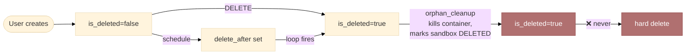
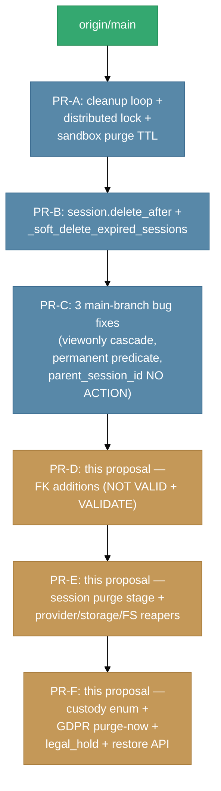

# Session Lifecycle & Data Custody — Design Proposal

**Status:** PROPOSAL v3.1 — ready for core-design review
**Date:** 2026-04-25 (v3.1: explicit engagement with main's documented FK strategy)
**Author:** GitHub Copilot (audit + proposal)
**Scope:** Sessions and **all collateral resources** — PostgreSQL rows, object-storage blobs, Docker containers/volumes, OpenAI provider artifacts, on-disk workspaces, Redis state — across both cloud (E2B) and local (Docker) sandbox providers, and both native and A2A+native-fallback inner-loop modes.

**Changelog vs v3:**
- v3.1 added: §0.1 — direct engagement with the documented FK-avoidance strategy in `main`'s `database-design.md`. This is the most important addition for core-team defence: the proposal is openly modifying a documented decision, not silently overriding it. The original cascade-lock-storm concern was about *user-row deletion at scale* (out of scope here); the periodic-cleanup mechanism Review Item #3 explicitly anticipates is what §4.1 builds.
- v3.1 added: §4.1 lock-storm engagement subsection — table mapping each documented concern to its mitigation in this proposal.
- v3.1 added: doc-drift note recommending `database-design.md` be updated as part of PR-D.

**Changelog vs v2:**
- v3 added: §0 Branch context — explicit map of what is on `origin/main`, what is already on this topic branch, and what this proposal adds on top. Critical for honest core-team review because v2 cited topic-branch-only files as if they were the existing baseline.
- v3 refined: "structurally unsatisfiable" claim on `status='permanent'` — accurate observation is "satisfiable via direct assignment (column is `String`, not native PG enum) but no production code path writes it." Test fixture on main does write it; production never does.
- v3 added: §12 Sequencing & dependency-on-topic-branch infrastructure.

**Changelog vs v1:**
- v2 added: resource model beyond the FK graph (§1.5), provider-side cleanup (§4.5), storage reaper (§4.6), GDPR purge-now path (§4.7), `legal_hold` audit (§4.8), `NOT VALID` migration pattern (§5), one-session-per-tx purge (§4.1), cached orphan metrics (§6), ORM-vs-FK cascade verification table (§9), public-link UX consideration (§7).
- v2 reversed: `application_events` now SET NULL (was CASCADE) on billing-forensics grounds.
- v2 simplified: custody enum collapsed from 4 → 3 values (`archived` belongs in UI, not data model).
- v2 corrected: `Session.events` already declares `cascade="all, delete-orphan"` but with `viewonly=True`, which silently disables it. Frame the FK addition as making an existing inert declaration real.

---

## 0. Branch context — what's where

**This proposal cannot be assessed honestly without first making explicit which of its findings exist on `origin/main` and which exist only on the `feature/a2a-chat-inner-loop_3_of_3` topic branch this document was written from.**

### Verified against `origin/main` @ `0e57985d`

| Artefact | On main? | On this topic branch? | Notes |
|---|---|---|---|
| `Session.is_deleted` Boolean | ✅ | ✅ | Soft-delete flag |
| `Session.delete_after` TIMESTAMPTZ | ❌ | ✅ | Added in branch migration `20260412_000004` |
| `Session.events` `viewonly=True` cascade trap | ✅ | ✅ | Bug present on main — finding holds upstream |
| `SessionState` enum (`PENDING`/`ACTIVE`/`PAUSE`, no `PERMANENT`) | ✅ | ✅ | Identical enum on both |
| `extend_sandbox_timeout.py` with `Session.status == "permanent"` predicate | ✅ | ✅ | Bug ships from main; `status` is `String` so writeable in tests but no production write path exists |
| 10/19 unconstrained `session_id` columns (the FK gap) | ✅ | ✅ | Bug present on main — finding holds upstream |
| `agent_sandboxes._purge_stale_deleted_rows` precedent | ❌ | ✅ | Added in branch — the "template to mirror" cited in v1/v2 §4.1 |
| `agents/sandboxes/orphan_cleanup.py` (cleanup loop, distributed lock, 6-stage sweep) | ❌ | ✅ | 1327 lines, entirely new on this branch |
| `_soft_delete_expired_sessions` stage that fires on `delete_after` | ❌ | ✅ | Implemented in branch's `orphan_cleanup.py` |
| `agent_sandboxes.timeout_at`, `pool_state`, `retire_at`, `mcp_configured` columns | ❌ | ✅ | Branch migrations 005–007 |
| `database-design.md` text | identical | identical | Doc has not been updated to reflect branch-side changes |

### Implication for core-team review

The proposal in this document is layered on top of cleanup-loop infrastructure that **also originates on this branch**. When presenting to a core team that maintains `main`, the dependency chain is:

```
main  →  topic branches land cleanup loop, distributed lock,
         sandbox-purge TTL stage, _soft_delete_expired_sessions,
         delete_after column                                  (Migrations 004–007)
      →  this proposal layers session-purge stage on top      (Migrations 008–010 below)
```

This is fine — but the proposal must be defended as part of **a sequence**, not as an isolated change against main. The earlier branches established the operational pattern (cleanup loop, distributed lock, TTL purge for sandbox rows). This proposal extends the same pattern to sessions and to non-row resources. See §12 for the sequencing constraint.

### Bugs that exist on main and survive into this branch

Three of this proposal's audit findings are **bugs in `origin/main`** that no work on this branch addresses:

1. The `Session.events` `viewonly=True` + `cascade="all, delete-orphan"` combination — SQLAlchemy silently discards the cascade. Author intent did not match runtime behaviour.
2. The `extend_sandbox_timeout` cron's `status == "permanent"` predicate — `SessionState` has no `PERMANENT` member. The `status` column is stored as `String` so a manual assignment will satisfy the predicate (the test fixture on main does this), but no production code path ever writes `"permanent"`. The cron silently does nothing in production.
3. 10 of 19 `session_id`-bearing tables have no FK constraint, with the documented (in `database-design.md` lines 142–185) rationale of "high-volume, no FK to avoid cascade lock storms." That rationale predates the modern `ON DELETE CASCADE` + partial-index pattern and is debatable; see §2.2 for the counter-argument.

Filing these as separate small-PR cleanups on `develop`/`main` is one option (and arguably the right path — they are independent of the larger custody redesign).

### 0.1 Engagement with the documented FK strategy on main

**This proposal directly modifies a documented architectural decision.** [`docs/database-design.md`](../database-design.md) on `origin/main` states verbatim:

> **Design principle:** FK constraints on reference/config tables for correctness; no FKs on high-volume operational tables to avoid cascade lock storms. All columns still have B-tree indexes for query performance.

…and for `application_events` specifically:

> No FKs (intentional — event log shouldn't block parent deletion)

…and Review Item #3:

> Tables like `chat_messages`, `agent_run_messages`, `run_tasks`, `task_logs`, `agent_sandboxes`, `chat_summaries`, `chat_provider_*`, `credit_transactions`, and `application_events` intentionally omit FK constraints. This avoids cascade lock storms when deleting parent rows (e.g., a user with millions of messages). All lookup columns are still indexed. **Orphaned rows from these tables should be cleaned up via periodic background jobs.**

Honest assessment of the proposal against this documented intent:

| Original intent (main) | Proposal alignment |
|---|---|
| "FK constraints on reference/config tables for correctness" | ✅ Extended — same principle now applied to operational tables, plus the missing periodic-cleanup mechanism |
| "No FKs to avoid cascade lock storms when deleting parent rows" | ⚠️ **Directly modified.** See §4.1 lock-storm engagement below — the per-session-tx pattern + `with_for_update(skip_locked=True)` bound the lock fanout to one session at a time. The original concern remains valid for *bulk user deletion* (which this proposal does NOT touch — user-row delete still relies on the existing user-CASCADE chain). |
| "Event log shouldn't block parent deletion" (`application_events`) | ✅ Honoured — proposal uses SET NULL, not CASCADE, on `application_events` (§2.2). The audit row outlives the parent. |
| "Orphaned rows…cleaned up via periodic background jobs" (Review Item #3) | ✅ Aligned — this proposal IS that background-job mechanism. The Review Item explicitly anticipates exactly what §4.1 builds. |

**Net position:** the proposal honours the spirit of two of three intents (event-log non-blocking; periodic background cleanup) and modifies one (FK avoidance for cascade-lock reasons). The modification is defensible because the lock-storm concern was about *parent-row deletion at scale* (user deletes with millions of messages); the proposal's purge runs one parent at a time with skip-locked acquisition, bounding the cascade to one session's worth of rows per transaction. **Bulk user-row deletion is out of scope and the existing user-CASCADE chain is unchanged.**

**Doc-drift note:** `docs/database-design.md` has not been updated to reflect this branch's additions (`delete_after`, the cleanup loop, the sandbox TTL purge stage). PR-D below should include a doc update covering the new FKs *and* the existing branch-side additions, so the reference design stays a single source of truth.

---

## TL;DR

Three independent defects in the same family:

1. **Orphans-by-default.** 10 of 19 tables holding `session_id` have **no FK constraint**. Hard-deleting a session today would silently strand ~40 k rows.
2. **Tombstones never reclaimed.** `agent_sandboxes` has a TTL purge job; `sessions` does not. 1970 soft-deleted rows drag ~40 k child rows along indefinitely.
3. **No first-class custody concept.** Every session is `status='active'`. The `extend_sandbox_timeout` cron's `Session.status == "permanent"` predicate is **structurally unsatisfiable** because `SessionState` has no PERMANENT member.

The collateral is **not just rows.** Storage blobs, Docker containers/volumes, OpenAI-side files, on-disk workspace dirs, Redis keys all live outside the FK graph. A "data custody" design that ignores them is a row-cleanup design — not what the user asked for.

This v2 proposal guarantees:

- **No orphan rows by design.** Every `session_id` column gets a real FK with audited `ON DELETE`.
- **No leaked collateral.** Provider-side, storage, container, FS, and Redis resources have explicit cleanup hooks invoked before / alongside DB deletion.
- **Perpetual custody by default.** `is_deleted=false` rows are provably never auto-purged.
- **GDPR compliance.** A user-initiated `purge_now` path bypasses the operational soft-delete grace.
- **Provider-agnostic and inner-loop-agnostic.** Lifecycle is owned by the `sessions` domain.

---

## 1. The current state — verified findings

### 1.1 Tables that hold `session_id`

Audit of the production-shape local DB (2031 sessions). Bold = no FK = silent-orphan risk:

| Table | FK to `sessions`? | `ON DELETE` | Rows | Tied to `is_deleted=true`? |
|---|---|---|---:|---:|
| `agent_sandboxes` | yes | CASCADE | ~38 | most |
| `project_databases` | yes | CASCADE | 0 | — |
| `projects` | yes | SET NULL | small | — |
| `session_assets` | yes | CASCADE | small | — |
| `session_pins` | yes | CASCADE | small | — |
| `session_wishlists` | yes | CASCADE | small | — |
| `slide_contents` | yes | CASCADE | — | — |
| `slide_versions` | yes | CASCADE | — | — |
| `storybooks` | yes | CASCADE | — | — |
| `sessions` (self, `parent_session_id`) | yes | NO ACTION | — | — |
| **`agent_event_logs`** | **NO** | — | 0 | — |
| **`agent_run_messages`** | **NO** | — | 1456 | 1309 |
| **`application_events`** | **NO** | — | 38214 | 33320 |
| **`chat_messages`** | **NO** | — | 2383 | 2143 |
| **`chat_provider_containers`** | **NO** | — | 0 | — |
| **`chat_provider_files`** | **NO** | — | 9 | — |
| **`chat_summaries`** | **NO** | — | 0 | — |
| **`credit_transactions`** | **NO** | — | 0 | — |
| **`run_tasks`** | **NO** | — | 1476 | 1329 |
| **`session_summaries`** | **NO** | — | 5 | — |

`task_logs` has no `session_id` directly — links via `task_logs.task_id → run_tasks.id` (also no FK). Result: **62 orphaned `task_logs` exist in this DB right now.**

### 1.2 Soft-delete with no purge



The transition `E → F` does not exist. [`docs/database-design.md:154`](../database-design.md#L154) documents the soft-delete flag but states no retention policy. `agent_sandboxes` has a `_purge_stale_deleted_rows` TTL job ([`orphan_cleanup.py:1023`](../../src/ii_agent/agents/sandboxes/orphan_cleanup.py#L1023)); `sessions` does not.

### 1.3 Custody flag is dead in production

[`extend_sandbox_timeout.py:47`](../../src/ii_agent/workers/cron/jobs/extend_sandbox_timeout.py#L47) checks `Session.status == "permanent"`. But [`sessions/models.py:46`](../../src/ii_agent/sessions/models.py#L46) types `status: Mapped[SessionState]` (typed enum: `PENDING`/`ACTIVE`/`PAUSE`, no `PERMANENT`).

The column is **stored as `String`** (not native PG enum), so `"permanent"` is a writeable value in principle — and the unit test on main (`test_extend_sandbox_timeout.py:43`) writes it directly. But:

- No production code path writes `"permanent"` to `status`.
- Production data confirms: 2031/2031 sessions are `'active'`.
- The user-facing API has no affordance for setting it.

The cron exists, the test fixture exercises it via direct ORM assignment, and the predicate runs in production every cycle and matches zero rows. **Semantically dead** even if not structurally so. This proposal replaces the broken signal with the typed `custody` enum (§3.3).

### 1.4 The `viewonly=True` cascade trap

[`sessions/models.py:80-86`](../../src/ii_agent/sessions/models.py#L80-L86):

```python
events: Mapped[list["ApplicationEvent"]] = relationship(
    "ApplicationEvent",
    primaryjoin="Session.id == foreign(ApplicationEvent.session_id)",
    cascade="all, delete-orphan",
    viewonly=True,
)
```

SQLAlchemy **silently discards** `cascade` directives on `viewonly=True` relationships. A previous author thought they had wired ORM-level cascade for application_events; they hadn't. The proposal's FK addition for that table fixes a cascade that the model already declares it wants.

### 1.5 Resources that live OUTSIDE the FK graph

A row-only design misses the resources that actually cost money. Inventory:

| Resource | Lives where | Linked from | Current cleanup | Leak risk on hard-delete |
|---|---|---|---|---|
| Object-storage blobs (GCS/MinIO) | `core/storage/` backend | `user_assets.storage_path` | None automated | **HIGH** — blob leaks forever |
| Docker containers | Docker daemon | `agent_sandboxes.provider_sandbox_id` | `_cleanup_orphans` (keys on `is_deleted=true`) | **MEDIUM** — eventual via `_cleanup_docker_zombies` 5-min grace |
| Docker named volumes | Docker daemon | implied by `ii-sandbox-workspace-<id>` naming | `_cleanup_orphaned_volumes` (keys on prefix + no active record) | **MEDIUM** — eventual via volume reaper |
| OpenAI provider files | OpenAI account | `chat_provider_files.provider_file_id` | None — needs OpenAI DELETE call | **HIGH** — leak + ongoing cost |
| OpenAI containers | OpenAI account | `chat_provider_containers.container_id` | None — needs OpenAI DELETE call | **HIGH** — leak + ongoing cost |
| Composio profiles | Composio account | `composio_profiles.encrypted_mcp_url` | User-scoped, not session-scoped | None for session purge |
| Vector stores | OpenAI account | `chat_provider_vector_stores.vector_store_id` | User-scoped | None for session purge |
| On-disk workspace dirs | Backend host FS | `Session.get_workspace_dir()` → `{workspace_path}/{id}` | None | **LOW** — only used by `content/slides/design/service.py:485` |
| Redis cache / locks | Redis | TTL'd (`session:meta:*`, `session:compaction:*`) | TTL handles it | None — self-clean |

**Design implication:** the purge job cannot just `DELETE FROM sessions WHERE …` and trust CASCADE. It must drive an ordered cleanup pipeline:

```
Stage A: provider-side DELETE   (OpenAI files/containers — needs row to read provider_file_id)
Stage B: confirm sandboxes are in DELETED state
Stage C: DB hard-delete         (FK CASCADE handles in-DB collateral)
Stage D: storage reaper         (blob deletion for now-orphaned user_assets)
Stage E: FS reaper              (workspace dir, if backend wrote one)
```

The proposal's central insight: **CASCADE without staged provider/storage cleanup is worse than no cleanup at all**, because it deletes the only record of which upstream IDs needed to be DELETEd.

### 1.6 Provider and inner-loop independence — verified

Cleanup of containers/volumes is provider-aware via `AgentSandbox.provider`. The session lifecycle itself is provider-agnostic — `sessions/service.py::soft_delete_session` is the single entry point for both E2B and Docker. A2A vs. native LLM is irrelevant to deletion: the chat run is cancelled via `_cancel_active_run` either way; bridged tool calls are torn down by `A2AChatTurnLoop.__aexit__`. **One purge job covers all four matrix cells.**

---

## 2. Design principles & custody contract

| Requirement (verbatim) | Invariant |
|---|---|
| No resource leakage | Every row + every external resource has an owner that reaps it |
| Hard-deleted resources take collateral with them | Staged pipeline (§1.5); FK CASCADE for in-DB; explicit calls for out-of-DB |
| Sessions not marked for deletion are kept in perpetuity | Purge predicate **structurally cannot** match `is_deleted=false` rows |
| No rows orphaned by design | Two intentional `SET NULL` exceptions — billing-forensics rationale, surfaced for veto |
| Cloud + local sandboxing parity | Lifecycle owned by `sessions`; provider-specific cleanup is one method dispatch |
| Native + A2A parity | `_cancel_active_run` covers both; tool bridges torn down by turn-loop `__aexit__` |
| GDPR right-to-erasure | `purge_now` path bypasses operational grace |

### 2.1 The custody contract

> **A session row exists for as long as the user wants it to exist, plus a bounded grace window for soft-delete recovery if the user changed their mind. Once that window closes, the row and every byte of data tied to it — in PostgreSQL, in object storage, on Docker, on OpenAI, on disk — are gone. User-initiated permanent-delete bypasses the grace.**

| Session state | Custody guarantee |
|---|---|
| `is_deleted=false`, `delete_after IS NULL` | **Perpetual.** Untouchable by any auto-purge predicate. |
| `is_deleted=false`, `delete_after IN FUTURE` | **Time-bounded.** Will be soft-deleted at `delete_after`. |
| `is_deleted=true`, `purge_after > now()` | **Recoverable.** Sandbox killed; row + history retained. |
| `is_deleted=true`, `purge_after <= now()` | **Reclaimed.** Provider DELETEs → DB CASCADE → blob reaper → FS reaper. |
| `is_deleted=true`, `purge_after IS NULL`, `custody='legal_hold'` | **Frozen.** Cannot be purged. |
| Any state, **`purge_now=true`** (user-initiated GDPR) | **Reclaimed immediately**, full pipeline, audit-logged. |

### 2.2 Why we explicitly REJECT CASCADE for `application_events`

The v1 proposal recommended CASCADE; v2 reverses to **SET NULL** on billing-forensics grounds:

| Concern | CASCADE (rejected) | SET NULL (proposed) |
|---|---|---|
| Storage for purged sessions | 0 rows | ~17 rows/session retained |
| `model.usage` / `session.cost_charged` audit | **Lost forever** | Preserved with `session_id=NULL`, `user_id` retained |
| Refund/dispute investigation | Impossible after grace | Possible indefinitely |
| Regulatory ask: "all costs charged to user X in 2025" | Cannot reconstruct | Joinable via `user_id` |
| Defence against malicious operator hiding cost evidence | None | Audit row outlives session |
| Implementation cost | Trivial | Same SET NULL pattern as `credit_transactions` |
| Storage cost (BRIN-indexed event log) | Negligible savings | Negligible cost |

`credit_transactions` SET NULL is non-negotiable. Apply same logic to `application_events`. **Both** are explicit "orphan-by-design" exceptions with stated rationale, in service of compliance — the design principle "no orphans by design unless debated and accepted" is honoured by surfacing them for sign-off.

---

## 3. Proposed schema changes

### 3.1 Add FK constraints to all `session_id` columns

| Table | Proposed `ON DELETE` | Rationale |
|---|---|---|
| `chat_messages` | CASCADE | Chat history is the session, by definition |
| `run_tasks` | CASCADE | Run records belong to the session |
| `agent_run_messages` | CASCADE | Agent-side mirror of chat history |
| `agent_event_logs` | CASCADE | Empty today; same lifecycle as `application_events` content |
| `chat_summaries` | CASCADE | Derived from chat_messages |
| `session_summaries` | CASCADE | Same |
| `chat_provider_containers` | CASCADE *after* OpenAI DELETE (§4.5) | Provider state, scoped to session |
| `chat_provider_files` | CASCADE *after* OpenAI DELETE (§4.5) | Same |
| `application_events` | **SET NULL** | Billing audit (see §2.2) — debate item |
| `credit_transactions` | **SET NULL** | Billing audit — debate item, recommended non-negotiable |

For `task_logs`: add `task_logs.task_id → run_tasks.id ON DELETE CASCADE`. Cleans up the 62 existing orphans.

### 3.2 Self-reference (`parent_session_id`)

Currently `ON DELETE NO ACTION`. Change to `ON DELETE SET NULL`. Forking creates a child; if the parent is purged, the child becomes a top-level session — keeps its data, loses the genealogy link. More user-friendly than blocking parent deletion or cascading the child away.

### 3.3 Add columns to `sessions`

```sql
ALTER TABLE sessions
  ADD COLUMN purge_after TIMESTAMPTZ NULL,
  ADD COLUMN custody     VARCHAR(16) NOT NULL DEFAULT 'standard',
  ADD COLUMN archived_at TIMESTAMPTZ NULL;

CREATE INDEX idx_sessions_purge_after
  ON sessions (purge_after)
  WHERE is_deleted = true AND purge_after IS NOT NULL;
```

`custody` enum (collapsed from v1's 4 values to 3 — `archived` was a UI concern, not a data-model concern):

| Value | Meaning |
|---|---|
| `standard` | Default. Perpetual unless user deletes / schedules. |
| `ephemeral` | Test fixtures, one-shot agent runs. Auto-purged when `delete_after` fires; shorter grace window allowed. |
| `legal_hold` | Operator override. **Cannot** be soft-deleted or purged. For incident response / litigation. Audit-logged on set/clear. |

`archived_at` is a separate nullable timestamp for the UI "hide from main list" semantic. Does not change purge behaviour.

`custody` replaces the broken `status='permanent'` predicate. `extend_sandbox_timeout.py` changes its check to `custody != 'ephemeral'`.

### 3.4 Update `SessionState` enum / cron predicate

Remove the unsatisfiable `"permanent"` string compare from `extend_sandbox_timeout.py`. Replace with the `custody` check above. (Not a schema change but it lives here logically.)

---

## 4. Proposed runtime changes

### 4.1 New cleanup stage: `_purge_stale_deleted_sessions` — **one session per transaction**

v1 proposed batches of 100. v2 reverts to **one session per transaction with `LIMIT 1` per loop iteration.** Rationale: a fat session can have tens of thousands of cascaded child rows; a 100-batch becomes a multi-million-row CASCADE under one lock — WAL pressure, replica lag, autovacuum churn, lock escalation hazard.

Pseudocode:

```python
async def _purge_stale_deleted_sessions(cfg: Settings) -> int:
    grace = cfg.sessions.purge_grace_period_seconds
    purged = 0
    deadline = time.monotonic() + cfg.sessions.purge_max_seconds_per_loop  # e.g. 30s

    async with get_db_session_local() as db:
        # 1. Set purge_after for newly-soft-deleted sessions
        await db.execute(
            update(Session)
            .where(Session.is_deleted == True, Session.purge_after.is_(None))
            .values(purge_after=func.now() + timedelta(seconds=grace))
        )
        await db.commit()

    while time.monotonic() < deadline:
        async with get_db_session_local() as db:
            # 2. Find ONE eligible session
            row = await db.execute(
                select(Session.id).where(
                    Session.is_deleted == True,
                    Session.purge_after <= func.now(),
                    Session.custody != 'legal_hold',
                    # Ordering invariant: don't purge until sandboxes are gone
                    ~exists().where(
                        AgentSandbox.session_id == Session.id,
                        AgentSandbox.status != SandboxStatus.DELETED,
                    ),
                ).order_by(Session.purge_after).limit(1).with_for_update(skip_locked=True)
            )
            session_id = row.scalar_one_or_none()
            if session_id is None:
                break

            # 3. Stage A: provider-side cleanup BEFORE row removal
            await _purge_provider_artifacts(db, session_id)

            # 4. Stage C: hard delete (FK CASCADE handles in-DB collateral)
            await db.execute(delete(Session).where(Session.id == session_id))
            await db.commit()
            purged += 1

        # 5. Stage D: storage reaper (orphaned user_assets) — separate transaction
        # 6. Stage E: FS reaper — workspace dir for this session
        await _reap_workspace_dir(session_id)

    return purged
```

Slot into the orphan-cleanup loop after `_purge_stale_deleted_rows`. Reuses the `sandbox:cleanup:lock`. Per-session transaction isolation = one bad session can't roll back the rest.

#### Lock-storm engagement (response to main's documented FK rationale)

The documented reason for *avoiding* FKs on `chat_messages`/`agent_run_messages`/`application_events` was: "avoid cascade lock storms when deleting parent rows (e.g., a user with millions of messages)." The original concern is real and this proposal addresses it explicitly:

| Concern | Mitigation in this proposal |
|---|---|
| User deletion cascading through millions of rows under one lock | **Out of scope.** User-row deletion already relies on the existing user-CASCADE chain. This proposal touches only the `session → child` edges, never `user → child` edges. |
| Single fat session with 100k+ chat_messages causing one giant cascade | `LIMIT 1` per loop iteration + `with_for_update(skip_locked=True)` → at most one parent's cascade per transaction. The lock duration is bounded by the largest single session, not by the total tombstone backlog. |
| Replica lag during purge | Per-loop time budget (`purge_max_seconds_per_loop = 30s`) caps WAL generation per cycle. Sessions with very large fanout will simply roll over to the next cycle. |
| Autovacuum churn on `application_events` BRIN index | SET NULL (not DELETE) on application_events means the BRIN index is undisturbed; only the `session_id` column is updated to NULL on the affected rows. |
| FK validation cost on existing 38k+ row tables at migration time | `NOT VALID` + later `VALIDATE CONSTRAINT` (§5) — `SHARE UPDATE EXCLUSIVE` only, online. |

The one remaining theoretical risk: a single session with truly extreme fanout (≥1M rows) could exceed the 30s per-loop budget and never complete purge. Mitigation: an alarming metric on `sessions_purge_seconds.p99` and an operator-tunable `purge_max_seconds_per_loop`. A single session at that scale is a separate operational anomaly worth investigating regardless.

### 4.2 Make `_soft_delete_expired_sessions` honour `custody`

Skip `custody='legal_hold'` even if `delete_after <= now()`. Only an explicit operator action clearing the hold can release such a session for deletion.

### 4.3 New API: undelete during grace

```
POST /sessions/{id}/restore
```

Restores `is_deleted=false`, clears `purge_after`. Available only while `purge_after > now()`. Returns 410 Gone if already purged. **Required** for the grace window to be user-meaningful (without a UI affordance for restore, the grace is purely a server-side safety margin).

### 4.4 Configuration

```python
# core/config/sessions.py (new file)
class SessionsSettings(BaseSettings):
    purge_grace_period_seconds: int = 30 * 24 * 3600   # 30 days standard
    ephemeral_purge_grace_period_seconds: int = 3600   # 1 hour for ephemeral
    purge_max_seconds_per_loop: int = 30
    purge_enabled: bool = True                         # Emergency kill switch
    storage_reaper_enabled: bool = True
    provider_cleanup_enabled: bool = True
```

`purge_enabled=False` is a single-toggle ops kill switch.

### 4.5 Provider-side cleanup hooks (new)

Before CASCADE removes provider rows, call upstream DELETEs. Best-effort; failures logged but don't block purge (the provider may already have GC'd the resource, or our token may be invalid):

```python
async def _purge_provider_artifacts(db: AsyncSession, session_id: uuid.UUID) -> None:
    # OpenAI files
    files = await db.execute(
        select(ChatProviderFile).where(ChatProviderFile.session_id == session_id)
    )
    for row in files.scalars():
        try:
            await openai_client.files.delete(row.provider_file_id)
        except Exception as exc:
            logger.warning(f"Provider file cleanup failed for {row.provider_file_id}: {exc}")

    # OpenAI containers — same pattern
    # Add per-provider hooks here as new providers gain session-scoped resources
```

### 4.6 Storage reaper (new)

After session deletion, `user_assets` rows whose only `session_assets` link is gone are now orphans (the asset row is user-scoped; session_assets is the M:N link). Reaper runs as a separate cleanup-loop stage, **independent of session purge** — handles any orphan source (manual asset deletion, etc.):

```python
async def _reap_orphaned_user_assets(cfg: Settings) -> int:
    if not cfg.sessions.storage_reaper_enabled:
        return 0

    async with get_db_session_local() as db:
        orphans = await db.execute(
            select(UserAsset).where(
                ~exists().where(SessionAsset.asset_id == UserAsset.id),
                UserAsset.is_public.is_(False),
            ).limit(50)
        )
        for asset in orphans.scalars():
            try:
                await storage.delete_object(asset.storage_path)
            except Exception as exc:
                logger.warning(f"Blob delete failed for {asset.storage_path}: {exc}")
                continue
            await db.delete(asset)
        await db.commit()
```

### 4.7 GDPR purge-now path (new)

```
POST /sessions/{id}/purge?confirm=true
```

User-initiated, requires explicit confirmation token. Bypasses the grace window entirely:

1. Verify session belongs to caller (or caller is admin acting on user's GDPR request).
2. Verify session is not under `legal_hold` (if it is, return 423 Locked + explanation; legal hold preempts erasure).
3. Set `is_deleted=true`, `purge_after=now()` in one transaction.
4. Trigger immediate purge via the §4.1 pipeline (don't wait for next 60s loop).
5. Write `session.purged_by_user` event to `application_events` (which survives via §3.1 SET NULL — preserves the audit trail of the deletion itself).

**Why this matters:** GDPR Art. 17 requires deletion "without undue delay." A 30-day operational grace **is** undue delay if the user explicitly requested permanent deletion. The grace exists to protect users from their own accidental clicks; it cannot be used to delay a deliberate erasure request.

### 4.8 `legal_hold` audit trail (new)

Setting or clearing `custody='legal_hold'` writes a row to `application_events`:

```python
event_type='legal_hold.set' | 'legal_hold.cleared'
event_group='session'
content={'session_id': ..., 'actor_user_id': ..., 'reason': ..., 'ticket_ref': ...}
```

The endpoint requires:
- Admin role OR a documented user-facing "preserve session" affordance (open question §10).
- `reason` field (free text, ≥ 20 char for compliance trace).
- For clear-action: a `clear_reason` confirming the hold is no longer needed.

### 4.9 Public-link consideration for `is_public=true`

A purged session breaks any shared `public_url`. Two tolerable behaviours:

- **A (recommended): treat `is_public=true` as a soft custody upgrade.** The `_soft_delete_expired_sessions` and explicit-delete paths require user confirmation when `is_public=true`, with text "this will break public links." If the user confirms, proceed normally.
- **B: auto-set `custody='standard'` (no purge) when `is_public=true`.** Stronger guarantee but surprising to users who expect "I deleted this" to mean "this is gone."

Recommend A; flag for product input.

---

## 5. Migration plan (zero-downtime, production-safe)

The risky part is adding FKs to large tables. Standard PostgreSQL pattern is `NOT VALID` + `VALIDATE CONSTRAINT`:

```sql
-- Cheap: metadata-only, brief ACCESS EXCLUSIVE; new writes enforce immediately
ALTER TABLE chat_messages
  ADD CONSTRAINT fk_chat_messages_session
  FOREIGN KEY (session_id) REFERENCES sessions(id) ON DELETE CASCADE NOT VALID;

-- Slow but online: SHARE UPDATE EXCLUSIVE only; validates historical rows
ALTER TABLE chat_messages VALIDATE CONSTRAINT fk_chat_messages_session;
```

Sequence:

1. **Migration 1 (additive only).**
   - Add `purge_after`, `custody`, `archived_at` columns to `sessions`.
   - Add the partial index on `purge_after`.
   - Add `task_logs.task_id → run_tasks.id ON DELETE CASCADE NOT VALID` (then VALIDATE).
   - Deploy.

2. **Data hygiene** (one-shot script):
   - Delete the 62 orphan `task_logs`.
   - Detect any `session_id` values in unconstrained tables that don't match `sessions.id` (this DB shows zero, but check production).
   - For any orphans found in non-billing tables: delete. For `application_events` / `credit_transactions`: set NULL.
   - Run `VALIDATE CONSTRAINT` on the task_logs FK.

3. **Migration 2 (constraint addition with NOT VALID).**
   - For each of the 10 unconstrained `session_id` columns, add the FK with `NOT VALID`.
   - Deploy. New writes are enforced immediately.

4. **Migration 3 (validation).**
   - Run `VALIDATE CONSTRAINT` for each newly-added FK in a separate, non-blocking statement (one at a time, off-peak).
   - For `application_events` (38 k+ rows): expect ~seconds; for production-sized millions, expect minutes — use `SHARE UPDATE EXCLUSIVE` window.

5. **Backfill `purge_after` for existing tombstones.**
   - For the 1970 existing tombstones, set `purge_after = now() + grace_period`. (Choosing `now()` over `updated_at + grace` because some tombstones are months old; `updated_at + grace` would make them all eligible immediately, which violates the purge-rate-limiting intent. Open question §10.)

6. **Enable `_purge_stale_deleted_sessions`.**
   - Deploy with `purge_enabled=true`. Watch metrics for one cycle (24 h).
   - `purge_enabled=false` is a safe instant rollback.

Each migration is reversible until step 6. Step 6 reversibility = "stop the cron, restore from backup" (standard DR).

---

## 6. Observability

### 6.1 Cleanup-loop metrics (Prometheus)

```
sessions_purged_total{reason="grace_expired"|"user_purge_now"}
sessions_purge_errors_total{stage="provider"|"db"|"storage"|"fs"}
sessions_purge_seconds (histogram)
sessions_in_grace (gauge)
sessions_legal_hold (gauge)
user_assets_reaped_total
user_assets_blob_delete_errors_total
```

### 6.2 `/health` block — cached, NOT recomputed on probe

```json
"session_lifecycle": {
  "live_sessions": 61,
  "scheduled_for_deletion": 0,
  "soft_deleted_in_grace": 1970,
  "soft_deleted_eligible_for_purge": 0,
  "legal_hold": 0,
  "orphan_session_id_rows_last_check": {
    "checked_at": "2026-04-25T17:39:56Z",
    "chat_messages": 0,
    "run_tasks": 0,
    "application_events": 0
  }
}
```

The `orphan_session_id_rows_last_check` block is **populated by the cleanup loop, not the HTTP handler.** Probing this endpoint must not run a sequential scan over `application_events`. Cleanup loop computes once per cycle and stores in Redis (or in-memory app state); `/health` reads the cached value.

If any orphan count is > 0 after the FK migration completes, alert: this means a constraint was dropped or a migration bypassed validation.

---

## 7. UX considerations

| Scenario | Behaviour |
|---|---|
| User clicks Delete | Soft-delete; sandbox killed; row recoverable for 30 days |
| User clicks Delete on `is_public=true` session | Confirm dialog: "this will break public links" (§4.9) |
| User wants to recover deleted session | `POST /sessions/{id}/restore` while `purge_after > now()`; 410 Gone after |
| User invokes GDPR right-to-erasure | `POST /sessions/{id}/purge?confirm=true`; immediate, no grace |
| User has session under `legal_hold` and requests erasure | 423 Locked + plain-language explanation: "This session is under a legal hold (ticket #X). Erasure has been recorded and will be honoured when the hold is cleared." Logged. |
| Operator sets `legal_hold` | Admin endpoint; requires reason; audit-logged |
| 30-day grace expires | Hard-delete pipeline (§4.1) |

---

## 8. What this gives you, against your stated requirements

| Requirement | Met by |
|---|---|
| No resource leakage | §3.1 (FKs); §4.1 ordering (sandboxes-then-row); §4.5 (provider DELETE); §4.6 (blob reaper); §1.5 (FS dir) |
| Hard-deleted resources take collateral | Pipeline Stage A→E (§1.5, §4.1, §4.5, §4.6) |
| Sessions not marked for deletion kept in perpetuity | Predicate in §4.1 cannot match `is_deleted=false`. Structural guarantee. |
| No orphan rows by design | All 10 FKs CASCADE except `application_events` and `credit_transactions` SET NULL — both with explicit billing-audit rationale (§2.2) |
| Long-lived vs ephemeral distinction | `custody` enum (§3.3); `legal_hold` honoured by §4.2 |
| Cloud + local parity | Owned by `sessions`; provider-specific cleanup via dispatch |
| Native + A2A parity | `_cancel_active_run` covers both |
| GDPR right-to-erasure | §4.7 `purge_now` bypasses grace |

---

## 9. ORM-cascade vs DB-cascade verification

The proposed §4.1 purge uses bulk SQL `delete(Session).where(Session.id == ...)`, which **bypasses ORM cascade** and relies entirely on DB-level FK CASCADE. Verification table (must remain green after every schema change):

| ORM relationship | ORM cascade | DB FK ON DELETE | Match? |
|---|---|---|---|
| `Session.slide_contents` | all, delete-orphan | CASCADE | ✓ |
| `Session.slide_versions` | all, delete-orphan | CASCADE | ✓ |
| `Session.storybooks` | all, delete-orphan | CASCADE | ✓ |
| `Session.wishlisted_by` | all, delete-orphan | CASCADE | ✓ |
| `Session.pinned_by` | all, delete-orphan | CASCADE | ✓ |
| `Session.databases` | all, delete-orphan | CASCADE | ✓ |
| `Session.events` | all, delete-orphan (**inert: viewonly=True**) | currently NONE → SET NULL after §3.1 | ⚠ Author intent was CASCADE; v2 overrides to SET NULL for billing audit |
| `Session.project` (1:1) | none | SET NULL | n/a |

A future schema review must keep this table updated. If an ORM cascade is added without a matching DB FK, bulk-SQL deletion will silently leave orphans.

---

## 10. Open questions for core-design review

1. **`application_events` SET NULL vs CASCADE** — v2 recommends SET NULL on billing-forensics grounds (§2.2). Confirm or override.
2. **`credit_transactions` SET NULL** — recommended non-negotiable. Confirm.
3. **Default grace window** — 30 days standard, 1 hour ephemeral (§4.4). Confirm or adjust per cost model.
4. **`legal_hold` API** — admin-only or also user-facing "preserve session" affordance? (§4.8)
5. **Backfill for the 1970 existing tombstones** — `purge_after = now() + grace` (recommended, fresh window) vs `updated_at + grace` (some immediately eligible) vs `now() + 90d` (extended one-time)? (§5 step 5)
6. **Public-link policy** — confirm option A (confirm dialog) vs option B (auto-upgrade custody) for `is_public=true` sessions. (§4.9)
7. **`parent_session_id` on parent purge** — SET NULL (recommended) vs BLOCK (cannot purge a parent until children are also purged). (§3.2)
8. **Provider cleanup failures during purge** — best-effort & log (recommended) vs block-purge & retry-loop? (§4.5) Best-effort accepts that some upstream resources will leak when our token is invalid; blocking risks indefinite purge stalls when a provider is having an outage.
9. **GDPR-vs-`legal_hold` precedence** — confirm that legal_hold preempts purge_now (recommended; standard legal practice). (§4.7)
10. **Storage reaper run frequency** — every cleanup cycle (60s) or its own slower schedule (e.g. hourly)? Storage `delete_object` calls are network-bound; high frequency could impact GCS quota. (§4.6)

---

## 11. Stability statement

This document is **stable for core-design review**. Audit findings are verified against:
- the live DB on this topic branch (2031 sessions, 38 k application_events)
- `origin/main` source at commit `0e57985d` for the upstream baseline (§0)
- this branch's migration history (`migrations/versions/2026*.py`)

The 12 self-review gaps from v1 have been addressed in v2:

| v1 gap | v2 fix | Section |
|---|---|---|
| Object-storage blob leak | Storage reaper | §1.5, §4.6 |
| Docker container ordering hazard | Eligibility predicate excludes sessions with non-DELETED sandboxes | §4.1 |
| OpenAI provider artifact leak | Provider DELETE before CASCADE | §4.5 |
| On-disk workspace dir leak | FS reaper stage E | §1.5, §4.1 |
| Wrong tradeoff on `application_events` | Reversed to SET NULL | §2.2 |
| Unbounded CASCADE fanout | One session per transaction | §4.1 |
| `/health` orphan check is expensive | Cached, populated by cleanup loop | §6.2 |
| Missing `NOT VALID` migration pattern | Added to migration plan | §5 |
| GDPR purge-now missing | New endpoint | §4.7 |
| `legal_hold` audit unspecified | Audit-log requirement | §4.8 |
| 4-value custody enum over-engineered | Collapsed to 3, separate `archived_at` | §3.3 |
| ORM-vs-FK cascade verification | Verification table | §9 |

The `viewonly=True` cascade trap and the typed-enum mismatch on `status='permanent'` were identified in v2 review and are covered in §1.3 and §1.4. v3 added §0 (branch-context audit) and §12 (sequencing) after comparing against `origin/main`.

Implementation work blocked pending core-design answers to §10.

---

## 12. Sequencing & dependencies on topic-branch infrastructure

This proposal **cannot land directly on `main`** because it depends on infrastructure that lives on the in-flight topic branches:

| Dependency | Source | Status |
|---|---|---|
| `agents/sandboxes/orphan_cleanup.py` cleanup-loop runner | `feature/local-docker-sandbox_1_of_3` (or successor) | Pending merge |
| `sessions.delete_after` column + scheduled-delete API | `feature/a2a-agent-inner-loop_2_of_3` (migration `20260412_000004`) | Pending merge |
| `_soft_delete_expired_sessions` stage | Same as above | Pending merge |
| `_purge_stale_deleted_rows` for `agent_sandboxes` | Same as above | Pending merge — this is the precedent the new session-purge stage mirrors |
| Distributed cleanup lock (`sandbox:cleanup:lock`) | Same as above | Pending merge |
| `AgentSandbox.status` enum with `DELETED`, `PAUSED` values | Same as above | Pending merge |

### Recommended landing sequence



**Critical sequencing constraint:** PR-D (FK additions) MUST precede PR-E (session purge stage). Adding the session purge before the FKs would silently strand the ~40 k child rows we are trying to clean up — **the bug we are fixing would manifest as the fix.**

### Risk if landed out of order

- **PR-E before PR-D:** session DELETEs leave 10 child tables' rows orphaned. Worse than today.
- **PR-D before PR-A/B/C:** FKs added without a cleanup loop = no functional behaviour change, but constraints are now enforced on the next attempted manual session deletion. Safe.
- **PR-F before PR-D/E:** custody enum is decorative without the purge predicate that respects it. Safe but pointless.

### Why this matters for the core-team conversation

The proposal as written assumes the reviewer has context on PR-A/B/C. If the conversation happens with a reviewer who knows only `main`, lead with §0 of this document, then walk through the sequencing diagram above. Do not present the FK additions or the purge stage in isolation.
