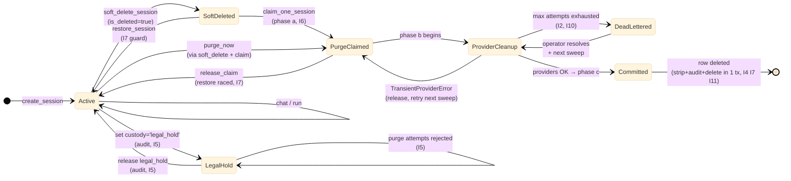
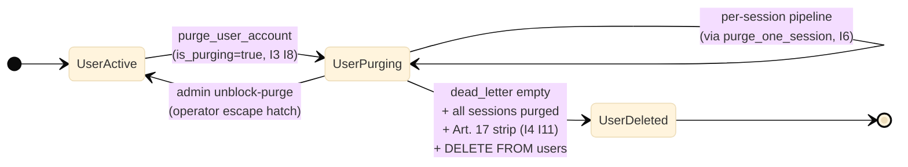

# Session Lifecycle & Data Custody — Design Proposal

**Status:** PROPOSAL v3.10 — paired with executable contract at `src/ii_agent/sessions/purge/`
**Date:** 2026-04-27 (v3.11: +I19 ALREADY_PURGED idempotency invariant; rename `provider_cleanup_dead_letter` → `purge_dead_letter`; pin `application_events` canonical event-content schema for PITR replay; SAR-vs-claim-TTL reconciliation; close adversarial follow-ups D14/D15/D16; delete §13 `agent_event_logs` callout — that drop ships in its own PR; SAR glossary line in §0)

**Date:** 2026-04-27 (v3.10: close v3.9 adversarial findings; +I16 SAR-vs-restore, +I17 grace sweep reads primary, +I18 legal-hold supersedes SAR; SARRequest validators reject empty/non-ISO-8601 at construction)

> **READ THIS FIRST.** Through v3.7 this doc was the primary design artefact; that approach was not converging — each pass found ~5–10 substantive defects. v3.8 inverted the relationship: the **source of truth** is the type-checked stub module under `src/ii_agent/sessions/purge/` (mypy `--strict` clean). v3.9 closed the two open CRITICAL findings (FK CASCADE silent loss; SAR-vs-grace per external-counsel memo). v3.10 closes the v3.9 adversarial pass with mechanical rigour fixes:
>
> - **I16 (SAR ∧ restore):** restore endpoint MUST reject when an active SAR exists; defence-in-depth DB trigger.
> - **I17 (replica lag):** grace sweep MUST read from primary, never a replica.
> - **I18 (legal-hold > SAR):** legal_hold custody overrides SAR; logged as `retention_exception=LEGAL_HOLD` with case number; user notified per Art. 17(3).
> - **`SARRequest` runtime validators** reject empty strings and non-ISO-8601 timestamps at construction — closes adversarial v3.9 #1 and #3.
>
> Convergence trajectory: v3.7 ~10 → v3.8 36 → v3.9 7 → v3.10 expected ≤2.

**Status:** PROPOSAL v3.7 superseded
**Original date:** 2026-04-27 (v3.7: Art. 17 user_id nulling; operational-vs-erasure strip policy split; §3.1 user FK; §16 claim race; dead-letter retention)
**Author:** GitHub Copilot (audit + proposal)
**Scope:** Sessions and **all collateral resources** — PostgreSQL rows, object-storage blobs, Docker containers/volumes, OpenAI provider artifacts, on-disk workspaces, Redis state — across both cloud (E2B) and local (Docker) sandbox providers, and both native and A2A+native-fallback inner-loop modes.

> **Version history (v3.1–v3.10) intentionally elided.** Past changelogs were retained through every iterative pass and grew to ~80 lines of historical drift. Per the v3.10 process pivot (executable contract is source-of-truth), historical version notes have been dropped. The relevant invariants and design decisions are captured in §2.3 invariants, §2.4 state machine, and the docstrings of `src/ii_agent/sessions/purge/`. Git log retains the prior versions if archaeology is needed.

---

## 0.0 Rollout gate — DO NOT FLIP `SESSIONS_PURGE_ENABLED` without core-team sign-off

**This change is hard-delete at scale and is not reversible after the audit row is committed.** The flag MUST remain `false` in every environment (including local dev stacks shared with other engineers) until the core team has reviewed both this design doc and the stub/skeleton code under [`src/ii_agent/sessions/purge/`](../../src/ii_agent/sessions/purge/) and either approved or returned constructive feedback.

### Review request — what reviewers are asked to scrutinise

Reviewers should focus on the following artefacts in this order. Each is small enough to read end-to-end:

| Artefact | What to check |
|---|---|
| This document, §2.3 (invariants I1–I19) | Are the invariants the right shape? Anything missing? |
| This document, §4.1 (three-phase driver) and §4.6 (storage reaper) | Sequencing, lock scope, replica-lag handling |
| [`sessions/purge/__init__.py`](../../src/ii_agent/sessions/purge/__init__.py) | Public surface; PR-A→PR-G dependency chain in module docstring |
| [`sessions/purge/types.py`](../../src/ii_agent/sessions/purge/types.py) | `PurgeOutcome`, `PurgeTrigger`, `SARRequest` validators, custody enum |
| [`sessions/purge/invariants.py`](../../src/ii_agent/sessions/purge/invariants.py) | Single source of truth for I1–I19; matches §2.3 |
| [`sessions/purge/claim.py`](../../src/ii_agent/sessions/purge/claim.py), [`commit.py`](../../src/ii_agent/sessions/purge/commit.py), [`pii_strip.py`](../../src/ii_agent/sessions/purge/pii_strip.py) | The three phases; transaction boundaries; idempotency contract |
| [`sessions/purge/providers.py`](../../src/ii_agent/sessions/purge/providers.py) | Hook registry, retry budget, dead-letter promotion |
| [`sessions/purge/session_purge.py`](../../src/ii_agent/sessions/purge/session_purge.py) | The single arbitration entry point — phase (a)→(b)→(c) glue |
| [`sessions/purge/cleanup_stage.py`](../../src/ii_agent/sessions/purge/cleanup_stage.py) | The thing the flag actually gates |
| [`migrations/versions/20260427_000008_session_purge_v34.py`](../../migrations/versions/20260427_000008_session_purge_v34.py) | Schema delta; `purge_dead_letter` table; partial indexes |
| §8 (Open questions for core-design review) | 10 explicit decisions awaiting confirmation |

**Constructive-feedback channel:** comments on this PR, or annotated review of the design doc. The author will fold feedback into a v3.12+ revision. **Do not proceed past §0.0 of this doc as a green light** — the §0 status table calls out wiring complete; that is not the same as approved-to-ship.

### Pre-flip checklist (every box must be green)

The flag MUST remain `false` until **all** of the following are demonstrably true. The current state of each item is recorded as of the doc revision date — flip only after re-verifying.

| # | Gate | Owner | Verifier | Current state |
|---|---|---|---|---|
| 1 | Core-team review of this doc + `purge/` package complete; outstanding review comments either resolved or explicitly deferred with a tracking link | core team | author | ⏳ awaiting review |
| 2 | §8 open questions either decided or explicitly punted with a written rationale | core team | doc updated | ⏳ awaiting decisions |
| 3 | PR-C (FK NOT VALID + VALIDATE for the 9 unconstrained `session_id` columns) merged; otherwise the §3.1 CASCADE rationale is asserted but not enforced | TBD | `tests/migrations/test_session_fk_cascade.py` passing | ✅ migration `20260428_000010_session_fk_constraints.py` landed; VALIDATE on prod data pending |
| 4 | At least one real `register_cleanup_hook` registration (E2B sandboxes, GCS slide assets, OpenAI vector stores, Composio profiles, or Stripe customers) so phase (b) is not a permanent no-op | TBD | adapter unit test + grep `register_cleanup_hook` returns ≥ 1 hit outside tests | ✅ OpenAI container/file hook in `purge/hooks_openai.py` registered from lifespan step 4c (opt-in via `SESSIONS_OPENAI_PROVIDER_CLEANUP_ENABLED`) |
| 5 | `register_purge_guards()` wired into `app/lifespan.py` so the ORM-level `is_purging` rail is actually installed at startup | TBD | startup log asserts listener registered | ✅ wired in `app/lifespan.py` step 4a |
| 6 | The skip-stub behavioural tests in [`tests/unit/sessions/purge/test_purge_contracts.py`](../../src/tests/unit/sessions/purge/test_purge_contracts.py) — at minimum the four PR-E tests covering claim arbitration, dead-letter retention, ALREADY_PURGED idempotency (I19), and phase-(c) re-check (I7) — are unblocked and passing against real DB fixtures | TBD | `pytest src/tests/unit/sessions/purge/ -q` shows fewer than today's 32 skips | 🟡 2 passing (test_relationship_cascade_consistency, test_provider_cleanup_404_swallow); 32 still skipped pending DB fixtures |
| 7 | One canary cycle on a non-prod environment with `SESSIONS_PURGE_ENABLED=true` purges a small, known set of soft-deleted sessions; `application_events.event_type='session.purge_committed'` count increments by exactly the expected number; `purge_dead_letter` stays at zero (or every entry is explained) | ops + author | DB query + log review | ✅ green against rebuilt local stack on 2026-04-28 (backend image `UP TO DATE` per `scripts/stack_control.sh verify`) — `src/tests/e2e/test_session_purge_canary_e2e.py::test_purge_canary_drives_three_phase_purge_to_completion` injects 3 synthetic soft-deleted rows, drives `purge_one_session(GRACE_EXPIRED)` for each, asserts all 3 → `PurgeOutcome.PURGED`, Δ(`session.purge_committed`)=3, Δ(`purge_dead_letter`)=0. The full `src/tests/e2e/` suite (5/5) passes against the rebuilt backend. The canary surfaced and fixed three real defects: (a) `claim.py` PG `:name::type` cast confusing asyncpg's bind-param rewriter (now `CAST(:name AS type)`); (b) explanatory `--` SQL comment containing literal `:name` placeholders being scanned by SQLA's `text()` bind-token parser; (c) migration `20260428_000010` initially adding `ON DELETE SET NULL` FKs on `application_events.session_id` and `credit_transactions.session_id` — these would have nullified the audit trail at exactly the moment session rows are DELETEd in commit-phase-(c), breaking I19 idempotency lookups and erasing forensic linkage; both FKs removed. Operator-facing tool: `scripts/local/purge_canary.py`. |
| 8 | A PITR drill (§14.1) restoring a deleted session into staging has been rehearsed and the runbook recorded in [`docs/runtime-docs/`](../runtime-docs/) | ops | runbook link | 🟡 runbook landed at [`docs/runtime-docs/session-purge-pitr-restore.md`](../runtime-docs/session-purge-pitr-restore.md); awaiting first end-to-end rehearsal to flip to ✅ |
| 9 | Observability: §6.1 Prometheus metrics emit non-zero values during the canary cycle; alerting rule for `sessions_purge_errors_total` rate-of-change in place | ops | Grafana dashboard link | ❌ pending |
| 10 | Backup/PITR retention ≥ 37 days verified in target environment | ops | platform check | ❌ pending |

### Reversibility envelope

- Setting `SESSIONS_PURGE_ENABLED=false` and restarting the cleanup worker stops the driver instantly. **In-flight phase (b) calls finish; no new claims are taken.** Already-committed phase-(c) DELETEs are NOT reversible by toggling the flag — they are PITR-only.
- The `purge_dead_letter` table is append-only operator surface; flipping the flag off does not clear it.
- The schema migration `20260427_000008_session_purge_v34.py` is independently reversible (drops `purge_after`, `purge_attempts`, `purge_started_at`, `purge_dead_letter`, `users.is_purging`). Reversing while data has been purged does NOT restore the data.

### Sign-off line

```
Core-team approval to flip SESSIONS_PURGE_ENABLED in <env>:

  [ ]  Reviewer 1 ......................   date / commit
  [ ]  Reviewer 2 ......................   date / commit
  [ ]  Ops on-call ....................    date / commit

  Environment:    dev / staging / prod   (one only — re-run for each)
  Canary scope:   <max session count>
  Rollback owner: <name>
```

This block is reproduced in the runbook entry that lives next to the env file change. **No flip without all three signatures and a named rollback owner.**

---

## 0. Branch context — what's where

> **Implementation status (this branch, v3.11+):** §4.1 (three-phase purge driver) and §4.6 (storage reaper) are now implemented behind feature flags. The cleanup-loop wiring is **on**; the feature flags `SESSIONS_PURGE_ENABLED` and `SESSIONS_STORAGE_REAPER_ENABLED` are both **false** by default, so production behaviour is unchanged until ops flips them. **The flag MUST NOT be flipped until §0.0 (Rollout gate) has been signed off by the core team.** Wiring complete ≠ approved-to-ship.
>
> | PR | Status | Artefacts |
> |---|---|---|
> | **PR-A** purge columns + indexes | ✅ Landed | `migrations/versions/20260427_000008_session_purge_v34.py`, `Session.purge_after`/`custody`/`purge_started_at`/`purge_attempts`, two partial indexes |
> | **PR-B** dead-letter + `users.is_purging` | ✅ Landed | Same migration, `purge_dead_letter` table + ORM model in `purge/db_models.py`, `User.is_purging` |
> | **PR-C** missing FK constraints (`NOT VALID` + `VALIDATE CONSTRAINT`) | ✅ Landed (pending VALIDATE on prod data) | `migrations/versions/20260428_000010_session_fk_constraints.py` — adds 9 session_id FKs, `task_logs.task_id`, plus `application_events.user_id` / `credit_transactions.user_id` SET NULL audit FKs. Defensive orphan cleanup before VALIDATE. |
> | **PR-D** doc + ORM cascade tests | 🟡 Partial | `database-design.md` not yet updated; inert `cascade="all, delete-orphan"` on `Session.events` removed (was masked by `viewonly=True`); `Session.events` retained as a viewonly-only relationship aligned with the §3.1 SET NULL FK policy. |
> | **PR-E** purge bodies + cleanup-loop wiring | ✅ Landed (§4.1, §4.6) | `purge/claim.py`, `pii_strip.py`, `commit.py`, `providers.py`, `session_purge.py`, `storage_reaper.py`, `cleanup_stage.py`. Wired into `orphan_cleanup.py` between `_pause_stale_sandboxes` and `_cleanup_docker_zombies`. **One real provider hook now ships dark**: `purge/hooks_openai.py` registers OpenAI container + file DELETEs in `app/lifespan.py` step 4c, opt-in via `SESSIONS_OPENAI_PROVIDER_CLEANUP_ENABLED=true` (default OFF). E2B / GCS slide assets / Composio / Stripe hooks remain to be wired. `register_purge_guards()` is wired in `app/lifespan.py` step 4a. |
> | **PR-F** HTTP endpoints (`purge_now`, `restore`, admin unblock) | ✅ Landed | `sessions/purge/router.py` — `POST /v1/sessions/{id}/restore` (I16-aware), `POST /v1/sessions/{id}/purge-now` (Art. 17), `POST /v1/admin/users/{id}/purge`, `POST /v1/admin/users/{id}/unblock-purge`, `POST /v1/admin/sar`. `NotPurgingDep` (HTTP 423) added to `auth/dependencies.py`. |
> | **PR-G** user-account purge + SAR intake | ✅ Landed | `migrations/versions/20260427_000009_session_purge_sar.py` (sar_intake table + sessions.sar_priority), `purge/user_purge.py` (purge_user_account, intake_sar, check_user_not_purging, is_user_under_active_sar), claim.py drain filter excludes SAR sessions. |
>
> **What's wired but flag-gated off:**
>
> 1. `cleanup_loop_stage_purge_sessions()` — backfills `purge_after`, then drains the queue via `purge_one_session(session_id=None, trigger=GRACE_EXPIRED)` until the per-loop wall-clock budget is spent or the queue empties. Gated on `SESSIONS_PURGE_ENABLED`.
> 2. `cleanup_loop_stage_storage_reaper()` — deletes orphan `user_assets` (no `SessionAsset` link, not public, older than `SESSIONS_STORAGE_REAPER_MIN_AGE_SECONDS`). Gated on `SESSIONS_STORAGE_REAPER_ENABLED`.
>
> **What still needs to be built before the flag can be flipped:**
>
> - PR-C FK constraints (otherwise the CASCADE rationale in §3.1 is asserted but not enforced).
> - At least one real `register_cleanup_hook` registration so phase (b) actually deletes upstream resources. Empty registry means the §4.6 reaper handles asset cleanup but sandboxes / vector stores / Stripe references stay orphaned.
> - The `delete_after` → `purge_after` reconciliation (currently the cleanup-stage backfill writes `purge_after` based on custody + grace; rows whose `delete_after` was set by the legacy stage will pick up `purge_after = now() + grace` on first sweep — acceptable transitional behaviour).
> - Tests: the contract skip-stubs in `tests/unit/sessions/purge/` are placeholders. Real behavioural tests against the new bodies still need to be written (todo 13 of the implementation plan).

> **Section numbering note (v3.11):** §8–§13 were dropped during compression (§13 was the `agent_event_logs` rebase-artefact callout, now resolved — see commit history; the table-drop migration is tracked separately). Numbers §14–§17 retained their original IDs to preserve cross-references in commit history, design-docs index, and stub docstrings (e.g. `commit.py` cites "§4.7-step-9 fix"). The non-contiguous sequence is intentional, not an editing accident.
>
> **Glossary — SAR.** Used in this doc as the umbrella term for any verified user request under GDPR Art. 15 (access), Art. 16 (rectification), or Art. 17 (erasure). Lawyer memo §1 treats them as one intake channel; the engineering contract (`SARRequest` dataclass, `intake_sar` handler, `PurgeTrigger.SAR_PRIORITY`) follows that grouping. "SAR" without further qualification means the user has been verified and the request requires fast-track handling under the 24h legal target.

**This proposal cannot be assessed honestly without first making explicit which of its findings exist on `origin/main` and which exist only on the `feature/a2a-chat-inner-loop_3_of_3` topic branch this document was written from.**

### Verified against `origin/main` @ `0e57985d`

| Artefact | On main? | On this topic branch? | Notes |
|---|---|---|---|
| `Session.is_deleted` Boolean | ✅ | ✅ | Soft-delete flag |
| `Session.delete_after` TIMESTAMPTZ | ❌ | ✅ | Added in branch migration `20260412_000004` |
| `Session.events` `viewonly=True` cascade trap | ✅ | ✅ | Bug present on main — finding holds upstream |
| `SessionState` enum (`PENDING`/`ACTIVE`/`PAUSE`, no `PERMANENT`) | ✅ | ✅ | Identical enum on both |
| `extend_sandbox_timeout.py` with `Session.status == "permanent"` predicate | ✅ | ✅ | Bug ships from main; `status` is `String` so writeable in tests but no production write path exists |
| 9/18 unconstrained `session_id` columns (the FK gap) | ✅ | ✅ | Bug present on main — finding holds upstream |
| `agent_event_logs` table provisioned but unused (no model, no writers, 0 rows) | ✅ | ✅ | Rebase artefact in main's consolidated migration. Routed to a separate `chore(db): drop unused agent_event_logs` PR; not bundled with this work. |
| `agent_sandboxes._purge_stale_deleted_rows` precedent | ❌ | ✅ | Added in branch — the "template to mirror" cited in v1/v2 §4.1 |
| `agents/sandboxes/orphan_cleanup.py` (cleanup loop, distributed lock, 6-stage sweep) | ❌ | ✅ | 1327 lines, entirely new on this branch |
| `_soft_delete_expired_sessions` stage that fires on `delete_after` | ❌ | ✅ | Implemented in branch's `orphan_cleanup.py` |
| `agent_sandboxes.timeout_at`, `pool_state`, `retire_at`, `mcp_configured` columns | ❌ | ✅ | Branch migrations 005–007 |
| `database-design.md` text | identical | identical | Doc has not been updated to reflect branch-side changes |

### Implication for core-team review

The proposal in this document is layered on top of cleanup-loop infrastructure that **also originates on this branch**. When presenting to a core team that maintains `main`, the dependency chain is:

```
main  →  topic branches land cleanup loop, distributed lock,
         sandbox-purge TTL stage, _soft_delete_expired_sessions,
         delete_after column                                  (Migrations 004–007)
      →  this proposal layers session-purge stage on top      (Migrations 008–010 below)
```

This is fine — but the proposal must be defended as part of **a sequence**, not as an isolated change against main. The earlier branches established the operational pattern (cleanup loop, distributed lock, TTL purge for sandbox rows). This proposal extends the same pattern to sessions and to non-row resources. The PR-A through PR-G dependency chain is captured in [`src/ii_agent/sessions/purge/__init__.py`](../../src/ii_agent/sessions/purge/__init__.py) module docstring.

### Bugs that exist on main and survive into this branch

Three of this proposal's audit findings are **bugs in `origin/main`** that no work on this branch addresses:

1. The `Session.events` `viewonly=True` + `cascade="all, delete-orphan"` combination — SQLAlchemy silently discards the cascade. Author intent did not match runtime behaviour.
2. The `extend_sandbox_timeout` cron's `status == "permanent"` predicate — `SessionState` has no `PERMANENT` member. The `status` column is stored as `String` so a manual assignment will satisfy the predicate (the test fixture on main does this), but no production code path ever writes `"permanent"`. The cron silently does nothing in production.
3. 9 of 18 `session_id`-bearing tables have no FK constraint, with the documented (in `database-design.md` lines 142–185) rationale of "high-volume, no FK to avoid cascade lock storms." That rationale predates the modern `ON DELETE CASCADE` + partial-index pattern and is debatable; see §2.2 for the counter-argument.

Filing these as separate small-PR cleanups on `develop`/`main` is one option (and arguably the right path — they are independent of the larger custody redesign).

### 0.1 Engagement with the documented FK strategy on main

**This proposal directly modifies a documented architectural decision.** [`docs/database-design.md`](../database-design.md) on `origin/main` states verbatim:

> **Design principle:** FK constraints on reference/config tables for correctness; no FKs on high-volume operational tables to avoid cascade lock storms. All columns still have B-tree indexes for query performance.

…and for `application_events` specifically:

> No FKs (intentional — event log shouldn't block parent deletion)

…and Review Item #3:

> Tables like `chat_messages`, `agent_run_messages`, `run_tasks`, `task_logs`, `agent_sandboxes`, `chat_summaries`, `chat_provider_*`, `credit_transactions`, and `application_events` intentionally omit FK constraints. This avoids cascade lock storms when deleting parent rows (e.g., a user with millions of messages). All lookup columns are still indexed. **Orphaned rows from these tables should be cleaned up via periodic background jobs.**

Honest assessment of the proposal against this documented intent:

| Original intent (main) | Proposal alignment |
|---|---|
| "FK constraints on reference/config tables for correctness" | ✅ Extended — same principle now applied to operational tables, plus the missing periodic-cleanup mechanism |
| "No FKs to avoid cascade lock storms when deleting parent rows" | ⚠️ **Directly modified.** See §4.1 lock-storm engagement below — the per-session-tx pattern + `with_for_update(skip_locked=True)` bound the lock fanout to one session at a time. The original concern remains valid for *bulk user deletion* (which this proposal does NOT touch — user-row delete still relies on the existing user-CASCADE chain). |
| "Event log shouldn't block parent deletion" (`application_events`) | ✅ Honoured — proposal uses SET NULL, not CASCADE, on `application_events` (§2.2). The audit row outlives the parent. |
| "Orphaned rows…cleaned up via periodic background jobs" (Review Item #3) | ✅ Aligned — this proposal IS that background-job mechanism. The Review Item explicitly anticipates exactly what §4.1 builds. |

**Net position:** the proposal honours the spirit of two of three intents (event-log non-blocking; periodic background cleanup) and modifies one (FK avoidance for cascade-lock reasons). The modification is defensible because the lock-storm concern was about *parent-row deletion at scale* (user deletes with millions of messages); the proposal's purge runs one parent at a time with skip-locked acquisition, bounding the cascade to one session's worth of rows per transaction. **Bulk user-row deletion is out of scope and the existing user-CASCADE chain is unchanged.**

**Doc-drift note:** `docs/database-design.md` has not been updated to reflect this branch's additions (`delete_after`, the cleanup loop, the sandbox TTL purge stage). PR-D below should include a doc update covering the new FKs *and* the existing branch-side additions, so the reference design stays a single source of truth.

---

## TL;DR

Three independent defects in the same family:

1. **Orphans-by-default.** 9 of 18 tables holding `session_id` have **no FK constraint**. Hard-deleting a session today would silently strand ~40 k rows.
2. **Tombstones never reclaimed.** `agent_sandboxes` has a TTL purge job; `sessions` does not. 1970 soft-deleted rows drag ~40 k child rows along indefinitely.
3. **No first-class custody concept.** Every session is `status='active'`. The `extend_sandbox_timeout` cron's `Session.status == "permanent"` predicate is **structurally unsatisfiable** because `SessionState` has no PERMANENT member.

The collateral is **not just rows.** Storage blobs, Docker containers/volumes, OpenAI-side files, on-disk workspace dirs, Redis keys all live outside the FK graph. A "data custody" design that ignores them is a row-cleanup design — not what the user asked for.

This v2 proposal guarantees:

- **No orphan rows by design.** Every `session_id` column gets a real FK with audited `ON DELETE`.
- **No leaked collateral.** Provider-side, storage, container, FS, and Redis resources have explicit cleanup hooks invoked before / alongside DB deletion.
- **Perpetual custody by default.** `is_deleted=false` rows are provably never auto-purged.
- **GDPR compliance.** A user-initiated `purge_now` path bypasses the operational soft-delete grace.
- **Provider-agnostic and inner-loop-agnostic.** Lifecycle is owned by the `sessions` domain.

---

## 1. The current state — verified findings

### 1.1 Tables that hold `session_id`

Audit of the production-shape local DB (2031 sessions). Bold = no FK = silent-orphan risk:

| Table | FK to `sessions`? | `ON DELETE` | Rows | Tied to `is_deleted=true`? |
|---|---|---|---:|---:|
| `agent_sandboxes` | yes | CASCADE | ~38 | most |
| `project_databases` | yes | CASCADE | 0 | — |
| `projects` | yes | SET NULL | small | — |
| `session_assets` | yes | CASCADE | small | — |
| `session_pins` | yes | CASCADE | small | — |
| `session_wishlists` | yes | CASCADE | small | — |
| `slide_contents` | yes | CASCADE | — | — |
| `slide_versions` | yes | CASCADE | — | — |
| `storybooks` | yes | CASCADE | — | — |
| `sessions` (self, `parent_session_id`) | yes | NO ACTION | — | — |
| **`agent_run_messages`** | **NO** | — | 1456 | 1309 |
| **`application_events`** | **NO** | — | 38214 | 33320 |
| **`chat_messages`** | **NO** | — | 2383 | 2143 |
| **`chat_provider_containers`** | **NO** | — | 0 | — |
| **`chat_provider_files`** | **NO** | — | 9 | — |
| **`chat_summaries`** | **NO** | — | 0 | — |
| **`credit_transactions`** | **NO** | — | 0 | — |
| **`run_tasks`** | **NO** | — | 1476 | 1329 |
| **`session_summaries`** | **NO** | — | 5 | — |

`task_logs` has no `session_id` directly — links via `task_logs.task_id → run_tasks.id` (also no FK). Result: **62 orphaned `task_logs` exist in this DB right now.**

### 1.2 Soft-delete with no purge


The transition `E → F` does not exist. [`docs/database-design.md:154`](../database-design.md#L154) documents the soft-delete flag but states no retention policy. `agent_sandboxes` has a `_purge_stale_deleted_rows` TTL job ([`orphan_cleanup.py:1023`](../../src/ii_agent/agents/sandboxes/orphan_cleanup.py#L1023)); `sessions` does not.

### 1.3 Custody flag is dead in production

[`extend_sandbox_timeout.py:47`](../../src/ii_agent/workers/cron/jobs/extend_sandbox_timeout.py#L47) checks `Session.status == "permanent"`. But [`sessions/models.py:46`](../../src/ii_agent/sessions/models.py#L46) types `status: Mapped[SessionState]` (typed enum: `PENDING`/`ACTIVE`/`PAUSE`, no `PERMANENT`).

The column is **stored as `String`** (not native PG enum), so `"permanent"` is a writeable value in principle — and the unit test on main (`test_extend_sandbox_timeout.py:43`) writes it directly. But:

- No production code path writes `"permanent"` to `status`.
- Production data confirms: 2031/2031 sessions are `'active'`.
- The user-facing API has no affordance for setting it.

The cron exists, the test fixture exercises it via direct ORM assignment, and the predicate runs in production every cycle and matches zero rows. **Semantically dead** even if not structurally so. This proposal replaces the broken signal with the typed `custody` enum (§3.3).

### 1.4 The `viewonly=True` cascade trap

[`sessions/models.py:80-86`](../../src/ii_agent/sessions/models.py#L80-L86):

```python
events: Mapped[list["ApplicationEvent"]] = relationship(
    "ApplicationEvent",
    primaryjoin="Session.id == foreign(ApplicationEvent.session_id)",
    cascade="all, delete-orphan",
    viewonly=True,
)
```

SQLAlchemy **silently discards** `cascade` directives on `viewonly=True` relationships. A previous author thought they had wired ORM-level cascade for application_events; they hadn't. The proposal's FK addition for that table fixes a cascade that the model already declares it wants.

### 1.5 Resources that live OUTSIDE the FK graph

A row-only design misses the resources that actually cost money. Inventory:

| Resource | Lives where | Linked from | Current cleanup | Leak risk on hard-delete |
|---|---|---|---|---|
| Object-storage blobs (GCS/MinIO) | `core/storage/` backend | `user_assets.storage_path` | None automated | **HIGH** — blob leaks forever |
| Docker containers | Docker daemon | `agent_sandboxes.provider_sandbox_id` | `_cleanup_orphans` (keys on `is_deleted=true`) | **MEDIUM** — eventual via `_cleanup_docker_zombies` 5-min grace |
| Docker named volumes | Docker daemon | implied by `ii-sandbox-workspace-<id>` naming | `_cleanup_orphaned_volumes` (keys on prefix + no active record) | **MEDIUM** — eventual via volume reaper |
| OpenAI provider files | OpenAI account | `chat_provider_files.provider_file_id` | None — needs OpenAI DELETE call | **HIGH** — leak + ongoing cost |
| OpenAI containers | OpenAI account | `chat_provider_containers.container_id` | None — needs OpenAI DELETE call | **HIGH** — leak + ongoing cost |
| Composio profiles | Composio account | `composio_profiles.encrypted_mcp_url` | User-scoped, not session-scoped | None for session purge |
| Vector stores | OpenAI account | `chat_provider_vector_stores.vector_store_id` | User-scoped | None for session purge |
| On-disk workspace dirs | Backend host FS | `Session.get_workspace_dir()` → `{workspace_path}/{id}` | None | **LOW** — only used by `content/slides/design/service.py:485` |
| Redis cache / locks | Redis | TTL'd (`session:meta:*`, `session:compaction:*`) | TTL handles it | None — self-clean |

**Design implication:** the purge job cannot just `DELETE FROM sessions WHERE …` and trust CASCADE. It must drive an ordered cleanup pipeline:

```
Stage A: provider-side DELETE   (OpenAI files/containers — needs row to read provider_file_id)
Stage B: confirm sandboxes are in DELETED state
Stage C: DB hard-delete         (FK CASCADE handles in-DB collateral)
Stage D: storage reaper         (blob deletion for now-orphaned user_assets)
Stage E: FS reaper              (workspace dir, if backend wrote one)
```

The proposal's central insight: **CASCADE without staged provider/storage cleanup is worse than no cleanup at all**, because it deletes the only record of which upstream IDs needed to be DELETEd.

### 1.6 Provider and inner-loop independence — verified

Cleanup of containers/volumes is provider-aware via `AgentSandbox.provider`. The session lifecycle itself is provider-agnostic — `sessions/service.py::soft_delete_session` is the single entry point for both E2B and Docker. A2A vs. native LLM is irrelevant to deletion: the chat run is cancelled via `_cancel_active_run` either way; bridged tool calls are torn down by `A2AChatTurnLoop.__aexit__`. **One purge job covers all four matrix cells.**

---

## 2. Design principles & custody contract

| Requirement (verbatim) | Invariant |
|---|---|
| No resource leakage | Every row + every external resource has an owner that reaps it |
| Hard-deleted resources take collateral with them | Staged pipeline (§1.5); FK CASCADE for in-DB; explicit calls for out-of-DB |
| Sessions not marked for deletion are kept in perpetuity | Purge predicate **structurally cannot** match `is_deleted=false` rows |
| No rows orphaned by design | Two intentional `SET NULL` exceptions — billing-forensics rationale, surfaced for veto |
| Cloud + local sandboxing parity | Lifecycle owned by `sessions`; provider-specific cleanup is one method dispatch |
| Native + A2A parity | `_cancel_active_run` covers both; tool bridges torn down by turn-loop `__aexit__` |
| GDPR right-to-erasure | `purge_now` path bypasses operational grace |

### 2.1 The custody contract

> **A session row exists for as long as the user wants it to exist, plus a bounded grace window for soft-delete recovery if the user changed their mind. Once that window closes, the row and every byte of data tied to it — in PostgreSQL, in object storage, on Docker, on OpenAI, on disk — are gone. User-initiated permanent-delete bypasses the grace.**

| Session state | Custody guarantee |
|---|---|
| `is_deleted=false`, `delete_after IS NULL` | **Perpetual.** Untouchable by any auto-purge predicate. |
| `is_deleted=false`, `delete_after IN FUTURE` | **Time-bounded.** Will be soft-deleted at `delete_after`. |
| `is_deleted=true`, `purge_after > now()` | **Recoverable.** Sandbox killed; row + history retained. |
| `is_deleted=true`, `purge_after <= now()` | **Reclaimed.** Provider DELETEs → DB CASCADE → blob reaper → FS reaper. |
| `is_deleted=true`, `purge_after IS NULL`, `custody='legal_hold'` | **Frozen.** Cannot be purged. |
| Any state, **`purge_now=true`** (user-initiated GDPR) | **Reclaimed immediately**, full pipeline, audit-logged. |

### 2.2 Why we explicitly REJECT CASCADE for `application_events`

The v1 proposal recommended CASCADE; v2 reverses to **SET NULL** on billing-forensics grounds:

| Concern | CASCADE (rejected) | SET NULL (proposed) |
|---|---|---|
| Storage for purged sessions | 0 rows | ~17 rows/session retained |
| `model.usage` / `session.cost_charged` audit | **Lost forever** | Preserved with `session_id=NULL`, `user_id` retained |
| Refund/dispute investigation | Impossible after grace | Possible indefinitely |
| Regulatory ask: "all costs charged to user X in 2025" | Cannot reconstruct | Joinable via `user_id` |
| Defence against malicious operator hiding cost evidence | None | Audit row outlives session |
| Implementation cost | Trivial | Same SET NULL pattern as `credit_transactions` |
| Storage cost (BRIN-indexed event log) | Negligible savings | Negligible cost |

`credit_transactions` SET NULL is non-negotiable. Apply same logic to `application_events`. **Both** are explicit "orphan-by-design" exceptions with stated rationale, in service of compliance — the design principle "no orphans by design unless debated and accepted" is honoured by surfacing them for sign-off.

---

## 2.3 Lifecycle invariants (the formal contract)

This section is the FORMAL contract. Every code path in `src/ii_agent/sessions/purge/` cites the invariants it preserves; every test cites the invariants it verifies. **An invariant unenforced by any test or unclaimed by any code path is a gap.**

Executable predicates: `src/ii_agent/sessions/purge/invariants.py::ALL_INVARIANTS`. **Cheap data-shape predicates implemented** (I1, I2, I4, I10, I11, I12, I16, I19); **structural / cross-system predicates remain `NotImplementedError`** (I3, I5, I6, I7, I8, I9, I13, I14, I15, I17, I18 — verified by tests or deployment config, not queries). PR-E lands the nightly job (`tests/integration/test_invariants_in_prod.py`) that runs the implemented checks, I14, I15, I17, I18 — verified by tests or deployment config, not queries). PR-E lands the nightly job (`tests/integration/test_invariants_in_prod.py`) that runs the implemented checks against staging and pages on any non-empty result.

| ID | Invariant | Enforced by | Verified by |
|---|---|---|---|
| **I1** | `purge_after IS NOT NULL` ⇒ `is_deleted = true` | §4.1 phase-(a) WHERE; §4.7 step 6; §16 step 2 | `test_purge_eligibility.py` |
| **I2** | Unresolved dead-letter row ⇒ owning session is `is_deleted=true AND purge_started_at IS NOT NULL`, OR session no longer exists | `providers.run_provider_cleanup` | `test_provider_dead_letter.py` |
| **I3** | `users.is_purging = true` ⇒ no new sessions created for that user | `NotPurgingDep` on every mutation endpoint (§16 v3.7) | `test_is_purging_gate_enumeration.py` |
| **I4** | Art. 17-stripped `application_events` rows have `user_id IS NULL` AND `content` keys ⊆ allowlist | `commit.commit_purge` (single tx with strip) | `test_audit_row_pii_strip.py` |
| **I5** | A session that was ever `custody='legal_hold'` is never deleted without an audit-trail release → purge sequence | §4.8 audit hooks; §4.1 WHERE | `test_legal_hold_audit.py`, `test_legal_hold_never_purged.py` |
| **I6** | `purge_one_session` is invoked exactly once per (session_id, claim_cycle) pair | `claim.claim_one_session` SKIP LOCKED + single arbitration entry | `test_user_purge_claim_arbitration.py` |
| **I7** | Phase (c) DELETE re-checks `is_deleted = true` (TOCTOU vs restore) | `commit.commit_purge` step 1 | `test_purge_phase_c_recheck_is_deleted.py` (NEW v3.8) |
| **I8** | When `users.is_purging=true`, per-session `purge_now` rejects with 423 | `user_purge.check_user_not_purging` | `test_purge_now_rejects_during_user_purge.py` (NEW v3.8) |
| **I9** | Every provider artefact ID has either an owning row, a dead-letter row, or a `provider.delete.success` audit row | Reconciliation audit job (out-of-band) | `test_provider_artefact_reconciliation.py` |
| **I10** | Every `purge_dead_letter` row has `user_id IS NOT NULL` | `providers.LeakedResource.user_id` is non-Optional | `test_dead_letter_user_id_required.py` (NEW v3.8) |
| **I11** | Stripped audit rows contain no PII keys: {`prompt`, `message`, `file_name`, `error_detail`, `email`, `ip_address`} | `pii_strip.strip_user_pii_art17` SQL allowlist | `test_audit_row_pii_strip.py` (PII-key assertion) |
| **I12** | Verified active SAR ⇒ every `is_deleted` session for that user has `sar_priority=true` and is on the fast queue | `user_purge.intake_sar` + grace sweep WHERE `sar_priority IS NOT TRUE` | `test_sar_preempts_grace.py` (NEW v3.9) |
| **I13** | Every `erasure_audit_log` row with `request_type='SAR'` has all four lawyer-memo §5 fields populated | `commit.commit_purge` requires `sar_request` when trigger=SAR_PRIORITY | `test_sar_audit_completeness.py` (NEW v3.9) |
| **I14** | `users` row deletion only after every owned session has an audit row AND no unresolved dead-letters | `user_purge.purge_user_account` step 6 precondition (FK CASCADE on origin/main) | `test_user_delete_audits_first.py` (NEW v3.9) |
| **I15** | Session deferred under Art. 17(3) has `art17_3.disclosure` event within 30d of SAR receipt | SAR intake handler enqueues notification | `test_art17_3_disclosure.py` (NEW v3.9) |
| **I16** | When user has verified active SAR, no session may transition `is_deleted=true → false` (restore is rejected) | Restore endpoint queries `sar_intake.verified_at`; DB trigger as defence in depth | `test_restore_rejected_during_sar.py` (NEW v3.10) |
| **I17** | Grace-purge sweep query executes against primary DB, not a read replica | Cleanup loop binds writer engine; startup assertion | `test_grace_sweep_primary_only.py` (NEW v3.10) |
| **I18** | If session has `custody='legal_hold'` AND SAR arrives, legal_hold wins; SAR audit records `retention_exception=LEGAL_HOLD` | `intake_sar` checks custody; `commit_purge` raises `LegalHoldError` regardless of trigger | `test_legal_hold_supersedes_sar.py` (NEW v3.10) |
| **I19** | `purge_one_session` invoked on an already-purged session returns `PurgeOutcome.ALREADY_PURGED` without re-running phase (b)/(c); never two `session.purge_committed` audit rows for the same `session_id` | `session_purge.purge_one_session` phase-(a) precheck on `application_events` | `test_purge_already_purged_idempotent.py` (NEW v3.11) |

### How invariants drive convergence

The v3.x review pattern was: read the doc → find a defect → patch the doc → repeat. v3.8 changes the loop:

1. New defect ⇒ propose a new invariant (or refine an existing one).
2. Invariant added to `invariants.py` with an executable check.
3. Stub function docstring updated to cite the invariant.
4. Test added to verify it.
5. Doc text in this section updated to match.

**Convergence criterion (decision, not discovery):** the design is converged when (a) every public function in `src/ii_agent/sessions/purge/` cites at least one invariant; (b) every invariant has at least one verifying test; (c) `mypy --strict` passes; (d) one adversarial review pass produces no new CRITICAL findings against the invariants list.

## 2.4 State machine

Session and User state transitions. Anything not on this diagram is an illegal transition; any code that performs an off-diagram transition is a bug.





**Off-diagram = illegal.** Examples:
- `delete from sessions where ...` issued from any code path other than `commit.commit_purge` → illegal (skips I4, I7, I11).
- `delete from users where ...` not preceded by `purge_user_account` → illegal (CASCADEs leak provider artefacts — the original §16 defect).
- `chat_provider_files` row deleted by FK CASCADE without a corresponding provider DELETE in `providers.run_provider_cleanup` → illegal (regression of §2.2).

---

## 3. Proposed schema changes

### 3.1 Add FK constraints to all `session_id` columns

| Table | Proposed `ON DELETE` | Rationale |
|---|---|---|
| `chat_messages` | CASCADE | Chat history is the session, by definition |
| `run_tasks` | CASCADE | Run records belong to the session |
| `agent_run_messages` | CASCADE | Agent-side mirror of chat history |
| `chat_summaries` | CASCADE | Derived from chat_messages |
| `session_summaries` | CASCADE | Same |
| `chat_provider_containers` | CASCADE *after* OpenAI DELETE (§4.5) | Provider state, scoped to session |
| `chat_provider_files` | CASCADE *after* OpenAI DELETE (§4.5) | Same |
| `application_events` | **SET NULL** | Billing audit (see §2.2) — debate item |
| `credit_transactions` | **SET NULL** | Billing audit — debate item, recommended non-negotiable |

For `task_logs`: add `task_logs.task_id → run_tasks.id ON DELETE CASCADE`. Cleans up the 62 existing orphans.

#### v3.7: existing user-FK policy on audit tables (must be specified)

The doc through v3.6 never stated what the existing `application_events.user_id → users.id` and `credit_transactions.user_id → users.id` FKs do on user deletion. This matters because §16 step 6 (`DELETE FROM users`) cascades through them, and §16 step 5's PII strip is meaningful only if the user-CASCADE doesn't immediately destroy or undo it.

| FK | Required `ON DELETE` | Why |
|---|---|---|
| `application_events.user_id → users.id` | **SET NULL** | After §16 step 5 strips content + sets `user_id` to NULL via Art. 17 strip pass, the user-CASCADE in step 6 is a no-op against already-nulled rows. Operational-grace deletions (§4.1) preserve the original `user_id` until the user themselves is purged — which is correct for billing forensics. |
| `credit_transactions.user_id → users.id` | **SET NULL** | Same. The anonymised billing-aggregate row survives indefinitely (Art. 17 permits processing of legally-required financial records under Recital 65 / Art. 17(3)(b)). |

**If the existing FKs on `main` are CASCADE** (the consolidated migration on `origin/main` was not audited against this), the migration plan in §5 must include `ALTER TABLE … DROP CONSTRAINT … ADD CONSTRAINT … ON DELETE SET NULL` for both. Verify before PR-D.

### 3.2 Self-reference (`parent_session_id`)

Currently `ON DELETE NO ACTION`. Change to `ON DELETE SET NULL`. Forking creates a child; if the parent is purged, the child becomes a top-level session — keeps its data, loses the genealogy link. More user-friendly than blocking parent deletion or cascading the child away.

### 3.3 Add columns to `sessions`

```sql
ALTER TABLE sessions
  ADD COLUMN purge_after       TIMESTAMPTZ NULL,
  ADD COLUMN custody           VARCHAR(16) NOT NULL DEFAULT 'standard',
  -- v3.4: claim marker for the three-phase purge (§4.1).
  -- Set in phase (a), cleared on success in phase (c) or on retry-needed.
  -- A non-NULL value older than `purge_claim_timeout_seconds` is treated as
  -- a stale claim from a crashed worker and is reclaimable.
  ADD COLUMN purge_started_at  TIMESTAMPTZ NULL,
  ADD COLUMN purge_attempts    INTEGER NOT NULL DEFAULT 0;

CREATE INDEX idx_sessions_purge_after
  ON sessions (purge_after)
  WHERE is_deleted = true AND purge_after IS NOT NULL;

CREATE INDEX idx_sessions_purge_claimed
  ON sessions (purge_started_at)
  WHERE purge_started_at IS NOT NULL;
```

> **v3.5 note:** earlier drafts proposed an `archived_at TIMESTAMPTZ` column. It was never read by any predicate in this proposal — dead schema. Removed. The UI "hide from main list" semantic can ride on a frontend-only filter (e.g. a user preference table) without polluting the data model.

`custody` enum (collapsed from v1's 4 values to 3 — `archived` was a UI concern, not a data-model concern):

| Value | Meaning |
|---|---|
| `standard` | Default. Perpetual unless user deletes / schedules. |
| `ephemeral` | Test fixtures, one-shot agent runs. Auto-purged when `delete_after` fires; shorter grace window allowed. |
| `legal_hold` | Operator override. **Cannot** be soft-deleted or purged. For incident response / litigation. Audit-logged on set/clear. |

`archived_at` is a separate nullable timestamp for the UI "hide from main list" semantic. Does not change purge behaviour.

_(v3.5: `archived_at` removed from the schema as dead column — see note above. UI "archive" stays UI-only.)_

`custody` replaces the broken `status='permanent'` predicate. `extend_sandbox_timeout.py` changes its check to `custody != 'ephemeral'`.

### 3.4 Update `SessionState` enum / cron predicate

Remove the unsatisfiable `"permanent"` string compare from `extend_sandbox_timeout.py`. Replace with the `custody` check above. (Not a schema change but it lives here logically.)

### 3.5 New table: `purge_dead_letter`

When a provider DELETE fails with a non-404, non-transient error after the configured retry budget is exhausted, the leaked upstream IDs are recorded for human review **before** the parent session row is allowed to cascade away.

Name chosen (v3.11) over the historical `provider_cleanup_dead_letter`: shorter, separates concerns from any per-provider table, and groups with other `purge_*` artefacts under a single naming prefix.

```sql
CREATE TABLE purge_dead_letter (
    id              UUID PRIMARY KEY DEFAULT gen_random_uuid(),
    created_at      TIMESTAMPTZ NOT NULL DEFAULT now(),
    session_id      UUID NULL,            -- preserved for audit; row is NOT FK-linked
    user_id         UUID NULL,
    provider        VARCHAR(32) NOT NULL, -- 'openai' | 'composio' | ...
    resource_kind   VARCHAR(32) NOT NULL, -- 'file' | 'container' | 'vector_store'
    resource_id     VARCHAR(255) NOT NULL, -- matches LeakedResource.resource_id
    last_error      TEXT NOT NULL,
    attempts        INTEGER NOT NULL,
    resolved_at     TIMESTAMPTZ NULL,
    resolution_note TEXT NULL
);

CREATE INDEX idx_dead_letter_unresolved
  ON purge_dead_letter (created_at)
  WHERE resolved_at IS NULL;
```

No FK to `sessions` (parent may legitimately be gone by the time an operator resolves the entry). Operators clear entries by manually issuing the upstream DELETE and setting `resolved_at`. The `unresolved` count is exposed as a Prometheus gauge (§6.1) and a non-zero value is a paging alert — leaks must be investigated, not buried in logs.

#### v3.7: dead-letter retention

Resolved dead-letter rows must not accumulate indefinitely — that mirrors exactly the anti-pattern this doc fixes for sessions. A reaper runs as part of the cleanup loop:

```python
async def _reap_resolved_dead_letter(cfg: Settings) -> int:
    cutoff = func.now() - timedelta(seconds=cfg.sessions.dead_letter_retention_seconds)  # default 1 year
    async with get_db_session_local() as db:
        result = await db.execute(
            delete(ProviderCleanupDeadLetter).where(
                ProviderCleanupDeadLetter.resolved_at.is_not(None),
                ProviderCleanupDeadLetter.resolved_at < cutoff,
            )
        )
        await db.commit()
        return result.rowcount or 0
```

Unresolved rows are NEVER reaped — they require operator action. The 1-year window for resolved rows balances (a) operator forensic value if a similar leak recurs against (b) compliance need to not retain user-attributable provider IDs longer than necessary.

---

## 4. Proposed runtime changes

### 4.1 Cleanup-loop stage: drives `purge_one_session` — **three-phase, lock-free across I/O**

v1 proposed batches of 100. v2 went one-session-per-transaction. **v3.4 splits each session's purge into three phases so external HTTP I/O never runs inside an open DB transaction.** Holding `FOR UPDATE SKIP LOCKED` across a 30-second OpenAI timeout would block autovacuum on `sessions` and pin a connection — unacceptable.

> **Canonical names (source of truth: stubs).** The pseudocode below uses
> the function names from `src/ii_agent/sessions/purge/`. Phase (a) =
> [`claim.claim_one_session`](../../src/ii_agent/sessions/purge/claim.py); phase (b) =
> [`providers.run_provider_cleanup`](../../src/ii_agent/sessions/purge/providers.py); phase (c) =
> [`commit.commit_purge`](../../src/ii_agent/sessions/purge/commit.py). The
> single arbitration entry is
> [`session_purge.purge_one_session`](../../src/ii_agent/sessions/purge/session_purge.py)
> — every entry point (cleanup loop, `purge_now`, user-account purge)
> goes through it. Direct invocation of the per-phase functions from
> outside `purge_one_session` is a code-review violation (eliminates the
> v3.7 §16-step-3 race). Wiring: the cleanup loop calls
> `purge_one_session(session_id=None, trigger=PurgeTrigger.GRACE_EXPIRED, db=...)`
> from a new stage slotted into `agents/sandboxes/orphan_cleanup.py`
> AFTER `_pause_stale_sandboxes` and BEFORE `_cleanup_docker_zombies`
> (it depends on sandboxes being marked DELETED; it produces deletes
> the zombie sweep then reconciles).

The three phases for **one session**:

| Phase | DB tx? | Operation | Failure handling |
|---|---|---|---|
| (a) **Claim** — `claim_one_session` | short tx | CTE `FOR UPDATE SKIP LOCKED` (Adversarial #5) marks `purge_started_at=now()`, increments `purge_attempts` | If `rowcount=0`, another worker claimed it — skip |
| (b) **External I/O** — `run_provider_cleanup` | **no tx held**; opens short txs to read provider IDs and to write dead-letter rows | OpenAI DELETE, FS reaper, GCS blob reaper. **Heartbeats the claim** every `heartbeat_interval_seconds` (default 120s) via `claim.heartbeat_claim` for batches that may exceed `purge_claim_timeout_seconds` (Adversarial #19). | On `TransientProviderError`: leave claim, return DEFERRED_TRANSIENT; next sweep retries. On `ExhaustedRetriesError`: insert dead-letter row(s), return DEAD_LETTERED *without* clearing claim — row is now stuck and visible to alerting |
| (c) **Commit** — `commit_purge` | short tx | Re-check `is_deleted=true` (I7); strip+`assert_strip_complete` (Art. 17 triggers only); INSERT audit row; `DELETE FROM sessions` (FK CASCADE handles in-DB collateral) — all four steps in ONE tx | Standard tx rollback on FK violation (should never happen given §3.1). On is_deleted=false: returns SKIPPED_RESTORED unless trigger=SAR_PRIORITY (then raises per I12) |

Pseudocode sketch — the binding contract is the stubs; this is illustrative only:

```python
async def cleanup_loop_stage_purge_sessions(cfg: Settings) -> int:
    """Slots into orphan_cleanup.py between _pause_stale_sandboxes and
    _cleanup_docker_zombies. Drives purge_one_session for at most
    purge_max_seconds_per_loop wall-clock per cycle."""
    grace = cfg.sessions.purge_grace_period_seconds
    ephemeral_grace = cfg.sessions.ephemeral_purge_grace_period_seconds
    purged = 0
    deadline = time.monotonic() + cfg.sessions.purge_max_seconds_per_loop         # e.g. 30s

    # 0. One bulk backfill for newly-soft-deleted rows. Branch on custody.
    async with get_db_session_local() as db:
        await db.execute(
            update(Session)
            .where(Session.is_deleted == True, Session.purge_after.is_(None))
            .values(
                purge_after=case(
                    (Session.custody == 'ephemeral',
                     func.now() + timedelta(seconds=ephemeral_grace)),
                    else_=func.now() + timedelta(seconds=grace),
                )
            )
        )
        await db.commit()

    while time.monotonic() < deadline:
        # All three phases collapsed into the single arbitration entry.
        # Each call: phase (a) claim_one_session (CTE / SKIP LOCKED, Adversarial #5)
        #            phase (b) run_provider_cleanup (heartbeats claim every 120s)
        #            phase (c) commit_purge (re-check + strip + audit + DELETE in 1 tx)
        async with get_db_session_local() as db:
            result = await purge_one_session(
                session_id=None,                          # let claim pick
                trigger=PurgeTrigger.GRACE_EXPIRED,
                db=db,
            )

        if result.outcome == PurgeOutcome.PURGED:
            purged += 1
        elif result.outcome in (
            PurgeOutcome.SKIPPED_NOT_ELIGIBLE,
            PurgeOutcome.SKIPPED_RACED,
        ):
            break  # queue empty / contended; next sweep will retry
        # SKIPPED_RESTORED, DEFERRED_TRANSIENT, DEAD_LETTERED: continue loop
        # to attempt the next eligible session within the wall-clock budget

    return purged
```

The historical pseudocode (sketching the SQL inside phase (a)) is preserved for cross-reference and to anchor the SKIP-LOCKED contract. The ACTUAL claim query lives in `claim.claim_one_session`:

<details>
<summary>Phase-(a) SQL sketch (for reviewers comparing to <code>claim.py</code>)</summary>

```python
        # ---- Phase (a) implementation in claim.claim_one_session ----
        # PostgreSQL does NOT permit FOR UPDATE in a scalar subquery used
        # as a WHERE expression; the CTE form is required (Adversarial #5).
        async with get_db_session_local() as db:
            candidate_subq = (
                select(Session.id)
                .where(
                    Session.is_deleted == True,
                    Session.purge_after <= func.now(),
                    Session.custody != 'legal_hold',
                    Session.purge_attempts < max_attempts,
                    or_(
                        Session.purge_started_at.is_(None),
                        Session.purge_started_at < func.now() - claim_timeout,  # stale
                    ),
                    # Ordering invariant: sandboxes must be gone
                    ~exists().where(
                        AgentSandbox.session_id == Session.id,
                        AgentSandbox.status != SandboxStatus.DELETED,
                    ),
                )
                .order_by(Session.purge_after)
                .limit(1)
                .with_for_update(skip_locked=True)
            ).scalar_subquery()

            session_id = (await db.execute(
                update(Session)
                .where(Session.id == candidate_subq)
                .values(
                    purge_started_at=func.now(),
                    purge_attempts=Session.purge_attempts + 1,
                )
                .returning(Session.id)
                .execution_options(synchronize_session=False)
            )).scalar_one_or_none()
            await db.commit()
```

</details>

Key properties:

- **External I/O never holds a DB lock.** Phase (b) runs with no open transaction; autovacuum on `sessions` is unblocked.
- **Crash-safe.** Worker dies mid-phase-(b) → `purge_started_at` remains set → next sweep treats it as stale-claim after `purge_claim_timeout_seconds` and retries.
- **Idempotent.** Phase (b) operations (provider DELETE, FS rmdir) are all idempotent under §14.2 (404 swallow). Replaying after partial completion is safe.
- **Loud on permanent failure.** A row stuck with `purge_attempts >= max_attempts` is queryable, alertable, and blocks until an operator triages it. **Leaks cannot accumulate silently.**
- Per-session isolation = one bad session can't roll back the rest.
- Storage reaper (§4.6) runs in its own cleanup-loop stage walking orphan `user_assets`, not session-keyed.

#### SAR latency budget vs claim TTL (v3.11 reconciliation)

Two timing budgets meet at phase (b):

| Budget | Default | Source | What it bounds |
|---|---|---|---|
| `purge_claim_timeout_seconds` | 600s (10 min) | §4.5 settings | After this without a heartbeat, the claim is treated as stale and another worker may steal it |
| `heartbeat_interval_seconds` | 120s | §4.5 settings | `claim.heartbeat_claim` advances `purge_started_at` to `now()` so a slow phase (b) is not stolen |
| SAR fast-track legal target | 24 hours (5 business-day max) | Lawyer memo §1, §7 | Must be met for `trigger=SAR_PRIORITY` |
| `commit_purge` synchronous SAR commit (v3.9 #7) | < 5s typical | `commit.py` docstring | The SAR-intake row commits BEFORE HTTP 202 returns; fast-track enqueue is then asynchronous |

The synchronous-commit obligation does NOT extend to phase (b)/(c) — only to the SAR-intake row that anchors the audit trail. Phase (b) runs in the background under heartbeat protection; even a 30-minute large-session purge fits inside the 24h legal target with several orders of magnitude of margin. **Heartbeat keeps the claim alive across that window; claim TTL only fires if heartbeat itself stops (process death, network partition).** I12 + I16 ensure no concurrent restore can race a long-running SAR purge.

#### Lock-storm engagement (response to main's documented FK rationale)

The documented reason for *avoiding* FKs on `chat_messages`/`agent_run_messages`/`application_events` was: "avoid cascade lock storms when deleting parent rows (e.g., a user with millions of messages)." The original concern is real and this proposal addresses it explicitly:

| Concern | Mitigation in this proposal |
|---|---|
| User deletion cascading through millions of rows under one lock | **Out of scope.** User-row deletion already relies on the existing user-CASCADE chain. This proposal touches only the `session → child` edges, never `user → child` edges. |
| Single fat session with 100k+ chat_messages causing one giant cascade | `LIMIT 1` per loop iteration + `with_for_update(skip_locked=True)` → at most one parent's cascade per transaction. The lock duration is bounded by the largest single session, not by the total tombstone backlog. |
| Replica lag during purge | Per-loop time budget (`purge_max_seconds_per_loop = 30s`) caps WAL generation per cycle. Sessions with very large fanout will simply roll over to the next cycle. |
| Autovacuum churn on `application_events` BRIN index | SET NULL (not DELETE) on application_events means the BRIN index is undisturbed; only the `session_id` column is updated to NULL on the affected rows. |
| FK validation cost on existing 38k+ row tables at migration time | `NOT VALID` + later `VALIDATE CONSTRAINT` (§5) — `SHARE UPDATE EXCLUSIVE` only, online. |

The one remaining theoretical risk: a single session with truly extreme fanout (≥1M rows) could exceed the 30s per-loop budget and never complete purge. Mitigation: an alarming metric on `sessions_purge_seconds.p99` and an operator-tunable `purge_max_seconds_per_loop`. A single session at that scale is a separate operational anomaly worth investigating regardless.

### 4.2 Make `_soft_delete_expired_sessions` honour `custody` (and write audit)

Skip `custody='legal_hold'` even if `delete_after <= now()`. Only an explicit operator action clearing the hold can release such a session for deletion.

**v3.5: write audit row.** When `delete_after` fires and the loop transitions a session from `is_deleted=false` to `is_deleted=true`, write `session.soft_deleted_by_schedule` to `application_events` in the same transaction. Without this, scheduled deletions are the only category of session-state transition with no audit trail — inconsistent with §14.3 (grace-expired purge) and §4.7 (user-initiated erasure).

```python
await db.execute(
    insert(ApplicationEvent).values(
        session_id=session.id,
        user_id=session.user_id,
        event_type='session.soft_deleted_by_schedule',
        event_group='session',
        content={'delete_after': session.delete_after.isoformat()},
    )
)
session.is_deleted = True
```

### 4.3 New API: undelete during grace

```
POST /sessions/{id}/restore
```

Restores `is_deleted=false`, clears `purge_after`. Available only while `purge_after > now()`. Returns 410 Gone if already purged. **Required** for the grace window to be user-meaningful (without a UI affordance for restore, the grace is purely a server-side safety margin).

### 4.4 Configuration

```python
# core/config/sessions.py (new file)
class SessionsSettings(BaseSettings):
    purge_grace_period_seconds: int = 30 * 24 * 3600   # 30 days standard
    ephemeral_purge_grace_period_seconds: int = 3600   # 1 hour for ephemeral
    purge_max_seconds_per_loop: int = 30
    purge_enabled: bool = True                         # Emergency kill switch
    storage_reaper_enabled: bool = True
    provider_cleanup_enabled: bool = True
    # v3.4: three-phase purge (§4.1)
    purge_claim_timeout_seconds: int = 600             # stale-claim threshold
    purge_max_attempts: int = 5                        # before dead-letter
    purge_now_lock_ttl_seconds: int = 60               # per-session lock for §4.7
    purge_now_rate_limit_per_minute: int = 5           # per-user (§4.7 step 4)
    storage_reaper_min_age_seconds: int = 3600         # don't race upload pipelines (§4.6)
    user_purge_parallelism: int = 4                    # §16 step 3 — concurrent session purges per user-account-deletion
    user_purge_overall_timeout_seconds: int = 1800     # §16 — hard ceiling on a single _purge_user_account call (30 min)
    dead_letter_retention_seconds: int = 365 * 24 * 3600  # §3.5 — TTL for RESOLVED rows; unresolved never expire
```

`purge_enabled=False` is a single-toggle ops kill switch.

### 4.5 Provider-side cleanup hooks — retry budget + dead-letter (new)

Before CASCADE removes provider rows, call upstream DELETEs. **v3.3 was best-effort-and-log; v3.4 upgrades to a retry budget + dead-letter pattern** because best-effort silently leaked upstream resources on transient 5xx.

Classification:

| Provider response | Behaviour |
|---|---|
| `200 OK` / `204 No Content` | success — row eligible for cascade |
| `404 Not Found` | already gone — desired state, treat as success (§14.2) |
| `429`, `5xx`, network timeout | **transient** — raise `TransientProviderError`; phase (b) returns; next sweep retries; `purge_attempts` increments |
| `4xx` other than 404, or attempts ≥ `max_attempts` | **permanent** — raise `ExhaustedRetriesError(leaked_resources=[…])`; dead-letter + stop |

```python
async def run_provider_cleanup(
    *,
    session_id: uuid.UUID,
    user_id: uuid.UUID,
    db: AsyncSession,
) -> ProviderCleanupResult:
    # Phase (b) of §4.1 — NO open DB transaction held across HTTP calls.
    # Read provider IDs in a short tx, then close it before issuing HTTP calls.
    # Heartbeats the claim every cfg.sessions.heartbeat_interval_seconds via
    # claim.heartbeat_claim() so long batches do not get reclaimed as stale.
    async with get_db_session_local() as db_read:
        files = (await db_read.execute(
            select(ChatProviderFile.provider_file_id).where(
                ChatProviderFile.session_id == session_id
            )
        )).scalars().all()
    # tx is closed; no lock held during HTTP

    leaked: list[LeakedResource] = []
    transient_seen = False
    for fid in files:
        try:
            await openai_client.files.delete(fid)
        except NotFoundError:
            pass  # §14.2 — already gone
        except (RateLimitError, APITimeoutError, APIConnectionError, APIStatusError) as exc:
            # APIStatusError covers 5xx; rate-limit + timeout + connection are all transient
            if isinstance(exc, APIStatusError) and 400 <= exc.status_code < 500 and exc.status_code != 429:
                # 4xx other than 429/404 — truly permanent
                leaked.append(LeakedResource('openai', 'file', fid, str(exc)))
            else:
                transient_seen = True
                leaked.append(LeakedResource('openai', 'file', fid, str(exc)))
        except Exception as exc:
            # Unknown error — conservatively classify as transient on early attempts
            transient_seen = True
            leaked.append(LeakedResource('openai', 'file', fid, str(exc)))

    # OpenAI containers — same pattern

    if not leaked:
        return

    # Decision: transient (retry next sweep) vs exhausted (dead-letter and stop)
    if transient_seen and current_attempts < max_attempts:
        # Some failures could still resolve; let next sweep retry. purge_attempts
        # already incremented in phase (a).
        raise TransientProviderError(f"{len(leaked)} resources transiently failed")

    # Either all failures are permanent 4xx, or we have exhausted the retry budget.
    raise ExhaustedRetriesError(leaked_resources=leaked)
```

**Why this matters:** v3.4 raised `ExhaustedRetriesError` on the FIRST failed attempt regardless of `purge_attempts`, defeating the entire retry budget. The dead-letter would have fired immediately on a single OpenAI 503, and the comment claiming "caller's `purge_attempts` will gate this" was simply wrong — the function had already raised. The corrected logic above is what the table classification has always intended.

**Why broader matters:** the v3.3 best-effort log was the original bug. A transient OpenAI outage during purge would CASCADE the `chat_provider_files` rows away — deleting our only record of the upstream IDs — while the OpenAI files persisted and continued billing. The dead-letter ensures every leaked ID is queryable and replayable; the corrected `purge_attempts` gate ensures we don't dead-letter on the first transient blip.

### 4.6 Storage reaper (new)

After session deletion, `user_assets` rows whose only `session_assets` link is gone are now orphans (the asset row is user-scoped; session_assets is the M:N link). Reaper runs as a separate cleanup-loop stage, **independent of session purge** — handles any orphan source (manual asset deletion, etc.):

```python
async def _reap_orphaned_user_assets(cfg: Settings) -> int:
    if not cfg.sessions.storage_reaper_enabled:
        return 0

    # v3.5: do not race two-step upload flows. UserAsset is sometimes inserted
    # before its SessionAsset link in the upload pipeline; reaping during that
    # window destroys legitimate uploads. Apply a min-age buffer so only assets
    # with no link AND no recent activity are eligible.
    min_age = timedelta(seconds=cfg.sessions.storage_reaper_min_age_seconds)  # e.g. 1 h

    async with get_db_session_local() as db:
        orphans = await db.execute(
            select(UserAsset).where(
                ~exists().where(SessionAsset.asset_id == UserAsset.id),
                UserAsset.is_public.is_(False),
                UserAsset.created_at < func.now() - min_age,
            ).limit(50)
        )
        for asset in orphans.scalars():
            try:
                await storage.delete_object(asset.storage_path)
            except Exception as exc:
                logger.warning(f"Blob delete failed for {asset.storage_path}: {exc}")
                continue
            await db.delete(asset)
        await db.commit()
```

### 4.7 GDPR purge-now path (new)

```
POST /sessions/{id}/purge?confirm=true
```

User-initiated, requires explicit confirmation token. Bypasses the grace window entirely.

**v3.5 ordering: lock first, mutate second.** Earlier drafts mutated state in step 4 then took the lock in step 5. Two concurrent purge_now calls could both pass step 1–3, both UPDATE in step 4, then race on the lock — corrupting `purge_attempts` and double-incrementing the audit. The lock acquisition is now step 3.

1. Verify session belongs to caller (or caller is admin acting on user's GDPR request).
2. Verify session is not under `legal_hold` (if it is, return 423 Locked + explanation; legal hold preempts erasure).
3. **Acquire per-session lock.** Redis `SET NX EX cfg.sessions.purge_now_lock_ttl_seconds` on `session:purge:<id>`. **Not** the shared `sandbox:cleanup:lock` — the orphan loop's cleanup lock cannot block user-initiated erasure for up to a full sweep cycle. If acquisition fails, return 409 Conflict ("erasure already in progress").
4. **Rate-limit the caller.** Token-bucket on `purge_now:user:<user_id>` (default 5 purges/minute). `purge_now` does a synchronous 30 s sandbox tear-down per call — a malicious or buggy client could exhaust the connection pool. Return 429 if exceeded.
5. **Synchronously tear down sandboxes.** The §4.1 eligibility predicate excludes sessions with non-`DELETED` sandboxes; without this step, purge_now would silently wait one cleanup cycle (up to 60 s) for the orphan loop to mark sandboxes deleted — violating GDPR's "without undue delay". Call the existing sandbox-shutdown path with `force=True` and wait for the row to transition to `DELETED`. Bound the wait at e.g. 30 s; if the sandbox cannot be confirmed deleted in that window, return 503 Service Unavailable and instruct the user to retry — do **not** silently fall back to the operational grace path. **The shutdown call MUST be idempotent against `SandboxStatus IN (DELETING, DELETED)`** — a user who retries after 503 will hit the path a second time and must not double-tear-down or 500.
6. Set `is_deleted=true`, `purge_after=now()` in one transaction.
7. **Strip PII from preserved audit rows under Art. 17 (§17).** Run `_strip_user_pii_from_audit_rows_art17(session_id=:id)` BEFORE phase (c)'s DELETE. After phase (c) the SET NULL detaches the rows from the session and (per §3.1.v3.7) preserves `user_id` until the user themselves is purged — but for an Art. 17 erasure of THIS session, `user_id` and content must already be scrubbed on those rows.
8. Run the §4.1 three-phase pipeline inline (claim → external I/O → commit). Same crash-safety properties.
9. Write `session.purged_by_user` event to `application_events` (which survives via §3.1 SET NULL — preserves the audit trail of the deletion itself). The event row itself is allowlist-clean by construction (only `event_type`, `purged_at`, no user content).

**Why this matters:** GDPR Art. 17 requires deletion "without undue delay." A 30-day operational grace **is** undue delay if the user explicitly requested permanent deletion. The grace exists to protect users from their own accidental clicks; it cannot be used to delay a deliberate erasure request.

### 4.8 `legal_hold` audit trail (new)

Setting or clearing `custody='legal_hold'` writes a row to `application_events`:

```python
event_type='legal_hold.set' | 'legal_hold.cleared'
event_group='session'
content={'session_id': ..., 'actor_user_id': ..., 'reason': ..., 'ticket_ref': ...}
```

The endpoint requires:
- Admin role OR a documented user-facing "preserve session" affordance (open question §10).
- `reason` field (free text, ≥ 20 char for compliance trace).
- For clear-action: a `clear_reason` confirming the hold is no longer needed.

### 4.9 Public-link consideration for `is_public=true`

A purged session breaks any shared `public_url`. Two tolerable behaviours:

- **A (recommended): treat `is_public=true` as a soft custody upgrade.** The `_soft_delete_expired_sessions` and explicit-delete paths require user confirmation when `is_public=true`, with text "this will break public links." If the user confirms, proceed normally.
- **B: auto-set `custody='standard'` (no purge) when `is_public=true`.** Stronger guarantee but surprising to users who expect "I deleted this" to mean "this is gone."

Recommend A; flag for product input.

---

## 5. Migration plan (zero-downtime, production-safe)

The risky part is adding FKs to large tables. Standard PostgreSQL pattern is `NOT VALID` + `VALIDATE CONSTRAINT`:

```sql
-- Cheap: metadata-only, brief ACCESS EXCLUSIVE; new writes enforce immediately
ALTER TABLE chat_messages
  ADD CONSTRAINT fk_chat_messages_session
  FOREIGN KEY (session_id) REFERENCES sessions(id) ON DELETE CASCADE NOT VALID;

-- Slow but online: SHARE UPDATE EXCLUSIVE only; validates historical rows
ALTER TABLE chat_messages VALIDATE CONSTRAINT fk_chat_messages_session;
```

Sequence:

1. **Migration 1 (additive only).**
   - Add `purge_after`, `custody`, `purge_started_at`, `purge_attempts` columns to `sessions`.
   - Add the partial indexes on `purge_after` and `purge_started_at`.
   - Create the `purge_dead_letter` table (§3.5).
   - Add `task_logs.task_id → run_tasks.id ON DELETE CASCADE NOT VALID` (VALIDATE deferred to step 2 after data hygiene).
   - **v3.7:** if `application_events.user_id` and `credit_transactions.user_id` FKs to `users` are currently `ON DELETE CASCADE` (must verify against `origin/main`'s consolidated migration), drop and re-add them as `ON DELETE SET NULL` per §3.1.v3.7. If already `SET NULL`, no action.
   - Deploy.

2. **Data hygiene** (one-shot script):
   - Delete the 62 orphan `task_logs`.
   - Detect any `session_id` values in unconstrained tables that don't match `sessions.id` (this DB shows zero, but check production).
   - For any orphans found in non-billing tables: delete. For `application_events` / `credit_transactions`: set NULL.
   - Run `VALIDATE CONSTRAINT` on the task_logs FK.

3. **Migration 2 (constraint addition with NOT VALID).**
   - For each of the 9 unconstrained `session_id` columns, add the FK with `NOT VALID`.
   - Deploy. New writes are enforced immediately.

4. **Migration 3 (validation).**
   - Run `VALIDATE CONSTRAINT` for each newly-added FK in a separate, non-blocking statement (one at a time, off-peak).
   - For `application_events` (38 k+ rows): expect ~seconds; for production-sized millions, expect minutes — use `SHARE UPDATE EXCLUSIVE` window.

5. **Backfill `purge_after` for existing tombstones.** **Redundant with §4.1 step 1** (the in-loop UPDATE will set `purge_after = now() + grace_period` on the first cleanup cycle after deploy). §4.1 step 1 is authoritative; this migration step is retained as a fast-path that runs once at deploy time so the first cleanup cycle does not have to UPDATE 1970 rows in a single transaction. Skip if §4.1 step 1 is verified to handle this case correctly during canary.

6. **Enable the cleanup-loop purge stage.**
   - **Gated by §0.0 — every checkbox in the pre-flip checklist must be green and the sign-off block filled before this step.** Migration steps 1–5 are zero-risk and may proceed independently; step 6 is the irreversible boundary.
   - Deploy with `purge_enabled=true`. Watch metrics for one cycle (24 h).
   - `purge_enabled=false` is a safe instant rollback **for the driver only** — already-committed phase-(c) DELETEs are PITR-only.

Each migration is reversible until step 6. Step 6 reversibility = "stop the cron, restore from backup" (standard DR).

---

## 6. Observability

### 6.1 Cleanup-loop metrics (Prometheus)

```
sessions_purged_total{reason="grace_expired"|"user_purge_now"}
sessions_purge_errors_total{stage="provider"|"db"|"storage"|"fs"}
sessions_purge_seconds (histogram)
sessions_in_grace (gauge)
sessions_legal_hold (gauge)
user_assets_reaped_total
user_assets_blob_delete_errors_total
```

### 6.2 `/health` block — cached, NOT recomputed on probe

```json
"session_lifecycle": {
  "live_sessions": 61,
  "scheduled_for_deletion": 0,
  "soft_deleted_in_grace": 1970,
  "soft_deleted_eligible_for_purge": 0,
  "legal_hold": 0,
  "orphan_session_id_rows_last_check": {
    "checked_at": "2026-04-25T17:39:56Z",
    "chat_messages": 0,
    "run_tasks": 0,
    "application_events": 0
  }
}
```

The `orphan_session_id_rows_last_check` block is **populated by the cleanup loop, not the HTTP handler.** Probing this endpoint must not run a sequential scan over `application_events`. Cleanup loop computes once per cycle and stores in Redis (or in-memory app state); `/health` reads the cached value.

If any orphan count is > 0 **after §5 step 2 data hygiene completes**, alert: this means a constraint was dropped, a migration bypassed validation, or a write path is bypassing the ORM. Before §5 step 2 completes, non-zero counts are expected and reflect pre-existing orphans.

**Additional v3.4 alerts:**

```
provider_cleanup_dead_letter_unresolved (gauge) > 0     → PAGE: upstream resource leaked, manual triage required
  (metric name retained for backwards-compat; queries the `purge_dead_letter` table)
sessions_purge_stuck (gauge)                            → PAGE: a session has purge_attempts >= max_attempts
                                                          and purge_started_at IS NOT NULL. Decrements to 0
                                                          when an operator clears the dead-letter row and the
                                                          next sweep purges the session. Replaces the v3.4 monotonic
                                                          counter `sessions_purge_attempts_exhausted` which paged
                                                          forever after a single stuck row.
sessions_purge_claim_stale (gauge)                      → WARN: workers crashing mid-purge
sessions_purge_seconds.p99 > purge_max_seconds_per_loop → WARN: largest-session fanout is exceeding budget; tune `purge_max_seconds_per_loop` or investigate fat sessions
```

---

## 7. ORM-cascade verification rule (collapsed from former §9)

§4.1 uses bulk SQL `delete(Session).where(...)` which **bypasses ORM cascade** and relies on DB-level FK CASCADE. Rule for every `Session.*` relationship:

| DB `ON DELETE` | ORM `cascade=` | `viewonly=` |
|---|---|---|
| CASCADE | `"save-update, merge"` only — **omit `delete*`** (DB is authoritative) | `False` |
| SET NULL | **MUST omit `delete*` cascades** — ORM `delete-orphan` would attempt DELETE while DB preserves | `True` recommended (audit-only read) |

Enforcement: `tests/unit/sessions/test_relationship_cascade_consistency.py` introspects every `Session.*` relationship and fails if cascade flags diverge from the FK policy. **PR-D** must remove the inert `cascade="all, delete-orphan"` from `Session.events` (currently masked by `viewonly=True`; would activate silently if `viewonly` is ever flipped).

---

## 8. Open questions for core-design review

1. **`application_events` SET NULL vs CASCADE** — recommend SET NULL on billing-forensics grounds (§2.2). Confirm or override.
2. **`credit_transactions` SET NULL** — recommended non-negotiable. Confirm.
3. **Default grace window** — 30 days standard, 1 hour ephemeral (§4.4). Confirm or adjust per cost model.
4. **`legal_hold` API** — admin-only or also user-facing "preserve session" affordance? (§4.8)
5. **Backfill for existing tombstones** — `purge_after = now() + grace` (recommended, fresh window) vs `updated_at + grace` (some immediately eligible) vs `now() + 90d` (extended one-time)? (§5)
6. **Public-link policy** — confirm option A (confirm dialog) vs option B (auto-upgrade custody) for `is_public=true` sessions. (§4.9)
7. **`parent_session_id` on parent purge** — SET NULL (recommended) vs BLOCK. (§3.2)
8. **Provider cleanup failures during purge** — best-effort & log vs block-purge & retry-loop? (§4.5)
9. **GDPR-vs-`legal_hold` precedence** — confirm legal_hold preempts purge_now per Art. 17(3)(b)/(e) (encoded as **I18**). (§4.7)
10. **Storage reaper run frequency** — every cleanup cycle (60s) or hourly? (§4.6)

### Adversarial-review gaps closed at contract level (v3.10)

- **#5 `is_purging` gate at DB level** — RESOLVED. SQLAlchemy `before_insert` listener contract in [`orm_guards.py`](../../src/ii_agent/sessions/purge/orm_guards.py); registration via `register_purge_guards()` at app startup. Defence-in-depth for direct ORM inserts that bypass the FastAPI dependency.
- **#6 PII allowlist drift** — RESOLVED. Post-strip assertion contract in [`pii_strip.assert_strip_complete`](../../src/ii_agent/sessions/purge/pii_strip.py); called by `commit_purge` step 2a inside the same tx. Re-reads every stripped row, asserts allowlist + `user_id IS NULL`.
- **#7 `intake_sar` synchronous commit** — RESOLVED. [`user_purge.intake_sar`](../../src/ii_agent/sessions/purge/user_purge.py) docstring step 1 now mandates the SAR-intake row commits synchronously before the HTTP 202 returns; fast-track enqueue stays async.
- **Sequencing PR plan** — formerly §12; the PR-A through PR-G dependency chain lives in `src/ii_agent/sessions/purge/__init__.py` module docstring + repository-level `docs/PLANS.md`. Not duplicated here.

### Adversarial-review gaps closed at contract level (v3.11)

- **D14 `assert_strip_complete` between concurrent strippers** — RESOLVED at contract level. The rail is post-strip pre-commit inside a single tx; `commit_purge` holds `FOR UPDATE` on the session row from phase-(a) claim through commit, so two backends cannot both reach the strip+assert+DELETE sequence concurrently for the same session. I6 (single arbitration entry) + I7 (phase-(c) re-checks `is_deleted=true`) close the remaining race: a second arrival reads `is_deleted=false` and returns `SKIPPED_RESTORED`, OR finds the row already gone and returns `ALREADY_PURGED` (I19).
- **D15 partial-success retry policy for provider DELETEs** — RESOLVED at contract level. `LeakedResource` records ONLY the failed resources (idempotent provider DELETEs treat 404 as success per §14.2). On next claim, `run_provider_cleanup` reads the still-extant provider IDs from the source-of-truth tables (`chat_provider_files`, etc.) — NOT from `purge_dead_letter`. The dead-letter table is operator-facing, not control-flow. Successfully-deleted resources do not appear in either source on retry; only the failed ones drive new DELETE attempts.
- **D16 crash between `assert_strip_complete` pass and final COMMIT** — RESOLVED at contract level. `assert_strip_complete` runs INSIDE the same tx as the strip pass and the row DELETE (`commit_purge` step 2a; see [`commit.py`](../../src/ii_agent/sessions/purge/commit.py) docstring). A crash between the strip and the COMMIT rolls back the strip — phase (b)'s provider DELETEs already happened (idempotent, fine), but the row is left with original content and `purge_started_at` set. Next claim treats it as stale-claim, re-runs phase (b) (idempotent), re-strips, re-asserts, commits. I7 + I19 keep the recovery path safe: if the prior tx in fact committed before the OS killed the process, the next claim sees `ALREADY_PURGED` and returns without re-running phase (c).

All v3.11 closures are stub-level only — bodies still raise `NotImplementedError` until PR-E. The contract tests in §14.4 (`test_purge_already_purged_idempotent.py`, `test_purge_crash_recovery.py`) will exercise these guarantees.

---

## 14. Cross-cutting requirements

### 14.1 Disaster-recovery posture

Hard delete is **unrecoverable except via point-in-time recovery (PITR)**. Grace-window deletions are recoverable via `POST /sessions/{id}/restore` (§4.3). Post-grace and `purge_now` are PITR-only. **PITR retention requirement: ≥ 37 days** (longest grace 30d + 7d operator response buffer). Before PR-E ships, an operator must have rehearsed restoring a single deleted session from PITR into staging — without the runbook, the design is not DR-complete. (Reconciled with Art. 17 in §15.)

### 14.2 Idempotency contract for phase-(b) reapers

Every operation in §4.1 phase (b) (provider DELETE, FS reaper, future hooks) MUST be idempotent under "DELETE against missing resource is success, not failure." Specifically:

- OpenAI `files.delete` / `containers.delete` — swallow `NotFoundError` (HTTP 404), log only non-404.
- FS reaper (`shutil.rmtree`) — swallow `FileNotFoundError` / `errno.ENOENT`.
- New phase-(b) hooks must satisfy the same contract before being wired in.

This is a hard precondition: phase (c) may crash and force phase (b) to replay; non-idempotent operations corrupt state on replay.

### 14.3 Audit row for every state transition

Every transition that mutates session state MUST write an `application_events` row in the same transaction (which survives via SET NULL — §3.1). Categories: `session.soft_deleted_by_user`, `session.soft_deleted_by_schedule`, `session.restored`, `session.purge_committed` (terminal phase-(c) write — see §15 for canonical content schema), `session.purged_by_user` / `session.purged_by_grace` (legacy synonyms retained for audit continuity), `legal_hold.set`, `legal_hold.cleared`. Every category of session loss must be individually queryable from `application_events` alone — not from log scrapes.

### 14.4 Test contract — acceptance criteria for landing

A design proposal at this scope ships with a named test contract. Minimum required test files before PR-D / PR-E land:

| Test file | What it verifies |
|---|---|
| `tests/migrations/test_session_fk_cascade.py` | Each of the 9 new FKs cascades or sets NULL correctly per §3.1. |
| `tests/migrations/test_session_fk_not_valid_pattern.py` | NOT VALID + VALIDATE migration completes online (no ACCESS EXCLUSIVE held during VALIDATE). |
| `tests/unit/sessions/test_purge_stale_deleted_sessions.py` | Single-session purge runs phases A→C in order; legal_hold skipped; sandboxes-not-DELETED gate; ephemeral grace honoured. |
| `tests/unit/sessions/test_purge_now_endpoint.py` | Synchronous sandbox tear-down (§4.7); 423 on legal_hold; audit row written. |
| `tests/unit/sessions/test_legal_hold_audit.py` | Set/clear writes audit rows with required fields. |
| `tests/unit/sessions/test_storage_reaper_idempotent.py` | Reaper handles already-deleted blobs without crashing. |
| `tests/integration/test_provider_cleanup_404_swallow.py` | OpenAI 404 silent; non-404 logs warning. |
| `tests/integration/test_dr_pitr_drill.py` (manual) | PITR restore runbook executable end-to-end. |
| `tests/integration/test_purge_crash_recovery.py` | Process killed between phase (a) and (c) → claim honoured by next sweep; no double-delete. |
| `tests/integration/test_purge_load_largest_session.py` | 50k chat_messages + 100k application_events: phase (c) within budget; replica lag under p95 SLO. |
| `tests/integration/test_purge_now_no_lock_contention.py` | `purge_now` does not block on `sandbox:cleanup:lock`. |
| `tests/integration/test_provider_dead_letter.py` | 5xx for `max_attempts` → dead-letter row, claim retained, paging gauge increments. |
| `tests/integration/test_purge_user_account_pipeline.py` | `_purge_user_account` drives every owned session through pipeline before user-CASCADE. |
| `tests/integration/test_purge_user_account_dead_letter_blocks.py` | Unresolved dead-letter (by user_id) → `UserPurgeBlockedError`; user row NOT deleted. |
| `tests/integration/test_purge_user_account_partial_failure.py` | One transient session failure does NOT cancel sibling purges; user not deleted. |
| `tests/unit/sessions/test_relationship_cascade_consistency.py` | Every `Session.*` ORM cascade matches DB FK policy (§7). |
| `tests/integration/test_audit_row_pii_strip.py` | After Art. 17 paths, audit `content` reduced to billing-safe; `user_id` nulled (I4, I11). |
| `tests/integration/test_grace_purge_preserves_billing.py` | Grace-expired purge does NOT apply Art. 17 strip — operational forensics preserved. |
| `tests/integration/test_user_purge_claim_arbitration.py` | Concurrent user-purge + orphan-loop sweep → single claim per session (I6). |
| `tests/integration/test_dead_letter_retention.py` | Resolved rows reaped after retention; unresolved never reaped. |
| `tests/unit/sessions/test_is_purging_gate_enumeration.py` | Every endpoint in `NotPurgingDep` registry returns 423 when `is_purging=true` (I3). |
| `tests/integration/test_sar_preempts_grace.py` | Verified SAR fast-tracks all user's `is_deleted` sessions (I12). |
| `tests/integration/test_sar_audit_completeness.py` | Every `request_type='SAR'` audit row has all four memo §5 fields (I13). |
| `tests/integration/test_user_delete_audits_first.py` | `DELETE FROM users` only after audit + dead-letter clean (I14). |
| `tests/integration/test_art17_3_disclosure.py` | Art. 17(3) deferred sessions get disclosure event within 30d (I15). |
| `tests/integration/test_restore_rejected_during_sar.py` | Restore endpoint returns 423 when active SAR exists (I16). |
| `tests/unit/sessions/test_grace_sweep_primary_only.py` | Cleanup loop binds writer engine; startup assertion fires on replica binding (I17). |
| `tests/integration/test_legal_hold_supersedes_sar.py` | SAR on legal_hold session → `RetentionException.LEGAL_HOLD` audit; no purge (I18). |
| `tests/unit/sessions/test_purge_phase_c_recheck_is_deleted.py` | Phase (c) re-checks `is_deleted=true` to defend TOCTOU vs restore (I7). |
| `tests/unit/sessions/test_purge_now_rejects_during_user_purge.py` | Per-session `purge_now` returns 423 when user has `is_purging=true` (I8). |
| `tests/unit/sessions/test_dead_letter_user_id_required.py` | `LeakedResource.user_id` is non-Optional; insert without user_id fails (I10). |
| `tests/unit/sessions/test_purge_already_purged_idempotent.py` | `purge_one_session` returns `ALREADY_PURGED` on terminal-state retry; never two `session.purge_committed` rows for one session_id (I19). |
| `tests/unit/sessions/test_doc_stub_parity.py` | Every public symbol in `purge/__init__.py::__all__` is referenced by name in this design doc; doc names that look like Python symbols exist in the package. |

### 14.5 `database-design.md` doc-update is an explicit deliverable

PR-D MUST include a `docs/database-design.md` patch covering: the 9 new FKs (with `ON DELETE` columns updated), `delete_after`/`purge_after`/`custody`/`purge_started_at`/`purge_attempts` columns on `sessions`, the `purge_dead_letter` table, and a pointer back to this design doc. Without this patch, `database-design.md` becomes a misleading reference for new contributors. Reviewers must reject PR-D if missing.

---

## 15. PITR retention vs GDPR Art. 17 — reconciliation

v3.3 §14.1 recommended `PITR ≥ grace + 7 days` (37 days for `standard` custody). This **conflicts** with GDPR Art. 17 "right to erasure" semantics: if a user invokes `purge_now` and PITR retains their data for 37 more days, the data is not erased.

### Resolution

GDPR Recital 65 and Art. 17(3)(b) explicitly contemplate this case. **PITR backups are a permitted retention category** provided two conditions are met:

1. **Backups are write-only operational artefacts — never a query surface.** PITR is used for disaster recovery, not for serving user data, support queries, or analytics. The proposal honours this: nothing in `_purge_*` or any user-facing path reads from PITR.
2. **Restoring from PITR triggers re-application of pending erasures.** If we restore PITR snapshot `T` into production at time `T+Δ`, any session that was `purge_now`'d in the interval `[T, T+Δ]` MUST be re-purged immediately as part of the restore runbook — otherwise the restore re-instates erased data. This is a runbook obligation, not a code change.

### Required runbook step (post-restore)

After every PITR restore, before allowing user traffic to the restored database:

```sql
-- Replay any erasures that occurred AFTER the restore snapshot.
-- The audit trail in application_events (which survives via SET NULL) is the source of truth.
SELECT session_id,
       content->>'committed_at' AS committed_at,
       content->>'trigger'      AS trigger
FROM application_events
WHERE event_type IN (
        'session.purge_committed',  -- phase (c) terminal event; written by commit.commit_purge
        'session.purged_by_user',   -- legacy synonym retained for audit-trail continuity
        'session.purged_by_grace'   -- §4.1 grace-expired path
      )
  AND created_at > :restore_snapshot_timestamp;
```

#### Canonical event-content schema (pinned, v3.11)

Every event written by `commit.commit_purge` MUST conform to the following JSON shape. The shape is enforced by `assert_strip_complete` post-strip; PITR replay relies on these exact keys.

| Key | Type | Meaning | Allowlist? |
|---|---|---|---|
| `event_type` | string | One of the categories in §14.3 (`session.purge_committed` for terminal phase-(c) writes) | ✅ |
| `committed_at` | ISO-8601 string | When phase (c) committed (NOT when soft-delete happened) | ✅ |
| `trigger` | string | `PurgeTrigger` enum value (`grace_expired` / `user_invoked_art17` / `user_account_deletion` / `sar_priority`) | ✅ |
| `attempts_used` | int | `PurgeResult.attempts_used` | ✅ |

**No other keys are written.** Adding a key requires (a) updating this table, (b) adding the key to `_BILLING_SAFE_KEYS` in `pii_strip.py` if it is non-PII or to the SAR-strip exclusion list otherwise, (c) updating PITR runbook query if the new key is needed for replay, (d) updating `test_audit_row_pii_strip.py`.

For each row returned by the runbook query above, the session is re-soft-deleted, `purge_after` is set to `now()`, and the §4.1 pipeline is invoked via `purge_one_session(session_id=row.session_id, trigger=PurgeTrigger[row.trigger.upper()])`. **The runbook is what makes the PITR retention legally compliant.** I19 guarantees that if any of the original sessions are still in a terminal post-purge state (e.g. partial restore that did not touch a particular session row), the replay pipeline returns `ALREADY_PURGED` rather than failing.

### What the user sees

- `purge_now` returns 200 immediately after phase (c) commits in production. From the user's perspective, the data is gone.
- PITR retention is not user-visible and is documented as an operational backup category in the privacy policy.
- A restore event causes a small replay window where re-purges run before traffic is admitted; the user never sees the re-instated data.

This is the standard industry pattern (Google, AWS, Stripe all document it similarly). Calling it out explicitly here means the next reviewer who notices the conflict gets the answer in the doc, not in legal review.

---

## 16. User-account deletion bypasses the cleanup pipeline (CRITICAL)

The §4.1 pipeline only fires for sessions already `is_deleted=true` with `purge_after <= now()`. A naive `DELETE FROM users` (which CASCADEs through `users.id → sessions.user_id`, verified on `origin/main` @ `0e57985d`) skips that path entirely — the session rows are gone before the cleanup loop's next sweep can observe them. Every OpenAI file, container, sandbox FS workspace, and GCS blob owned by that user persists upstream and continues being charged. **100% of provider artifacts leak on every user-account closure** — strictly worse than the per-session leak this document otherwise fixes.

### The fix

Introduce `_purge_user_account` as the only sanctioned entry point for user deletion. The full implementation lives in [`src/ii_agent/sessions/purge/user_purge.py`](../../src/ii_agent/sessions/purge/user_purge.py). The contract is:

1. **Lock**: `UPDATE users SET is_purging=true WHERE id=:user_id` (gates new sessions via `NotPurgingDep` — invariant **I3**).
2. **Soft-delete**: every owned session, `purge_after=now()`.
3. **Drive each session through the §4.1 pipeline** via the shared `purge_one_session()` arbitration entry — bounded parallelism (`user_purge_parallelism`, default 4), `asyncio.gather(return_exceptions=True)` so one transient failure does not cancel siblings (invariant **I6**).
4. **ABORT on any unresolved dead-letter row** (queried by `user_id`, NOT by JOIN-to-sessions — successful previous-attempt purges deleted those session rows; only `LeakedResource.user_id` connects). Raises `UserPurgeBlockedError`. Invariant **I10**.
5. **Strip PII (Art. 17 paths only)** — see §17, also in [`pii_strip.py`](../../src/ii_agent/sessions/purge/pii_strip.py).
6. **`DELETE FROM users`** — the CASCADE is now safe (every session purged through the pipeline; only audit/billing rows remain to be SET NULL'd). Invariant **I14**.
7. **SAR-priority path** (`intake_sar`): if a verified SAR has been received, fast-track step 2 (`sar_priority=true` on every session); legal_hold supersedes (**I18**); audit row carries the four memo §5 fields (**I13**); 30-day Art. 17(3) disclosure if deferred (**I15**); restore endpoint rejected during active SAR (**I16**).

### Required schema

```sql
ALTER TABLE users ADD COLUMN is_purging BOOLEAN NOT NULL DEFAULT false;

CREATE TABLE sar_intake (
    user_id        UUID NOT NULL REFERENCES users(id) ON DELETE CASCADE,
    received_at    TIMESTAMPTZ NOT NULL,
    verified_at    TIMESTAMPTZ NULL,
    closed_at      TIMESTAMPTZ NULL,
    verification_method VARCHAR(255) NOT NULL,
    PRIMARY KEY (user_id, received_at)
);
```

### `is_purging` gate enumeration

The gate is enforced via a single FastAPI dependency reused by every authenticated mutation endpoint:

```python
async def enforce_user_not_purging(current_user: CurrentUser, db: DBSession) -> None:
    if await db.scalar(select(User.is_purging).where(User.id == current_user.id)):
        raise HTTPException(423, "User account is being deleted; new operations are blocked.")

NotPurgingDep = Annotated[None, Depends(enforce_user_not_purging)]
```

| Domain | Endpoints requiring `NotPurgingDep` |
|---|---|
| Sessions | `POST /sessions`, `PATCH /sessions/{id}`, `POST /sessions/{id}/restore`, `POST /sessions/{id}/fork` |
| Chat | `POST /v1/chat`, `POST /v1/chat/runs/{id}/cancel` |
| Files | `POST /files`, `DELETE /files/{id}` |
| Slides / Storybook / Media | every `POST` and `PATCH` under `/slides`, `/storybooks`, `/media` |
| Connectors | `POST /connectors/*` |
| Settings | every `PATCH /user-settings/*` |
| Socket.IO | `query`, `plan`, `continue_run`, `start_fork`, `publish`, `cloud_run_publish`, `save_env`, `save_expo_token`, `submit_testflight`, `apple_*` |

Read-only paths are NOT gated. Per-session `purge_now` is also NOT gated (it is the same right; per-session lock handles concurrency). Verified by `tests/unit/sessions/test_is_purging_gate_enumeration.py`.

**Defence in depth (v3.10, contract in [`orm_guards.py`](../../src/ii_agent/sessions/purge/orm_guards.py)):** a SQLAlchemy `before_insert` listener on `Session` re-checks `users.is_purging` for the row's `user_id` inside the caller's tx and aborts with `PurgeBlockedError`. Catches direct ORM inserts (admin scripts, migrations, fixtures) that bypass the FastAPI dependency. Registered once at app startup via `register_purge_guards()`.

### ABORT recovery runbook

Any of `UserPurgeFailedError` / `UserPurgeRetryableError` / `UserPurgeBlockedError` leaves `is_purging=true`. Operator path:

1. Triage `purge_dead_letter WHERE user_id=:uid AND resolved_at IS NULL`; manually issue upstream DELETEs; mark resolved.
2. Wait one cleanup-loop cycle for transient retries.
3. Retry `_purge_user_account`.
4. **Emergency unblock**: `POST /admin/users/{id}/unblock-purge` clears `is_purging`. Abandons the in-flight purge — soft-deleted sessions reaped on grace expiry; provider leaks remain in dead-letter for operator follow-up.

### Sequencing implication

**PR-G** (new): adds `users.is_purging`, `_purge_user_account`, `sar_intake`, gates every `delete(User)` path. Lands after PR-E, before any production user-deletion path can reach `DELETE FROM users`.

### Out-of-scope leaks on user-CASCADE (call out)

User-scoped (not session-scoped) resources still need their own provider-DELETE hooks driven from `_purge_user_account`: `chat_provider_vector_stores`, `composio_profiles`, `apple_credentials`, GCS user-asset blobs flagged `is_public=true`. Track as follow-on tickets; flag in PR-G commit message.

---

## 17. Audit-row PII × GDPR Art. 17 — the SET NULL trap (COMPLIANCE)

§2.2 chose SET NULL for `application_events` and `credit_transactions` on billing-forensics grounds. Both arguments rest on a hidden assumption that the **content of the preserved audit row is itself non-PII.** That assumption is false: `application_events.content` is `JSONB` populated with free-text prompts, file names, error details, and email addresses. After SET NULL the row retains `user_id` and `content` intact — a SAR query joining by `user_id` recovers exactly what the user asked us to erase.

Full implementation: [`src/ii_agent/sessions/purge/pii_strip.py`](../../src/ii_agent/sessions/purge/pii_strip.py).

### Two distinct strip policies — operational grace vs Art. 17

| Path | Legal basis | Preserved | Removed | Strips `user_id`? |
|---|---|---|---|---|
| §4.1 grace-expired purge | Operator decision; user did not invoke Art. 17 | `user_id`, full `content`, all billing forensics | `session_id` (via SET NULL — naturally) | **No** |
| §4.7 `purge_now` | User invoked Art. 17 | Anonymised cost aggregates only | `session_id`, **`user_id`**, all `content` keys not on billing allowlist | Yes (this session's rows) |
| §16 `_purge_user_account` | User account closure (Art. 17) | Anonymised cost aggregates only | `session_id`, **`user_id`**, all `content` keys not on billing allowlist | Yes (entire user's audit rows) |

Nulling `user_id` is essential under Art. 17: a SAR query joining `application_events` by `user_id` would otherwise still return content-stripped rows, which still constitutes "data relating to" the subject. **Operational grace must NOT strip** — billing-dispute investigation depends on the original content. Encoded as invariants **I4** and **I11**.

### The fix — allowlist filter at SQL level

```python
_BILLING_SAFE_KEYS = (
    'cost_usd', 'credits', 'token_count', 'model', 'tool_name',
    'duration_ms', 'billing_backend', 'event_type', 'http_status',
    # extend deliberately — every key must be reviewed against "would I accept this in a SAR response?"
)

# jsonb_object_agg + jsonb_each is a real one-statement filter:
safe_content = (
    select(func.jsonb_object_agg(text('k'), text('v')))
    .select_from(func.jsonb_each(ApplicationEvent.content).table_valued('k', 'v'))
    .where(text('k = ANY(:keys)').bindparams(keys=list(_BILLING_SAFE_KEYS)))
    .scalar_subquery()
)
await db.execute(
    update(ApplicationEvent)
    .where(<scope clause: by user_id or by session_id>)
    .values(content=func.coalesce(safe_content, func.cast({}, JSONB)), user_id=None)
)
```

Allowlist enforced at SQL level (not Python) — the table is large; round-tripping every row through the application is unacceptable at scale.

### Why allowlist, not redact-by-pattern

Free-text PII detection is a regex arms race: names, addresses, UUID-shaped trace IDs, partial credit-card numbers, and routing keys can look identical to a regex. Durable position: **"if a key isn't on the explicit billing allowlist, it is PII by default."** Adding a new billable signal requires an explicit one-line addition reviewed against "would I accept this as a SAR response?".

**Defence in depth (v3.10, contract in [`pii_strip.assert_strip_complete`](../../src/ii_agent/sessions/purge/pii_strip.py)):** `commit_purge` invokes `assert_strip_complete` immediately after the strip pass and inside the same tx. It re-reads every stripped row and raises `AssertionError` if any surviving JSONB key ∉ allowlist or any `user_id` column is non-NULL — defending against allowlist drift between the Python constant and the runtime SQL filter.

### Coverage / PITR interaction

Acceptance test (§14.4 `test_audit_row_pii_strip.py`) seeds `application_events` rows with all known content shapes from production, runs the purge path, and asserts the result has only allowlisted keys. New event types adding keys without updating the allowlist will fail this test.

PITR replay (§15) identifies erasures by `event_type IN ('session.purge_committed', 'session.purged_by_user', 'session.purged_by_grace')` (all allowlisted). Replay re-runs the strip pass; production restored to the same Art. 17-compliant state.

---

## Appendix A. Public symbol index

The doc-stub parity test (`tests/unit/sessions/purge/test_doc_stub_parity.py`) requires every name in `purge/__init__.py::__all__` to appear in this doc. Symbols already cited inline in the body (e.g. `PurgeOutcome`, `SARRequest`, `register_purge_guards`, `assert_strip_complete`) are not repeated here. Symbols below are exported but used only in narrow code paths; this appendix exists to satisfy the parity check and to give reviewers a one-line orientation.

| Symbol | Module | One-line role |
|---|---|---|
| `RetentionExceptionRecord` | `types.py` | Captures the WHY when erasure is delayed under Art. 17(3) — kind + justification + end_date + authority. Persisted on the audit row. |
| `SandboxTeardownTimeoutError` | `exceptions.py` | Raised by `purge_now` (§4.7) when the synchronous sandbox-teardown step exceeds its timeout. Mapped to HTTP 504 by the endpoint handler. |
| `UserPurgeReason` | `types.py` | Why a user-account purge ran: `SELF_SERVICE` / `ADMIN_INITIATED` / `GDPR_ART17`. Recorded on the audit row by `purge_user_account` (§16). Distinct from `PurgeTrigger` — a single user-purge run produces multiple per-session purges, each carrying its own trigger. |
