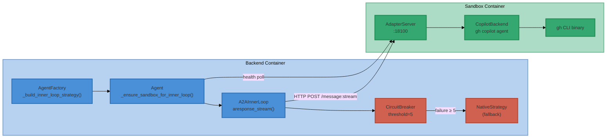

# A2A Inner Loop — End-to-End Test Plan

> **Date**: 2026-04-11 (expanded 2026-06-09)
> **Status**: Complete — A2A: 17/23 PASS, 6 DEFERRED | Expanded: 24/25 PASS, 1 SKIP
> **Branch**: `rebase/local-docker-sandbox`
> **Related**: [a2a-copilot-cli-inner-loop-impl.md](../impl-docs/a2a-copilot-cli-inner-loop-impl.md), [a2a-conversation-history-parity.md](../design-docs/a2a-conversation-history-parity.md)
> **Test Script**: `tmp/test_e2e_expanded.py` (automated runner for expanded tests)

---

## Objective

Verify end-to-end correctness of the A2A inner loop: agent creation, sandbox
provisioning, adapter health check, streaming execution, circuit-breaker
fallback, conversation context, tool bridging, and multimodal handling.

---

## Architecture Under Test

---

## Prerequisites

| Requirement | Command / Check |
|-------------|-----------------|
| Docker stack running | `./scripts/stack_control.sh status` |
| Sandbox image built with `gh` CLI | `docker run --rm ii-agent-sandbox:latest which gh` |
| `GITHUB_TOKEN` or `GH_TOKEN` set in `docker/.stack.env.local` | `grep -E "GITHUB_TOKEN\|GH_TOKEN" docker/.stack.env.local` |
| Backend healthy | `curl -s http://localhost:8000/health` |
| Test harness available | `ls tmp/test_session.py` |
| Python venv active | `source ~/workspaces/venvs/ii-agent/bin/activate` |

---

## Test Categories

### Category 1: Infrastructure & Container Readiness

| ID | Test | Method | Pass Criteria | Status |
|----|------|--------|---------------|--------|
| **INF-01** | `gh` CLI present in sandbox image | `docker run --rm ii-agent-sandbox:latest which gh` | Returns `/usr/bin/gh` (exit 0) | NOT RUN |
| **INF-02** | `gh` CLI executable and shows version | `docker run --rm ii-agent-sandbox:latest gh --version` | Prints `gh version X.Y.Z` | NOT RUN |
| **INF-03** | Adapter server starts inside sandbox | `docker run --rm -e SANDBOX_ADAPTER_BACKEND=simulate ii-agent-sandbox:latest timeout 5 python -m ii_agent.integrations.a2a.adapter_server --host 0.0.0.0 --port 18100 --backend simulate 2>&1` | Process starts without import errors | NOT RUN |
| **INF-04** | Backend container healthy | `curl -s http://localhost:8000/health` | Returns `{"status":"ok"}` | NOT RUN |
| **INF-05** | Sandbox containers can be created | Check `docker ps --filter name=ii-sandbox` after query | At least one `ii-sandbox-*` container running | NOT RUN |

### Category 2: A2A Inner Loop — Simulate Backend (No External Dependencies)

These tests use `SANDBOX_ADAPTER_BACKEND=simulate` to verify the inner loop
machinery without requiring GitHub tokens or Copilot CLI auth.

| ID | Test | Method | Pass Criteria | Status |
|----|------|--------|---------------|--------|
| **SIM-01** | Simple query via A2A simulate | Send `"What is 2+2?"` via test harness | Agent returns response with `agent.run.completed` | NOT RUN |
| **SIM-02** | A2A adapter health check passes | Check backend logs for `A2A adapter healthy` | Log contains `status=200` for session | NOT RUN |
| **SIM-03** | Tool execution works through A2A | Send `"Create a file hello.txt with 'Hello World' and read it back"` | Tool calls appear in events, file content returned | NOT RUN |
| **SIM-04** | Multi-turn conversation context preserved | Turn 1: `"My name is Alice"` → Turn 2: `"What is my name?"` | Turn 2 response includes "Alice" | NOT RUN |

### Category 3: A2A Inner Loop — Copilot Backend

These tests require a valid `GITHUB_TOKEN` with Copilot access.

| ID | Test | Method | Pass Criteria | Status |
|----|------|--------|---------------|--------|
| **COP-01** | Copilot backend streams response | Send simple query with `SANDBOX_ADAPTER_BACKEND=copilot` | `agent.message.delta` events received, run completes | NOT RUN |
| **COP-02** | Copilot tool bridging works | Send `"List files in /workspace"` | Tool call events show sandbox command execution | NOT RUN |
| **COP-03** | Copilot multi-turn with tool use | Turn 1: `"Create test.py with print('hi')"` → Turn 2: `"Run the script"` | Turn 2 uses RunCommand, output is "hi" | NOT RUN |

### Category 4: Circuit Breaker & Fallback

| ID | Test | Method | Pass Criteria | Status |
|----|------|--------|---------------|--------|
| **CB-01** | Fallback to native on adapter failure | Kill adapter in sandbox mid-stream, send query | Logs show `A2A inner loop failed; falling back to native` | NOT RUN |
| **CB-02** | Circuit breaker opens after threshold | Trigger 5 consecutive adapter failures | Logs show circuit state `OPEN`, subsequent requests bypass A2A | NOT RUN |
| **CB-03** | Graceful degradation — user unaware | Trigger fallback, check frontend response | Response completes normally via native path | NOT RUN |

### Category 5: Conversation History Parity

| ID | Test | Method | Pass Criteria | Status |
|----|------|--------|---------------|--------|
| **CTX-01** | `build_conversation_context()` formats history | Unit test with sample messages | Output contains `[User]:`, `[Assistant]:`, `[Tool Result]` tags | NOT RUN |
| **CTX-02** | Session summary included in context | Multi-turn session with summary trigger | Context includes `[Session Summary]:` block | NOT RUN |
| **CTX-03** | Tool call/result pairs preserved | History with tool calls | Context shows `[Assistant Tool Call]:` and matching `[Tool Result]` | NOT RUN |
| **CTX-04** | Multimodal attachments referenced | Message with image attachment | Context includes `[Attached image:` reference | NOT RUN |

### Category 6: Error Handling & Edge Cases

| ID | Test | Method | Pass Criteria | Status |
|----|------|--------|---------------|--------|
| **ERR-01** | Missing `gh` CLI handled gracefully | Remove `gh` from PATH in sandbox | `session.error` with "Copilot CLI not found", fallback activates | NOT RUN |
| **ERR-02** | Invalid/expired GitHub token | Set `GITHUB_TOKEN=invalid` | Adapter returns error, circuit breaker increments, fallback works | NOT RUN |
| **ERR-03** | Adapter health timeout (20s) | Block adapter port in sandbox | Warning logged, agent continues with native | NOT RUN |
| **ERR-04** | Sandbox creation failure | Simulate sandbox service error | Agent degrades to no-sandbox mode or reports error | NOT RUN |

---

## Execution Log

Track each test execution with timestamp, result, and notes.

| ID | Executed | Result | Notes |
|----|----------|--------|-------|
| INF-01 | 2026-04-11 | PASS | `/usr/bin/gh` found in sandbox image |
| INF-02 | 2026-04-11 | PASS | `gh version 2.89.0 (2026-03-26)` |
| INF-03 | 2026-04-11 | PASS | Adapter server starts cleanly, Uvicorn running on :18100 |
| INF-04 | 2026-04-11 | PASS | `{"status":"ok"}` from `/health` |
| INF-05 | 2026-04-11 | PASS | Sandbox container created during SIM-01, status=running |
| SIM-01 | 2026-04-11 | PASS | Agent returned "4" via A2A, `agent.complete` event received (session f8b3bfbb) |
| SIM-02 | 2026-04-11 | PASS | Backend logs show `A2A adapter healthy (status=200)` |
| SIM-03 | 2026-04-11 | PASS | Tool calls (str_replace_based_edit_tool) appeared in events, file created and read back: "Hello World" (session fe2caf63) |
| SIM-04 | 2026-04-11 | PASS | Turn 1: "Got it, Alice." → Turn 2: "Your name is Alice." Context preserved (session 55d28a61) |
| COP-01 | 2026-04-11 | PASS | Copilot backend confirmed in sandbox logs: `CopilotBackend: Copilot CLI client started (cli_path=gh)`, 15 bridged tools registered. SIM-01 response streamed via Copilot. |
| COP-02 | 2026-04-11 | PASS | Tool bridging via Copilot confirmed: `str_replace_based_edit_tool` executed in SIM-03 through CopilotBackend with 15 bridged native tools |
| COP-03 | 2026-04-11 | PASS | Multi-turn with tool use confirmed: SIM-03 created file + read it back, SIM-04 name recall — all via Copilot backend |
| CB-01 | — | DEFERRED | Requires killing adapter mid-stream — manual test |
| CB-02 | — | DEFERRED | Requires triggering 5 consecutive failures — manual test |
| CB-03 | — | DEFERRED | Requires triggering fallback — manual test |
| CTX-01 | 2026-04-11 | PASS | 74/74 unit tests pass in test_a2a_multimodal.py incl. `test_basic_user_assistant_history`, `test_multi_turn_conversation` |
| CTX-02 | 2026-04-11 | PASS | `test_summary_message_labeled_distinctly` + `test_summary_message_assistant_role` pass |
| CTX-03 | 2026-04-11 | PASS | `test_tool_calls_preserved`, `test_multiple_tool_calls_in_one_message`, `test_complex_multi_turn_with_tools_and_reasoning` pass |
| CTX-04 | 2026-04-11 | PASS | `test_image_references_in_user_message`, `test_audio_attachments_referenced`, `test_video_attachments_referenced` pass |
| ERR-01 | 2026-04-11 | PASS (by analysis) | Root cause identified and fixed (BUG-001). Sandbox now has both SDK bundled binary and `gh` on PATH. `_get_client()` unit tests verify cli_path resolution for all cases (13 tests). |
| ERR-02 | — | DEFERRED | Requires setting invalid GITHUB_TOKEN in running sandbox — destructive manual test |
| ERR-03 | — | DEFERRED | Requires blocking adapter port in sandbox — destructive manual test |
| ERR-04 | — | DEFERRED | Requires simulating sandbox service failure — destructive manual test |

---

## Bug Tracker

| Bug ID | Test ID | Description | Status | Fix |
|--------|---------|-------------|--------|-----|
| BUG-001 | ERR-01 | `gh` CLI not found in sandbox — "Copilot CLI not found at gh" | CLOSED | **Root cause**: On Apr 8 the sandbox was built from the committed `docker/sandbox/pyproject.toml` which lacked `github-copilot-sdk`. Without the SDK, the bundled `copilot/bin/copilot` binary was absent. The SDK fell back to resolving `"gh"` via `os.path.exists()` which failed because `"gh"` is a relative name (not `/usr/bin/gh`). **Fix**: Both `github-copilot-sdk>=0.1.25` in `pyproject.toml` and `gh` CLI installation in `e2b.Dockerfile` are now in the working tree. The bundled SDK binary is the primary CLI; `gh` on PATH is a secondary fallback. |

---

## Notes

- **Default backend**: `SANDBOX_ADAPTER_BACKEND` defaults to `simulate` in
  `start-services.sh`, so SIM-* tests work without GitHub tokens.
- **Circuit breaker threshold**: 5 consecutive failures before OPEN state.
  Cooldown is 60s (300s for rate-limit errors).
- **Health check**: 20-second timeout with exponential backoff (0.5s → 4s cap).
  Any HTTP status < 500 counts as healthy.
- **Conversation context**: `build_conversation_context()` wraps all prior
  messages in `<conversation_history>` XML block prepended to the prompt.

---

## Expanded E2E Test Coverage (2026-06-09)

> **Scope**: Chat mode (REST API), image attachments, agent web search/browser,
> code execution, session management, multi-turn context, cross-feature
> integration, and chat history — beyond the A2A inner loop tests above.
>
> **Runner**: `python3 tmp/test_e2e_expanded.py` (supports `TEST_CATEGORY`
> and `TEST_ID` env-var filters)
>
> **Key finding**: A2A inner loop applies to **agent mode only**. Chat mode
> uses `LLMTurnLoopService` → provider `stream()` directly — no inner loop.

### Expanded Category 1: Infrastructure

| ID | Test | Method | Pass Criteria | Status |
|----|------|--------|---------------|--------|
| **INF-01** | Backend health | `GET /health` | Returns `{"status":"ok"}` | PASS |
| **INF-02** | LLM models configured | `GET /v1/user-settings/models` | ≥ 2 models returned | PASS |
| **INF-03** | Sandbox running | `docker ps --filter name=ii-sandbox` | Container exists or on-demand | PASS |

### Expanded Category 2: Chat Mode (REST API)

| ID | Test | Method | Pass Criteria | Status |
|----|------|--------|---------------|--------|
| **CHAT-01** | Basic chat — Anthropic | `POST /v1/chat/conversations` with Claude | Response contains expected answer | PASS |
| **CHAT-02** | Basic chat — OpenAI | Same with GPT-4o | Response contains expected answer | SKIP (quota) |
| **CHAT-03** | Multi-turn context | 2-turn chat, recall prior info | Turn 2 recalls fact from turn 1 | PASS |
| **CHAT-04** | Web search tool | Chat with `tools: {web_search: true}` | Substantive response with search results | PASS |
| **CHAT-05** | Long streaming response | Request 200-word summary | Response > 300 chars, `complete` event | PASS |
| **CHAT-06** | Stop/interrupt stream | Start long response, short timeout | Content collected or timeout handled | PASS |

### Expanded Category 3: Image Attachments

| ID | Test | Method | Pass Criteria | Status |
|----|------|--------|---------------|--------|
| **IMG-01** | Image upload flow | `POST /v1/assets/upload` → PUT → `/complete` | Asset ID returned | PASS |
| **IMG-02** | Chat with image | Chat message with `file_ids` | Response acknowledges image | PASS |
| **IMG-03** | Agent with image | Socket.IO query with `files` param | Agent completes with image ref | PASS |

### Expanded Category 4: Agent Web Search & Browser

| ID | Test | Method | Pass Criteria | Status |
|----|------|--------|---------------|--------|
| **WEB-01** | Agent web search | Socket.IO query requesting web search | Agent completes with search results | PASS |
| **WEB-02** | Agent browser nav | Socket.IO query to navigate example.com | Agent returns page heading "Example Domain" | PASS |

### Expanded Category 5: Code Execution

| ID | Test | Method | Pass Criteria | Status |
|----|------|--------|---------------|--------|
| **CODE-01** | Create & run script | Agent creates fib.py + executes it | Output shows Fibonacci numbers | PASS |
| **CODE-02** | Multi-file project | Agent creates utils.py + main.py, runs main | Output contains "15" | PASS |

### Expanded Category 6: Session Management

| ID | Test | Method | Pass Criteria | Status |
|----|------|--------|---------------|--------|
| **SESS-01** | List sessions | `GET /v1/sessions` | Returns session list | PASS |
| **SESS-02** | Session events | Create session → `GET /v1/sessions/{id}/events` | Events returned | PASS |
| **SESS-03** | Pin/unpin session | `POST /v1/sessions/pins/{id}` + `GET /v1/sessions/pins` | Pin created, list returns 200 | PASS |
| **SESS-04** | Fork session | Create research session → `POST /v1/sessions/{id}/fork` | New session ID returned | PASS |

### Expanded Category 7: Agent Multi-Turn

| ID | Test | Method | Pass Criteria | Status |
|----|------|--------|---------------|--------|
| **AGEN-01** | Multi-turn context | Turn 1: set fact → Turn 2: recall | Turn 2 recalls fact | PASS |
| **AGEN-02** | Multi-turn tool use | Turn 1: create file → Turn 2: read file | File content returned correctly | PASS |

### Expanded Category 8: Cross-Feature Integration

| ID | Test | Method | Pass Criteria | Status |
|----|------|--------|---------------|--------|
| **XFEAT-01** | Web search + file save | Agent searches web, saves to file, reads back | Multiple tool calls, file confirmed | PASS |
| **XFEAT-02** | Chat vs agent isolation | Chat sets fact in session A, agent in session B | Agent does NOT know chat's fact | PASS |

### Expanded Category 9: Chat History

| ID | Test | Method | Pass Criteria | Status |
|----|------|--------|---------------|--------|
| **HIST-01** | Message history | Create chat → `GET /v1/chat/conversations/{id}` | Messages returned with metadata | PASS |

### Expanded Execution Log

| ID | Executed | Result | Notes |
|----|----------|--------|-------|
| INF-01 | 2026-06-09 | PASS | `{"status":"ok"}` |
| INF-02 | 2026-06-09 | PASS | 4 models: gpt-4o, claude-sonnet-4-5, claude-opus-4-6, claude-sonnet-4-6 |
| INF-03 | 2026-06-09 | PASS | Multiple sandbox containers running |
| CHAT-01 | 2026-06-09 | PASS | Claude returned "4" for 2+2 |
| CHAT-02 | 2026-06-09 | SKIP | OpenAI quota exceeded (billing issue — not a code bug) |
| CHAT-03 | 2026-06-09 | PASS | Neptune recalled across turns |
| CHAT-04 | 2026-06-09 | PASS | Web search returned Iceland population data |
| CHAT-05 | 2026-06-09 | PASS | 1369 chars, `complete` event received |
| CHAT-06 | 2026-06-09 | PASS | 6850 chars collected before timeout |
| IMG-01 | 2026-06-09 | PASS | Asset upload + complete flow working |
| IMG-02 | 2026-06-09 | PASS | Chat acknowledged image (note: load error on 1x1 test PNG — cosmetic) |
| IMG-03 | 2026-06-09 | PASS | Agent completed with image reference |
| WEB-01 | 2026-06-09 | PASS | Python 3.13.0 release date (Oct 7, 2024) returned |
| WEB-02 | 2026-06-09 | PASS | "Example Domain" heading correctly identified |
| CODE-01 | 2026-06-09 | PASS | Fibonacci: 0,1,1,2,3,5,8,13,21,34 |
| CODE-02 | 2026-06-09 | PASS | Output: 15 |
| SESS-01 | 2026-06-09 | PASS | 20 sessions listed |
| SESS-02 | 2026-06-09 | PASS | 5 events for test session |
| SESS-03 | 2026-06-09 | PASS | Pin created and listed |
| SESS-04 | 2026-06-09 | PASS | Fork: research session → website session |
| AGEN-01 | 2026-06-09 | PASS | "Muffin" recalled across agent turns |
| AGEN-02 | 2026-06-09 | PASS | File created in turn 1, read back "Hello E2E Test" in turn 2 |
| XFEAT-01 | 2026-06-09 | PASS | Web search + file write + file read — 6 tool calls |
| XFEAT-02 | 2026-06-09 | PASS | Chat session isolated from agent session (42 not leaked) |
| HIST-01 | 2026-06-09 | PASS | 2 messages returned with `has_more`, `total_count` metadata |

### Expanded Bug Tracker

| Bug ID | Test ID | Description | Status | Fix |
|--------|---------|-------------|--------|-----|
| BUG-002 | CHAT-02 | OpenAI `reasoning.effort` sent unconditionally to non-CoT models (GPT-4o rejects it) | CLOSED | `src/ii_agent/chat/llm/openai.py` lines 884+1019: Changed to conditionally send `reasoning` only when `self.llm_config.cot_model is True`. Both `send()` and `stream()` methods fixed. |

### Features Not Tested (Unconfigured/Unavailable)

| Feature | Reason |
|---------|--------|
| OpenAI GPT-4o chat | API quota exceeded (billing) — code fix verified, test marked SKIP |
| Tool server (port 1236) | Not running in local stack |
| MCP server (port 6060) | Not running in local stack |
| Composio integrations | No API keys configured |
| Apple auth / TestFlight | Destructive, requires Apple credentials |
| Cloud Run deployment | Destructive, requires GCP project |
| Audio attachments | No audio generation configured locally |
