# E2E Test Plan

Comprehensive end-to-end test coverage plan for ii-agent. Tests run against a local Docker stack
with A2A/Copilot backend.

## Test Matrix

### Implemented Tests

| ID | Category | Name | Mode | Timeout | Dependencies |
|----|----------|------|------|---------|-------------|
| INF-01 | Infrastructure | Backend health check | REST | 10s | None |
| INF-02 | Infrastructure | LLM models configured | REST | 10s | None |
| INF-03 | Infrastructure | Sandbox container running | REST | 10s | Docker |
| CHAT-01 | Chat Mode | Basic chat — Anthropic | REST SSE | 60s | Anthropic API |
| CHAT-02 | Chat Mode | Basic chat — OpenAI | REST SSE | 60s | OpenAI API |
| CHAT-03 | Chat Mode | Multi-turn context preservation | REST SSE | 60s | Anthropic API |
| CHAT-04 | Chat Mode | Web search tool in chat | REST SSE | 60s | Anthropic API |
| CHAT-05 | Chat Mode | Long streaming response | REST SSE | 60s | Anthropic API |
| CHAT-06 | Chat Mode | Stop conversation mid-stream | REST SSE | 60s | Anthropic API |
| IMG-01 | Image Attachments | Image upload flow | REST | 10s | MinIO |
| IMG-02 | Image Attachments | Chat with image + multi-turn verification | REST SSE | 120s | Anthropic API, MinIO |
| IMG-03 | Image Attachments | Agent with image + multi-turn verification | Socket.IO | 240s | Anthropic API, MinIO |
| WEB-01 | Web Search | Agent web search tool | Socket.IO | 180s | A2A/Copilot |
| WEB-02 | Web Search | Agent browser navigation | Socket.IO | 180s | A2A/Copilot |
| CODE-01 | Code Execution | Agent creates and runs Python | Socket.IO | 180s | A2A/Copilot, Sandbox |
| CODE-02 | Code Execution | Agent multi-file project | Socket.IO | 180s | A2A/Copilot, Sandbox |
| SESS-01 | Session Management | List sessions API | REST | 10s | None |
| SESS-02 | Session Management | Session events retrieval | Socket.IO+REST | 60s | A2A/Copilot |
| SESS-03 | Session Management | Pin/unpin session | Socket.IO+REST | 60s | A2A/Copilot |
| SESS-04 | Session Management | Fork session | Socket.IO | 120s | A2A/Copilot |
| AGEN-01 | Agent Multi-Turn | Context preservation across turns | Socket.IO | 180s | A2A/Copilot |
| AGEN-02 | Agent Multi-Turn | Tool use across turns | Socket.IO | 180s | A2A/Copilot |
| XFEAT-01 | Cross-Feature | Web search + file save + read | Socket.IO | 180s | A2A/Copilot |
| XFEAT-02 | Cross-Feature | Chat vs agent session independence | Socket.IO+REST | 120s | A2A/Copilot |
| HIST-01 | Chat History | Retrieve message history | REST SSE+REST | 60s | Anthropic API |
| CNCL-01 | Council Mode | 2-model parallel execution | REST SSE | 120s | Anthropic+OpenAI API |
| CNCL-02 | Council Mode | Validation — rejects < 2 models | REST SSE | 10s | None |
| CNCL-03 | Council Mode | Billing usage events produced | REST SSE | 120s | Anthropic+OpenAI API |
| A2A-01 | A2A Backend | Health reports A2A mode active | REST | 10s | None |
| A2A-02 | A2A Backend | Chat triggers A2A turn loop (log) | REST SSE+logs | 60s | A2A/Copilot |
| A2A-03 | A2A Backend | Agent triggers A2A inner loop (log) | Socket.IO+logs | 180s | A2A/Copilot |
| A2A-04 | A2A Backend | Council uses A2A for members | REST SSE+logs | 120s | A2A/Copilot |
| A2A-05 | A2A Backend | Chat selected model reaches A2A runtime | REST SSE+logs | 60s | A2A/Copilot |
| A2A-06 | A2A Backend | Agent selected model reaches A2A runtime | Socket.IO+logs | 180s | A2A/Copilot |
| SLIDE-01 | Slides | Agent creates slide via agent_type=slide | Socket.IO+REST | 180s | A2A/Copilot |

For model steering, the product exposes **two separate entry points**:
- **Agent mode**: the top-right **Agent Settings** menu (sliders icon) → **Model** tab
- **Chat mode**: inside an active chat session via **Chat Settings** with **no tab**, where the model picker is shown directly

The automated A2A-05/A2A-06 checks validate the same underlying selection effect end-to-end by asserting that the chosen runtime model is forwarded into the A2A/Copilot backend and appears in backend logs for the matching request context.
| SLIDE-02 | Slides | Direct REST slide write + list round-trip | REST | 10s | None |
| RSRCH-01 | Research | Fast research produces report | Socket.IO | 240s | A2A/Copilot |
| WDEV-01 | Web Dev | Website build agent creates HTML | Socket.IO | 180s | A2A/Copilot |
| SET-01 | Settings/API | Skills API lists built-in skills | REST | 10s | None |
| SET-02 | Settings/API | Media templates API returns data | REST | 10s | None |
| SET-03 | Settings/API | LLM settings CRUD round-trip | REST | 10s | None |
| SET-04 | Settings/API | Enhance prompt round-trip | REST | 10s | None |
| SET-05 | Settings/API | Credits balance check | REST | 10s | None |
| SBOX-01 | Sandbox Lifecycle | FK constraint rejects orphaned sandbox rows | Docker+psql | 10s | PostgreSQL |
| SBOX-02 | Sandbox Lifecycle | Port pool overflow protection active | REST | 10s | None |
| SBOX-03 | Sandbox Lifecycle | Orphaned Docker volumes cleaned up | Docker | 90s | Docker, cleanup loop |
| SBOX-04 | Sandbox Lifecycle | timeout_at column persisted in DB | Docker+psql | 10s | PostgreSQL |
| SBOX-05 | Sandbox Lifecycle | Cleanup loop active (6 stages) | Logs | 10s | Backend logs |

### Not Automated — Rationale

| Feature | Reason | Future Possibility |
|---------|--------|-------------------|
| **Video Generation** | Requires video generation API not available locally. No local model or mock. | If a local video gen model becomes available or a mock endpoint is created. |
| **Storybook** | Full generation requires image gen + TTS APIs for page images and voice-over. REST CRUD is partially testable but creation flow needs external services. | Could add CRUD-only test if storybook seeding is added. |
| **Image Generation (chat media)** | Requires Gemini image model API key. Through A2A/Copilot, image gen tools may not bridge correctly. | If Gemini API key is provisioned in local stack. |
| **Infographic / Poster** | Media handler subtypes that depend on image generation APIs (Gemini/Anthropic). Same blocker as image gen. | Same as image gen. |
| **Nano Banana (AI slide editing)** | Requires Google Gemini Vision API for component detection + image generation for regeneration. | If Gemini Vision API is provisioned locally. |
| **Mobile App (Expo/TestFlight)** | Requires Apple Developer account, Fastlane CLI, TestFlight access — entire iOS ecosystem. | Not feasible for automated testing without Apple infra. |
| **Project Deployment (Cloud Run)** | Requires GCP Cloud Run, Terraform, custom domains, Cloudflare KV. | Possible with GCP service account in CI. |
| **Subdomain Management** | Requires Cloudflare KV and DNS infrastructure. | Same as deployment. |
| **Connectors (GitHub/Google Drive/Composio)** | Requires OAuth flows with real third-party provider accounts. | Could test with mock OAuth server. |
| **MCP Settings** | CRUD is testable but connection validation requires external MCP server running. | Could add CRUD-only test. |
| **Deep Research** | Same agent type as fast research but runs 200+ turns (5-10 minutes). Too long for standard E2E sweep. | Run as separate extended test suite with `--category RSRCH`. |
| **Research → Website** | Multi-step: requires completed research session to fork from. Fragile chain of dependencies. | Possible as integration test with pre-seeded research session. |

## Test Architecture

```mermaid
%%{init: {'theme':'base', 'themeVariables': {'fontFamily': 'Arial, sans-serif', 'fontSize': '13px', 'fontWeight': 'normal'}}}%%
flowchart TD
    subgraph E2E["E2E Test Runner"]
        R["test_e2e.py"]
    end

    subgraph REST["REST API Tests"]
        R --> CHAT["CHAT-01..06"]
        R --> IMG_CHAT["IMG-01..02"]
        R --> HIST["HIST-01"]
        R --> CNCL["CNCL-01..03"]
        R --> SET["SET-01..05"]
        R --> SLIDE_REST["SLIDE-02"]
    end

    subgraph SIO["Socket.IO Tests"]
        R --> WEB["WEB-01..02"]
        R --> CODE["CODE-01..02"]
        R --> AGEN["AGEN-01..02"]
        R --> IMG_AGENT["IMG-03"]
        R --> SLIDE_AGENT["SLIDE-01"]
        R --> RSRCH["RSRCH-01"]
        R --> WDEV["WDEV-01"]
    end

    subgraph HYBRID["Hybrid Tests"]
        R --> SESS["SESS-01..04"]
        R --> XFEAT["XFEAT-01..02"]
        R --> A2A["A2A-01..04"]
    end

    subgraph BACKEND["Backend Stack"]
        API["FastAPI :8000"]
        SIO_SRV["Socket.IO"]
        PG["PostgreSQL :5433"]
        REDIS["Redis"]
        MINIO["MinIO"]
        SANDBOX["Docker Sandbox"]
    end

    REST --> API
    SIO --> SIO_SRV
    HYBRID --> API
    HYBRID --> SIO_SRV

    style E2E fill:#5a7a9066,stroke:#3e5e748C,stroke-width:2px
    style REST fill:#34a87066,stroke:#1e88508C,stroke-width:2px
    style SIO fill:#4a90d966,stroke:#2c6cb08C,stroke-width:2px
    style HYBRID fill:#e8a83866,stroke:#c088288C,stroke-width:2px
    style BACKEND fill:#8e6aad66,stroke:#6e4a8d8C,stroke-width:2px

    classDef runner fill:#5a7a90,stroke:#3e5e74,stroke-width:2px
    classDef restNode fill:#34a870,stroke:#1e8850,stroke-width:2px
    classDef sioNode fill:#4a90d9,stroke:#2c6cb0,stroke-width:2px
    classDef hybridNode fill:#e8a838,stroke:#c08828,stroke-width:2px
    classDef backendNode fill:#8e6aad,stroke:#6e4a8d,stroke-width:2px

    class R runner
    class CHAT,IMG_CHAT,HIST,CNCL,SET,SLIDE_REST restNode
    class WEB,CODE,AGEN,IMG_AGENT,SLIDE_AGENT,RSRCH,WDEV sioNode
    class SESS,XFEAT,A2A hybridNode
    class API,SIO_SRV,PG,REDIS,MINIO,SANDBOX backendNode

    linkStyle 0 stroke:#34a870,stroke-width:2px
    linkStyle 1 stroke:#34a870,stroke-width:2px
    linkStyle 2 stroke:#34a870,stroke-width:2px
    linkStyle 3 stroke:#34a870,stroke-width:2px
    linkStyle 4 stroke:#34a870,stroke-width:2px
    linkStyle 5 stroke:#34a870,stroke-width:2px
    linkStyle 6 stroke:#4a90d9,stroke-width:2px
    linkStyle 7 stroke:#4a90d9,stroke-width:2px
    linkStyle 8 stroke:#4a90d9,stroke-width:2px
    linkStyle 9 stroke:#4a90d9,stroke-width:2px
    linkStyle 10 stroke:#4a90d9,stroke-width:2px
    linkStyle 11 stroke:#4a90d9,stroke-width:2px
    linkStyle 12 stroke:#4a90d9,stroke-width:2px
    linkStyle 13 stroke:#e8a838,stroke-width:2px
    linkStyle 14 stroke:#e8a838,stroke-width:2px
    linkStyle 15 stroke:#e8a838,stroke-width:2px
    linkStyle 16 stroke:#8e6aad,stroke-width:2px
    linkStyle 17 stroke:#8e6aad,stroke-width:2px
    linkStyle 18 stroke:#8e6aad,stroke-width:2px
    linkStyle 19 stroke:#8e6aad,stroke-width:2px
```



## Image Test Multi-Turn Verification

IMG-02 and IMG-03 include a critical **second-turn verification** that detects a known regression
where the chat/agent loses access to a previously-provided image across turns. The test image is a
10x10 2D gradient (red-blue with purple blending). The verification flow:

1. **Turn 1**: Upload image, ask model to describe colors → verify color words in response.
2. **Turn 2**: In same session, ask about color blending strategy and directionality → verify the
   model still has access to the image and describes gradient/blending/directional terms.

If turn 2 fails to reference blending or directionality, the test FAILs — this catches the
image-context-loss regression that was previously observed in production.

## Running Tests

```bash
# Full suite
python3 scripts/local/test_e2e.py

# Single test
python3 scripts/local/test_e2e.py --test SLIDE-01

# Multiple tests
python3 scripts/local/test_e2e.py --test SLIDE-01,SLIDE-02,SET-01

# Category
python3 scripts/local/test_e2e.py --category SLIDE

# Rerun failures from last run
python3 scripts/local/test_e2e.py --failed

# Via environment variables (backward-compatible)
TEST_ID=SLIDE-01 python3 scripts/local/test_e2e.py
TEST_CATEGORY=SET python3 scripts/local/test_e2e.py
```
